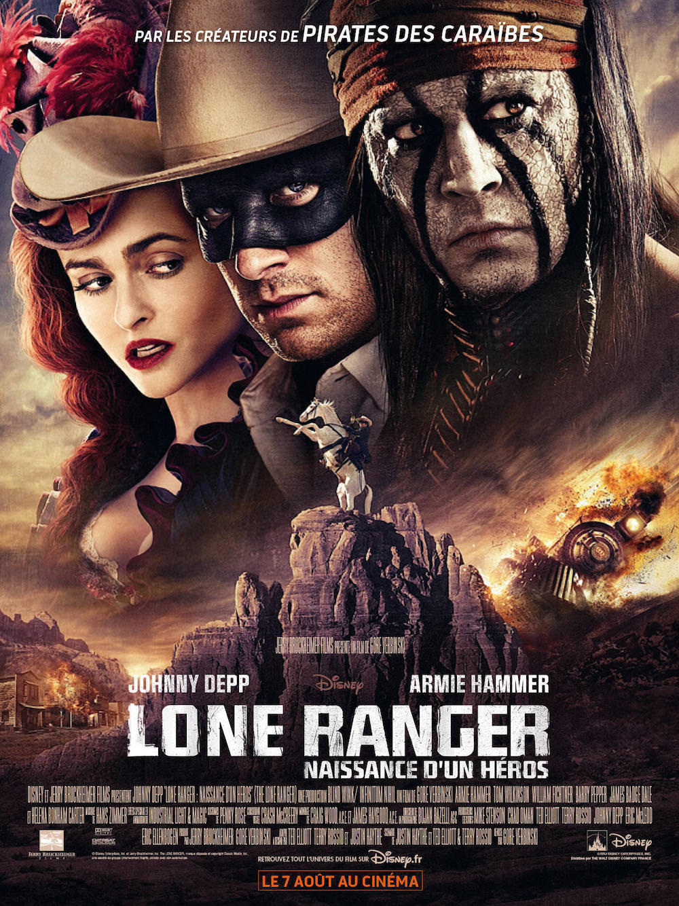
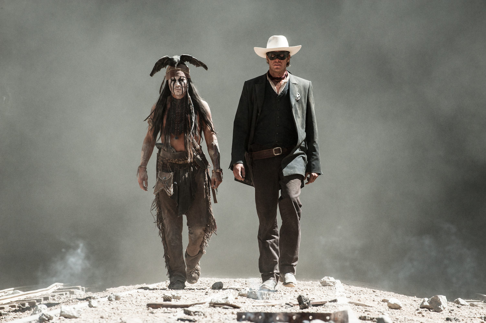
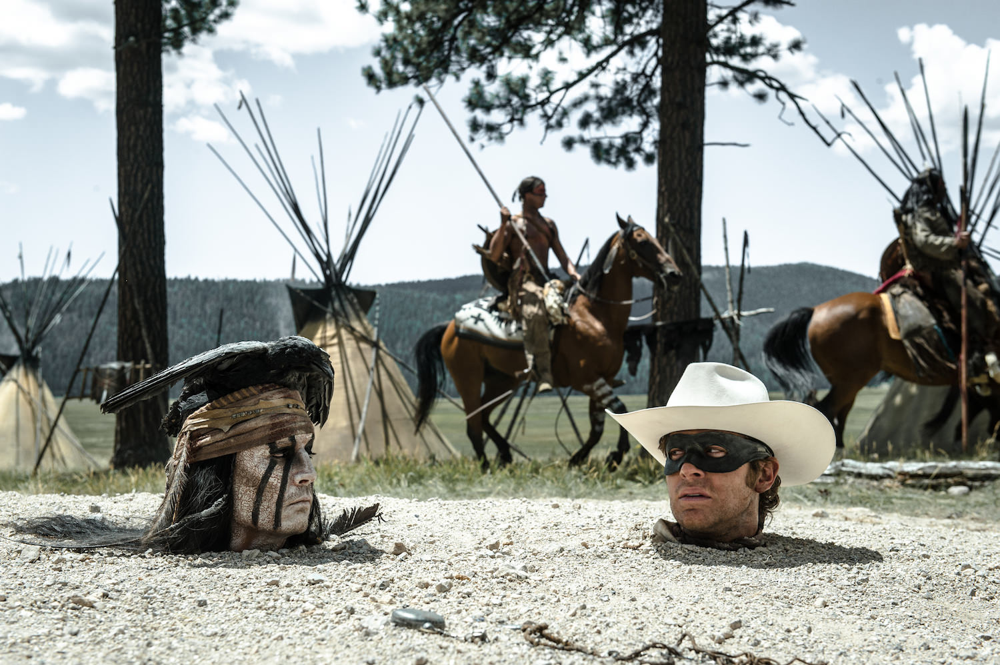

+++
type = "post"
titre = "<em>The Lone Ranger, Naissance d&rsquo;un héros</em>, Gore Verbinski"
title = "The Lone Ranger, Naissance d'un héros, Gore Verbinski"
url = "/the-lone-ranger-naissance-heros-verbinski"
date = "2013-08-13T23:37:12"
Lastmod = "2015-01-04T10:24:09"
cover = "lone-ranger-naissance-heros-verbinski-johnny-depp.jpg"
categorie = [ "À voir" ]
tag = [ "Action", "Blockbuster", "Histoire", "Humour", "Sorties du mois", "Train", "Vite oublié", "Western" ]
createur = [ "Gore Verbinski" ]
acteur = [ "Armie Hammer", "Helena Bonham Carter", "Johnny Depp", "Ruth Wilson", "Tom Wilkinson", "William Fichtner" ]
annee = [ "2013" ]
weight = 2013
pays = [ "États-Unis" ]
original = "The Lone Ranger"

+++

L’affiche ne laisse guère de place au doute : <em>The Lone Ranger, Naissance d’un héros</em> est l’œuvre des créateurs de <a href="http://voiretmanger.fr/saga/pirates-des-caraibes/"><em>Pirates des Caraïbes</em></a>, la fameuse saga qui a connu un énorme succès et qui a poussé encore plus loin la tendance des superproductions estivales. De fait, difficile de ne pas voir la trace de cette saga dans ce nouveau blockbuster qui appelle par son titre à en ouvrir une nouvelle. Gore Verbinski est à nouveau à la réalisation, Jerry Bruckheimer à nouveau à la production, le fidèle Johnny Depp s’invente encore un personnage farfelu, tandis que Hans Zimmer se charge encore une fois de mettre tout ce beau monde en musique. Dans ces conditions, difficile de ne pas voir dans cette énorme production une simple variation, un <em>Pirates des Caraïbes</em> qui abandonnerait le XVIIIe siècle des batailles navales pour le western. À l’écran, Gore Verbinski et toute son équipe n’évitent pas quelques redites, mais <em>The Lone Ranger, Naissance d’un héros</em> est finalement plus original que prévu avec ce mélange étonnant de sérieux et de second degré. Un divertissement assez efficace, même si le film est beaucoup trop long et semble un peu trop hésiter sur ses intentions.

On le connaît très mal en Europe, mais Lone Ranger est un personnage bien connu aux États-Unis. Imaginé dans les années 1930 à la radio, ce cow-boy moderne se bat pour défendre de justes causes, à mi-chemin entre Zorro pour l’ambiance du western et Robin des Bois pour les valeurs défendues. Son titre le laisse bien entendre, <em>The Lone Ranger, Naissance d’un héros</em> évoque les premiers pas de ce héros populaire : Gore Verbinski nous invite à découvrir la naissance du héros et ses premiers pas avec Tonto, l’Indien qui l’accompagne dans la série originale. Ce <em>Texas ranger</em> solitaire n’est au départ qu’un jeune avocat ambitieux qui revient chez lui dans le fin fond des États-Unis après huit années d’études. En route, John Reid se trouve mêlé à la fuite de Butch Cavendish, un dangereux criminel qui devait être jugé et pendu dans la ville de Colby. C’est à cette occasion que John et Tonto font connaissance et ils ne se quittent ensuite plus, ou presque. Laissé pour mort, l’avocat est sauvé par l’Indien et ils partent ensemble en quête du criminel qui pour se venger de la mort d’un frère, qui pour venger son peuple assassiné pour une mine d’argent. Contrairement à la saga des pirates, <em>The Lone Ranger, Naissance d’un héros</em> surprend très vite par le foisonnement de son scénario. Très simple à suivre, le film est très difficile à résumer rapidement et on est surpris de voir un dispositif scénaristique aussi complexe dans un blockbuster estival. Il y a d’abord le récit dans le récit, bien que minime : Gore Verbinski a choisi d’ouvrir son long-métrage en 1933, un hommage direct au feuilleton radiophonique créé cette année-là ; un garçon dans une foire visite un chapiteau dédié au Far West et tombe… sur Tonto âgé qui lui raconte son histoire. Un dispositif assez classique, sauf que les années 1930 font des retours pour interrompre le récit qui devient ainsi, en partie, du moins restructuré. Une idée plutôt audacieuse pour ce blockbuster par ailleurs assez sage quant à son organisation du récit. Apprentissage et formation du héros, <em>The Lone Ranger, Naissance d’un héros</em> est assez classique et se termine sans surprise sur la création du couple de héros qui devait ouvrir à une suite. L’échec du film au box-office devrait avoir raison de cette ambition, mais Gore Verbinski fait son travail d’introduction de façon méthodique et sans originalité, nonobstant cette touche de désordre dans la chronologie

<em>The Lone Ranger, Naissance d’un héros</em> est un divertissement efficace qui sait en mettre plein la vue quand il faut. La séquence vers la fin avec les deux trains qui se croisent dans les montagnes est, à cet égard vraiment, épique et la mise en scène plutôt audacieuse à cet instant de Gore Verbinski combinée à la relecture entrainante de l’<a href="http://open.spotify.com/track/6c7CHDYMmFrcfHQolTYPSs">ouverture de <em>Guillaume Tell</em></a> de Rossini par Hans Zimmer en font une séquence époustouflante. C’est du cinéma de pur spectacle et le rapprochement avec les montagnes russes n’a jamais été aussi évident, mais il faut reconnaître que cela fonctionne vraiment bien, quoique la séquence aurait pu être raccourcie. La longueur, c’est bien le principal problème de ce nouveau blockbuster qui aurait énormément gagné avec au moins trente minutes de moins. <em>The Lone Ranger, Naissance d’un héros</em> a du mal à démarrer et il souffre d’un ventre mou, ce qui fait quand même beaucoup. Pis, les défauts du film sont d’autant plus sensibles qu’il manque de rythme : avec un format resserré, on n’aurait sans doute pas autant de temps à consacrer à l’analyse de tous les problèmes du long-métrage. Après <a href="http://voiretmanger.fr/rango-verbinski/" title="Rango, Gore Verbinski"><em>Rango</em></a> qui donnait déjà dans l’hommage, Gore Verbinski réalise à nouveau un western et son idée semble encore une fois de rassembler tout le genre en un seul film. Les allusions et clins d’œil sont évidents, il y a du Sergio Leone ou du John Ford dans ce film, tandis que la figure du cow-boy solitaire est un classique du genre. La figure de la femme, les thèmes évoqués (le train, les Indiens, l’unification du pays…) sont également des réminiscences des classiques du genre. Le souci, c’est que le cinéaste en fait trop en cherchant à embrasser tout le western en un seul film. Dans <em>Rango</em>, cela passait grâce au ton parodique, mais ce nouveau film est plus sérieux et on frôle l’indigestion. <em>The Lone Ranger, Naissance d’un héros</em> ne sait pas bien où se placer, entre humour et second degré à la <em>Pirate des Caraïbes</em> et le sérieux de certains sujets — on parle de génocide, quand même. On apprécie l’humour plutôt bien dosé, avec un Johnny Depp en forme, quoique dans un rôle extrêmement proche de Jack Sparrow, plus pince-sans-rire et moins grimaçant et sautillant. Le divertissement est au rendez-vous et l’ensemble passerait bien, sauf que c’est long, trop long. Au lieu d’apprécier le genre hybridé imaginé par Gore Verbinski, on s’ennuie pendant les séquences plus dramatiques et on reconnaît parfois un peu trop la patte de l’équipe des pirates pendant les séquences d’action ou d’humour. Ajoutons à cela une <a href="http://www.amazon.fr/gp/product/B00DPEIBFE/ref=as_li_ss_tl?ie=UTF8&tag=leblogdenic07-21&linkCode=as2&camp=1642&creative=19458&creativeASIN=B00DPEIBFE">bande originale</a> qui souffre à la fois d’un déjà entendu permanent, de sa trop grande présence — il faudra apprendre aux réalisateurs de blockbuster l’intérêt des silences —, mais aussi de son côté pompier qui alourdit souvent le film.

Sans être aussi mauvais qu’on pouvait le craindre, <em>The Lone Ranger, Naissance d’un héros</em> n’est pas vraiment réussi. Son principal défaut est certainement sa longueur : Gore Verbinski aime manifestement le western, mais il a voulu en faire trop et son dernier film a des allures de fourre-tout indigeste. Inattendue, l’alliance d’humour et de second degré à la <em>Pirates des Caraïbes</em> et de séquences dramatiques beaucoup plus sérieuses était séduisante, mais elle ne fonctionne pas tout à fait et ralentit surtout l’ensemble. <em>The Lone Ranger, Naissance d’un héros</em> ne va nulle part et constitue un étrange objet de cinéma, entre grosse production hollywoodienne très efficace et idées plus originales, mais pas abouties. À voir pour se détendre, et puis à oublier…

<h3>Vous voulez <a href="http://voiretmanger.fr/soutien/">m&rsquo;aider</a> ?</h3>
<ul>
<li><a href="http://www.amazon.fr/gp/product/B00ALUN8J4/ref=as_li_ss_tl?ie=UTF8&amp;tag=leblogdenic07-21&amp;linkCode=as2&amp;camp=1642&amp;creative=19458&amp;creativeASIN=B00ALUN8J4">Acheter le film en Blu-ray sur Amazon</a></li>
<li><a href="http://www.amazon.fr/gp/product/B00ALUN82G/ref=as_li_ss_tl?ie=UTF8&amp;tag=leblogdenic07-21&amp;linkCode=as2&amp;camp=1642&amp;creative=19458&amp;creativeASIN=B00ALUN82G">Acheter le film en DVD sur Amazon</a></li>
<li><a href="https://itunes.apple.com/fr/movie/lone-ranger-naissance-dun/id716968901">Acheter ou louer le film sur l&rsquo;iTunes Store</a></li>
</ul>

