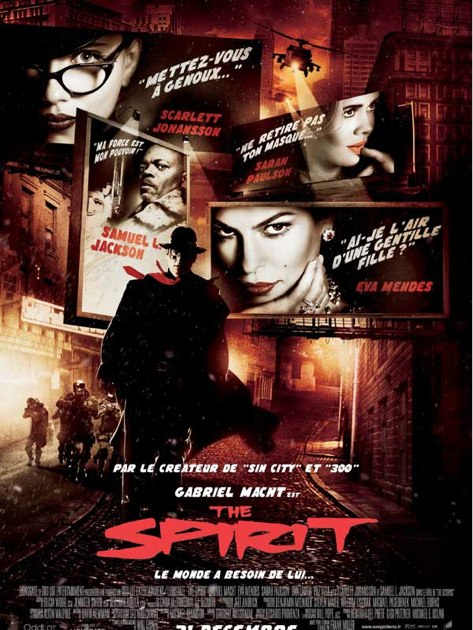

+++
titre = "The Spirit, de Frank Miller"
title = "The Spirit, de Frank Miller"
url = "/the-spirit-de-franck-miller"
date = "2009-01-12T23:30:08"
Lastmod = "2014-03-26T08:44:18"
cover = "spirit-franck-miller.jpg"
categorie = [ "À voir" ]
tag = [ "Comics", "Fantastique" ]
createur = [ "Frank Miller" ]
acteur = [ "Samuel L Jackson", "Scarlett Johansson" ]
annee = [ "2008" ]
weight = 2008
pays = [ "États-Unis" ]

+++

Ce week-end, après une dizaine jours sans cinéma (vous rendez-vous compte !) j&rsquo;ai enfin pu commencer à rattraper mon retard par le plus urgent, <em>The Spirit</em> par Franck Miller.

Sur ce film, les critiques sont globalement négatives, exception faite des <em>Inrockuptibles</em> que je vais donc rejoindre ici. Ce qui a plu ou déplu alternativement, c&rsquo;est essentiellement que le film n&rsquo;est que style. C&rsquo;était déjà dans ses précédents, que ce soit <a href="http://voiretmanger.fr/sin-city-rodriguez-miller/" title="Sin City, Robert Rodriguez et Frank Miller"><em>Sin City</em></a> ou <em>300</em>, mais là, le réalisateur pousse son principe beaucoup plus loin et effectivement, il ne reste plus cela. Il ne faut pas chercher trop longtemps le scénario dans ce film. Il existe bien, mais l&rsquo;histoire n&rsquo;est qu&rsquo;un prétexte aux délires (ou fantasmes) les plus fous. Et d&rsquo;abord de délires visuels : comme pour Sin City, tout le film est entièrement filmé sur fond vert et le fond est composé numériquement. L&rsquo;esthétique en noir et blanc, très lourde et oppressante, est bien présente et occupe, de fait le premier rôle. Le noir est découpé de taches blanches (les chaussures, la neige) ou rouge (la cravate, le sang) dans un plus bel effet.

Le héros officiel fait, il faut bien le dire, un peu pâle figure. À dire vrai, on ne s&rsquo;y intéresse jamais, et les méchants (et méchantes) du film sont bien plus intéressants. Samuel L. Jackson s&rsquo;amuse comme un fou et Scarlett Johanson est géniale ici. L&rsquo;histoire est assez abracadabrantesque, à base de vie éternelle mais peu importe. Elle n&rsquo;est, on l&rsquo;a dit, qu&rsquo;un prétexte pour des délires visuels, mais aussi rassembler le plus de clichés possibles sur le genre. Cette histoire d&rsquo;amour de jeunesse contrarié par exemple, est à mourir de rire (mieux vaut en rire en tout cas), de même que le super héros finalement, assez caricatural dans le genre &laquo;&nbsp;je sauve le monde mais j&rsquo;ai des tas de problèmes vous savez&nbsp;&raquo;. À noter, cependant, une métaphore originale sur l&rsquo;unique amour du héros pour sa ville, un amour physique également.

Deux raisons, je pense, permettent de comprendre la déception générale. D&rsquo;une part, il semble que le comics de base, un classique du genre, soit bien meilleur que le film. Je veux bien le croire, mais n&rsquo;ayant pas vu le film, cela ne me fait aucun effet. L&rsquo;autre raison est, je crois, le fait que ce film a la mauvaise idée de passer après <em>Sin City</em>. C&rsquo;est vrai que T<em>he Spirit</em> n&rsquo;évolue pas depuis <em>Sin City</em> mais, et alors ? J&rsquo;avais bien aimé l&rsquo;original, j&rsquo;aime bien cette nouvelle version&#8230;

Je ne vais pas m&rsquo;étendre plus avant sur le sujet : j&rsquo;ai bien aimé, je me suis bien amusé, cela me suffit. Maintenant, je comprends très bien que l&rsquo;on n&rsquo;aime pas ce genre de films&#8230;

<strong>À lire également</strong> : la critique positive des <em><a href="http://www.lesinrocks.com/cine/cinema-article/critique/the-spirit/">Inrockuptibles</a></em>, et les critiques négatives de <em><a href="http://www.telerama.fr/cinema/films/the-spirit,369015,critique.php">Télérama</a></em> et <a href="http://www.critikat.com/The-Spirit.html">Critikat</a>.

