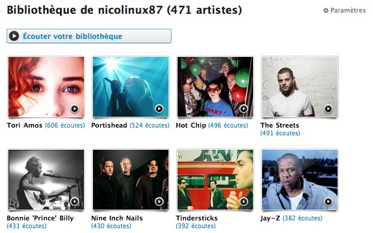
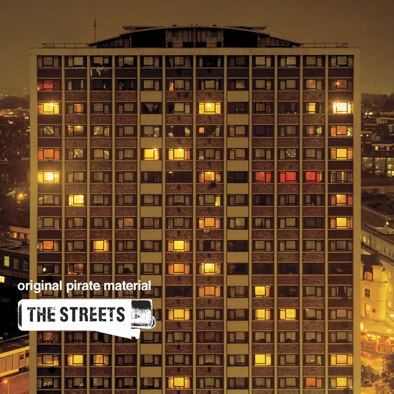
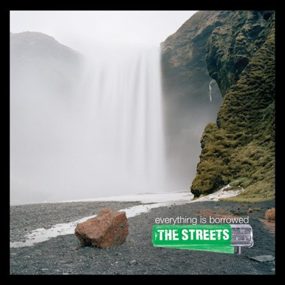

+++
type = "post"
titre = "The Streets, le rap à l&rsquo;anglaise"
title = "The Streets, le rap à l'anglaise"
url = "/the-streets-le-rap-a-langlaise"
date = "2009-01-24T00:17:44"
Lastmod = "2010-02-01T18:51:42"
cover = "the-streets-mike-skinner.jpg"
categorie = [ "Musique" ]
tag = [ "Rap", "Société" ]
createur = [ "Mike Skinner" ]

+++

Dans ma série de découvertes sur le rap<a href="#footnote_0_1139" id="identifier_0_1139" class="footnote-link footnote-identifier-link" title="D&rsquo;ailleurs, &agrave; ce propos, j&rsquo;ouvre une vraie s&eacute;rie sur le sujet&hellip; ">1</a>, The Streets occupe une place particulière, matérialisée en quelque sorte par mon classement Last.Fm où il apparaît dans le top huit. Quasiment 500 morceaux écoutés (et encore, uniquement sur mon ordinateur, et uniquement quand celui-ci est connecté à Internet : la réalité est sans doute plus importante) alors que c&rsquo;est une découverte qui remonte aux vacances de la Toussaint, soit il y a, en gros, deux mois. Belle performance, à la hauteur d&rsquo;un artiste passionnant !

The Streets, de son vrai nom Mike Skinner, est un rappeur anglais et cela s&rsquo;entend. La première chose qui m&rsquo;a frappé dans sa musique et qui m&rsquo;a immédiatement plu, c&rsquo;est cet accent londonien populaire si typique un accent à couper au couteau, à la limite de l&rsquo;intelligible d&rsquo;ailleurs. Un accent qui donne à sa musique toute sa saveur et son identité : découvrant en même temps le rap américain, je n&rsquo;ai pu qu&rsquo;être frappé par la différence. L&rsquo;accent est d&rsquo;autant plus mis en valeur que, au moins sur les premiers albums, l&rsquo;accompagnement sonore est minimaliste. Quelques samples forment un discret fond sonore, comme s&rsquo;il était dans un équilibre précaire, menaçant de retourner au silence à tout moment. Une fragilité et une maladresse qui fait tout le charme du premier album, <em>Original Pirate Material</em>, au titre d&rsquo;ailleurs évocateur.

Les albums suivants sont, à cet égard, assez impressionnants en terme de richesse musicale. Entre ce premier album et <em>Everything is Borrowed</em>, son dernier sorti en 2008, l&rsquo;ambiance change du tout au tout, au point que le Mike Skinner des débuts est difficilement reconnaissable dans le Mike Skinner actuel. Une interview du jeune homme dans un numéro des <em>Inrockuptibles</em> du mois d&rsquo;octobre permet de comprendre plusieurs éléments à ce propos. L&rsquo;artiste s&rsquo;y plaint notamment des critiques à propos de son premier album et d&rsquo;un son jugé lo-fi, mais aux paroles excellentes. Pourtant, les paroles ne l&rsquo;intéressent pas autant que la musique et il s&rsquo;est toujours considéré d&rsquo;abord comme un musicien, avant d&rsquo;être un chanteur (au point d&rsquo;avoir été contraint de chanter lui-même par l&rsquo;abandon d&rsquo;autres rappeurs, le projet initial de The Streets étant un collectif). On comprend mieux, dès lors, les incursions du dernier album dans le lyrique (accompagnement orchestral), ou le chant choral pour des morceaux plus doux.

J&rsquo;aime bien le titre du journal : &laquo;&nbsp;La belle maturité de The Streets&nbsp;&raquo;. C&rsquo;est tout à fait cela, une maturité, un calme apaisé après la colère très vive des deux premiers albums. Ses deux premiers albums étaient, il faut dire, très remontés sociopolitiquement. Son accent populaire semblait le conduire naturellement à la défense des petits, des gens ordinaires. Ses premières chansons décrivent ainsi la vie de l&rsquo;Anglais lambda, vu du niveau de la rue, à laquelle Mike Skinner a très vite été identifié (ce qui n&rsquo;est pas sans lien avec son pseudonyme, il faut dire&#8230;). Pourtant, son troisième album, <em>The Hardest Way To Make An Easy Living</em>, se détourne de ce premier sujet et aborde des sujets plus communs dans le rap (et la musique en général) comme le succès, ou l&rsquo;argent. Cet album a déçu beaucoup de fans qui, manifestement, pensaient qu&rsquo;un artiste leur devait quelque chose et devait rester dans l&rsquo;univers assez noir des débuts. Ils se sont donc sentis trahis par l&rsquo;artiste, ce qui est idiot, car depuis quand un artiste devrait la moindre chose à des fans ? Pour ma part, je suis ravi de ce retour au calme qui passe, comme les deux pochettes l&rsquo;illustrent bien, par le départ de la ville pour des horizons plus larges. Une chanson du dernier album est même clairement écologiste, ce qui étonne quand on connaît les débuts.

Mais je n&rsquo;apprécie pas tant cet artiste pour des paroles : fidèle à mon habitude, c&rsquo;est d&rsquo;abord la musique qui m&rsquo;intéresse et non le texte. Or la musique n&rsquo;est pas reléguée au second plan, contrairement à ce que je pensais du rap : le chant est, bien sûr, partie intégrante de cette musique avec l&rsquo;accent si particulier que nous avons déjà évoqué. Mais il n&rsquo;y a pas que la voix, il y aussi des accompagnements, du simple sample aux orchestrations de luxe sur le dernier album. La musique est, en tout cas, toujours présente et accompagne à merveille le chanteur.

Artiste passionnant, capable d&rsquo;écrire des petites chansons légères comme de grands albums concepts (<em>A Grant Don&rsquo;t Come for Free</em>, son second album, un excellent concept-album), Mike Skinner vaut vraiment la peine d&rsquo;y tendre une oreille, même si vous n&rsquo;aimez pas le rap et que vous l&rsquo;identifiez à la version américaine. Les albums de The Streets sont à des années lumières des grosses voitures et des filles peu vêtues en pagaille (comme, d&rsquo;ailleurs, l&rsquo;énorme majorité du rap américain que j&rsquo;écoute), qu&rsquo;on se le dise.

Il est d&rsquo;autant plus un artiste à suivre qu&rsquo;il a promis un cinquième et dernier album sous le nom actuel<a href="#footnote_1_1139" id="identifier_1_1139" class="footnote-link footnote-identifier-link" title="Un nom qu&rsquo;il veut abandonner pour se d&eacute;faire de cette image qui lui colle &agrave; la peau depuis ses d&eacute;buts.">2</a>, un nouveau concept qu&rsquo;il compare volontiers au <em>Berlin</em> de Lou Reed. Je ne vois pas bien ce que cela pourrait donner, mais je sais que j&rsquo;écouterai l&rsquo;album dès sa sortie !

<ol class="footnotes"><li id="footnote_0_1139" class="footnote">D&rsquo;ailleurs, à ce propos, j&rsquo;ouvre une vraie série sur le sujet&#8230;  [<a href="#identifier_0_1139" class="footnote-link footnote-back-link">&#8617;</a>]</li><li id="footnote_1_1139" class="footnote">Un nom qu&rsquo;il veut abandonner pour se défaire de cette image qui lui colle à la peau depuis ses débuts. [<a href="#identifier_1_1139" class="footnote-link footnote-back-link">&#8617;</a>]</li></ol>
