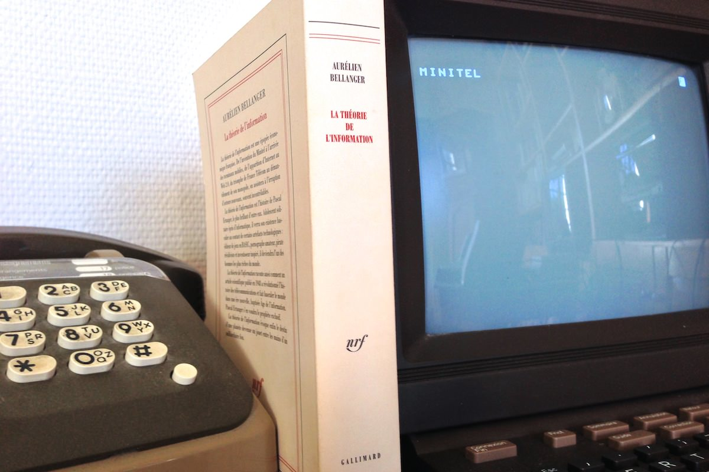
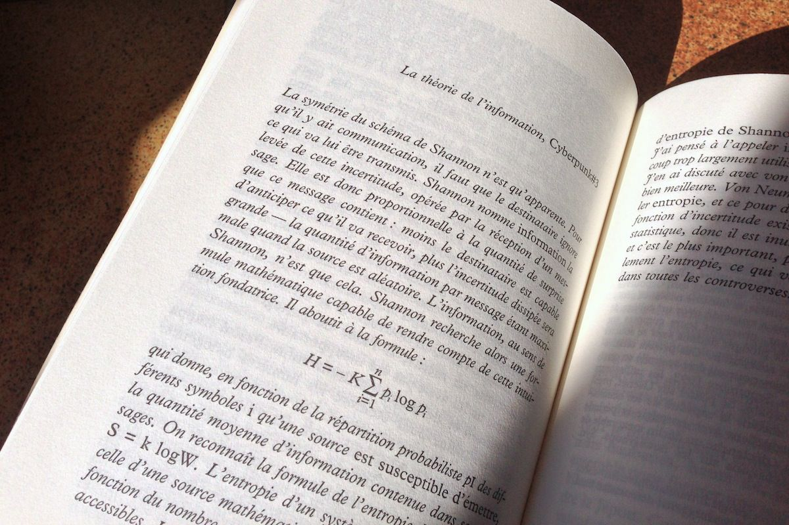

+++
titre = "La théorie de l&rsquo;information, Aurélien Bellanger"
title = "La théorie de l'information, Aurélien Bellanger"
url = "/theorie-information-bellanger"
date = "2013-02-20T15:22:04"
Lastmod = "2013-02-20T15:27:16"
cover = "theorie-information-aurelien-bellanger.jpg"
categorie = [ "À lire" ]
tag = [ "Histoire", "Histoire vraie", "Informatique", "Roman", "Science-Fiction" ]
createur = [ "Aurélien Bellanger" ]
annee = [ "2012" ]
weight = 2012
pays = [ "France" ]

+++

Peut-on concevoir un bon roman à partir uniquement de Wikipedia ? Cette question qui avait déjà été posée par Michel Houellebecq dans <a href="http://voiretmanger.fr/2011/02/10/carte-territoire-houellebecq/" title="La carte et le territoire, Michel Houellebecq - À voir et à manger"><em>La carte et le territoire</em></a> qui intégrait des extraits de l’encyclopédie libre et participative. Aurélien Bellanger est allé encore plus loin : <a href="http://www.gallimard.fr/rentreelitteraire/AurelienBellanger.htm"><em>La théorie de l’information</em></a> puise ses informations dans le fameux site et ses innombrables ressources, mais le roman tout entier se veut écrit dans le style Wikipedia, c’est-à-dire sans style. Un choix audacieux, d’autant que le jeune écrivain qui signe son premier roman n’a pas manqué de souligner le caractère balzacien de l’histoire qu’il raconte. Du Minitel à l’ADSL, <em>La théorie de l’information</em> est en effet également une biographie fictive de Xavier Niel, le patron de Free, présenté ici sous les traits de Pascal Etranger. L’ensemble est ambitieux, il faut le reconnaître, et le livre n’est pas inintéressant, notamment pour tous ceux qui n’ont pas connu les années Minitel. S’agit-il d’un bon roman pour autant ? Difficile de l’affirmer, tant Wikipedia pèse sur <em>La théorie de l’information</em>, sur la forme comme sur le fond…

La référence explicitée par son auteur ne fait aucun doute, elle est de toute manière sensible dès les premières pages de <em>La théorie de l’information</em>. Le personnage principal d’Aurélien Bellanger, Pascal Ertanger, est Rastignac, l’un des héros de <em>La Comédie Humaine</em> de Balzac. Comme son illustre modèle, Pascal est issu d’un milieu modeste de banlieue et son ascension sociale est irrésistible et extrêmement rapide. Dès 18 ans, il se trouve embarqué dans l’aventure du Minitel et il s’enrichit très vite grâce au succès du Minitel rose qui fleurit dans les années 1980. Avant cela, l’auteur prend le temps de retracer l’enfance et le parcours de son personnage, sa vie dans le pavillon de banlieue de ses parents et surtout les premières découvertes de l’informatique grâce aux premiers prototypes du Minitel distribués dans sa ville, mais aussi, et surtout son premier ordinateur, un <a href="http://fr.wikipedia.org/wiki/ZX81">ZX81</a>. Avec cette modeste machine, Pascal apprend un élément essentiel : la programmation et le code informatique. Son apprentissage rapide du BASIC n’a pas tellement de but, mais le jeune garçon entrevoit dans ces mots assemblés qui semblent n’avoir aucun sens, mais qui permettent d’obtenir de la machine un résultat, la réalité. Garçon isolé et peu social, il s’enferme dans l’informatique et il fait preuve d’un véritable génie pour ce domaine. Son ascension dans la France du Minitel est ensuite foudroyante : d’abord autour des services de discussion de charme, il a une idée géniale en ouvrant le service 3617 ANNU qui permet de connaître l’identité d’une personne en utilisant son numéro. Plus tard, sentant le vent tourner en défaveur du Minitel, Pascal Ertanger a la bonne idée de revendre ses activités pour se concentrer sur une nouveauté : l’Internet. Il lance alors l’une des premières offres d’accès à Internet avec Démon et connait également le succès… jusqu’à la chute. 

<em>La théorie de l’information</em> décrit brièvement toutes ces étapes, non sans oublier un fond plus trouble à base de peep-shows et de sex-shops. Comme le vrai Xavier Niel, Pascal Ertanger baigne dans ces milieux parisiens autour du sexe et cette association lui rapporte beaucoup d’argent, tant pour financer ses activités officielles que pour sa fortune personnelle. Comme le PDG de Free, le personnage du roman finit par être rattrapé par la justice au sujet de ces activités illégales, mais c’est alors que <em>La théorie de l’information</em> dérive de son modèle. Autant la première partie était factuellement correcte dans l’ensemble, autant la dernière s’éloigne complètement de Xavier Niel pour emprunter les voies de la science-fiction. Le titre du livre donne un indice quant au contenu de cette partie : la <a href="http://fr.wikipedia.org/wiki/Théorie_de_l%27information">théorie de l’information</a> a été très sérieusement mise au point par Claude Shannon dans les années d’après-guerre. Elle est à la base de plusieurs concepts essentiels en informatique, comme le codage binaire de l’alphabet et elle sert également au livre d’Aurélien Bellanger. Découpé en trois parties (« Minitel », « Internet » et « 2.0 »), le roman consacre ainsi deux tiers à Pascal Ertanger/Xavier Niel, avant de terminer sur une partie délirante qui exploite la théorie de l’information pour la mettre en œuvre à l’échelle planétaire. Entre temps, chaque chapitre est découpé par un texte scientifique plus ou moins bref, mais rarement accessible pour un lecteur néophyte. On y découvre une sorte d’histoire des techniques avec comme point de départ la machine à vapeur, mais très vite ces extraits deviennent plus théoriques et complexes et l’auteur prend un malin plaisir à les parsemer d’équations qui les rendent encore plus opaques. 

Cette intégration de la science au cœur du récit intéressera peut-être les lecteurs scientifiques, mais elle risque surtout de lasser tous les autres. <em>La théorie de l’information</em> reste par ailleurs intéressant à lire, surtout pour tous ceux qui n’ont pas connu le Minitel et qui veulent en savoir plus sur cette avancée technologique qui a placé la France à la pointe du progrès, avant de la retarder. C’est intéressant, mais Aurélien Bellanger ne prend pas suffisamment le temps d’expliquer et il reste assez superficiel sur le plan factuel. On aimerait en savoir plus sur certains points fascinants, comme le piratage de l’annuaire pour proposer un service nouveau, un coup de génie de Xavier Niel et de son alter ego littéraire. On reste malheureusement à la surface des choses et <em>La théorie de l’information</em> a la pénible habitude de toujours choisir un point de vue supérieur qui sait toujours tout et qui présente systématiquement les évènements historiques comme ayant déjà eu lieu. En d’autres termes, Aurélien Bellanger propose un cours d’histoire qui manque de chair, bien loin de son modèle balzacien. L’humain n’est pas vraiment présent dans ce récit assez sec, il faut dire que le style très plat désiré par l’auteur pour s’approcher de Wikipedia n’aide pas. Parler d’absence de style est impossible, même la volonté d’effacer l’écriture stylisée reste un style en littérature, mais l’écrivain a su composer des phrases assez courtes et très simples, souvent purement factuelles, atteignant même parfois le style de Wikipedia…

De ce point de vue, <em>La théorie de l’information</em> est réussi, Aurélien Bellanger est parvenu à proposer un récit au style blanc. Faut-il s’en réjouir pour autant ? La critique traditionnelle a souvent apprécié cet écrit jugé novateur et il est vrai que l’objectif de l’écrivain est ambitieux. Lier la très sérieuse théorie de l’information de Shannon à l’histoire personnelle de Xavier Niel était une idée originale et intéressante à ce titre, mais le résultat déçoit. Au-delà de l’appréciation de l’écriture qui est affaire de goût, c’est bien le côté encyclopédique de ces 500 pages qui fatigue à la longue. Commencer avec Wikipedia est certainement un passage obligé pour qui veut écrire un roman basé sur des faits historiques, mais il faut ensuite digérer l’information pour faire un bon roman qui ne soit pas qu’une simple fiche de plus sur l’encyclopédie participative. <em>La théorie de l’information</em> essaie de donner trop d’informations à la fois et à bien des égards, ce roman rappelle la dissertation d’un élève qui a beaucoup appris, mais qui n’a pas su faire la synthèse des éléments pour en tirer quelque chose. Aurélien Bellanger se contente trop souvent de juxtaposer des informations intéressantes en soi, mais rébarbatives dans l’ensemble. On s’en fiche assez de savoir ce qu’est une adresse IP, en revanche on aimerait en découvrir plus sur les personnages qui sont souvent résumés à un nom et un titre. Les dialogues se font rares, mais ce n’est pas plus mal et leur rare présence permet de constater qu’ils ne sont pas le point fort de l’écrivain. Ajoutons qu’à l’heure d’Internet des liens hypertextes, le respect strict de la chronologie dans ce récit linéaire fait assez vieillot, alors que d’autres écrivains ont expérimenté des formes beaucoup plus modernes.

Michel Houellebecq a puisé dans Wikipedia pour son roman, mais <em>La carte et le territoire</em> n’en oubliait pas pour autant ses personnages, ses dialogues, bref l’écriture romanesque. Aurélien Bellanger a voulu aller plus loin encore avec <em>La théorie de l’information</em>, mais à l’heure des bilans, ce n’était peut-être pas une bonne idée. Le récit reste intéressant pour en savoir plus sur Xavier Niel, mais le lecteur vraiment intéressé par ces sujets sera vite frustré par le manque de corps et peut-être lassé par le trop plein d’informations factuelles périphériques. Quant à la fin de science-fiction, elle peine à passionner, d’autant que le style Wikipedia ne lui convient pas du tout… 

<h3>Vous voulez m’aider ?<a href="#footnote_0_8653" id="identifier_0_8653" class="footnote-link footnote-identifier-link" title="&Agrave; propos de la publicit&eacute;&hellip;">1</a></h3>
<ul>
<li><a href="http://www.amazon.fr/gp/product/2070138097/ref=as_li_ss_tl?ie=UTF8&#038;tag=leblogdenic07-21&#038;linkCode=as2&#038;camp=1642&#038;creative=19458&#038;creativeASIN=2070138097">Acheter le livre sur Amazon</a></li>
<li><a href="http://www.amazon.fr/gp/product/B009018D86/ref=as_li_ss_tl?ie=UTF8&#038;tag=leblogdenic07-21&#038;linkCode=as2&#038;camp=1642&#038;creative=19458&#038;creativeASIN=B009018D86">Acheter le livre au format Kindle sur Amazon</a></li>
<li><a href="https://itunes.apple.com/fr/book/la-theorie-de-linformation/id547161948?mt=11">Acheter le livre sur l’iBooksstore</a></li>
</ul>

<ol class="footnotes"><li id="footnote_0_8653" class="footnote"><a href="http://voiretmanger.fr/soutien/">À propos de la publicité…</a> [<a href="#identifier_0_8653" class="footnote-link footnote-back-link">&#8617;</a>]</li></ol>
