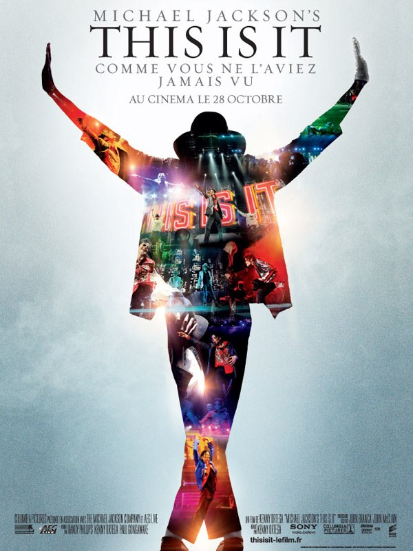
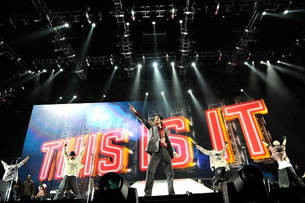
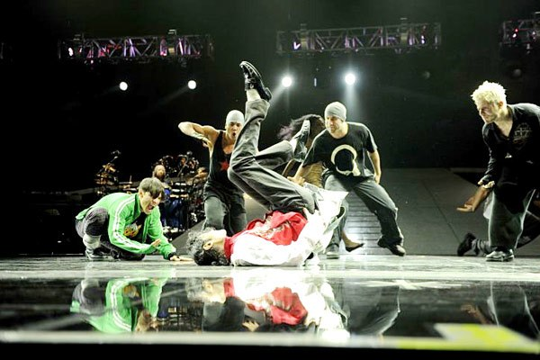
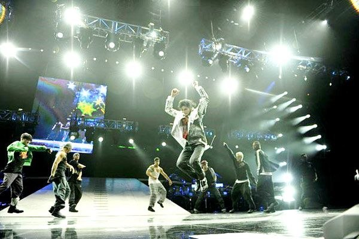

+++
type = "post"
titre = "This is it, Michael Jackson"
title = "This is it, Michael Jackson"
url = "/this-is-it-jackson"
date = "2009-10-30T22:36:02"
Lastmod = "2012-06-26T13:48:53"
cover = "this-is-it-michael-jackson.jpg"
categorie = [ "À voir" ]
tag = [ "Concert", "Hommage", "Michael Jackson", "Musique", "Pop" ]
createur = [ "Michael Jackson" ]
annee = [ "2009" ]
weight = 2009
pays = [ "États-Unis" ]

+++

Je suis faible, j&rsquo;ai écouté les sirènes du discours marketing qui nous assènent depuis de longs mois déjà qu&rsquo;il faut absolument ne pas rater <em>This is it</em>, le film-événement qui montre les dernières images du roi de la pop, alors qu&rsquo;il répétait la série de concerts londoniens. Oui, j&rsquo;ai vu <em>This is it</em>, entouré de fans qui reprenaient en chœur les passages les plus célèbres et applaudissaient les temps forts. L&rsquo;occasion surtout de confirmer ce que j&rsquo;avais écrit peu après sa mort, Michael Jackson est définitivement <a href="http://voiretmanger.fr/2009/07/18/michael-jackson-phenomene-fascinant/">un phénomène fascinant</a>.

Le film se compose d&rsquo;extraits vidéo enregistrés pendant les longues répétitions précédant la non moins longue série de 50 concerts que l&rsquo;artiste devait donner à Londres. Des répétitions à la hauteur d&rsquo;un show à l&rsquo;américaine énorme, avec son écran (vraiment) géant, ses multiples jeux de scène (hop on ouvre la trappe, hop on éjecte les danseurs, hop une nacelle passe sur le public) et bien sûr une dizaine de danseurs et autant de choristes. Un tas de monde donc qui répète ensemble et sans arrêt pour un concert millimétré à la seconde près, où rien ne doit dépasser. Les répétitions se font donc grandeur nature, dans des salles américaines.

Comme il l&rsquo;indique dès le départ, <em>This is it</em> n&rsquo;aurait jamais dû sortir en salle. C&rsquo;était un tournage réalisé entre amis, pour éventuellement en faire un DVD par la suite. En d&rsquo;autres termes, on nous présente ici le bonus lambda d&rsquo;un concert en DVD, sans doute un bonus de très bonne qualité et très long, mais un bonus quand même. Cela se ressent à l&rsquo;écran, avec une image rarement de qualité cinématographique, et parfois même une image de taille réduite, sans doute parce que la source n&rsquo;était pas assez définie. L&rsquo;usage du <em>split screen</em> n&rsquo;est qu&rsquo;un artifice qui met mieux en valeur ce souci.

En clair, on sent bien le produit marketing, le film réalisé à la va-vite après la mort de Michael Jackson pour surfer sur la vague qui est d&rsquo;abord financière. En effet, <a href="http://www.dontmiss.fr/n23115-1/michael-jackson-le-nouvel-affront-de-son-pere.html">comme l&rsquo;a rappelé son décidément fort sympathique père</a>, Michael rapporte énormément depuis qu&rsquo;il est mort. Tout le monde essaie d&rsquo;en profiter, le plus souvent en écrivant en quelques jours un bouquin, mais là avec des images bienvenues des dernières répétitions de l&rsquo;artiste. Le fait que le film ne sorte en salle que pendant deux semaines ne fait qu&rsquo;ajouter au côté produit marketing, en jouant sur la rareté, un principe aussi classique qu&rsquo;efficace.

Néanmoins, <em>This is it</em> tient en gros la route cinématographiquement parlant. Je ne reviendrai pas sur la qualité parfois douteuse de l&rsquo;image, mais plus sur le montage. Se concentrant quasiment uniquement sur Michael Jackson, le film est découpé comme un concert. Et d&rsquo;ailleurs, sa durée — deux petites heures — correspond sans doute à la durée du concert final et on peut penser que l&rsquo;on voit défiler, en gros, la setlist. Chaque chanson est ainsi clairement isolée par le montage, et tous les éléments du film — la répétition proprement dite, les tournages des films projetés pendant le concert ou les interviews — s&rsquo;intègrent à chaque chanson. Cela fonctionne assez bien, finalement.

Mais <em>This is it</em> m&rsquo;a surtout intéressé par ce qu&rsquo;il montre de Michael Jackson. Je suis très loin d&rsquo;être un fan de l&rsquo;artiste, autant le préciser d&rsquo;emblée. J&rsquo;ai découvert récemment <em>Thriller</em>, et je maintiens que c&rsquo;est un bijou, un pur chef-d&rsquo;œuvre de pop. Malheureusement, Michael Jackson a eu cette fulgurance une seule fois dans sa vie, et le reste oscille entre ridicule mielleux et carrément mauvais goût. Reste un album, et un homme qui m&rsquo;impressionne beaucoup par ce qu&rsquo;il est devenu. Je ne vais pas répéter ce que j&rsquo;ai déjà longuement eu le temps d&rsquo;expliquer <a href="http://voiretmanger.fr/2009/07/18/michael-jackson-phenomene-fascinant/">par ailleurs</a>, mais les gros plans de <em>This is it</em> sont une belle démonstration, sans doute involontaire, du monstre que cet homme est devenu.

Michael Jackson est un enfant, voilà ce que montre très bien <em>This is it</em> à travers son quotidien. Bien sûr, cela se lit d&rsquo;abord sur son visage hors du temps, blanc et lisse comme la peau d&rsquo;un enfant justement, alors qu&rsquo;il a 50 ans. Le temps n&rsquo;a plus d&rsquo;effet sur ce visage qui perd aussi toute humanité. On cherche désespérément ce qu&rsquo;il reste d&rsquo;humain en lui, et franchement 3PO semble bien plus vivant que Michael Jackson à la fin de sa vie. Mais c&rsquo;est aussi un gamin dans son comportement, tellement modeste et finalement gêné d&rsquo;être ce qu&rsquo;il est, un monstre de la pop. Ainsi, quand quelque chose ne va pas, il s&rsquo;en excuse et glisse tout de suite un mot : &laquo;&nbsp;Je sais que vous voulez bien faire&nbsp;&raquo;. Et pour régler ce problème, il se plaint auprès du maître technique, Kenny Ortega, qui est aussi le réalisateur du film. C&rsquo;est ce dernier qui demande à régler le problème, et non Michael Jackson lui-même. On trouve aussi l&rsquo;enfant dans la &laquo;&nbsp;conscience&nbsp;&raquo; politique, notamment sur la planète en danger. Avec, à la clé, une ridiculissime séquence pour illustrer une chanson à vomir de mièvrerie avec une petite fille qui est toute contente dans la nature belle et luxuriante jusqu&rsquo;à ce que de méchants hommes détruisent tout sur leur passage, et même la fillette. À la fin, Michael Jackson réunit les troupes pour les remercier et les encourager pour les concerts, et explique que leur objectif est d&rsquo;apporter la paix dans le monde. Le grand cynique que je suis ne peut s&rsquo;empêcher de ricaner, mais c&rsquo;est tellement proche de la vision d&rsquo;un enfant qui pense qu&rsquo;il suffit de dire que les hommes doivent s&rsquo;aimer, pour que les guerres et le mal s&rsquo;arrêtent.

Cet être sans âge resté un enfant au fond de lui est aussi un perfectionniste, et cet aspect-là est bien montré. Les morceaux sont répétés jusqu&rsquo;à atteindre la perfection souhaitée par l&rsquo;artiste, une perfection qu&rsquo;il définit comme étant une exacte copie des disques (voilà un écho intéressant à <a href="http://voiretmanger.fr/2009/10/14/porcupine-tree-olympia-octobre-2009/">un débat à propos de Porcupine Tree</a>&#8230;). Chaque note est travaillée, jusqu&rsquo;à ce qu&rsquo;elle sonne parfaitement bien. Évidemment, il en va de même avec les danseurs qui travaillent même le levé de couilles (oui, c&rsquo;est apparemment tout un art, et c&rsquo;est assez drôle quand la personne qui explique la méthode est une femme) ou avec les lumières et les clips diffusés en fond. À ce propos, ils ont quand même tourné une nouvelle version de &laquo;&nbsp;Thriller&nbsp;&raquo; entièrement en 3D qui perd le charme désuet de l&rsquo;original, mais qui semble quand même bien fichue.

En fin de séance, que penser de <em>This is it</em> ? Déjà, à en juger à l&rsquo;état des spectateurs autour de moi, le film plait aux fans, sans nul doute. À cet égard, l&rsquo;objectif du film de rendre hommage une dernière fois au roi de la pop est certainement atteint. Quand on n&rsquo;est pas fan, on peut trouver un peu léger cet assemblage d&rsquo;images quasiment volées pendant les répétitions, à la qualité douteuse et sans grand intérêt dans le sens où elles n&rsquo;apportent rien que l&rsquo;on ne savait déjà. Tout ceci est vrai, mais en même temps, je ne trouve pas que le film soit totalement inintéressant, en ce qu&rsquo;il présente le quotidien d&rsquo;un homme totalement déshumanisé comme les brèves images d&rsquo;archives des Jackson 5 le mettent cruellement en valeur. <em>This is it</em> gagnerait à être plus bref, indéniablement (on pourrait virer toutes les chansons qui ne sont pas dans <em>Thriller</em> par exemple&#8230;), mais le film évite en grande partie l&rsquo;hommage appuyé posthume et reste de ce fait plaisant à regarder.

<h3>Vous voulez m&rsquo;aider ?<a href="#footnote_0_2004" id="identifier_0_2004" class="footnote-link footnote-identifier-link" title="&Agrave; propos de la publicit&eacute;&hellip;">1</a></h3>
<ul>
<li><a href="http://www.amazon.fr/gp/product/B002TOKAAU/ref=as_li_ss_tl?ie=UTF8&#038;tag=leblogdenic07-21&#038;linkCode=as2&#038;camp=1642&#038;creative=19458&#038;creativeASIN=B002TOKAAU">Acheter le film en Blu-Ray sur Amazon</a></li>
<li><a href="http://www.amazon.fr/gp/product/B002UHL3DO/ref=as_li_ss_tl?ie=UTF8&#038;tag=leblogdenic07-21&#038;linkCode=as2&#038;camp=1642&#038;creative=19458&#038;creativeASIN=B002UHL3DO">Acheter le film en DVD sur Amazon</a></li>
<li><a href="http://itunes.apple.com/fr/tv-season/michael-jacksons-this-is-it/id342734654">Acheter le film sur l&rsquo;iTunes Store</a></li>
</ul>

<ol class="footnotes"><li id="footnote_0_2004" class="footnote"><a href="http://voiretmanger.fr/soutien/">À propos de la publicité…</a> [<a href="#identifier_0_2004" class="footnote-link footnote-back-link">&#8617;</a>]</li></ol>
