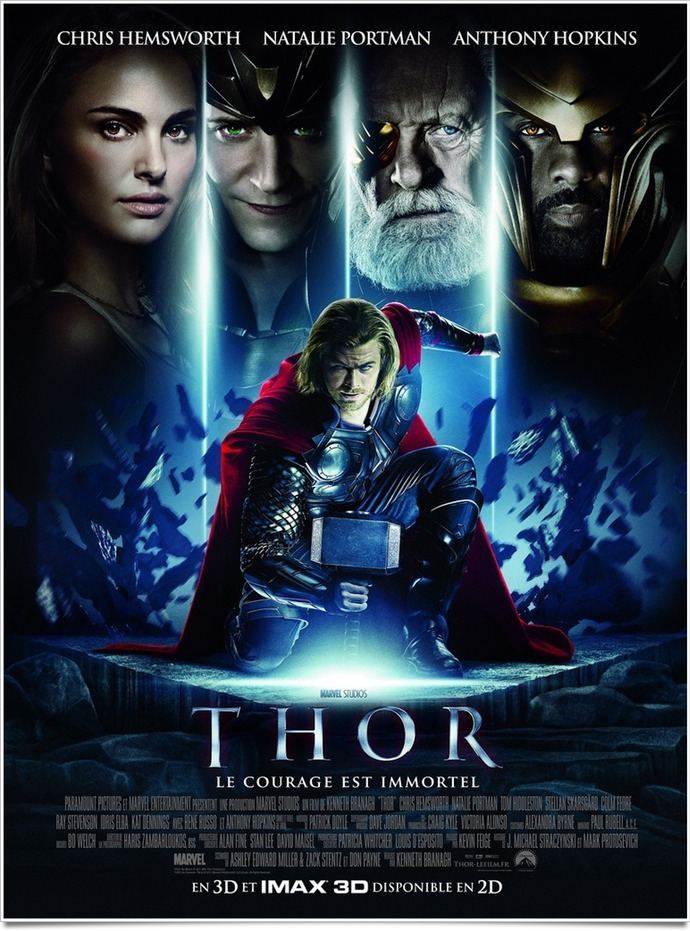
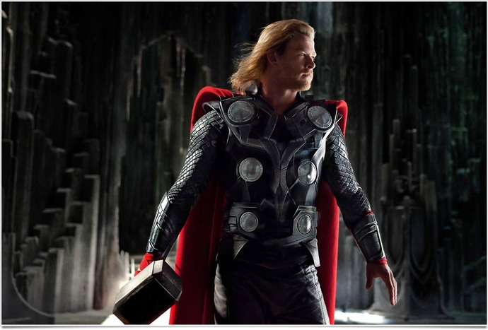
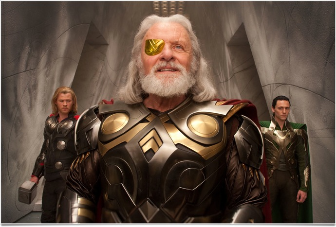

+++
type = "post"
titre = "<em>Thor</em>, Kenneth Branagh"
title = "Thor, Kenneth Branagh"
url = "/thor-branagh"
date = "2011-04-30T00:21:17"
Lastmod = "2015-05-06T11:37:53"
cover = "thor-branagh.jpg"
categorie = [ "À voir" ]
tag = [ "Blockbuster", "Comics", "Fantastique", "Kitsch", "Mythe", "Superhéros", "Vite oublié" ]
createur = [ "Kenneth Branagh" ]
acteur = [ "Anthony Hopkins", "Chris Hemworth", "Nathalie Portman" ]
annee = [ "2011" ]
weight = 2011
saga = [ "Avengers", "Thor" ]
pays = [ "États-Unis" ]

+++

Dans l&rsquo;univers des comics, les <a href="http://fr.wikipedia.org/wiki/Les_Vengeurs">Avengers</a> ont sans nul doute une place à part. Créés par les célèbres éditions Marvel, les Vengeurs rassemblent plusieurs super héros, dans une sorte de récit de super héros ultime. Depuis plusieurs années déjà, le cinéma s&rsquo;est emparé des comics pour fournir de multiples adaptations, parmi lesquelles plusieurs Avengers se sont cachés : Hulk ou Iron Man notamment. Peu à peu, Hollywood reconstruit le groupe avec cette fois un autre élément clé : Thor. <em>Thor</em>, le film de Kenneth Branagh, constitue ainsi une pierre à l&rsquo;édifice et intéressera les fans de la série, en attendant la sortie tant attendue d&rsquo;<em>Avengers</em>, le film, en 2012, et en attendant d&rsquo;ici là la sortie de <em>Captain America : First Avenger</em> cet été. Les autres risquent d&rsquo;être déçus par cette histoire assez alambiquée et très kitsch, ainsi que par son héros aussi monobloc que son marteau.

Royaume d&rsquo;Asgard, à une date indéterminée. Thor est le fils d&rsquo;Odin, père de toute chose. On comprend qu&rsquo;un tel héritage lui soit monté à la tête et Thor est ainsi un jeune homme fier, arrogant, violent et un peu stupide. Pour prouver sa valeur à son père, il décide de partir avec son frère Loki et une poignée de fidèles contre les ennemis de toujours de son peuple. Ce geste stupide et suicidaire ranime une guerre ancestrale. Odin, furieux, bannit son fils du royaume et l&rsquo;envoi… sur terre. Il tombe alors nez à nez avec Jane, une scientifique venue enquêter dans le désert du Nouveau-Mexique sur d&rsquo;étranges phénomènes météorologiques. Thor sur terre n&rsquo;est plus qu&rsquo;un simple mortel, certes avec des pectoraux plus gros que la taille de la tête de Jane, mais sans ses pouvoirs magiques, et notamment sans son célèbre marteau. Alors que le Shield, une organisation mystérieuse, mais toute puissante, veut récupérer le marteau, notre jeune super héros tente tant bien que mal de retrouver grâce aux yeux de son père. Il va néanmoins découvrir que Loki, son jeune frère, complote contre lui et veut prendre sa place sur le trône d&rsquo;Asgard…

<em>Thor</em> est un film assez typique où le super héros se découvre, même s&rsquo;il y a ici une subtilité. Au début du film, Thor est fils d&rsquo;un dieu et à ce titre, il jouit d&rsquo;un pouvoir immense dont il a pleinement conscience. Mais en arrivant sur Terre, il est rabaissé au simple rang d&rsquo;humain et il va devoir redécouvrir ses pouvoirs : on retrouve bien là le processus d&rsquo;apprentissage classique. Thor fait partie de cette catégorie de super héros qui bénéficie de pouvoirs surnaturels innés, au contraire d&rsquo;autres, comme Iron Man, qui doivent construire leurs pouvoirs. Le seul accessoire de Thor est son marteau qui s&rsquo;amuse ici à jouer à l&rsquo;Excalibur, mais ce n&rsquo;est pas un accessoire standard puisque seul Thor peut l&rsquo;utiliser. Une fois le marteau récupéré cependant, Thor semble totalement indestructible : il vole, il crée des tempêtes, lance son marteau dans tous les sens, etc. Comme Superman, Thor vient d&rsquo;une autre planète et il est sur terre en tant qu&rsquo;étranger. Kenneth Branagh a réussi à assez bien exploiter cet aspect du personnage, principal ressort comique d&rsquo;un film par ailleurs assez sérieux. Si <em>Thor</em> permet de découvrir un super héros, le film est aussi prévu pour s&rsquo;insérer dans le réseau de films qui, mis bout à bout, forment l&rsquo;histoire des Avengers. À ce titre, il est préférable d&rsquo;avoir vu <em><a href="http://voiretmanger.fr/2010/04/29/iron-man-2-favreau/">Iron Man 2</a></em> pour tout comprendre même si les deux films sont suffisamment différents pour être vus séparément. Les deux films sont néanmoins très clairement reliés par des personnages récurrents et par une référence explicite : la fin d&rsquo;<em>Iron Man 2</em> se situe dans <em>Thor</em>, tandis qu&rsquo;il faudra rester jusqu&rsquo;à la fin du générique pour avoir une idée de la suite. Cette construction assez rare au cinéma est assez fascinante, même si elle relève plus de l&rsquo;anecdotique pour une raison simple : chaque film doit être vu indépendamment.

Ce choix peut se comprendre sur le plan économique, mais il n&rsquo;aide pas <em>Thor</em>. Le film semble bien faible par rapport aux deux <em>Iron Man</em>, ou à d&rsquo;autres adaptations de comics. La raison est en fait assez simple : Thor est un super héros sans intérêt. Du début à la fin, il reste globalement le même : un gars un peu trop fier, très musclé et plutôt sympa, dans l&rsquo;ensemble. Il lui manque le côté sombre qui est normalement présent en tout super héros. Thor ne doute jamais sérieusement, même si l&rsquo;impossible récupération du marteau semble le faire vaciller quelques secondes. Reste que, dans l&rsquo;ensemble, Kenneth Branagh fait de son héros un bloc incroyablement statique qui empêche vraiment de s&rsquo;intéresser à lui. Peut-être est-ce un trait de caractère du personnage lui-même, mais cette faiblesse s&rsquo;apparente plus à une faiblesse du film lui-même. Dommage, d&rsquo;autant que l&rsquo;histoire elle-même n&rsquo;est pas des plus passionnantes. Les enjeux sont très réduits dans <em>Thor</em> et ils sont de toute manière trop peu développés pour passionner sérieusement. Ajoutons à cela que toute la partie extra-terrestre est vieillotte et kitsch : la ville est toute dorée et brille de mille feux, les armures brillent au soleil (pas autant que dans <em><a href="http://voiretmanger.fr/2010/04/28/choc-titans-leterrier/">Le Choc des Titans</a></em> néanmoins)… C&rsquo;est en tout cas un cadre qui ne donne pas vraiment envie de s&rsquo;intéresser plus avant à l&rsquo;histoire…

Le problème de <em>Thor</em> tient aussi dans sa panoplie d&rsquo;acteurs. Si Thor semble aussi statique, c&rsquo;est aussi parce que son acteur, Chris Hemsworth, n&rsquo;est pas très bon. Son père, interprété par un Anthony Hopkins qui semble vraiment avoir pris une retraite anticipée, n&rsquo;est pas vraiment mieux, on ne ressent jamais de douleur, ou même de peine. C&rsquo;est un peu mieux côté humains, mais Nathalie Portman fait ce qu&rsquo;elle peut pour vaguement rendre son personnage intéressant, elle ne suffit pas à sauver le film. Malgré un budget très confortable, les effets spéciaux de <em>Thor</em> sont inégaux : parfois impressionnants, ils sont aussi d&rsquo;autres fois assez ridicules, pour ne pas dire kitsch. On regrette bien sûr le choix de la 3D : ajoutée en post-production, elle n&rsquo;apporte rien et nuit à la lisibilité de l&rsquo;ensemble, même s&rsquo;il faut reconnaître une amélioration par rapport à des films sortis il y a un an comme <em><a href="http://voiretmanger.fr/2010/07/06/dernier-maitre-air-shyamalan/">Le dernier maître de l&rsquo;air</a></em>. Complétons le tableau avec une musique pompière bien peu inspirée et l&rsquo;on comprendra que <em>Thor</em> ne passionne pas non plus sur le plan cinématographique…

Sous des aspects de blockbuster hollywoodien, <em>Thor</em> s&rsquo;apparente en fait plus à une introduction pour geeks fans des comics originaux qu&rsquo;à un film grand public. On sent bien un potentiel derrière, mais en attendant cette histoire est alambiquée, traitée un peu trop à la légère (avec, en particulier, une accélération sur la fin qui empêche de comprendre grand-chose) et elle manque globalement d&rsquo;intérêt. Thor est un super héros bien peu intéressant, le royaume d&rsquo;Asgard rappelle vraiment trop les contes pour enfants pour être réaliste, bref le scénario pêche et la réalisation ne le sauve pas. <em>Thor</em> n&rsquo;est pas un mauvais film pour autant : le savoir-faire d&rsquo;Hollywood reste entier et on passe un bon moment… mais ce sera tout. Pour l&rsquo;histoire intéressante, on attendra plutôt <em><a href="http://voiretmanger.fr/2011/08/20/captain-america-first-avenger-johnston/" title="Captain America : First Avenger, Joe Johnston">Captain America</a></em> cet été. Du moins, espérons-le…

<h3>Vous voulez m&rsquo;aider ?</h3>
<ul>
<li><a href="http://www.amazon.fr/gp/product/B004XAU7VA/ref=as_li_ss_tl?ie=UTF8&#038;tag=leblogdenic07-21&#038;linkCode=as2&#038;camp=1642&#038;creative=19458&#038;creativeASIN=B004XAU7VA">Acheter le film en Blu-Ray et DVD sur Amazon</a></li>
<li><a href="http://www.amazon.fr/gp/product/B004XAU7TM/ref=as_li_ss_tl?ie=UTF8&#038;tag=leblogdenic07-21&#038;linkCode=as2&#038;camp=1642&#038;creative=19458&#038;creativeASIN=B004XAU7TM">Acheter le film en DVD sur Amazon</a></li>
<li><a href="http://itunes.apple.com/fr/movie/thor/id448556543">Acheter le film sur l&rsquo;iTunes Store</a></li>
</ul>

