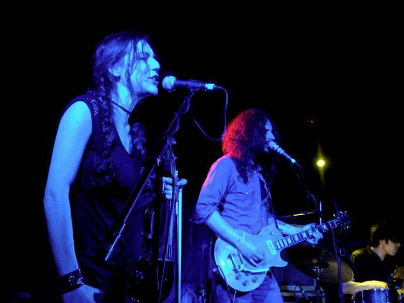
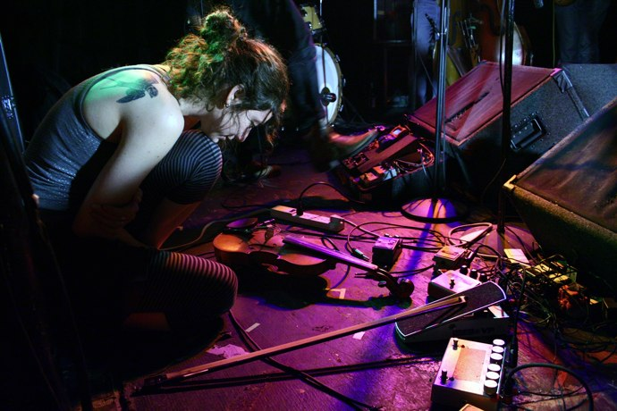
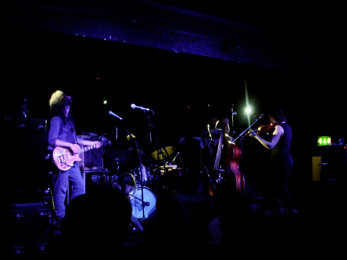

+++
type = "post"
titre = "Thee Silver Mt. Zion à l&rsquo;Alhambra (31 mars 2010)"
title = "Thee Silver Mt. Zion à l'Alhambra (31 mars 2010)"
url = "/three-silver-mt-zion-alhambra-mars-2010"
date = "2010-04-01T00:17:52"
Lastmod = "2010-04-07T21:35:18"
cover = "three-silver-mt-zion.jpg"
categorie = [ "À voir… en live" ]
tag = [ "Alhambra", "Concert", "Post-Rock" ]
createur = [ "A Silver Mt. Zion" ]
annee = [ "2010" ]
weight = 2010

+++

Ce soir, j&rsquo;ai enfin vu Thee Silver Mt. Zion<a href="#footnote_0_3122" id="identifier_0_3122" class="footnote-link footnote-identifier-link" title="La formation change de nom presque comme de chemise, et depuis le dernier album il semble qu&rsquo;il faille parler de Thee Silver Mt. Zion. Un A Silver Mt. Zion risque de m&rsquo;&eacute;chapper de temps en temps, mais c&rsquo;est bien le m&ecirc;me groupe.">1</a> sur scène. Ce groupe canadien est l&rsquo;héritier du mythique Godspeed You Black Emperor, le groupe qui n&rsquo;inventa rien de moins que le post-rock, ce genre assez flou censé signer la mort du rock traditionnel. J&rsquo;étais curieux de savoir ce que des disques complexes composés de titres longs, tortueux et torturés pouvaient donner en concert. Le risque était grand de n&rsquo;obtenir qu&rsquo;une répétition maitrisée des albums sur scène, un exercice sans le moindre intérêt. Le résultat fut néanmoins au-delà de mes espérances les plus folles : l&rsquo;énergie des disques est rendue avec plus de vigueur encore, sur des versions renouvelées. Un vrai bonheur !

<em>Crédit photo : <a href="http://www.flickr.com/photos/stephanck/4466415659/">stephanck @ Flickr</a></em>

Le concert est prévu pour 19h30, et quand j&rsquo;arrive devant la salle 45 minutes avant cet horaire, je suis le troisième. Quand on entre finalement, un quart d&rsquo;heure environ avant le début du concert, nous étions peut-être une vingtaine et cette impression de vide n&rsquo;a pas cessé avant le début de la première partie. Cela m&rsquo;a permis d&rsquo;innover sur un concert en étant pour la première fois accouder à la scène, tout devant. Bonne idée sur le papier, qui se révèle moyennement convaincante finalement, le son n&rsquo;étant finalement pas si bon et surtout à cause de la tendance à se faire éjecter du centre au fil du concert. Bref, j&rsquo;aurais mieux fait de ne pas faire mon malin et de m&rsquo;asseoir gentiment, conformément à mon état actuel de fatigue. Toujours est-il que le concert débute devant une salle vide, salle qui se remplit néanmoins pendant la première partie, ce que je trouve particulièrement irrespectueux, même si les premières parties ne sont pas toujours très passionnantes, il faut bien l&rsquo;avouer.

Ce soir, c&rsquo;est un groupe français dont j&rsquo;ai oublié le nom qui ouvrit les festivités.<em> EDIT du lendemain soir : il s&rsquo;agissait de </em><a href="http://www.myspace.com/faustineseilman" target="_blank"><em>Faustine Seilman</em></a><em> (merci Gapou)</em>. Ils ont chanté dans un anglais accentué à la française comme il se doit des tires qui m&rsquo;ont parfois rappelé l&rsquo;esprit de Jack The Ripper, mais peut-être n&rsquo;est-ce dû qu&rsquo;à l&rsquo;accent. En tout cas, ce n&rsquo;était pas déplaisant, et le guitariste avait des allures de premier de la classe d&rsquo;un lycée versaillais, tout en étant à fond dans ce qu&rsquo;il jouait, c&rsquo;était mignon.

Quand le groupe canadien monte enfin sur scène, l&rsquo;Alhambra est plein et prêt. On sent le public d&rsquo;habitués, il y a sans doute très peu de curieux venus découvrir le groupe dans la salle. Il fallait entendre les clameurs du public à l&rsquo;énoncé d&rsquo;un titre de chanson, titres que j&rsquo;ignorais en moyenne totalement (il faut dire que je ne retiens jamais les titres des chansons). Autant le dire, Thee Silver Mt. Zion n&rsquo;avait pas besoin de convaincre, ils disposaient d&rsquo;un Alhambra conquis. Dans son état actuel, le groupe compte cinq membres, un guitariste/chanteur, deux violonistes, un contrebassiste et un batteur. Le chanteur, Efrim Menuck, fait office de leader, c&rsquo;est lui papote, lance les titres ou remercie chaleureusement. Il s&rsquo;agit néanmoins d&rsquo;un véritable groupe où chacun joue un rôle essentiel.

<em>Crédit photo : <a href="http://www.flickr.com/photos/crustina/2549687766/"> crustina @ Flickr</a></em>

Techniquement, le concert fut quasiment irréprochable, même si je pense que le son aurait été meilleur en reculant légèrement. Néanmoins, la musique de Thee Silver Mt. Zion n&rsquo;est pas évidente à retranscrire, tant elle passe d&rsquo;un extrême à l&rsquo;autre rapidement. Dans les moments &laquo;&nbsp;violents&nbsp;&raquo;, la bouillie sonore a été évitée et les instruments sont restés globalement distincts, même si c&rsquo;est moins vrai pour l&rsquo;un ou l&rsquo;autre violon. La voix d&rsquo;Efrim Menuck est vraiment impressionnante : il semble hurler plus que chanter, mais c&rsquo;est toujours mélodique, sa voix ne sature ni ne faiblit jamais. À plusieurs reprises, il chante <em>a cappela</em>, tellement loin du micro que ce dernier en devient inutile. Et on l&rsquo;entend parfaitement bien, micro ou pas. Ce timbre de voix si particulier contribue en grande partie à l&rsquo;ambiance du concert, on s&rsquo;en doute, mais les instruments sont tout aussi essentiels. La guitare est le plus souvent saturée, mais les violons sont utilisés alternativement &laquo;&nbsp;normalement&nbsp;&raquo; et de manière très étrange, très saturés je pense, avec un son qui se rapproche de celui des guitares électriques.

Pendant tout le concert, Efrim Menuck n&rsquo;a pas arrêté de discuter avec le public. Je pensais voir un groupe plutôt refermé sur lui-même et j&rsquo;ai été vraiment étonné de découvrir que son chanteur est en fait très charismatique, il discute facilement et est même plutôt drôle. Avec ses cheveux longs et sa moustache, il est l&rsquo;archétype même du hippie. Ce qui est amusant, c&rsquo;est qu&rsquo;il se crée un personnage de hippie et qu&rsquo;il parle comme un hippie pour mieux s&rsquo;en moquer. À un moment, il nous a ainsi expliqué que l&rsquo;on s&rsquo;identifié à sa ville, éventuellement sa région, jamais au-delà. C&rsquo;est un refus du nationalisme, certes, mais aussi de tout ce qui relève de la fraternité supposée sans frontière. J&rsquo;ai beaucoup aimé son auto-dérision permanente, quand il s&rsquo;excuse d&rsquo;accorder sa guitare alors qu&rsquo;il vient de parler pendant plusieurs minutes et qu&rsquo;il dit qu&rsquo;un &laquo;&nbsp;musicien professionnel&nbsp;&raquo; l&rsquo;aurait accordée en même temps, par exemple. C&rsquo;est aussi la première fois que j&rsquo;assiste à un concert où on nous demande si l&rsquo;on a des questions, des remarques ou même des critiques à apporter, et ce à plusieurs reprises. Le plus fort, c&rsquo;est qu&rsquo;il a répondu à tout, même à propos de sa coupe de cheveux… Il a aussi tapé allègrement sur Arcade Fire, groupe manipulateur à l&rsquo;image de U2, avec démonstration à la clé sur la musique censée rendre heureux, mais qui n&rsquo;est qu&rsquo;un leurre selon lui.

Cette comparaison avec U2 et Arcade Fire est intéressante, au-delà de la leçon sur la musique, l&rsquo;argent et l&rsquo;indépendance. Il est frappant de constater que la musique de Thee Silver Mt. Zion est en fait assez primitive, derrière sa complexité apparente. En l&rsquo;écoutant sur scène, et en constatant que mes voisins étaient un peu dans le même état que moi, je me suis dit que ces montes en puissance, ces changements de rythme, rappelaient quand même fortement le principe de la transe. C&rsquo;est un principe central dans le post-rock, mais justement le genre se réduit un peu trop souvent à simplement des montées en puissance. Godspeed You Black Emperor proposait beaucoup plus, et on retrouve cette originalité chez Silver Mt. Zion, notamment par l&rsquo;utilisation des deux violons, mais aussi par l&rsquo;usage de la voix et donc des textes, qui manquent souvent à d&rsquo;autres groupes classés dans ce genre.

<em>Crédit photo : <a href="http://www.flickr.com/photos/4467203040/">stephanck @ Flickr</a></em>

Ce concert de Thee Silver Mt. Zion fut une excellente surprise. J&rsquo;en attendais beaucoup, j&rsquo;ai eu encore plus. C&rsquo;est bien simple, j&rsquo;ai été littéralement emporté par ce concert, au point de m&rsquo;étonner quand le premier bis est arrivé. Il est vrai que le spectacle fut court (apparemment un des musiciens s&rsquo;est blessé et en souffre toujours), mais je n&rsquo;ai vraiment pas vu le temps passer. Leur musique fera sans doute peur à beaucoup de monde, mais il ne faut pas se laisser impressionner par des abords difficiles, il faut se laisser emporter par la voix, par les instruments, et atteindre un état proche de la transe, mais sans substances illicites<a href="#footnote_1_3122" id="identifier_1_3122" class="footnote-link footnote-identifier-link" title="Sur sc&egrave;ne, on carbure au vin rouge, par contre&hellip;">2</a>.

<em>Crédit photo couverture : <a href="http://www.flickr.com/photos/stephanck/4466425327/">stephanck @ Flickr</a></em>

<ol class="footnotes"><li id="footnote_0_3122" class="footnote">La formation change de nom presque comme de chemise, et depuis le dernier album il semble qu&rsquo;il faille parler de Thee Silver Mt. Zion. Un A Silver Mt. Zion risque de m&rsquo;échapper de temps en temps, mais c&rsquo;est bien le même groupe. [<a href="#identifier_0_3122" class="footnote-link footnote-back-link">&#8617;</a>]</li><li id="footnote_1_3122" class="footnote">Sur scène, on carbure au vin rouge, par contre… [<a href="#identifier_1_3122" class="footnote-link footnote-back-link">&#8617;</a>]</li></ol>
