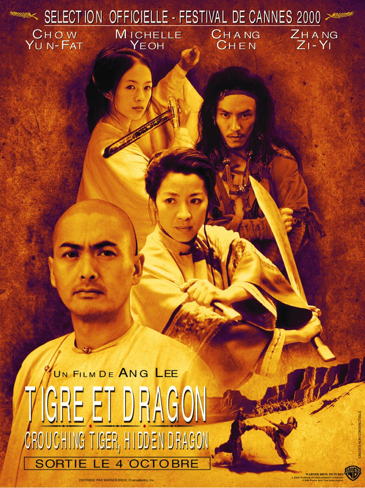
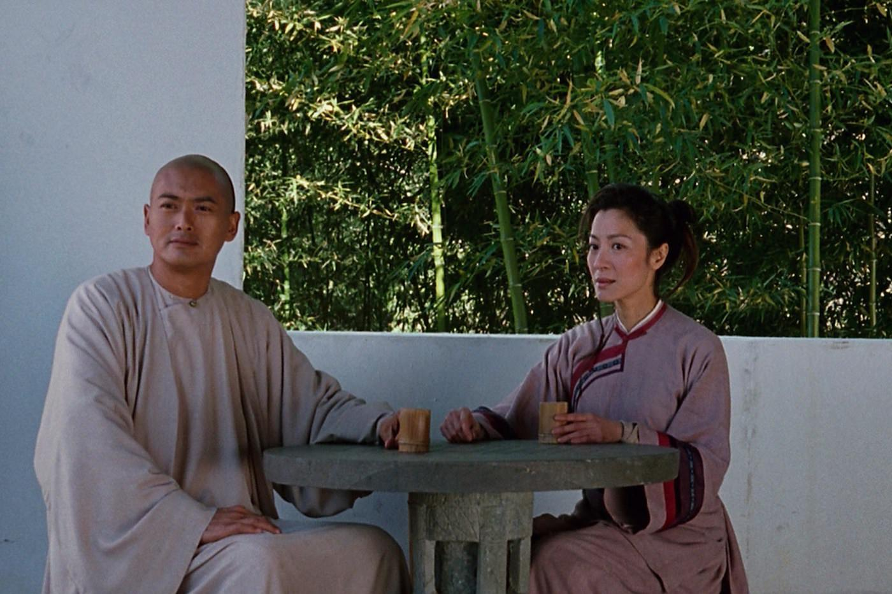
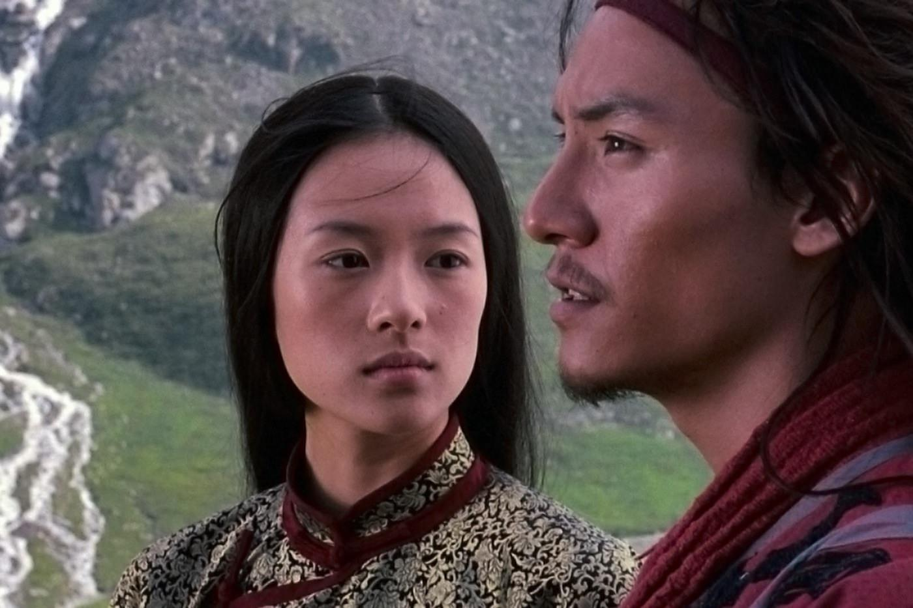

+++
type = "post"
titre = "<em>Tigre et Dragon</em>, Ang Lee"
title = "Tigre et Dragon, Ang Lee"
url = "/tigre-et-dragon-lee"
date = "2013-04-29T10:46:12"
Lastmod = "2014-09-30T11:11:12"
cover = "tigre-dragon-ang-lee-zhang-ziyi.jpg"
categorie = [ "À voir" ]
tag = [ "Action", "Adaptation littéraire", "Amour", "Blockbuster", "Drame", "Enquête", "Fantastique", "Kung-fu", "Société" ]
createur = [ "Ang Lee" ]
acteur = [ "Chang Chen", "Chow Yun-Fat", "Michelle Yeoh", "Zhang Ziyi" ]
annee = [ "2000" ]
weight = 2000
saga = [ "Tigre et Dragon" ]
pays = [ "Chine", "États-Unis", "Hong-Kong", "Taïwan" ]
original = "Wo hu cang long"

+++

D’origine taïwanaise, Ang Lee est certes un cinéaste asiatique, mais il a également tourné beaucoup de films aux États-Unis. En 2000, <em>Tigre et Dragon</em> est une grosse production sino-américaine, mais tournée avec des acteurs chinois en mandarin. Un film de kung-fu à l’ancienne qui a connu un succès surprise dans le monde entier. Surprise, peut-être, mais pas surprenant : avec cette double histoire d’amour mêlée de combats spectaculaires, Ang Lee réussit à faire un film touchant et apaisant où le réalisme n’a pas sa place, pour un résultat aérien.

<em>Tigre et Dragon</em> est l’adaptation d’un roman écrit dans la première moitié du XXe siècle et son histoire se déroule en Chine, au XIXe siècle. À dire vrai, cela n’a pas tellement d’importance, tant Ang Lee rejette toute forme de réalisme dans son film. Si la reconstitution d’époque est certainement fidèle, les combats d’arts martiaux qui constituent le clou du spectacle ne répondent, eux, à aucune loi de physique existante. Les personnages volent littéralement dans les airs, ils marchent sur les murs et parviennent à arrêter d’une main une flèche lancée avec un arc. Au spectateur d’accepter ces étranges combats qui tendent légèrement au ridicule quand les personnages marchent dans les airs ou sur l’eau, mais le message est clair : le réalisateur refuse tout réalisme et prône au contraire une esthétisation à outrance de ces scènes de combat. De fait, <em>Tigre et Dragon</em> propose des séquences aériennes magnifiques, notamment une restée célèbre qui oppose deux personnages sur les cimes d’une forêt de bambous. Très légère autant qu’impossible, cette scène de combat est vraiment splendide et elle a inspiré de nombreux cinéastes par la suite, créant une sorte de mode.

Ce refus du réalisme, c’est aussi dans le film celui de Jen. Cette jeune fille est issue d’une grande famille noble et son destin est tout tracé : quand <em>Tigre et Dragon</em> commence, elle est promise à son futur époux et on ne lui a jamais demandé son avis parce qu’elle n’a pas vraiment le choix. Ce qu’elle désire plus que tout pourtant, c’est d’être libre et d’échapper à cette vie que l’on a écrit à sa place. Elle a appris le kung-fu en secret et elle excelle dans l’art de manière une épée. Ang Lee en fait un personnage complexe, tiraillé entre ses obligations sociales qu’elle comprend et accepte en partie, et ses envies de femme. Un long flash-back illustre ce désir profondément ancré en elle : attaquée par des brigands dans le désert, elle poursuit le meneur pour récupérer un peigne, du moins c’est ce qu’elle dit, car <em>Tigre et Dragon</em> nous montre bien qu’elle désire en fait son ravisseur. Entre Jen et Lo, une grande histoire d’amour s’ouvre, mais un amour qui est totalement impossible et même impensable. De la même manière, le film évoque deux autres personnages qui ne sont pas nobles, mais qui ne peuvent pas non plus s’avouer leur amour.

Le long-métrage d’An Lee met en effet en scène deux couples dont les histoires se croisent jusqu’à la fin sans se réunir totalement. Aux côtés de Jen et de Lo, on retrouve ainsi Li Mu Bai, un virtuose des arts martiaux, mais qui décide de prendre sa retraite quand <em>Tigre et Dragon</em> commence. Il est las de sa vie de combats et il remet symboliquement son épée nommée « Destinée » au seigneur Té, par l’intermédiaire de Shu Lien, une bonne amie qui maîtrise également le kung-fu et qu’il aime en secret depuis des années. Le film ne nous explique pas pourquoi ces deux êtres ne peuvent s’aimer et on comprend que, au fond, ils se l’interdisent eux-mêmes. Quand, enfin, Ang Lee les réunit ouvertement, c’est déjà trop tard et la leçon est amère. On pourrait croire que cette leçon servirait à Jen et l’appellerait à vivre avec celle qu’elle aime, mais ce personnage est plus complexe qu’au premier abord, sans doute parce qu’elle préfère garder une indépendance totale. Son enseignement, elle le doit à Jade la Hyène, une meurtrière qui a notamment tué le maître de Li Mu Bai, mais celle qui pourrait être une mère de substitution finit par jalouser les performances de son élève. Jen pourrait alors apprendre auprès de Li Mu Bai, mais <em>Tigre et Dragon</em> change de voie et parvient à surprendre avec une fin différente de celle que l’on pouvait attendre.

Dans son film, Ang Lee laisse la part belle aux femmes qui font quasiment toute l’action. Les hommes sont présents, mais Li Mu Bai comme Lo sont deux personnages un peu sur le côté, qui interviennent sans bouleverser le récit. L’essentiel repose sur Jen d’une part et sur Shu Lien d’autre part, mais aussi sur le personnage de Jade la Hyène. Pour tous ces rôles féminins, le cinéaste a choisi des actrices à la hauteur en opposant Michelle Yeoh et Zhang Ziyi. La première est américaine, la seconde chinoise, mais cette différence a été totalement effacée à l’écran : si les combats ne parient pas sur le réalisme, le choix des dialogues en mandarin est payant et <em>Tigre et Dragon</em> fonctionne de bout en bout. La <a href="http://www.amazon.fr/gp/product/B0034PHWGI/ref=as_li_ss_tl?ie=UTF8&tag=leblogdenic07-21&linkCode=as2&camp=1642&creative=19458&creativeASIN=B0034PHWGI">bande originale</a> composée par Yo-Yo Ma représente aussi cet entre-deux : très classique avec son thème facile à reconnaître et joué avec des cordes pour susciter l’émotion, elle intègre malgré tout des éléments de musique chinoise pour un assemblage très réussi. C’est un peu ça, finalement, le cinéma d’An Lee : une alliance entre deux cultures, même si <em>Tigre et Dragon</em> tire bien plus vers l’Asie que les États-Unis.

<em>Tigre et Dragon</em> rassemble deux histoires d’amour interdit autour d’arts martiaux filmés avec une légèreté et une grâce totale. Ang Lee signe un film surprenant, où le réalisme n’a pas sa place, une très belle réalisation qui n’a pas volé son énorme succès à sa sortie, au début des années 2000. Même si les films de ce genre se sont multipliés depuis, <em>Tigre et Dragon</em> reste un modèle du genre et un très beau film, à voir et à revoir…

<h3>Vous voulez m&rsquo;aider ?<a href="#footnote_0_9259" id="identifier_0_9259" class="footnote-link footnote-identifier-link" title="&Agrave; propos de la publicit&eacute;&hellip;">1</a></h3>
<ul>
<li><a href="http://www.amazon.fr/gp/product/B00198X0UY/ref=as_li_ss_tl?ie=UTF8&tag=leblogdenic07-21&linkCode=as2&camp=1642&creative=19458&creativeASIN=B00198X0UY">Acheter le film en Blu-Ray sur Amazon</a></li>
<li><a href="http://www.amazon.fr/gp/product/B00005B5R9/ref=as_li_ss_tl?ie=UTF8&tag=leblogdenic07-21&linkCode=as2&camp=1642&creative=19458&creativeASIN=B00005B5R9">Acheter le film en DVD sur Amazon</a></li>
</ul>

<ol class="footnotes"><li id="footnote_0_9259" class="footnote"><a href="/soutien/">À propos de la publicité…</a> [<a href="#identifier_0_9259" class="footnote-link footnote-back-link">&#8617;</a>]</li></ol>
