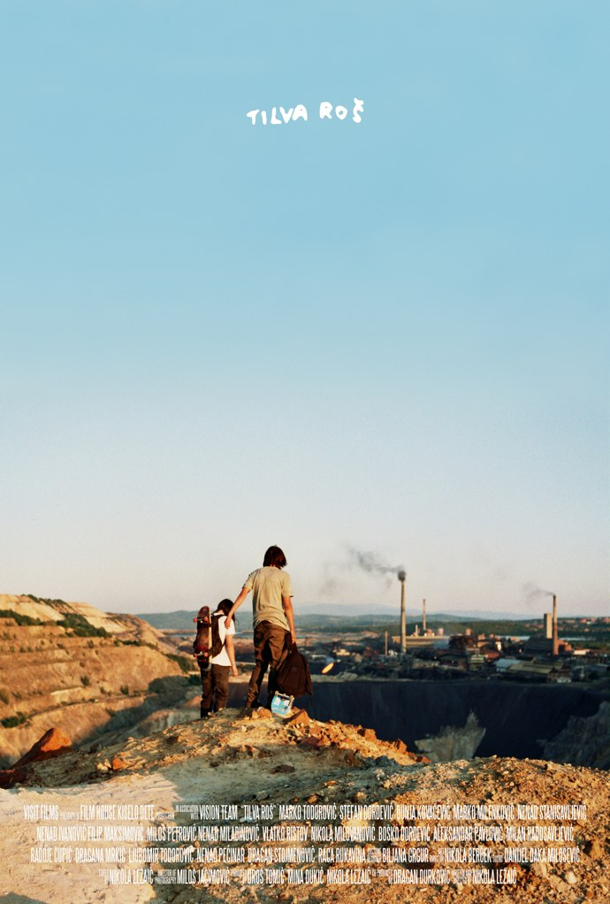
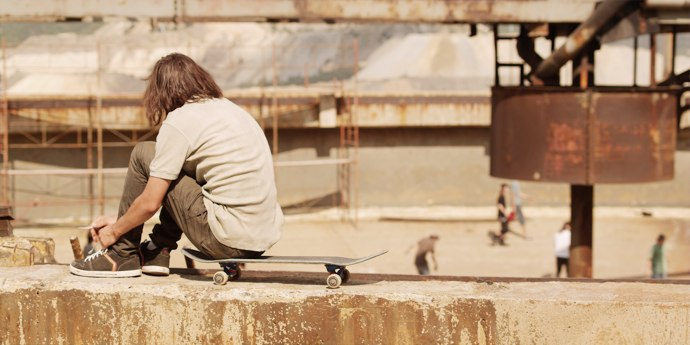
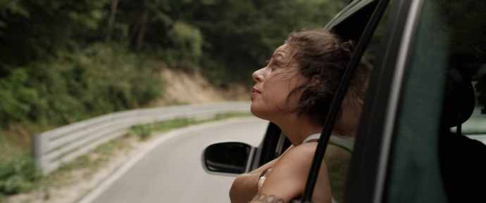

+++
titre = "Tilva Roš, Nikola Ležaic"
title = "Tilva Roš, Nikola Ležaic"
url = "/tilva-ros-lezaic"
date = "2010-12-22T00:18:50"
Lastmod = "2010-12-18T20:46:01"
cover = "tilva-ros-lezaic1.jpg"
categorie = [ "À voir" ]
tag = [ "Adolescence", "Arcs 2010", "Documentaire", "Famille", "Festival", "Société" ]
createur = [ "Nikola Ležaic" ]
annee = [ "2011" ]
weight = 2011
pays = [ "Serbie" ]

+++

<a href="http://www.lesarcs-filmfest.com/2010/accueil/">

</a>

Un Jackass serbe ? L&rsquo;idée a de quoi surprendre… Pourtant, <em>Tilva Roš</em> part pourtant de cette idée, mais le film de Nikola Ležaic ne s&rsquo;arrête pas à cette idée amusante, mais tout de même limitée. Au-delà des cascades casse-gueules, <em>Tilva Roš</em> est d&rsquo;abord un film sur l&rsquo;adolescence et le mal-être des adolescents. C&rsquo;est aussi, en filigrane, un film sur Bor, une ville minière sinistrée. Si le style Jackass est un peu pénible, le film reste intéressant et plaisant.

Toda et Stefan sont deux amis d&rsquo;enfance. Les conneries, ils les ont faites ensemble et ils continuent d&rsquo;en faire ensemble. C&rsquo;est que les deux compères aiment tellement <a href="http://fr.wikipedia.org/wiki/Jackass">Jackass</a> qu&rsquo;ils ont repris à leur compte le principe très simple des Américains : réaliser, face à la caméra, les plus grosses bêtises imaginables, (se) faire mal volontairement (en s&rsquo;enfonçant une aiguille dans la joue ou en se râpant le genou avec une râpe à fromage) ou tenter un exploit tel que sauter depuis un élément en hauteur ou tenir le plus longtemps possible sur le toit d&rsquo;une voiture. Les objectifs sont invariablement les mêmes : faire rire, épater la galerie, (se) faire peur, tester ses limites… C&rsquo;est stupide, certes, mais on sent aussi que c&rsquo;est là le meilleur moyen qu&rsquo;ont trouvé ces jeunes d&rsquo;exister, d&rsquo;affirmer leur présence et de faire quelque chose de leur vie. Le film se déroule entièrement pendant l&rsquo;été qui suit le bac : ces adolescents passent ainsi leur dernier vrai été en groupe, avant l&rsquo;éclatement des études ou du travail. Pour eux, c&rsquo;est l&rsquo;occasion ou jamais de s&rsquo;éclater, ce qui passe dans le cas de nos deux héros par la réalisation de vidéos à la Jackass.

La force de <em>Tilva Roš</em> est certainement son réalisme. L&rsquo;explication est très simple : Toda et Stefan ne sont pas des personnages de fiction, mais de vrais jeunes Serbes de Bor qui ont vraiment réalisé des vidéos de cascades et qui font vraiment partie d&rsquo;une bande de potes skaters nommée &laquo;&nbsp;<a href="http://en.wikipedia.org/wiki/Tilva_Roš#Skate_team_.22Kolos.22">Kolos</a>&laquo;&nbsp;. À quelques exceptions près, le film a donc été tourné avec des acteurs non professionnels, ce qui offre à <em>Tilva Roš</em> des scènes de dialogue extrêmement réalistes où tout le monde parle en même temps comme c&rsquo;est toujours le cas dans la vraie vie. Toutes les scènes de groupes sont aussi très réalistes, ce qui fait que l&rsquo;on a souvent le sentiment d&rsquo;être dans un documentaire, et non pas une œuvre de fiction. Sentiment renforcé par l&rsquo;utilisation d&rsquo;images tournées par les deux jeunes avec leur petite caméra numérique, une image de piètre qualité donc, tremblante et pixelisée, mais qui est beaucoup plus réaliste que l&rsquo;image qui sort d&rsquo;une caméra professionnelle. C&rsquo;est d&rsquo;ailleurs ce qui explique le format étrange de l&rsquo;image au cinéma, une image de taille réduite pour s&rsquo;adapter aux séquences Jackass. Autant le dire, ces séquences sont un peu trop présentes et même si leur taille a été réduite, elles sont tout de même un peu pénibles à regarder sur grand écran. Mais là où Nikola Ležaic a été très malin, c&rsquo;est de confronter ces images amateurs avec des plans très travaillés, des cadres le plus souvent fixes et longuement réfléchis avec un art de la composition certain. Les séquences &laquo;&nbsp;normales&nbsp;&raquo; sont ainsi très belles avec une part importante accordée aux paysages abandonnés de Bor, mais aussi une manière très particulière de filmer les acteurs amateurs. À la manière de Gus Van Sant, il les filme souvent de dos (les illustrations de cet article en témoigneront), les suivant de près. On pense à <em>Elephant</em>, mais aussi à <em>Paranoid Park</em> pour le skate. Nikola Ležaic n&rsquo;est pas au niveau de Van Sant, certes, mais pour un premier film c&rsquo;est plutôt bluffant.

<em>Tilva Roš</em> est d&rsquo;abord le portrait de quelques adolescents dans la Serbie actuelle. Comme tous les adolescents, ce sont des jeunes pas encore tout à fait adultes, mais plus vraiment dans l&rsquo;enfance non plus. Le passage à l&rsquo;âge adulte est très difficile, parce qu&rsquo;il implique des responsabilités qu&rsquo;ils ne tiennent pas forcément à assumer. Stefan part à l&rsquo;université et doit trouver un logement, Toda arrête ses études et doit trouver un emploi. Des attentes nouvelles que ces jeunes n&rsquo;assument pas toujours : ainsi, Toda préfère baisser son pantalon lors d&rsquo;un entretien d&rsquo;embauche fictif réalisé par l&rsquo;ANPE serbe plutôt que de jouer le jeu. Ces adolescents passent leur temps en groupe et font du groupe leur environnement quotidien et même leur seul univers connu. En groupe, ils font plus de conneries encore, du pillage de supermarché à la destruction d&rsquo;une pauvre (et bien fragile) Lada qui n&rsquo;avait rien demandé. Face à ce groupe, face à ces adolescents, il y a bien sûr les parents qui sont finalement assez peu présents dans <em>Tilva Roš</em>. Toda se fait bien frapper par son père ulcéré que son fils ait participé au pillage d&rsquo;un supermarché, mais c&rsquo;est à peu près tout. La Mercedes familiale peut bien être partiellement détruite, cela ne semble pas gêner outre mesure les parents de Stefan. Les parents sont globalement assez absents, et les conflits sont plutôt internes, notamment entre les deux amis d&rsquo;enfance. Une fille, Dunja, s&rsquo;est immiscée entre Toda et Stefan qui sont désormais en concurrence, même si le film ne dépassera jamais le stade de la tension sexuelle sous-jacente. C&rsquo;est en tout cas le moteur principal de l&rsquo;histoire, les conflits entre les deux jeunes hommes s&rsquo;amplifiant au fur et à mesure que le film avance.

En arrière-plan de l&rsquo;histoire de ces adolescents, <em>Tilva Roš</em> dresse aussi le portrait d&rsquo;une société en crise. Bor est <a href="http://fr.wikipedia.org/wiki/Bor_(Serbie)">connue</a> pour constituer une des plus grosses mines de cuivre en Europe, au moins jusqu&rsquo;à la crise qui a touché de plein fouet la mine dans les années 1990. Le minerai est devenu plus difficile d&rsquo;accès et nécessitait des investissements lourds que l&rsquo;entreprise nationale qui possédait la mine ne pouvait prendre en charge. Depuis, la mine est à l&rsquo;arrêt et cherche un repreneur privé. En attendant, ce n&rsquo;est pas seulement une mine qui est à l&rsquo;arrêt, mais aussi toute une ville. Nikola Ležaic l&rsquo;évoque dans son film en s&rsquo;inspirant de manifestations importantes qui ont eu lieu en 2004 : on voit ainsi à plusieurs reprises les mineurs manifester à travers la ville et le père de Stefan est le leader du mouvement de protestation. Signe de la dépendance de la ville à sa mine, le père de Toda y travaille également.  Mais signe de la baisse d&rsquo;influence de la mine, aucun des jeunes skaters du film n&rsquo;envisage de travailler dans cette mine qui n&rsquo;est désormais plus qu&rsquo;un immense trou au milieu de la nature.

<em>Tilva Roš</em> est un film hybride, en partie documentaire avec l&rsquo;utilisation d&rsquo;images tournées avec une petite caméra amateur et la présence quasiment exclusive d&rsquo;acteurs non professionnels, et en partie film d&rsquo;auteur à la composition soignée. Le mélange est plutôt efficace, même si les parties Jackass ne passent pas toujours très bien sur grand écran et sont un peu lassantes. Pas de quoi, néanmoins, nuire au plaisir général du film.

<em>Date de sortie en salles inconnue</em>

