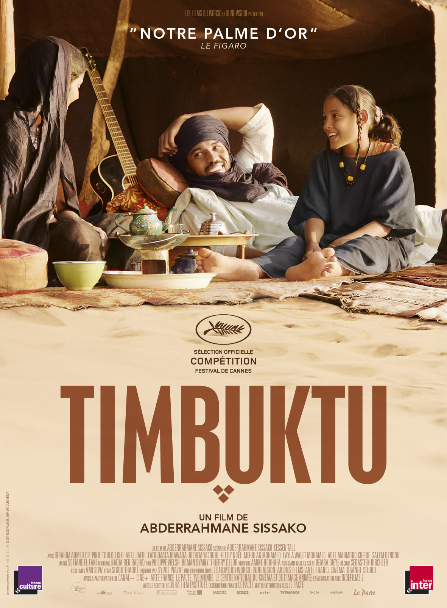
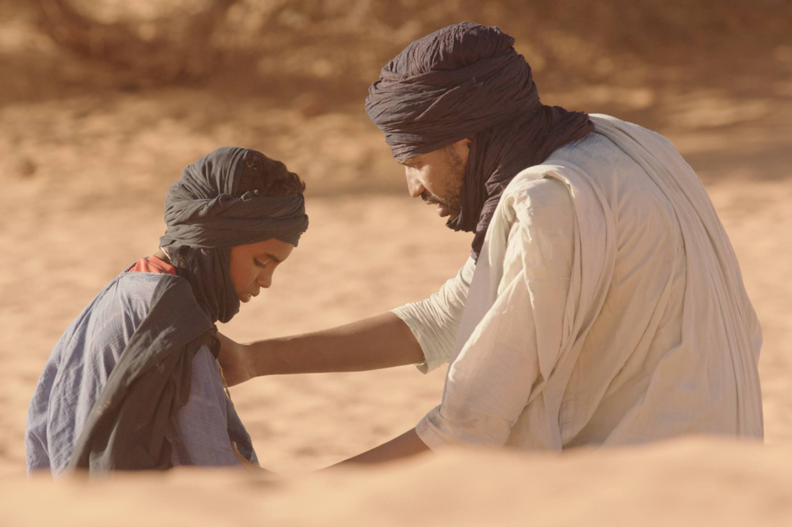
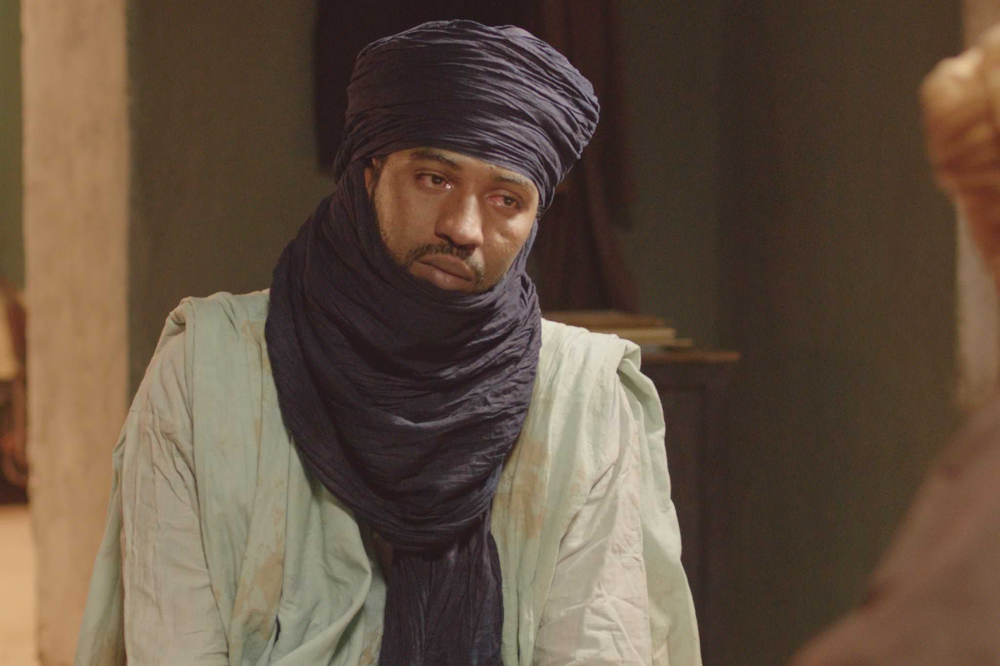

+++
type = "post"
titre = "<em>Timbuktu</em>, Abderrahmane Sissako"
title = "Timbuktu, Abderrahmane Sissako"
url = "/timbuktu-sissako"
date = "2014-12-16T23:02:32"
Lastmod = "2014-12-16T23:06:37"
cover = "sissako-timbuktu.jpg"
categorie = [ "À voir" ]
tag = [ "Drame", "Famille", "Guerre", "Islam", "Religion", "Société", "Sorties du mois" ]
createur = [ "Abderrahmane Sissako" ]
acteur = [ "Abel Jafri", "Fatoumata Diawara", "Ibrahim Ahmed", "Toulou Kiki" ]
annee = [ "2014" ]
weight = 2014
pays = [ "France", "Mauritanie" ]

+++

<em>Timbuktu</em> est un film étonnant, à tel point que l&rsquo;on a du mal à en parler ou à avoir une opinion à son sujet. S&rsquo;inspirant de faits réels, Abderrahmane Sissako a imaginé un scénario qui dépeint l&rsquo;arrivée d&rsquo;islamistes radicaux dans la ville de Tombouctou, au Mali. Ces étranges venus souvent d&rsquo;Afrique du Nord imposent la charia aux habitants qui n&rsquo;avaient rien demandé et le dernier long-métrage du cinéaste mauritanien interroge forcément le <em>djihad</em> et l&rsquo;islamisme intégral, mais on aurait tort de résumer son film à cela. S&rsquo;éloignant de la seule question religieuse — même si elle est reste au cœur des enjeux —, <em>Timbuktu</em> élargit son périmètre en racontant des histoires qui se déroulent si loin de nous… et pourtant si proches. C&rsquo;est bien là, le signe de la réussite du projet : traitant d&rsquo;un particulier plein d&rsquo;horreurs, il parvient à nous toucher en approchant l&rsquo;universel. Une bien belle réussite, à ne rater sous aucun prétexte.

Abderrahmane Sissako choisit d&rsquo;ouvrir son film avec des scènes du quotidien : un garçon qui surveille un troupeau de vaches près d&rsquo;un lac où un pêcheur travaille pour récupérer un peu de poisson. Tout semble paisible et <em>Timbuktu</em> nous transporte d&rsquo;emblée au cœur de l&rsquo;Afrique avec un format allongé et de magnifiques paysages. Mais très vite, le cinéaste interrompt cet aspect presque de carte postale en présentant de jeunes djihadistes souvent venus de loin pour imposer la charia, la loi de dieu. Personne ne les connaît dans la paisible ville de Tombouctou et pourtant ils imposent très rapidement de nouvelles règles, gueulées au mégaphone. Les femmes doivent se couvrir intégralement, jusqu&rsquo;aux mains qui doivent être gantées et aux pieds qui doivent être recouverts de chaussettes. La musique est interdite, l&rsquo;alcool est interdit, les cigarettes sont interdites… et la liste d&rsquo;interdit est longue encore. L&rsquo;imam du coin n&rsquo;a pas son mot à dire : lui qui est modéré et qui pratique le <em>djihad</em> au sens de lutte interne pour la foi, ne peut qu&rsquo;à peine protester. À moins qu&rsquo;il ne le souhaite pas ? Le film ne répond pas à cette question difficile et Abderrahmane Sissako nous fait assister, aussi impuissants que les habitants de la ville, à la mise en place de la charia, dans un respect strict. Comme toutes les dictatures, surtout celles venues d&rsquo;un élément étranger, la mise en place est progressive et les intégristes commencent par écouter l&rsquo;imam et les habitants, ils tolèrent dans un premier temps cette femme qui vend du poisson et qui refuse de porter des gants, ou encore ces chants qui sont excusés, car religieux. Mais peu à peu, l&rsquo;étau se resserre et <em>Timbuktu</em> finit par nous rappeler à l&rsquo;ordre, autant que les occupants rappellent les habitants à l&rsquo;ordre. Le temps des accords et des discussions est vite terminé et la charia est appliquée à la lettre. Le cinéaste ne nous épargne rien des méthodes de punition barbares, ni les coups de fouet, ni la lapidation, avec des images fortes qui resteront probablement gravées longtemps dans nos mémoires. Abderrahmane Sissako n&rsquo;a pas signé une comédie légère, qu&rsquo;on se le dise : <em>Timbuktu</em> est un drame et les scènes sont parfois pénibles à regarder ; l&rsquo;avertissement imposé dans les salles de cinéma n&rsquo;est clairement pas usurpé. Pour autant, le film n&rsquo;est pas qu&rsquo;un réquisitoire contre les djihadistes venus imposer leur loi divine à une ville qui n&rsquo;avait rien demandé.

Le drame n&rsquo;est jamais exclusif et les séquences les plus horribles n&rsquo;étouffent pas tout à fait la légèreté, voire le rire. Il y a des scènes amusantes dans ce film, avec notamment un match de foot absurde et visuellement impressionnant : le ballon ayant été interdit par les intégristes, les jeunes continuent de jouer sans balle, mais en faisant comme si elle y était. Un beau pied de nez face au diktat de ces djihadistes qui ne sont pas du tout de la même culture, ce que Abderrahmane Sissako montre admirablement bien en jouant très souvent sur les multiples langues et les incompréhensions<a href="#fn-12607-1" rel="footnote">1</a>. De fait, si <em>Timbuktu</em> paraît neutre, ce n&rsquo;est qu&rsquo;une impression, car le réalisateur prend systématiquement parti en ridiculisant tous les hommes venus imposer la charia. Ils devraient être exemplaires pour venir dans une ville qu&rsquo;ils ne connaissent pas et pour en changer les règles, mais ils restent avant tout humains et ils sont tous plus ou moins hypocrites. Il y a celui qui fume en cachette derrière une dune dans le désert, il y a les trois jeunes qui parlent de foot et de coupes du monde, il y a cet ancien rappeur qui est censé s&rsquo;être reconverti, mais qui ne semble pas convaincu. L&rsquo;air de rien, se contentant de juxtaposer des séquences, le long-métrage juge ces étrangers qui sont le plus souvent des jeunes embrigadés sans qu&rsquo;ils ne sachent très bien pourquoi. Mais <em>Timbuktu</em> n&rsquo;est pas un réquisitoire, on l&rsquo;évoquait en préambule, car malgré la violence extrême qu&rsquo;ils peuvent produire, tous ces soldats de dieu restent des hommes avant tout, avec leurs faiblesses. Abderrahmane Sissako n&rsquo;excuse absolument pas leurs actions, naturellement, mais il ne les accable pas non plus, ce qui fait que son film est étonnamment équilibré. Et puis on aurait trop vite fait d&rsquo;oublier qu&rsquo;il n&rsquo;est pas question que d&rsquo;islamisme et de charia : les vrais personnages principaux, ce sont peut-être ces touaregs qui vivent en marge de la ville et qui sont eux aussi rattrapés par les évènements. La facilité aurait probablement été de condamner la famille à cause de son comportement — la femme refuse le voile par exemple —, mais le scénario est plus complexe que cela. Le mari tue le pêcheur suite à une dispute et il est emprisonné et jugé pour ce meurtre. D&rsquo;un coup, ce n&rsquo;est plus vraiment une question de religion : charia ou non, cet homme aurait été condamné. <em>Timbuktu</em> s&rsquo;éloigne à cette occasion plus franchement du seul sujet religieux, pour ouvrir son horizon et le nôtre en même temps. On pouvait craindre une vision simpliste, mais il n&rsquo;en est rien et il convient de saluer, au-delà du scénario et du travail de mise en scène, le travail des comédiens, quasiment tous amateurs. Dans le rôle du touareg meurtrier, Ibrahim Ahmed (dit Pino, apparemment) est particulièrement émouvant, avec un jeu tout en finesse.

Même s&rsquo;il prend parti et même s&rsquo;il condamne en quelque sorte les djihadistes en montrant leurs contradictions et leur hypocrisie, Abderrahmane Sissako n&rsquo;en reste pas là et c&rsquo;est certainement ce qui explique la réussite du projet. <em>Timbuktu</em> n&rsquo;est pas vraiment un film engagé, c&rsquo;est d&rsquo;abord un long-métrage qui raconte une histoire et des vies, c&rsquo;est aussi un film splendide avec quelques plans parmi les plus marquants de l&rsquo;année au cinéma. C&rsquo;est aussi une œuvre plus universelle qu&rsquo;il n&rsquo;y paraît, car au-delà du contexte géographique et historique, Abderrahmane Sissako parle d&rsquo;humains avant tout. Dans tous les cas, <em>Timbuktu</em>  est une réussite, un film bouleversant à ne rater sous aucun prétexte !

<ol>
<li id="fn-12607-1">
Le film n&rsquo;est distribué qu&rsquo;en version originale <em>a priori</em>, mais si ce n&rsquo;était pas le cas, faut-il préciser qu&rsquo;il est indispensable de le voir sans traduction ? Les difficultés à se comprendre et le passage d&rsquo;une langue à l&rsquo;autre sont des moteurs essentiels de l&rsquo;action, <em>Timbuktu</em> perdrait énormément avec une seule langue…&#160;<a href="#fnref-12607-1" rev="footnote">&#8617;</a>
</li>
</ol>

