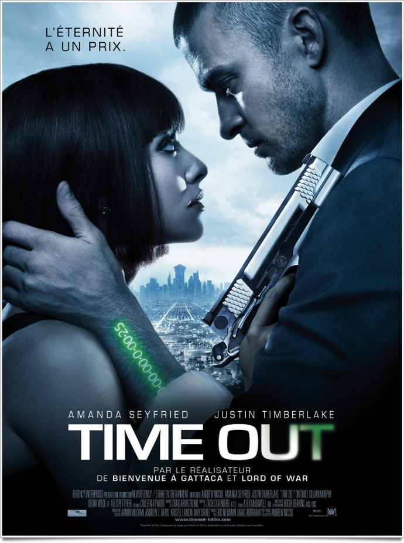

+++
type = "post"
titre = "<em>Time Out</em>, Andrew Niccol"
title = "Time Out, Andrew Niccol"
url = "/time-out-niccol"
date = "2011-11-25T00:00:01"
Lastmod = "2015-03-18T13:50:56"
cover = "niccol-time-out.jpg"
categorie = [ "À voir" ]
tag = [ "Amour", "Dystopie", "Science-Fiction", "Société", "Vite oublié" ]
createur = [ "Andrew Niccol" ]
acteur = [ "Amanda Seyfried", "Cillian Murphy", "Justin Timberlake" ]
annee = [ "2011" ]
weight = 2011
pays = [ "États-Unis" ]
original = "In Time"

+++

<em>Lire cet article vous coûtera 6 minutes</em>

Treize ans après <em><a href="http://voiretmanger.fr/2011/07/31/bienvenue-a-gattaca-niccol/">Bienvenue à Gattaca</a></em>, le discret cinéaste néo-zélandais Andrew Niccol revient à la science-fiction pour son quatrième film. <em>Time Out</em> part d&rsquo;une idée de base assez géniale : poussant le précepte &laquo;&nbsp;<em>Le temps, c&rsquo;est de l&rsquo;argent</em>&nbsp;&raquo; à son extrême, la société décrite ici a fait de l&rsquo;argent sa monnaie : chaque individu cesse de vieillir à 25 ans et doit ensuite travailler pour continuer à vivre en gagnant quelques jours par son travail. Une idée originale et vraiment excellente, mais que <em>Time Out</em> n&rsquo;exploite pas totalement. Le résultat est agréable, mais c&rsquo;est à peu près tout et Andrew Niccol passe malheureusement à côté d&rsquo;un film brillant…

On ne saura jamais pourquoi, mais les hommes ont été génétiquement modifiés. Ils vivent normalement jusqu&rsquo;à 25 ans et leur corps cesse alors de vieillir. Pour continuer à vivre, ils doivent alors travailler et gagner du temps, littéralement. Le temps sert de monnaie, tout ce qui s&rsquo;achète est compté en minutes, heures, jours ou années selon l&rsquo;importance de l&rsquo;achat. À l&rsquo;inverse, les salaires sont versés en temps. Ce système permet aux plus riches de vivre potentiellement pour toujours : le compteur ancré dans leur bras ne s&rsquo;épuise jamais alors que celui des plus pauvres est constamment proche du zéro. Si le compteur atteint ce chiffre, le corps s&rsquo;éteint automatiquement, un bon moyen de garder la population à un certain niveau. C&rsquo;est au cœur d&rsquo;un ghetto revisité d&rsquo;où l&rsquo;on ne sort qu&rsquo;à condition de disposer de plusieurs années devant soi que l&rsquo;on découvre Will, jeune ouvrier qui n&rsquo;a connu que trois 25e anniversaires. Avec sa mère, il lutte pour survivre au quotidien jusqu&rsquo;au jour où il fait une étrange rencontre. Un riche doté d&rsquo;un siècle de vie se suicide en lui donnant tout son temps restant. Devenu brutalement nanti, il décide de lutter contre le système après la mort de sa mère dans ses bras. Commence alors une longue course-poursuite…

Faire du temps restant à vivre une monnaie… l&rsquo;idée est décidément aussi originale que bonne et on s&rsquo;étonne qu&rsquo;elle n&rsquo;ait pas été exploitée auparavant. <em>Time Out</em> présente une société dytsopique assez terrifiante où la ségrégation est poussée à son extrême. Le monde, en l&rsquo;occurrence les États-Unis évidemment, est divisé en zones bien strictement clôturées où l&rsquo;on n&rsquo;entre qu&rsquo;à partir du moment où on a assez de temps à vivre, que l&rsquo;on est assez riche en d&rsquo;autres termes. Le ghetto où commence le film est ainsi composé uniquement d&rsquo;hommes et de femmes qui vivent au jour le jour au sens strict, puisqu&rsquo;ils n&rsquo;ont jamais plus de 24 heures d&rsquo;avance à la fois. Tout a été pensé pour s&rsquo;assurer qu&rsquo;ils ne sortent jamais de cette zone : les prix des produits ne dépend plus d&rsquo;aucune loi d&rsquo;offre et de demande, mais uniquement du bon vouloir des banques du temps qui gèrent le système. Les prix augmentent ainsi régulièrement pour que les plus pauvres ne soient pas trop nombreux et que les morts régulent automatiquement cette population gênante. Une solution radicale et extrêmement radicale, jusqu&rsquo;au jour où un grain de sable enraye la machine bien sûr.

<em>Time Out</em> raconte l&rsquo;histoire du grain de sable, incarné par Will Salas. Sa rencontre avec le riche suicidaire le change à tout jamais : il gagne un temps d&rsquo;avance qu&rsquo;il n&rsquo;aurait jamais rêvé toucher dans sa vie, mais il gagne aussi la vérité sur le système. Ce qu&rsquo;il croyait inaltérable est en fait une construction pensée par les plus riches, pour asservir les plus pauvres. Andrew Niccol raconte ainsi sa quête de vengeance contre le système, mais son film emprunte vite une piste très classique. Dans la zone réservée aux plus riches, il rencontre par hasard une jeune femme, Sylvia, et c&rsquo;est immédiatement le coup de foudre. Cette très belle jeune femme s&rsquo;avère être aussi la fille du propriétaire de la banque du temps à l&rsquo;origine du système et si Sylvia est comblée et peut prétendre à une vie éternelle, elle attend autre chose. Sa quête d&rsquo;aventures l&rsquo;amène à suivre Will et finalement à l&rsquo;aider à casser le système. <em>Time Out</em> emprunte vite un schéma bien connu, avec un ennemi du système poursuivi par la police. Seule différence finalement de ce Robin des Bois modernisé : on ne redistribue plus des lingots, mais des briques de temps. Andrew Niccol enrobe cette histoire convenue avec une romance tout aussi conventionnelle qui peine à renforcer l&rsquo;intérêt du spectateur. Finalement, l&rsquo;idée de base si intéressante de <em>Time Out</em> n&rsquo;est pas vraiment exploitée et c&rsquo;est certainement ce qui explique l&rsquo;impression de gâchis qui domine en sortant de la salle.

Le film d&rsquo;Andrew Niccol n&rsquo;est pas raté pour autant. Si <em>Time Out</em> pèche par son scénario sans doute trop simple, voire simpliste, il se laisse regarder avec plaisir et il est suffisamment court pour ne jamais ennuyer ses spectateurs. L&rsquo;idée de départ n&rsquo;est jamais oubliée non plus et même si elle sert parfois à des péripéties un peu convenues, et notamment des morts qui tombent un peu trop à pic, elle reste quand même une idée astucieuse et bien vue. Justin Timberlake fournit une performance assez convenue elle aussi, mais efficace alors que Cillian Murphy fait un opposant glacial à souhait ; l&rsquo;opposition entre les deux s&rsquo;avère plutôt réussie. L&rsquo;histoire d&rsquo;amour est moins intéressante et presque laissée de côté par <em>Time Out</em> ce qui n&rsquo;est, après tout, pas plus mal.

Andrew Niccol tenait une idée brillante, mais il passe un peu à côté dans <em>Time Out</em>, malheureusement. Je ne sais pas au juste ce qu&rsquo;il aurait dû faire, ou ne pas faire, mais son film paraît bien classique et convenu par rapport à son sujet. Dommage, mais <em>Time Out</em> n&rsquo;est pas un film déplaisant pour autant. À voir, et puis à oublier rapidement.

<h3>Vous voulez m&rsquo;aider ?</h3>
<ul>
<li><a href="http://www.amazon.fr/gp/product/B006UKB1XY/ref=as_li_ss_tl?ie=UTF8&#038;tag=leblogdenic07-21&#038;linkCode=as2&#038;camp=1642&#038;creative=19458&#038;creativeASIN=B006UKB1XY">Acheter le film en Blu-Ray sur Amazon</a></li>
<li><a href="http://www.amazon.fr/gp/product/B006FG4UZO/ref=as_li_ss_tl?ie=UTF8&#038;tag=leblogdenic07-21&#038;linkCode=as2&#038;camp=1642&#038;creative=19458&#038;creativeASIN=B006FG4UZO">Acheter le film en DVD sur Amazon</a></li>
<li><a href="https://itunes.apple.com/fr/movie/time-out/id490060186">Acheter ou louer le film sur l&rsquo;iTunes Store</a></li>
</ul>

