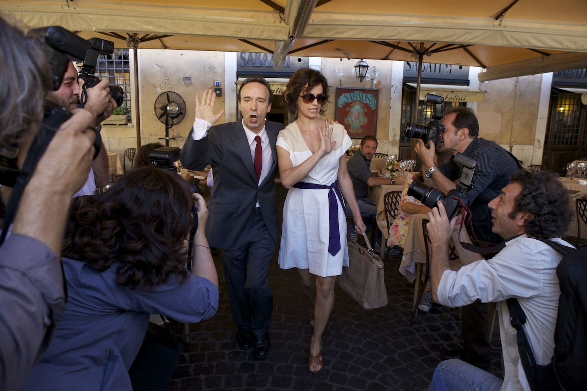

+++
type = "post"
titre = "<em>To Rome with Love</em>, Woody Allen"
title = "To Rome with Love, Woody Allen"
url = "/to-rome-with-love-allen"
date = "2013-06-24T10:19:44"
Lastmod = "2014-10-28T21:36:24"
cover = "to-rome-with-love-woody-allen.jpg"
categorie = [ "À voir" ]
tag = [ "Amour", "Clichés", "Film choral", "Société", "Tourisme", "Vite oublié" ]
createur = [ "Woody Allen" ]
acteur = [ "Alec Baldwin", "Ellen Page", "Jesse Eisenberg", "Penélope Cruz", "Roberto Benigni" ]
annee = [ "2012" ]
weight = 2012
pays = [ "États-Unis" ]

+++

<a href="http://voiretmanger.fr/match-point-allen/" title="Match Point, Woody Allen">Londres</a>, <a href="http://voiretmanger.fr/vicky-cristina-barcelona-woody-allen/" title="Vicky Cristina Barcelona, Woody Allen - À voir et à manger">Barcelone</a>, <a href="http://voiretmanger.fr/minuit-paris-allen/" title="Minuit à Paris, Woody Allen - À voir et à manger">Paris</a> et maintenant Rome. Woody Allen poursuit son tour d’Europe, mais poser ses caméras dans une ville semble être désormais sa seule idée. Si <em>Minuit à Paris</em> s’avérait décevant, il proposait quand même une idée originale avec le retour dans le passé du héros. En 2012, le cinéaste new-yorkais s’installe dans la capitale italienne avec <em>To Rome with Love</em> et avec une myriade de stars, à défaut d’idées. Malheureusement, de bons acteurs ne suffisent pas à masquer la vacuité de l’ensemble et même si on apprécie de revoir l’éternel personnage interprété par Woody Allen à l’écran, il faut bien convenir que son cru 2012 est très moyen.

<blockquote>

  

</blockquote>

Pourquoi raconter une histoire, quand on peut en raconter quatre ? <em>To Rome with Love</em> suit ainsi quatre personnages dans ce qui semble être un film choral au départ, mais qui ne s’avère finalement être qu’un film avec quatre histoires parallèles. Sans transition, Woody Allen alterne entre un étudiant en architecture qui tombe amoureux de la meilleure amie de sa copine, un employé de bureau tout ce qu’il y a de plus ennuyeux qui devient brutalement et mystérieusement célèbre, un couple de jeunes mariés qui viennent s’installer à Rome et enfin un couple américano-italien qui font rencontrer leurs parents. On a deux histoires purement italiennes, deux autres en partie américaines. Leur seul point commun est de se dérouler à Rome, mais c’est à peu près tout. Les lieux sont ainsi les mêmes, mais ils ne se croisent jamais et n’ont aucune relation les uns avec les autres : <em>To Rome with Love</em> pourrait rassembler quatre courts-métrages, comme un recueil de nouvelles, si le montage n’avait pas éclaté chaque histoire pour les faire s’entremêler. Le montage est bien la seule chose qui permet à ces petits récits de former un tout cohérent et si on peut saluer l’idée sur le papier, on doit constater qu’elle ne fonctionne pas du tout à l’écran. On ne voit jamais où Woody Allen veut en venir et on regarde ces histoires avec un désintérêt général, même si dans le détail, certaines s’avèrent plus intéressantes que d’autres. Quelques éléments intéressants additionnés à d’autres décevants ne forment pas un bon ensemble, telle pourrait être la leçon de ce <em>To Rome with Love</em> pour tout cinéaste en herbe.

N’espérez pas découvrir la capitale italienne avec <em>To Rome with Love</em>. Le cinéaste américain semble incapable d’aller au-delà des clichés et à nouveau ici, il se contente d’enfiler les plans dans les petites ruelles anciennes de Rome, devant la fontaine Trévise, le monument à Victor-Emmanuel II ou encore au-dessus du Capitole. On ne voit rien du vrai Rome, ou si peu, grâce à l’histoire de cet inconnu qui devient célèbre. Il se trouve que c’est aussi le segment le plus intéressant des quatre, peut-être justement parce qu’il est relié plus directement à la réalité, sans doute parce qu’il n’aborde pas la question de l’amour comme les trois autres. Woody Allen donne dans l’absurde avec l’histoire de cet homme qui, sans raison aucune, passe sur tous les plateaux télé et doit fuir en permanence les paparazzis. Les journalistes lui posent les questions les plus futiles sur son quotidien et il devient une star, avant de retomber tout aussi rapidement dans l’anonymat. Ce récit qui aurait peut-être mérité de faire un film indépendant est intéressant sur ce qu’il dit de notre société, sur le rôle des médias et des journalistes volages. Roberto Benigni est parfait dans ce rôle, tout comme on retrouve avec plaisir Woody Allen, l’acteur, dans un genre plus burlesque avec le récit du couple qui se forme à Rome et fait se rencontrer les parents italiens et américains. Le réalisateur interprète le père de la fille, un producteur de musique classique à la retraite et plein de complexes qui veut à tout prix travailler à nouveau quitte, pour cela, à faire chanter le beau-père de sa fille… dans une cabine de douche. L’occasion de quelques séquences loufoques assez drôles, surtout si on aime le jeu immuable de Woody Allen, mais <em>To Rome with Love</em> doit aussi composer avec deux autres histoires beaucoup moins intéressantes. On a une histoire d’amour vue et revue (Jesse Eisenberg et Ellen Page sont convaincants) et le récit sans grand intérêt de ce couple de jeunes mariés qui se trompent mutuellement, lui avec une pute, elle avec un acteur. Rien d’original, d’autant que l’ensemble est gâché par des dialogues souvent très mal écrits et qui sonnent toujours faux ; c’est flagrant quand l’étudiant en architecture rencontre un autre architecte, au début du film.

<em>To Rome with Love</em> accumule beaucoup trop de défauts pour rester dans les annales. Woody Allen semble s’être perdu en Europe : son tour des capitales semble lui retirer un peu plus d’inspiration à chaque fois. Cette fois, il n’a même pas su choisir entre quatre histoires et a préféré les filmer toutes les quatre. On aurait pu imaginer un bon film de ce dispositif, mais en l’état c’est vraiment le sentiment qui se dégage de ce <em>To Rome with Love</em> : quatre bouts de films qui doivent former, tant bien que mal, un long-métrage de deux heures. Le contrat est rempli, mais on peut tout à fait s’en passer…

<h3>Vous voulez m&rsquo;aider ?<a href="#footnote_0_9786" id="identifier_0_9786" class="footnote-link footnote-identifier-link" title="&Agrave; propos de la publicit&eacute;&hellip;">1</a></h3>
<ul>
<li><a href="http://www.amazon.fr/gp/product/B002KDNZ0W/ref=as_li_ss_tl?ie=UTF8&tag=leblogdenic07-21&linkCode=as2&camp=1642&creative=19458&creativeASIN=B002KDNZ0W">Acheter le film en Blu-Ray sur Amazon</a></li>
<li><a href="http://www.amazon.fr/gp/product/B002L70SEI/ref=as_li_ss_tl?ie=UTF8&tag=leblogdenic07-21&linkCode=as2&camp=1642&creative=19458&creativeASIN=B002L70SEI">Acheter le film en DVD sur Amazon</a></li>
<li><a href="https://itunes.apple.com/fr/movie/to-rome-with-love-vost/id579447951">Acheter ou louer le film sur l&rsquo;iTunes Store</a></li>
</ul>

<ol class="footnotes"><li id="footnote_0_9786" class="footnote"><a href="http://voiretmanger.fr/soutien/">À propos de la publicité…</a> [<a href="#identifier_0_9786" class="footnote-link footnote-back-link">&#8617;</a>]</li></ol>
