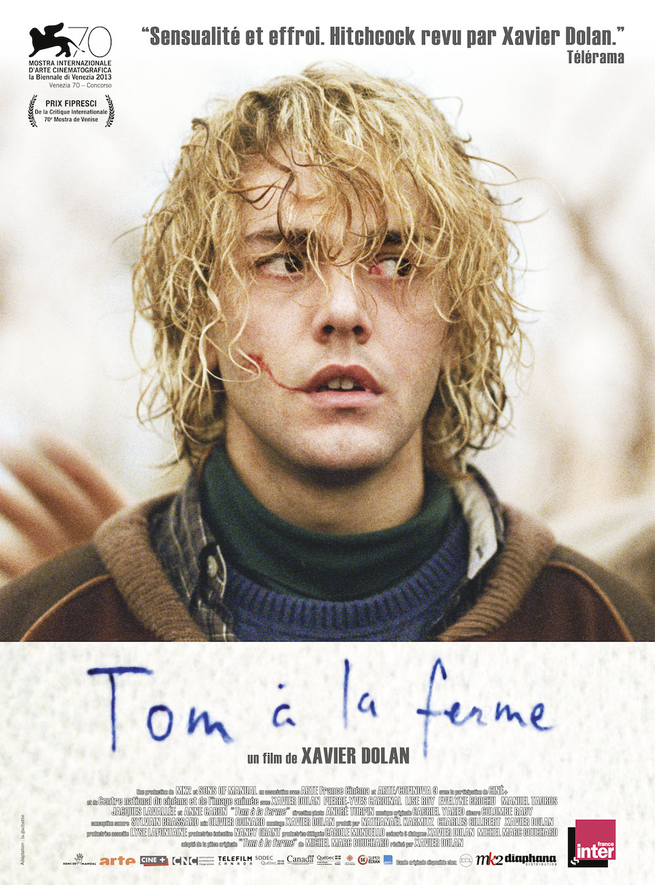
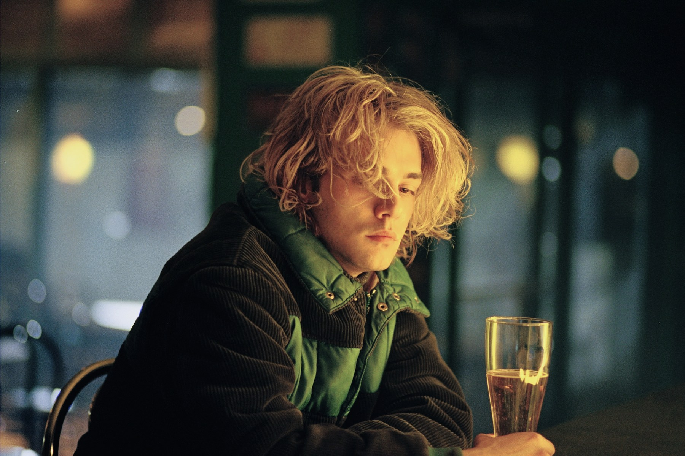
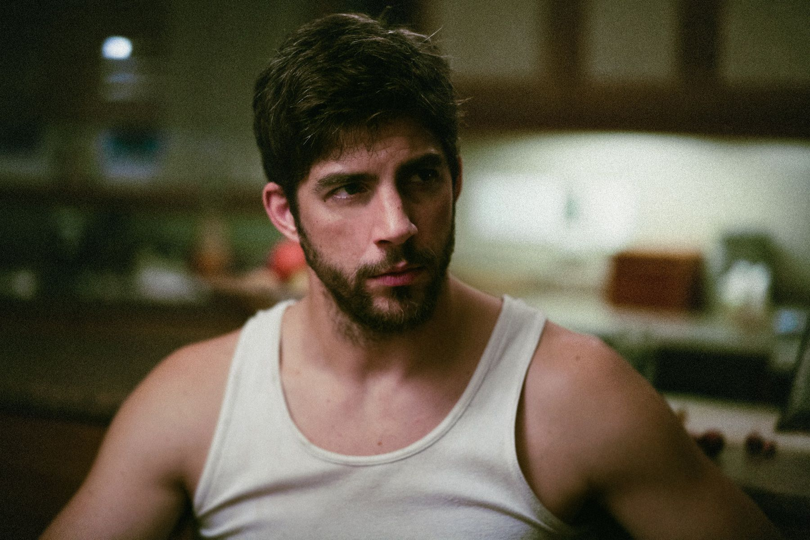

+++
type = "post"
titre = "<em>Tom à la ferme</em>, Xavier Dolan"
title = "Tom à la ferme, Xavier Dolan"
url = "/tom-ferme-dolan"
date = "2014-04-17T23:46:42"
Lastmod = "2014-04-20T18:33:32"
cover = "tom-ferme-dolan.jpg"
categorie = [ "À voir" ]
tag = [ "Adaptation théâtrale", "Amour", "Drame", "Famille", "Folie", "Homosexualité", "Sorties du mois", "Suspense", "Thriller" ]
createur = [ "Xavier Dolan" ]
acteur = [ "Evelyne Brochu", "Lise Roy", "Pierre-Yves Cardinal", "Xavier Dolan" ]
annee = [ "2014" ]
weight = 2014
pays = [ "Canada", "France" ]

+++

Xavier Dolan n’est pas un cinéaste discret. À vingt-cinq ans seulement, le jeune réalisateur canadien a déjà sorti trois films qui ont surpris par leur maturité. Avec <a href="http://voiretmanger.fr/jai-tue-ma-mere-dolan/" title="J’ai tué ma mère, Xavier Dolan"><em>J’ai tué ma mère</em></a>, puis avec <a href="http://voiretmanger.fr/amours-imaginaires-dolan/" title="Les Amours Imaginaires, Xavier Dolan"><em>Les Amours Imaginaires</em></a> et enfin avec <a href="http://voiretmanger.fr/laurence-anyways-dolan/" title="Laurence Anyways, Xavier Dolan"><em>Laurence Anyways</em></a>, Xavier Dolan a étudié plus configurations autour à chaque fois comme idée maîtresse, l’amour impossible. Comme il le dit lui-même, il a voulu tourner la page et s’éloigner le plus possible après cela, se mettre en danger pour ne pas se répéter. De fait, même si <em>Tom à la ferme</em> retrouve certaines idées, entre homosexualité et amour impossible encore, le quatrième long-métrage du réalisateur n’a plus grand-chose à voir avec ses prédécesseurs. Loin de l’image léchée que l’on avait l’habitude de voir, ce thriller psychologique est aussi poisseux que la campagne qu’il montre. Sans atteindre la sincérité des premières œuvres, ce nouveau film qui ne semble jamais aller là où on l’attend est une réussite. Stressant et envoutant.

<em>Tom à la ferme</em> s’ouvre sur quelques mots à peine lisibles, griffonnés au feutre sur un morceau d’essuie-tout. Ils évoquent la perte d’un être cher et la nécessité d’un nouveau départ, mais Xavier Dolan prend bien soin de rester flou aussi longtemps que possible. Si ces films précédents étaient assez explicites, on entre ici dans une zone de brouillard. On suit d’abord une voiture de loin, de haut, dans la campagne québécoise à perte de vue. Son chauffeur, perdu, écrase de rage son GPS et finit par trouver la maison qu’il cherchait. Elle est vide, mais il entre et s’endort sur la table. À ce stade, ce personnage principal est un mystère complet pour le spectateur, tout comme il l’est pour la propriétaire de la ferme qui arrive peu de temps après. On découvre peu à peu l’essentiel : le fils d’Agathe est mort à 25 ans à peine et Tom est le seul ami qui vient pour l’enterrement du jeune homme. D’emblée, on sent que ce n’est pas qu’un collègue, mais bien un amant, l’homme qu’il aimait. Tout aussi rapidement, on voit qu’Agathe, sa mère, ne le sait pas. Quand Francis, le grand frère qui dirige la ferme depuis la mort de son père, quelques années auparavant, fait son apparition, le puzzle se complète. <em>Tom à la ferme</em> raconte d’abord un immense mensonge : l’homosexualité du fils qui doit rester absolument secrète. La mère est persuadée que son enfant aime une femme, mais ce n’est pas vrai. Le frère pense qu’elle ne doit pas apprendre la nouvelle et Tom se retrouve au milieu de tout cela, pensant qu’il arrivait en tant que petit ami. Une situation difficile et un malaise qui s’ouvre dès les premières minutes et que l’on ne quittera plus. C’est la force du dernier long-métrage de Xavier Dolan : on ressent la peine de Tom qui doit mentir sur sa vraie identité et qui ne peut faire le deuil de son amour. On ressent aussi la peine de la mère qui sent bien que quelque chose n’est pas sincère, qu’il y a des non-dits, mais sans pouvoir les identifier complètement.

Cette situation formerait un bon drame familial, mais <em>Tom à la ferme</em> va plus loin. Par le style déjà, Xavier Dolan impose une ambiance de thriller et crée un sentiment de doute dès les premiers plans. La <a href="https://itunes.apple.com/fr/album/tom-la-ferme-bande-originale/id830617069">bande originale</a> composée par Gabriel Yared fait beaucoup dans cette sensation que quelque chose ne va pas bien se passer, et le spectateur n’est pas déçu. L’intrigue se noue autour du personnage de Francis, le frère bourru et même violent qui accueille Tom en le forçant assez violemment à mentir pour cacher à sa mère la vérité. Cet homme qui passe son temps entre des vaches en a oublié son humanité et il ne connaît plus que la loi de la nature. Paria de la petite commune isolée où est située sa ferme, il ne parle qu’à sa mère et il n’hésite pas à frapper Tom, presque par simple plaisir. De fait, le jeune homme est vite séquestré : sa voiture immobilisée dans un garage, il ne peut pas quitter la ferme. On pourrait alors penser que Xavier Dolan tourne un thriller en bonne et due forme, mais c’est aussi une fausse piste, au moins partiellement. Dans toutes les scènes entre Tom et Francis, on sent à nouveau un malaise, mais d’un autre ordre cette fois. Tom trouve une copie presque parfaite de son ex-copain et il se met, bien malgré lui, à espérer quelque chose de son côté. C’est sans doute ce qui le pousse à accepter en silence les coups et les pressions psychologiques. Aussi peut-être ce qui le retient à la ferme quand, à un moment, il pouvait partir. Le plus surprenant toutefois, c’est que Francis n’est pas insensible face à celui qu’aimait son frère. Même s’il est ouvertement hétérosexuel, on sent aussi que le personnage a besoin de Tom, peut-être même pour l’aimer à sa façon. Au fond, il n’est pas vraiment question d’homosexualité entre les deux personnages, mais <em>Tom à la ferme</em> filme un être qui sent si seul, qu’il a besoin d’affection, n’importe quelle affection. Tout en puissance brutale, Pierre-Yves Cardinal est excellent.

Avec <em>Tom à la ferme</em>, Xavier Dolan s’éloigne incontestablement de ce qu’il a réalisé jusque-là et s’il fallait s’en convaincre, il suffit de juger de sa prestation d’acteur dans ce film. Avec ses cheveux blonds décolorés et sales, avec son amour secret teinté de syndrome de Stockholm, il n’est plus du tout le personnage qu’il était à ses débuts et ce long-métrage est à cette image. Sale et moins soigné qu’avant, il gagne en liberté ce qu’il perd, en partie, en sincérité. On est moins touché et on est même parfois surpris de trouver quelques pointes humoristiques qui montrent bien que le long-métrage est imprévisible. Reste quoi qu’il en soit une maîtrise formelle qui force encore une fois le respect, mais qui devrait repousser ses détracteurs. <em>Tom à la ferme</em> est moins léché qu’avant, moins égocentrique qu’avant aussi, mais il reste toujours aussi travaillé et il confirme à nouveau, même si ce n’était pas nécessaire, que Xavier Dolan est un cinéaste à suivre de près !

