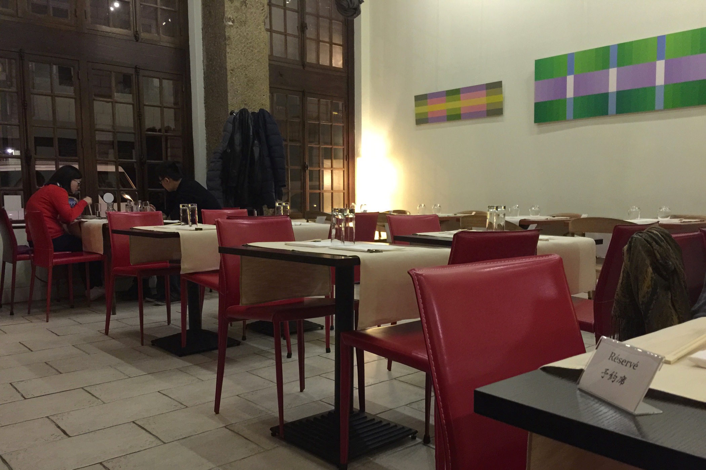
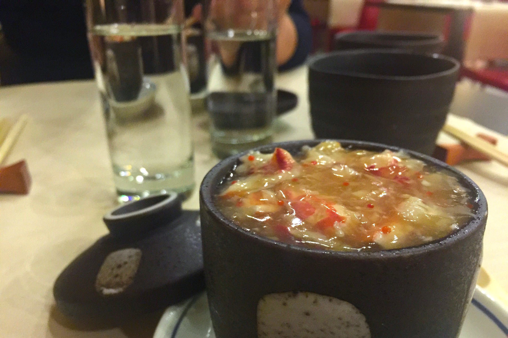
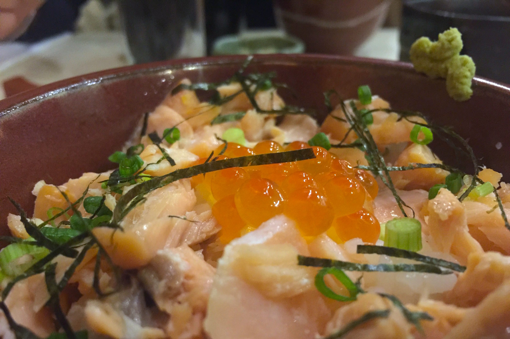

+++
type = "post"
titre = "Le Tomo à Lyon"
title = "Le Tomo à Lyon"
url = "/tomo-lyon"
date = "2015-01-17T23:30:49"
Lastmod = "2015-01-17T23:57:43"
cover = "tomo-lyon.jpg"
categorie = [ "À manger" ]
tag = [ "69006", "Cuisine japonaise", "Poisson" ]

+++

Comme toutes les grandes villes, Lyon ne manque pas de restaurants japonais, mais il est assez difficile de sortir du sempiternel sushis/yakitoris que l&rsquo;on trouve partout. Au cœur du sixième arrondissement, <a href="http://restaurant-tomo.fr"><strong>Tomo</strong></a> est une adresse qui promet précisément cela : une vraie cuisine japonaise authentique, loin des clichés du genre. À l&rsquo;arrivée, la promesse est tenue sur le papier, mais la réalisation ne suit pas toujours. Cuissons parfois imprécises et plats un peu trop simples : le restaurant a beaucoup d&rsquo;ambitions, mais le résultat n&rsquo;est pas à la hauteur du prix demandé.

Le <strong>Tomo</strong> ressemble à un grand nombre de restaurants lyonnais : situé au rez-de-chaussée d&rsquo;un immeuble ancien, il fait place dans une salle au plafond extrêmement haut, avec un mur en pierre d&rsquo;un côté. Beaucoup de cachet donc, pour une décoration minimale, pour ne pas dire simple. Quelques tableaux modernes d&rsquo;un côté et c&rsquo;est à peu près tout : pour l&rsquo;ambiance japonaise, on repassera. À l&rsquo;intérieur, une trentaine de couverts peuvent être servis en même temps et ce samedi soir-là, le restaurant affiche complet. Avec un plafond aussi haut, les amateurs de cadres calmes avaient de quoi être inquiets, mais l&rsquo;ambiance est plutôt calme et les échos étonnamment réduits. Au fond, un bar avec tellement de bouteilles de saké que l&rsquo;on ne voit pas ce qui se passe derrière rappelle bien que l&rsquo;on est dans un restaurant japonais, mais c&rsquo;est bien le seul indice. Qu&rsquo;importe, on n&rsquo;est pas venu pour la démo, mais pour manger.

La carte entière tient sur <a href="/wp-content/2015/01/tomo-carte.jpg">deux pages</a>, avec à chaque fois les intitulés d&rsquo;abord en japonais puis, entre parenthèses, en français ; une promesse d&rsquo;authenticité. On y trouve quelques intitulés bien connus, car le <strong>Tomo</strong> sert aussi les sashimis que l&rsquo;on retrouve partout, ainsi que d&rsquo;autres incontournables de la gastronomie du Japon, comme de l&rsquo;anguille grillée, l&rsquo;omelette japonaise ou bien encore la soupe miso. Les prix sont nettement plus élevés que dans les restaurants de sushi et on ne s&rsquo;en tirera pas à moins de 20 € avec un bol de riz et une soupe. Si vous ne savez que choisir dans toute cette sélection, le chef propose aussi <a href="/wp-content/2015/01/tomo-menus.jpeg">deux menus</a> qui changent très régulièrement, à tel point qu&rsquo;il faut trouver les deux ardoises dans la salle pour savoir ce que l&rsquo;on mange. Le premier menu, dit du marché, est proposé à 34 €, le second, appelé dégustation, est à 48 € et dans un cas, comme dans l&rsquo;autre, c&rsquo;est une invitation à découvrir la cuisine japonaise avec six plats. Pour accompagner le tout, une carte de vins et de sakés plutôt riche, et des conseils bienvenus pour les néophytes. Les verres de saké conseillés étaient d&rsquo;ailleurs excellents, quoi qu&rsquo;un peu cher, mais on retrouvait bien la finesse et la sophistication d&rsquo;un vin<a href="#fn-12880-1" rel="footnote">1</a>.

Nous avons choisi la formule dégustation avec la ferme envie de découvrir une cuisine japonaise plus typique. Le repas commence avec des Saint-Jacques et des crevettes servies crues et assaisonnées d&rsquo;une vinaigrette au miso. D&rsquo;emblée, on est frappé par la quantité servie : deux petites crevettes et deux tranches de noix, l&rsquo;ensemble passe si rapidement que l&rsquo;on pense n&rsquo;avoir mangé qu&rsquo;un amuse-bouche. Pour le reste, les crustacés crus sont frais et fondants, c&rsquo;est excellent, quoi qu&rsquo;un peu court. L&rsquo;assiette suivante est un flan japonais au homard bleu (première photo) : le flan en-dessous est un classique bien exécuté, une variation aérienne du flan que l&rsquo;on connaît en Occident, mais le vrai intérêt du plat, c&rsquo;est bien sûr le homard sur le dessus. On n&rsquo;a que des miettes, mais cela reste généreux et savoureux. Vient ensuite une daurade mijotée qui est malheureusement trop cuite et un peu sèche ; la sauce sucrée/salée améliore les choses, mais on aurait préféré une cuisson beaucoup moins forte. Le canard grillé (ci-dessus) qui suit est lui aussi un petit peu trop cuit, mais c&rsquo;est moins gênant : il est bien assaisonné d&rsquo;une sauce au sansho, le <a href="http://en.wikipedia.org/wiki/Zanthoxylum_piperitum">poivre japonais</a> et de quelques légumes crus, qui auraient pu être de saison (des asperges en plein hiver ?). Le dernier plat avant le dessert est en revanche une vraie déception : en annonçant du saumon sur du riz vinaigré, on s&rsquo;attendait à un chirashi, mais pas du tout (ci-dessous). Le saumon était en fait cuit et trop cuit, tout en étant froid : il était donc extrêmement sec et très banal. Les œufs de saumon relevaient un peu l&rsquo;ensemble, mais le bol reste assez plat et il manquait à notre goût d&rsquo;un élément pour le relever. La soupe miso à côté était tout à fait banale, le wasabi de qualité, mais pas de quoi sauver le plat. Le dessert, une crème brulée avec un bon goût de thé torréfié, relevait le niveau, même si là encore les fruits qui l&rsquo;accompagnaient auraient pu être de saison.

Bilan mitigé pour cette adresse japonaise : certes, on mange différemment au <strong>Tomo</strong> par rapport aux restaurants japonais standard, mais les prix sont vraiment trop élevés, par rapport à la qualité de ce qui est servi. Est-on passé à côté une cuisine véritablement japonaise par ignorance ? Peut-être, mais il n&rsquo;empêche que les deux poissons trop cuits et les quantités vraiment réduites n&rsquo;ont pas aidé. À 60 € environ par personne avec un verre de saké, on attendait mieux.

<ol>
<li id="fn-12880-1">
Ce saké contrastait agréablement avec celui que nous avions eu l&rsquo;occasion de déguster chez <a href="/oto-oto-lyon/" title="Oto Oto à Lyon"><strong>Oto Oto</strong></a> et qui était bien plus grossier. Cette fois, le côté riz fermenté n&rsquo;était pas envahissant, mais bien présent, un délice.&#160;<a href="#fnref-12880-1" rev="footnote">&#8617;</a>
</li>
</ol>

