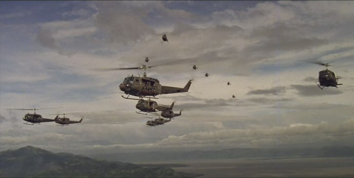
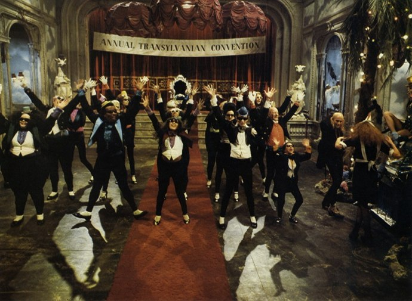
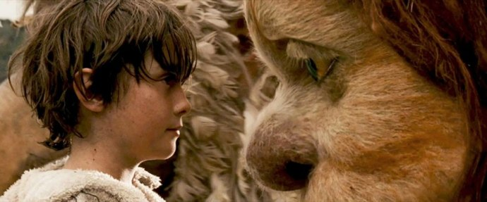
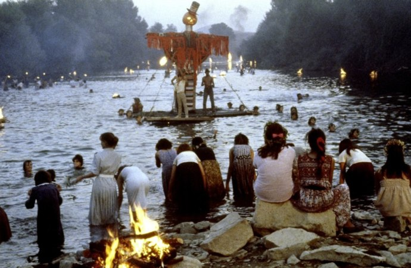
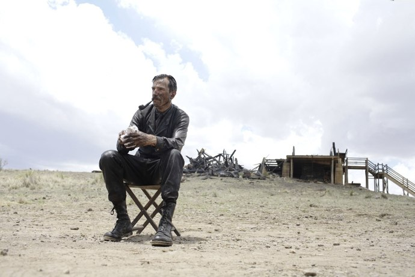
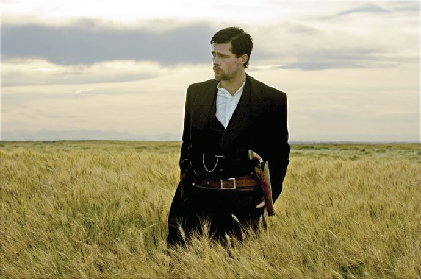
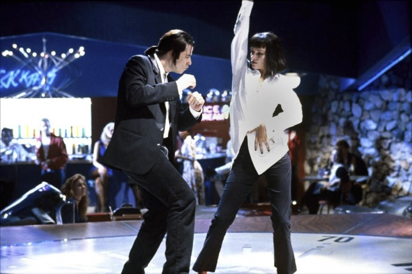
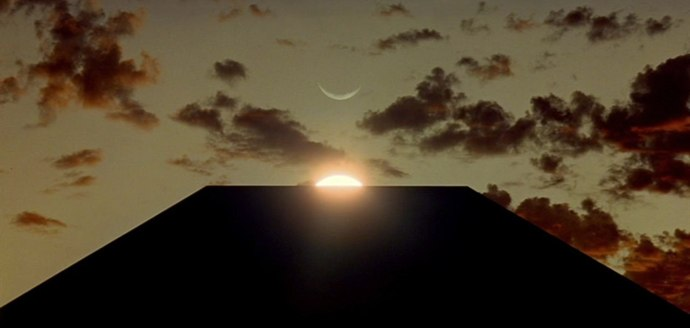
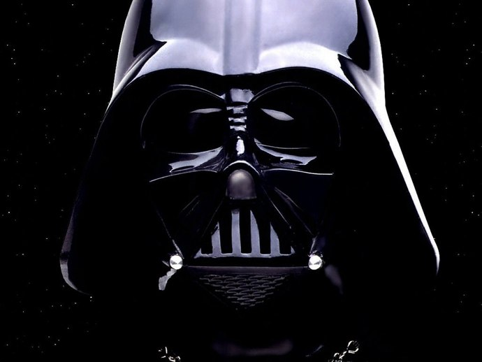
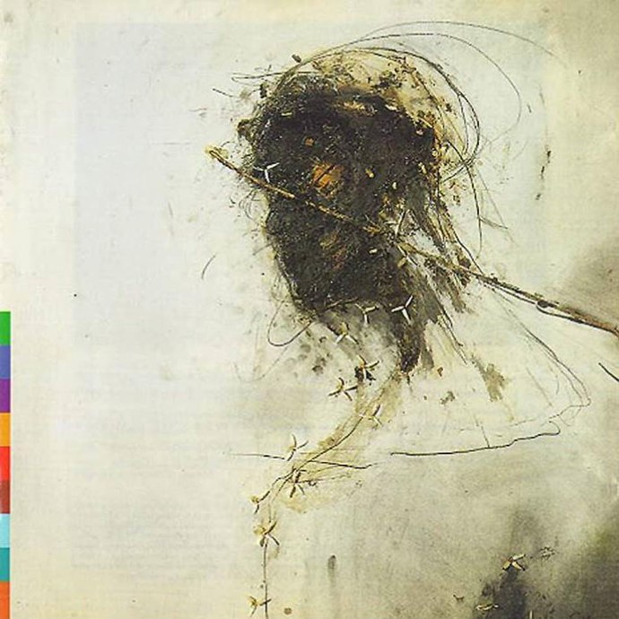

+++
titre = "S&rsquo;il ne fallait garder que 10 bandes-originales de films"
title = "S'il ne fallait garder que 10 bandes-originales de films"
url = "/top-10-bof"
date = "2010-06-22T11:30:04"
Lastmod = "2010-06-22T11:36:17"
cover = "top10-bof.jpg"
categorie = [ "À voir" ]
tag = [ "Musique", "Top" ]

+++

Ne garder que dix bandes-originales de film, voilà le défi audacieux qu&rsquo;ont lancé <a href="http://www.plan-c.fr/article-top-10-des-bandes-originales-de-film-52672051.html">Alexandre</a> et <a href="http://myscreens.fr/2010/cinema/top/top10-compilations-musicales-de-films/">Frédérik</a>. Audacieux car, comme toujours, la difficulté est d&rsquo;abord d&rsquo;éliminer 99% des prétendants. On pourrait mettre toutes les bandes-originales des films de Kubrick, et toutes celles de Tarantino dans une telle sélection !

J&rsquo;ai choisi de réfléchir peu, de lister rapidement les 10 premiers films qui me venaient à l&rsquo;esprit, en ne choisissant qu&rsquo;un film par réalisateur, et qu&rsquo;une bande-originale par compositeur. Cela a un avantage : trouver rapidement 10 films. Cela a un inconvénient : en oublier de majeurs. Je m&rsquo;aperçois ainsi avec effroi que j&rsquo;ai oublié <em>The Wall</em> qui était, je suppose, trop évident. Il aurait eu sa place ici, tout comme Ennio Morriconne évidemment, et tant d&rsquo;autres encore.

Mais un principe étant un principe, voici sans plus de commentaires ma liste des bandes-originales qui me viendraient immédiatement à l&rsquo;esprit si l&rsquo;on m&rsquo;en demandait dix seulement.

<h3>10. <em>Apocalypse Now</em>, compilation</h3>

À dire vrai, je connais très mal la bande-originale d&rsquo;<em>Apocalyspe Now</em>, exception faite de deux morceaux qui ont marqué durablement ma courte vie de cinéphile, mais aussi, je crois, le cinéma en général. L&rsquo;attaque des soldats américains au son des Walkyries bien sûr, mais aussi (et surtout), le début sur la musique des Doors (&laquo;&nbsp;<em>The end</em>&laquo;&nbsp;), avec les pâles des hélicoptères ou du ventilateur qui la ponctuent régulièrement sur fond d&rsquo;apocalypse dans la jungle. Rien que pour ces deux moments, le film de Ford Coppola méritait une place dans ce top.

<h3>9. <em>The Rocky Horror Picture Show</em>, Richard O&rsquo;Brien</h3>

Film culte et musique culte ! Seule comédie musicale de ce classement, c&rsquo;est en fait une parodie de comédie musicale. Film kitschissime  où l&rsquo;on croise un couple un peu naïf, un mystérieux manoir plein de fêtards aux mœurs, disons, débridées. La musique originale est composée de rock diablement efficace. Une poignée de chansons connues par cœur par les amateurs du film qui peuvent les reprendre à tue-tête tout en jetant du riz ou en accomplissant le &laquo;&nbsp;<em>time wrap</em>&nbsp;&raquo; au bon moment… Mieux, le début de <em>The Rocky Horror Picture Show</em> a toujours pour don de me remettre d&rsquo;aplomb quand ça va mal…

<h3>8. <em>Max et les Maximonstres</em>, Kareen O&rsquo;</h3>

J&rsquo;ai déjà eu l&rsquo;occasion d&rsquo;<a href="http://voiretmanger.fr/2010/01/31/where-the-wild-things-are-karen-o/">exprimer ici toute mon admiration</a> pour la bande-originale composée par Kareen O&rsquo; pour <em>Max et les maximonstres</em>. À l&rsquo;image du <a href="http://voiretmanger.fr/2009/12/18/max-maximonstres-jonze/">film</a> qui proposait une relecture très libre et adulte du livre pour enfants, la bande originale est étonnamment forte, à la fois mélancolique et joyeuse. Un album à part entière qui dépasse largement son simple statut de bande-originale de film.

<h3>7. <em>Le temps des gitans</em>, Goran Bregovic</h3>

Que serait un top 10 des bandes-originales sans une musique composée par Goran Bregovic ? Toutes les bandes-originales des films d&rsquo;Emir Kusturica composées par Bregovic auraient leur place ici, mais il en fallait un. <em>Le temps des gitans</em> représente un peu la perfection du système Bregovic/Kusturica à mes oreilles et c&rsquo;est un album que je connais quasiment par cœur. L&rsquo;apport de la musique yougoslave fait des merveilles sur cette bande-originale.

<h3>6. <em>There Will Be Blood</em>, Johnny Greenwood</h3>

Quelle expérience de cinéma que ce <em>There Will Be Blood</em> ! Un film si fort qu&rsquo;il créait un fort malaise chez le spectateur en attente du sang promis dès le titre. Un malaise indéniablement favorisé par la musique de Johnny Greenwood. Le guitariste de Radiohead s&rsquo;éloigne du rock expérimental du groupe britannique pour composer une musique inspirée de la musique classique. Greenwood ne fait pas dans les envolées lyriques façon blockbuster hollywoodien néanmoins : la musique qu&rsquo;il propose est minimaliste, froide et très puissante. Une vraie réussite, qui a le don de me glacer le sang à chaque fois.

<h3>5. <em>L&rsquo;assassinat de Jesse James par le lâche Robert Ford</em>, Nick Cave et Warren Ellis</h3>

Pour cette relecture moderne des westerns, Nick Cave compose avec le violoniste des Bad Seeds, groupe qui l&rsquo;accompagne depuis longtemps déjà, une bande-originale qui accompagne à merveille les larges plans de paysage du film. <em>L&rsquo;assassinat de Jesse James par le lâche Robert Ford</em> s&rsquo;en trouve alors sublimé par la musique mélancolique et magnifique où le violon et le piano font des miracles. Ce duo a collaboré sur d&rsquo;autres films, comme <em>The Proposition</em> ou le récent <em>The Road</em>, mais il n&rsquo;a jamais été aussi fort et poignant que sur ce film. Une bande-originale à découvrir d&rsquo;urgence.

<h3>4. <em>Pulp Fiction</em>, compilation</h3>

Quentin Tarantino est connu pour les bandes-originales de ses films. S&rsquo;il ne fait jamais appel à des compositeurs pour réaliser des compositions originales, il choisit toujours avec soin les morceaux de ses films pour des albums qui deviennent vite cultes. Et quoi de plus culte que <em>Pulp Fiction</em> ? Du célébrissime morceau &laquo;&nbsp;<em>Misirlou</em>&nbsp;&raquo; qui accompagne désormais bon nombre de courses-poursuites au cinéma jusqu&rsquo;à la fameuse citation d&rsquo;<em>Ezekiel</em> récitée par Samuel L. Jackson avant de tuer ses victimes, tout est culte dans cette bande-originale. Tarantino a toujours eu le chic pour rassembler des morceaux  qui n&rsquo;allaient pas ensemble du tout sur le papier, et qui forment pourtant d&rsquo;excellents albums qui prennent leur indépendance par rapport au film, malgré les citations.

<h3>3. <em>2001, Odyssée de l&rsquo;espace</em>, compilation</h3>

Comme Tarantino, quoique dans un registre radicalement différent, toutes les bandes-originales des films de Kubrick auraient leur place ici. Celle de <em>2001, Odyssée de l&rsquo;espace</em> est exceptionnelle par bien des aspects, mais sans doute d&rsquo;abord parce que c&rsquo;est l&rsquo;une des rares qui peut se targuer d&rsquo;avoir fait entrer une musique dans la légende. Je pense bien sûr à &laquo;&nbsp;Ainsi parlait Zarathustra&nbsp;&raquo; de Strauss. Mais le reste est à l&rsquo;avenant, particulièrement &laquo;&nbsp;Lux Aeterna&nbsp;&raquo; de Ligeti qui a toujours eu comme effet de me glacer littéralement le sang. Une grande bande-originale, pour un film culte.

<h3>2. <em>Star Wars</em>, John Williams</h3>

Je triche un peu en plaçant dans ce classement six films pour le prix d&rsquo;un. Mais comment distinguer un des épisodes de <em>Star Wars</em> sur le plan musical ? L&rsquo;ensemble de la série baigne dans l&rsquo;univers musical crée par John Williams avec ce thème reconnaissable entre tous. S&rsquo;inspirant de Wagner, le compositeur dédie un thème à chaque personnage principal si bien que les premières notes du thème de Dark Vador suffisent à signaler la présence du grand méchant, même lorsqu&rsquo;il n&rsquo;est pas sur l&rsquo;image. Un bel exemple de musique populaire qui marque encore aujourd&rsquo;hui les musiques de films.

<h3>1. <em>Passion</em>, Peter Gabriel</h3>

Établir ce classement a posé problèmes sur plusieurs choix, mais pas pour la première place. <em>Passion</em> n&rsquo;est pas le titre d&rsquo;un film, mais c&rsquo;est le nom de la bande-originale composée par Peter Gabriel pour <em>La dernière tentation du Christ</em> de Scorsese. Le simple fait d&rsquo;avoir nommé l&rsquo;album différemment du film en dit long sur le projet de Peter Gabriel. Cet album est tellement plus qu&rsquo;une bande-originale de film… à tel point que je n&rsquo;ai jamais vu le film en question, certain d&rsquo;être déçu parce qu&rsquo;il ne serait pas à la hauteur de la musique si riche de Peter Gabriel. <em>Passion</em> est une œuvre qui se suffit à elle-même, un ensemble instrumental (sans paroles, mais avec voix) mystérieux, très évocateur et que je peux réécouter à l&rsquo;infini sans jamais me lasser. Rares sont les albums qui ont ce pouvoir, étant par nature rapidement lassé de toute chose. <em>Passion</em> est non seulement le premier album de cette liste, mais c&rsquo;est aussi un de mes albums préférés, tout simplement.

Si vous souhaitez écouter ce top 10, j&rsquo;ai créé une playlist Spotify. Malheureusement, tout n&rsquo;y est pas : il n&rsquo;y a en fait aucune des compilations présentes dans le top et je n&rsquo;ai pas le temps de recomposer les disques. Mais surtout, il manque <em>Passion</em> ! On fait ce que l&rsquo;on peut avec ce que l&rsquo;on a, alors voici : <a href="spotify:user:nicolinux:playlist:04guR8yblDMeXXC65JsKnY">TOP10 BOF Nicolinux</a>

