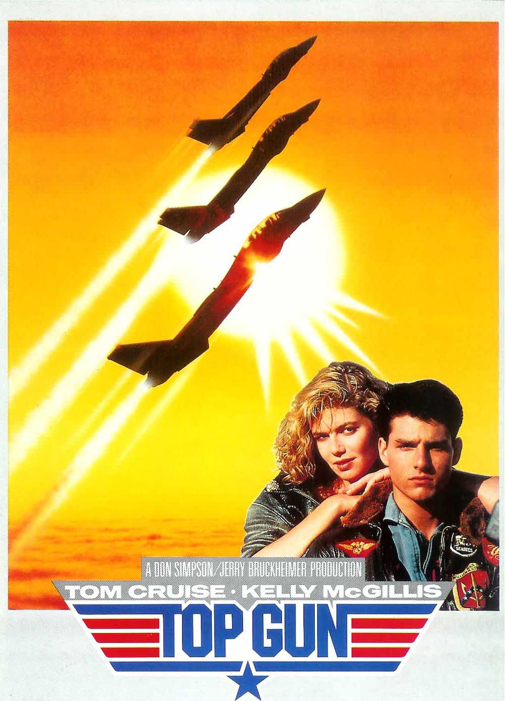
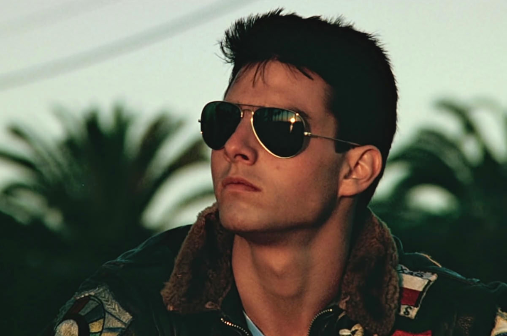
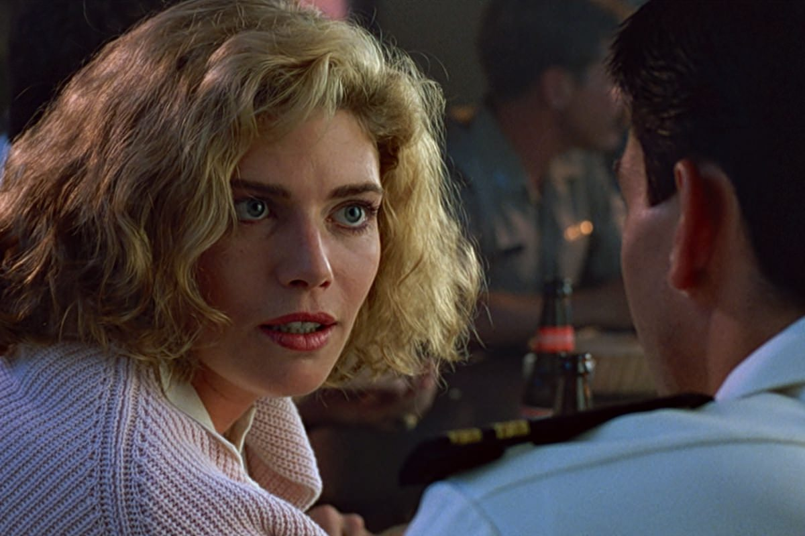

+++
titre = "<em>Top Gun</em>, Tony Scott"
title = "Top Gun, Tony Scott"
url = "/top-gun-scott"
date = "2013-07-24T23:48:37"
Lastmod = "2013-07-25T08:55:42"
cover = "top-gun-tom-cruise-tony-scott.jpg"
categorie = [ "À voir" ]
tag = [ "Action", "Amour", "Avion", "Blockbuster", "Guerre", "Homosexualité" ]
createur = [ "Tony Scott" ]
acteur = [ "Anthony Edwards", "Kelly McGillis", "Tom Cruise", "Val Kilmer" ]
annee = [ "1986" ]
weight = 1986
pays = [ "États-Unis" ]

+++

Symbole d’un certain âge d’or hollywoodien, <em>Top Gun</em> est rapidement devenu un film culte. Ce blockbuster composé essentiellement de combats aériens est sorti au milieu des années 1980 et on peut difficilement le distinguer de cette période. De la célèbre <a href="http://www.amazon.fr/gp/product/B00004TGDO/ref=as_li_ss_tl?ie=UTF8&#038;tag=leblogdenic07-21&#038;linkCode=as2&#038;camp=1642&#038;creative=19458&#038;creativeASIN=B00004TGDO">bande-originale</a> aux multiples séquences sur fond de soleil couchant, <em>Top Gun</em> respire son époque et il a forcément un peu vieilli. Les séquences dans les airs restent fort heureusement aussi spectaculaires qu’au premier jour et si le message militaire a du mal à passer aujourd’hui, le deuxième long-métrage de Tony Scott intéresse pour son sous-texte gay. Un film culte qui mérite d’être vu pour cette raison et pour ses séquences aériennes…

Tony Scott ne s’embarrasse pas avec les détails et lance le plus rapidement possible son histoire. À dire vrai, <em>Top Gun</em> n’est qu’une grosse excuse pour occuper les spectateurs entre les différents combats aériens au programme et son récit importe finalement assez peu. On suit « Maverick », un jeune pilote de l’US Navy. Extrêmement talentueux, le jeune homme est aussi réputé pour son indiscipline chronique qui lui vaut quelques problèmes avec sa hiérarchie. Un jour, alors qu’il mène une mission de routine autour de son porte-avion, il croise deux avions ennemis et parvient à les faire fuir tout en sauvant l’avion ami qui l’accompagne. Un geste de bravoure qui le fait remarquer et lui permet d’accéder à Top Gun, l’école qui forme les meilleurs pilotes de toute l’armée américaine. On entre alors dans le vif du sujet et Tony Scott s’intéresse à partir de là à l’évolution de son héros, opposé comme il se doit à un autre jeune pilote, « Iceman ». Les deux jeunes vont immédiatement se jauger et s’affronter dans les airs pour obtenir le plus de points et gagner la coupe décernée chaque année au meilleur pilote. Un arc scénaristique qui ne brille déjà pas par son originalité, mais qui est doublé d’une histoire d’amour encore plus banal : une histoire d’amour entre Maverick et Charlie, une jeune instructrice qui attire immédiatement le pilote, mais qui se fait désirer. Va-t-il battre son rival et conclure avec la femme qu’il désire ? On le voit, les enjeux de <em>Top Gun</em> ne sont pas des plus originaux, d’autant que le film ne s’éloigne pas d’un pouce des idées reçues de son scénario. Inutile d’espérer être surpris, ce n’est pas le propos du film et ce n’est d’ailleurs pas un problème. Tony Scott réalise un blockbuster conventionnel et il s’y tient, mais il le fait bien. Collection de clichés pendant près de deux heures, son long-métrage a eu tant de succès peut-être aussi parce qu’il était classique, justement.

L’ambiance années 1980 ne quitte jamais le film. Par sa bande originale qui fait la part belle aux synthés un peu cheap et par sa photographie toujours exagérée et qui tend souvent à la carte postale avec ses nombreux couchers de soleil, <em>Top Gun</em> frise aujourd’hui constamment le ridicule et le kitsch. C’est assez normal, cette ambiance n’est plus vraiment à la mode et elle semble plus vieillotte que tendance. Un sentiment renforcé par la tendance marquée de Tony Scott à filmer comme des clips musicaux : certaines scènes, avec la musique et les couchers de soleil, sont assez risibles à cet égard. Si le long-métrage mérite encore d’être vu, c’est d’abord pour ses séquences de combats dans les airs qui restent, encore aujourd’hui, époustouflantes et particulièrement réussies. Le cinéaste a choisi de rester au plus près de la réalité : les atterrissages et décollages ont vraiment été filmés depuis des porte-avions et seuls les spécialistes noteront que les MIG ennemis sont en fait des F-5 simplement repeints en noir. Dans les airs, les F-14 prêtés par l’armée américaine sont un personnage à part entière et ils font le show. Grâce aux progrès technologiques, on peut maintenant montrer les appareils les plus improbables au cinéma, mais des avions de chasse font preuve d’une efficacité qui surprend aujourd’hui encore. La mise en scène de Tony Scott, simple et efficace, y est pour beaucoup, indéniablement. <em>Top Gun</em> est sorti trois ans avant la chute du mur de Berlin et cela se sent : son message idéologique, centré sur la force militaire des États-Unis, n’est pas ce que l’on retiendra. L’armée elle-même ne s’y est pas trompée, ce film a fait office de formidable publicité en incitant tous les jeunes spectateurs à s’engager pour faire comme Maverick. Passons sur cet aspect que l’on gagnera à oublier, pour un sous-texte fascinant : sans jamais totalement l’expliciter, Tony Scott semble réaliser un film sur l’homosexualité. Les allusions sont non seulement constantes, elles sont aussi évidentes : on a des pilotes très musclés qui n’hésitent pas à montrer leurs torses musclés ; on a aussi une histoire d’amitié entre Maverick et son copilote qui pourrait ressembler à de l’amour ; on a aussi quelques allusions plus directes, glissées l’air de rien, comme ces deux pilotes qui disent qu’une explication de mission les fait bander. Trop d’éléments en somme pour qu’on puisse simplement les écarter sans s’en préoccuper : que ce soit intentionnel ou inconscient, <em>Top Gun</em> propose un deuxième niveau de lecture bien plus intéressant finalement que celui au premier degré<a href="#footnote_0_9960" id="identifier_0_9960" class="footnote-link footnote-identifier-link" title="Pour en savoir plus sur cette th&eacute;orie, Quentin Tarantino a eu l&rsquo;occasion de la d&eacute;velopper avec, &agrave; la cl&eacute;, quelques arguments troublants. On l&rsquo;entend dans cette vid&eacute;o et on peut trouver la traduction de son discours &agrave; cette adresse.">1</a>. 

<em>Top Gun</em> est devenu immédiatement culte, ce fut le plus gros succès de l’année 1986 et un des gros succès du cinéma populaire tout court. Tom Cruise n’aurait certainement pas eu la même carrière sans ce premier succès et il faut reconnaître que, malgré ses défauts, le deuxième film de Tony Scott reste encore aujourd’hui un divertissement très efficace. Ce n’est pas un blockbuster original, mais son classicisme ne l’empêche pas d’être bien conçu et plutôt plaisant à regarder. 

<h3>Vous voulez m’aider ?<a href="#footnote_1_9960" id="identifier_1_9960" class="footnote-link footnote-identifier-link" title="&Agrave; propos de la publicit&eacute;&hellip;">2</a></h3>
<ul>
<li><a href="http://www.amazon.fr/gp/product/B001QGCSP2/ref=as_li_ss_tl?ie=UTF8&#038;tag=leblogdenic07-21&#038;linkCode=as2&#038;camp=1642&#038;creative=19458&#038;creativeASIN=B001QGCSP2">Acheter le film en Blu-Ray sur Amazon</a> (<a href="http://www.amazon.fr/gp/product/B00BY92V26/ref=as_li_ss_tl?ie=UTF8&#038;tag=leblogdenic07-21&#038;linkCode=as2&#038;camp=1642&#038;creative=19458&#038;creativeASIN=B00BY92V26">version 3D</a>)</li>
<li><a href="http://www.amazon.fr/gp/product/B00004WZFI/ref=as_li_ss_tl?ie=UTF8&#038;tag=leblogdenic07-21&#038;linkCode=as2&#038;camp=1642&#038;creative=19458&#038;creativeASIN=B00004WZFI">Acheter le film en DVD sur Amazon</a></li>
<li><a href="https://itunes.apple.com/fr/movie/top-gun-1986/id369749451">Acheter ou louer le film sur l’iTunes Store</a></li>
</ul>

<ol class="footnotes"><li id="footnote_0_9960" class="footnote">Pour en savoir plus sur cette théorie, Quentin Tarantino a eu l’occasion de la développer avec, à la clé, quelques arguments troublants. On l’entend <a href="http://youtu.be/GrR7L-qRYIY">dans cette vidéo</a> et on peut trouver la traduction de son discours <a href="http://merdeaceluiquilelira.wordpress.com/2007/03/31/top-gun-film-dhomosexuel-refoule/">à cette adresse</a>. [<a href="#identifier_0_9960" class="footnote-link footnote-back-link">&#8617;</a>]</li><li id="footnote_1_9960" class="footnote"><a href="http://voiretmanger.fr/soutien/">À propos de la publicité…</a> [<a href="#identifier_1_9960" class="footnote-link footnote-back-link">&#8617;</a>]</li></ol>
