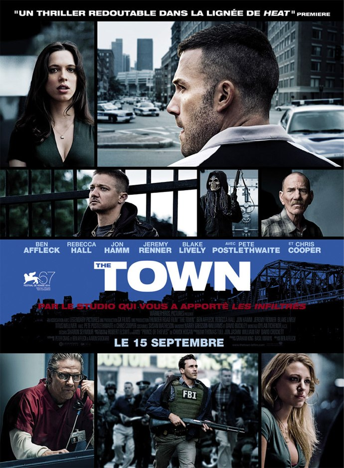
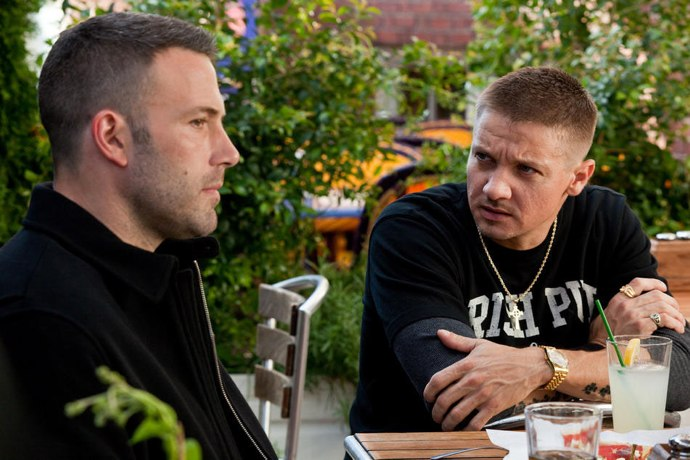
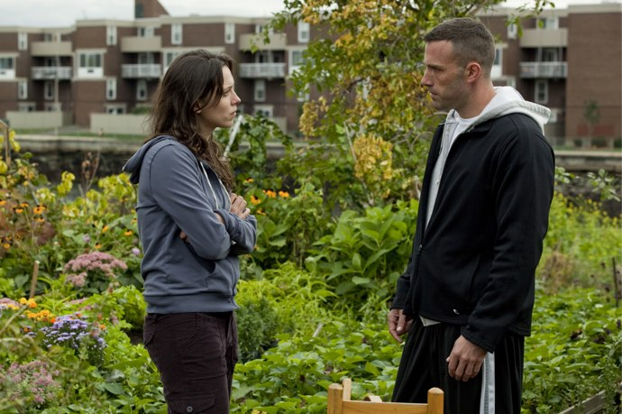

+++
titre = "<em>The Town</em>, Ben Affleck"
title = "The Town, Ben Affleck"
url = "/town-affleck"
date = "2010-09-18T12:38:58"
Lastmod = "2015-05-06T09:31:44"
cover = "ben-affleck-the-town.jpg"
categorie = [ "À voir" ]
tag = [ "Drame", "Mafia", "Police", "Thriller", "Violence" ]
createur = [ "Ben Affleck" ]
acteur = [ "Ben Affleck", "Jeremy Renner", "Rebecca Hall" ]
annee = [ "2010" ]
weight = 2010
pays = [ "États-Unis" ]

+++

Ben Affleck, longtemps surtout connu en tant qu&rsquo;acteur un peu fade, s&rsquo;affirme de plus en plus comme réalisateur. Si je découvrais avec <em>The Town</em> le Ben Affleck réalisateur, son précédent film, <em>Gone Baby Gone</em>, bénéficie d&rsquo;une solide réputation. Avec <em>The Town</em>, il fait le choix totalement d&rsquo;un film de mafia classique aussi bien sur la forme que le fond. Le résultat, loin d&rsquo;être déplaisant, est réussi et témoigne effectivement de l&rsquo;intérêt que représente ce jeune réalisateur.

Charlestown est un quartier situé au Nord de Boston. Foyer important de l&rsquo;immigration irlandaise au XIXe siècle, c&rsquo;est aujourd&rsquo;hui un quartier à la criminalité élevée et où la spécialité est, outre les classiques trafics de drogue, le cambriolage de banques et autre attaque contre fourgons blindés. Un carton nous explique ainsi que c&rsquo;est un métier familial, transmis de père en fils et perpétué ainsi à travers les générations. Les familles issues des premiers arrivants irlandais participent au sein de ce quartier à une vaste mafia avec ses règles et son parrain, en l&rsquo;occurrence un fleuriste anodin en apparence seulement. C&rsquo;est lui qui contrôle tout le réseau et qui donne les ordres aux hommes de main. Doug, le héros de <em>The Town</em>, est le chef d&rsquo;un groupe de quatre hommes. Ensemble, ils excellent à braquer des banques ou à récupérer de l&rsquo;argent où qu&rsquo;il soit, dans un van blindé ou dans le coffre du stade de Boston. Les affaires roulent bien, mais au fur et à mesure que la taille des opérations augmente, la police s&rsquo;intéresse de plus près à eux jusqu&rsquo;au FBI qui ouvre une enquête pour faire tomber le réseau. Le schéma la police contre la mafia, grand classique du cinéma américain, est ainsi respecté. Le film raconte plus précisément le dernier coup avant la retraite, autre classique du cinéma et entremêle à ces histoires de mafia et de police une histoire d&rsquo;amour entre Doug une directrice de banque victime d&rsquo;un braquage qui tourne mal et qui lance la police aux trousses des mafieux.

Ben Affleck propose une histoire aux schémas connus et attendus et l&rsquo;assume pleinement. <em>The Town</em> ne briguera peut-être pas la place du film le plus original de l&rsquo;année, mais il offre une relecture efficace des classiques. Doug, braqueur pas méchant qui entend d&rsquo;abord gagner sa vie et aider les autres et qui se révèle aussi capable d&rsquo;aimer et de changer, n&rsquo;est pas sans évoquer d&rsquo;autres hors-la-loi au grand cœur et il a même un petit côté Robin des Bois. En face de lui, composant un duo malfrat/policier là aussi bien connu, on trouve un &laquo;&nbsp;<em>Fed</em>&nbsp;&raquo; beaucoup plus terrifiant et qui avoue même qu&rsquo;il aurait aimé pouvoir tuer de ses propres mains un policier sur lequel les braqueurs avaient tiré pour que ces derniers soient condamnés à mort. Deux modèles très différents s&rsquo;opposent, avec d&rsquo;un côté l&rsquo;homme diligenté par l&rsquo;État pour arrêter des hors-la-loi et pour qui la fin justifie toujours les moyens. De l&rsquo;autre, un hors-la-loi qui devrait incarner le « <em>bad guy</em> », mais qui se révèle finalement beaucoup plus sympathique. Enchaînant trois séquences de braquage et course-poursuite avec la police, <em>The Town</em> ne démérite pas non plus dans l&rsquo;action. Là encore, c&rsquo;est l&rsquo;efficacité avant tout qui est recherchée par Ben Affleck et on peut dire que c&rsquo;est une réussite. Ces scènes ne sont peut-être pas aussi impressionnantes que dans certains gros blockbusters hollywoodiens, mais elles sont bien menées et créent même de vrais moments de tension. À tel point que la fin du film ne s&rsquo;impose pas d&rsquo;emblée comme une évidence et le réalisateur s&rsquo;amuse à ouvrir plusieurs pistes tout au long du film, avant de les refermer et d&rsquo;imposer sa fin, sorte d&rsquo;happy-end en demi-teinte. Si <em>The Town</em> n&rsquo;étonnera pas les plus cinéphiles aguerris à ce genre de films, il parvient tout de même à entraîner le spectateur dans son histoire pendant deux heures.

<em>The Town</em> parvient plutôt bien à rendre compte d&rsquo;une mafia et d&rsquo;un quartier. Le film est dédié d&rsquo;entrée à Charlestown et Ben Affleck multiplie les plans à hauteur d&rsquo;hélicoptère, filmant la ville de Boston et surtout ce quartier sous tous ses angles. L&rsquo;obélisque qui symbolise Charlestown sert ainsi de repère permanent, un peu à la manière du Golden Gate pour San Francisco, ou de la Maison-Blanche pour Washington. Pour un peu, on pourrait croire que le réalisateur a dédié un film à son quartier de naissance, si ce n&rsquo;est qu&rsquo;il est né en Californie et n&rsquo;a apparemment rien à voir avec Boston. Il a en tout cas bien potassé son sujet, s&rsquo;imprégnant de l&rsquo;ambiance du quartier et utilisant astucieusement la géographie locale. Charlestown est ainsi séparée du reste de l&rsquo;agglomération de Boston par un fleuve et un pont unique. Ce pont devient, le temps d&rsquo;une course-poursuite, un enjeu pour les deux camps<a href="#fn-4065-1" rel="footnote">1</a>, la police voulant empêcher les hommes en fuite de se réfugier dans ce quartier où ils font la loi. <em>The Town</em> évoque sans vraiment le creuser une thématique intéressante sur la perte d&rsquo;influence de la mafia irlandaise, et donc de Charlestown, au sein de Boston. Le conflit des mafias, avec l&rsquo;arrivée de nouveaux migrants en provenance d&rsquo;Amérique du Sud et d&rsquo;Asie, est un sujet passionnant, mais ce n&rsquo;est pas celui de Ben Affleck. Le réalisateur a préféré se concentrer sur l&rsquo;histoire de ses personnages, et c&rsquo;est finalement plutôt bien vu. L&rsquo;histoire d&rsquo;amour, à l&rsquo;opposée des bluettes hollywoodiennes, est touchante et permet de brosser un portrait contrasté de Doug, qui est né au mauvais endroit au mauvais moment, mais n&rsquo;est pas une mauvaise personne fondamentalement. On en revient au quartier, aux pressions extrêmes de la mafia et donc à une sorte de déterminisme social et géographique. Mais comme le montre très bien <em>The Town</em>, il est aussi possible d&rsquo;en sortir, pour peu que l&rsquo;on s&rsquo;en donne les moyens.

Le second long-métrage de cet acteur jeune premier parfois insipide est assez impressionnant. Il est indéniable que Ben Affleck a de quoi entrer dans la cour des grands. Très classique, <em>The Town</em> est peut-être l&rsquo;occasion pour lui d&rsquo;apprendre les règles, conditions <em>sine qua non</em> à leur bon détournement. Le film n&rsquo;est, certes, pas sans défaut et on regrette notamment une musique un peu trop envahissante et explicite. Néanmoins, le récit est bien mené, le rythme ne faiblit pas et le réalisateur parvient à multiplier les points de vue sans jamais perdre le spectateur. Le succès d&rsquo;un tel film dépend beaucoup de ses acteurs et Ben Affleck, acteur autant que réalisateur, a su bien s&rsquo;entourer. Mention spéciale à Jeremy Renner, déjà vu dans <em><a href="http://voiretmanger.fr/2009/10/07/demineurs-kathryn-bigelow/">Démineurs</a></em> et qui propose ici un vrai <em>bad boy</em> convaincant. Mais Ben Affleck est aussi très bien comme acteur, sobre et efficace : ses précédents rôles moins passionnants étaient certainement liés aux films et aux réalisateurs, en somme… Voilà, en tout cas, un réalisateur à suivre.

<em>The Town</em> ne brille pas par son originalité, mais propose un spectacle bien mené et prenant. Tissant une variation autour des organisations mafieuses et de la lutte éternelle entre police et voleurs, ce film est très efficace et témoigne d&rsquo;un vrai travail de réalisateur. Non sans défauts encore, <em>The Town</em> est prometteur pour un second film. Ben Affleck fait judicieusement preuve de modestie et si la critique a évoqué Michael Mann (ce que l&rsquo;affiche n&rsquo;a pas laissé passer évidemment), ce n&rsquo;était sans doute pas l&rsquo;ambition du réalisateur. On peut, en tout cas, espérer que Ben Affleck finira par être capable d&rsquo;un tel film. En attendant, <em>The Town</em> vaut le déplacement.

Avis également plutôt positifs dans la blogosphère, à l&rsquo;image d&rsquo;<a href="http://www.plan-c.fr/article-critique-the-town-de-ben-affleck-56790684.html">Alexandre</a>, de <a href="http://www.filmosphere.com/2010/09/critique-the-town-2010/">Nicolas</a> ou de <a href="http://www.toujoursraison.com/2010/09/town.html">Rob</a> (qui regrette, à raison, la fin un peu clichée). À chaque fois, le même espoir d&rsquo;avoir là un futur grand réalisateur. L&rsquo;avenir nous le dira, mais la déception est en tout cas sensible pour <em><a href="http://www.critikat.com/The-Town.html">Critikat</a></em> qui condamne l&rsquo;emphase, la lourdeur des explications appuyées et aussi la musique. Qu&rsquo;on se le dise, <em>The Town</em> est un film classique, mais est-ce forcément un problème ?

<h3>Vous voulez m&rsquo;aider ?</h3>
<ul>
<li><a href="http://www.amazon.fr/gp/product/B0047E8YK8/ref=as_li_ss_tl?ie=UTF8&#038;tag=leblogdenic07-21&#038;linkCode=as2&#038;camp=1642&#038;creative=19458&#038;creativeASIN=B0047E8YK8">Acheter le film en Blu-Ray et DVD sur Amazon</a></li>
<li><a href="http://www.amazon.fr/gp/product/B0043VDEPU/ref=as_li_ss_tl?ie=UTF8&#038;tag=leblogdenic07-21&#038;linkCode=as2&#038;camp=1642&#038;creative=19458&#038;creativeASIN=B0043VDEPU">Acheter le film en DVD sur Amazon</a></li>
<li><a href="https://itunes.apple.com/fr/movie/the-town-2010/id415149605">Acheter le film sur l&rsquo;iTunes Store</a></li>
</ul>

<ol>
<li id="fn-4065-1">
Ce n&rsquo;est pas sans rappeler une scène de <em><a href="http://voiretmanger.fr/2010/08/30/batman-begins-nolan/">Batman Begins</a></em>, dans un tout autre registre… Les masques utilisés par les braqueurs pendant leurs attaques sont aussi très proches de ceux utilisés par le Joker de <em><a href="http://voiretmanger.fr/2012/07/18/dark-knight-nolan/" title="The Dark Knight, Christopher Nolan">The Dark Knight</a></em>. Étonnant…&#160;<a href="#fnref-4065-1" rev="footnote">&#8617;</a>
</li>
</ol>

