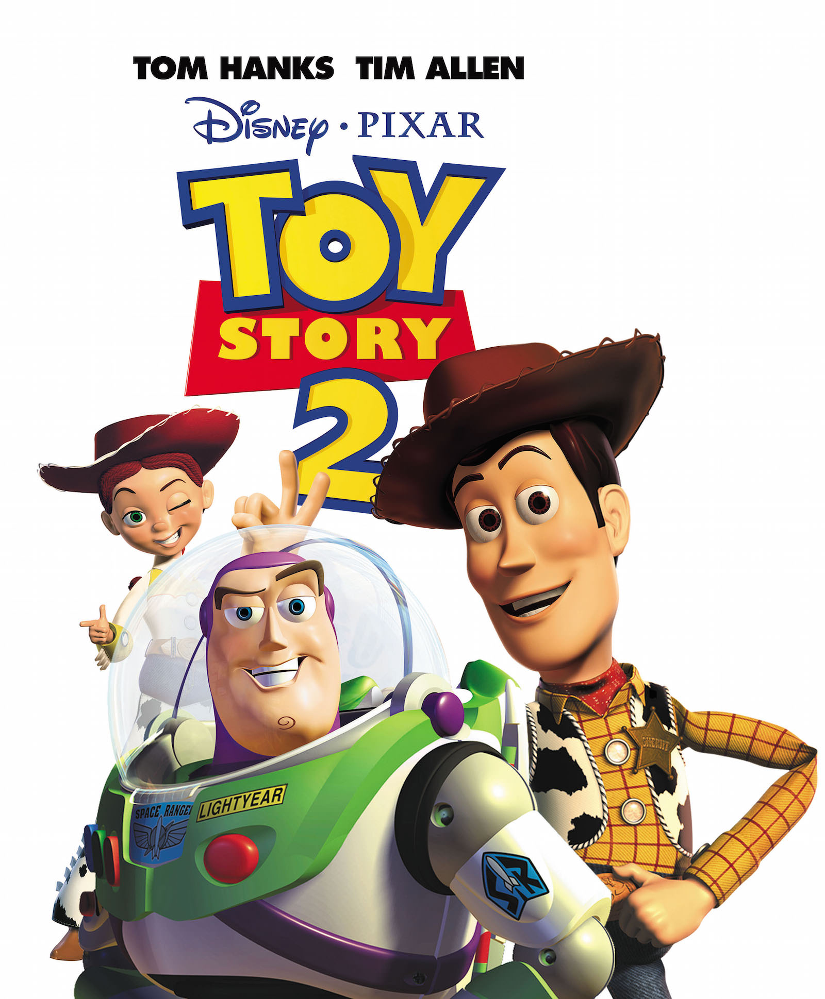
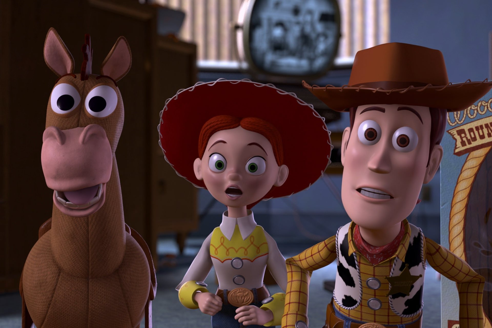
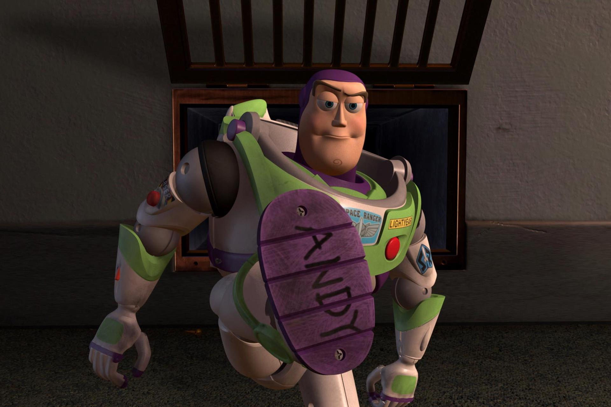

+++
titre = "<em>Toy Story 2</em>, John Lasseter, Ash Brannon et Lee Unkrich"
title = "Toy Story 2, John Lasseter, Ash Brannon et Lee Unkrich"
url = "/toy-story-2-lasseter-brannon-unkrich"
date = "2014-10-08T23:33:24"
Lastmod = "2014-10-08T23:40:53"
cover = "toy-story-2-lasseter-brannon-unkrich-pixar.jpg"
categorie = [ "À voir" ]
tag = [ "Action", "Animation", "Aventure", "Enfance", "Famille", "Humour", "Jeu" ]
createur = [ "Ash Brannon", "John Lasseter", "Lee Unkrich", "Pixar" ]
annee = [ "2000" ]
weight = 2000
saga = [ "Toy Story" ]
pays = [ "États-Unis" ]

+++

De manière générale, les suites de films à succès ne sont pas de très grandes réussites. Quand, en plus, on sait que <em>Toy Story 2</em> a commencé comme un projet secondaire, dirigé par une petite équipe en parallèle du développement de <em>1001 Pattes</em>, on se dit que cette suite a bien peu de chance de réussir. Et pourtant, trois ans seulement après avoir surpris en sortant le premier long-métrage d&rsquo;animation entièrement réalisé avec un ordinateur, Pixar surprend à nouveau… mais sur un autre domaine. <a href="http://voiretmanger.fr/toy-story-pixar/" title="Toy Story, John Lasseter"><em>Toy Story</em></a> était une réussite technique, certes, mais avant tout un excellent film porté par une histoire hors du commun. <em>Toy Story 2</em> prouve que ce n&rsquo;était pas qu&rsquo;un coup de génie : John Lasseter, Ash Brannon et Lee Unkrich réalisent une suite qui n&rsquo;a rien à envier au premier volet. En fait, ce nouvel épisode dans la <a href="http://voiretmanger.fr/saga/toy-story/">saga <em>Toy Story</em></a> est encore meilleur que le précédent sur bien des points et c&rsquo;est avec lui que la légende Pixar commence vraiment à se former. Quinze ans après, ce divertissement familial n&rsquo;a pas pris une seule ride et mérite d&rsquo;être vu et revu…

Le premier <em>Toy Story</em> était d&rsquo;abord l&rsquo;occasion de poser les bases de l&rsquo;univers et tous les personnages. On découvrait Andy, sa chambre et surtout ses jouets : Woody bien sûr, mais aussi Buzz, d&rsquo;abord un concurrent à éliminer, puis un ami. Ces bases sont posées, et <em>Toy Story 2</em> ne reviendra pas sur ces questions : quand le film commence, Andy a un petit peu grandi, les jouets n&rsquo;ont pas changé et on retrouve des personnages que l&rsquo;on connaît déjà. C&rsquo;est d&rsquo;emblée le point fort de cette suite : on entre immédiatement dans le vif du sujet, et puisque l&rsquo;on connait déjà les personnages, on n&rsquo;a pas besoin de longs discours. Le scénario a l&rsquo;intelligence de capitaliser sur cet acquis pour avancer plus rapidement et éviter les redites. On se sent dès les premières minutes en terrain familier et le long-métrage peut construire sur cette base une suite encore plus ambitieuse. De fait, <em>Toy Story 2</em> sort de la chambre d&rsquo;Andy pour s&rsquo;aventurer à l&rsquo;extérieur, loin du cocon familial et loin des personnages humains que l&rsquo;on connaissait. Woody étant abimé, Andy part en vacances sans lui et tous les jouets restent à la maison, livrés à eux-mêmes. Suite à une série d&rsquo;évènements <em>a priori</em> anodins, Woody est volé par un collectionneur qui a repéré une pièce rare qu&rsquo;il compte revendre à un musée. John Lasseter, Ash Brannon et Lee Unkrich imaginent alors que quelques autres jouets partent à sa rescousse : commence une véritable épopée pour Buzz, monsieur Patate ou encore le dinosaure qui doivent traverser la ville et éviter ses pièces. Une scène d&rsquo;anthologie est constituée uniquement par la traversée d&rsquo;un boulevard par ces jouets qui risquent de se faire écraser à tout moment. L&rsquo;animation informatisée a progressé et même s&rsquo;il reste encore des défauts techniques, Pixar profite des avancées technologiques. <em>Pixar 2</em> est beaucoup plus ouvert sur le monde extérieur et ressemble, plus que jamais, à un vrai film… mais qui aurait tourné à quelques centimètres de hauteur seulement. Les humains sont encore un peu grossiers, tout comme le chien de la famille, mais c&rsquo;est mieux, et c&rsquo;est tout à fait satisfaisant.

Même si ce n&rsquo;était pas son objectif, <em>Toy Story</em> a nécessairement attiré beaucoup l&rsquo;attention sur la technique. L&rsquo;effet de surprise étant passé, cette suite permet au contraire de se focaliser exclusivement sur l&rsquo;histoire, et <em>Toy Story 2</em> est une réussite éclatante à ce niveau. Comme tous les bons films d&rsquo;animation, celui-ci vise autant les enfants que leurs parents, et John Lasseter, Ash Brannon et Lee Unkrich excellent pour parler aux plus jeunes, tout en insérant des dizaines de clins d&rsquo;œil pour les plus grands. Une référence récurrente va ainsi piocher du côté de la <a href="http://voiretmanger.fr/saga/star-wars/">saga <em>Star Wars</em></a> : Pixar, rejeton d&rsquo;ILM, la société de George Lucas, rend ainsi un hommage à l&rsquo;univers mythique, essentiellement avec des bruits (la respiration de Dark Vador, les sabres laser…), mais aussi avec des séquences entières (le combat entre le deuxième Buzz et Zerg qui se termine sur la révélation de la paternité). <em>Toy Story 2</em> baigne entièrement dans cet univers et pioche aussi ailleurs, de <a href="http://voiretmanger.fr/2001-odyssee-espace-kubrick/" title="2001 : l’odyssée de l’espace, Stanley Kubrick"><em>2001 : l’odyssée de l’espace</em></a> à <a href="http://voiretmanger.fr/jurassic-park-spielberg/" title="Jurassic Park, Steven Spielberg"><em>Jurassic Park</em></a>, en passant par d&rsquo;autres films encore. Autant de références qui passeront totalement au-dessus des plus jeunes, et ce n&rsquo;est pas grave. Elles ne sont pas nécessaires pour comprendre l&rsquo;action, mais elles ajoutent une dimension supplémentaire quand on les comprend et elles créent une forme de complicité entre les réalisateurs et les spectateurs. Au-delà de ces références, <em>Toy Story 2</em> repose sur quelques idées de fond plus intéressantes encore que dans le premier volet. La question de l&rsquo;identité est posée avec beaucoup de force dans ce film, où des jouets se définissent par rapport à l&rsquo;amour que leur porte un enfant, mais aussi par rapport au temps. Derrière une histoire de kidnapping assez simple, John Lasseter, Ash Brannon et Lee Unkrich déploient des questions au fond assez complexes qui touchent à la vie et à la mort, mais adaptées au monde des jouets. Et prouvent, ce faisant, l&rsquo;ambition de Pixar de nous faire accepter que des êtres inanimés soient les personnages principaux de ses films. Une ambition qui n&rsquo;a jamais été aussi bien portée qu&rsquo;avec cette saga.

<em>Toy Story 2</em> ne se contente pas de faire aussi bien que son prédécesseur ce qui, connaissant les conditions de production précipitées de ce volet, aurait déjà été un exploit. Non, John Lasseter, Ash Brannon et Lee Unkrich ont réussi dans le peu de temps imparti à faire mieux. Puisque l&rsquo;on connait déjà tous les personnages de la saga, ce volet se concentre sur son histoire et propose un divertissement de haute volée, impressionnant et très drôle à la fois, mais pas seulement. Abordant des questions qui touchent tout le monde, <em>Toy Story 2</em> est un film étonnamment complexe, bien plus qu&rsquo;il ne pourrait en avoir l&rsquo;air. Tout en restant une œuvre familiale qui plaira même les plus jeunes : avec ce troisième long-métrage, Pixar prouve bien sa maîtrise qui est technique, certes, mais aussi et surtout scénaristique. Un classique, que l&rsquo;on peut revoir sans se lasser !

<h3>Vous voulez <a href="http://voiretmanger.fr/soutien/">m&rsquo;aider</a> ?</h3>
<ul>
<li><a href="http://www.amazon.fr/gp/product/B0067JJXTM/ref=as_li_ss_tl?ie=UTF8&amp;tag=leblogdenic07-21&amp;linkCode=as2&amp;camp=1642&amp;creative=19458&amp;creativeASIN=B0067JJXTM">Acheter le film en Blu-ray</a> / <a href="http://www.amazon.fr/gp/product/B0040X3SGG/ref=as_li_ss_tl?ie=UTF8&amp;tag=leblogdenic07-21&amp;linkCode=as2&amp;camp=1642&amp;creative=19458&amp;creativeASIN=B0040X3SGG">acheter la trilogie en Blu-ray</a> sur Amazon</li>
<li><a href="http://www.amazon.fr/gp/product/B0032CJ3MO/ref=as_li_ss_tl?ie=UTF8&amp;tag=leblogdenic07-21&amp;linkCode=as2&amp;camp=1642&amp;creative=19458&amp;creativeASIN=B0032CJ3MO">Acheter le film en DVD</a> / <a href="http://www.amazon.fr/gp/product/B0040X3SFW/ref=as_li_ss_tl?ie=UTF8&amp;tag=leblogdenic07-21&amp;linkCode=as2&amp;camp=1642&amp;creative=19458&amp;creativeASIN=B0040X3SFW">acheter la trilogie en DVD</a> sur Amazon</li>
<li><a href="https://itunes.apple.com/fr/movie/toy-story-2/id379473620">Acheter ou louer le film sur l&rsquo;iTunes Store</a></li>
</ul>

