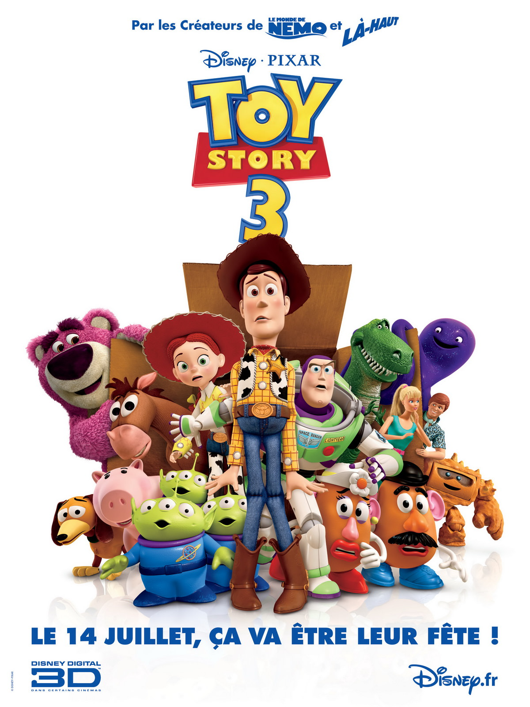
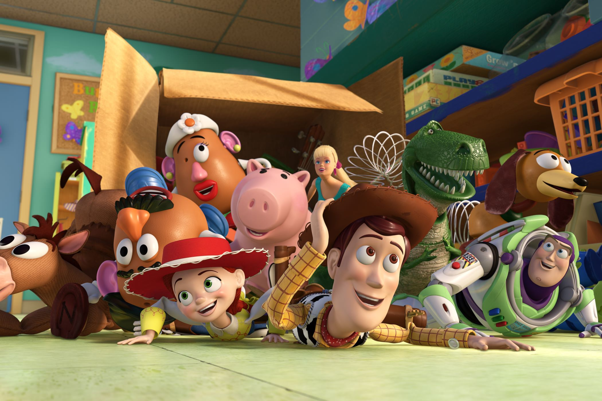
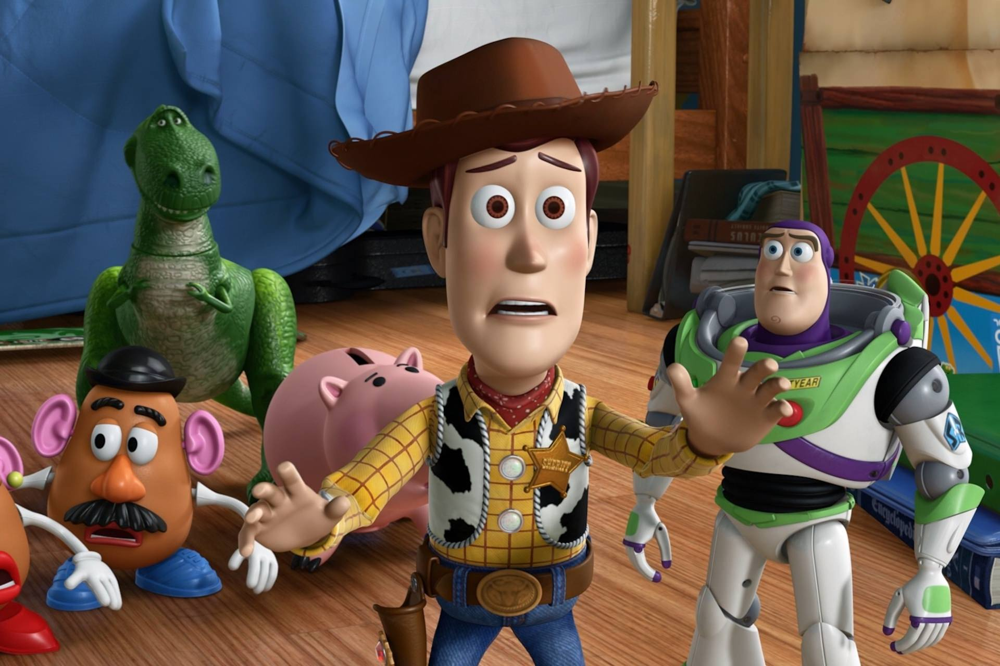

+++
type = "post"
titre = "<em>Toy Story 3</em>, Lee Unkrich"
title = "Toy Story 3, Lee Unkrich"
url = "/toy-story-3-unkrich"
date = "2010-06-25T01:24:11"
Lastmod = "2014-10-12T19:09:32"
cover = "toy-story-3.jpg"
categorie = [ "À voir" ]
tag = [ "3D", "Animation", "Enfance", "Famille", "Humour" ]
createur = [ "Lee Unkrich", "Pixar" ]
annee = [ "2010" ]
weight = 2010
saga = [ "Toy Story" ]
pays = [ "États-Unis" ]

+++

Mais comment font-ils ? Voici les premiers mots qui me vinrent à l&rsquo;esprit en sortant de la salle. Je venais de passer 1h40 en compagnie de jouets, et je sortais quasiment les larmes aux yeux, ému par ces bouts de plastiques et de tissus. Pixar a une nouvelle fois réussi son coup : comme tous les ans, le studio américain est parvenu à surprendre, émerveiller, émouvoir… Ce succès constamment renouvelé, tous les étés, est presque usant, comme si on en venait à regretter de ne pas être déçu, au moins une fois, pour voir. En attendant que cela advienne, qu&rsquo;on se le dise, <em>Toy Story 3</em>, le Pixar 2010 est tout simplement excellent.

Andy a grandi, il part à l&rsquo;université et doit vider sa chambre pour sa petite sœur. Que faire, dès lors, de tous les jouets qui ont accompagné son enfance ? Sa mère lui donne un ultimatum : le grenier, la poubelle ou un don à une garderie. Après moult hésitations, le jeune homme se décide pour le grenier, mais par une série de mésaventures, les jouets se retrouvent dans une garderie qui, derrière des atours de paradis pour jouets, se révèle vite être un enfer. Je préfère ne pas en dire trop sur l&rsquo;histoire de <em>Toy Story 3</em>, et me contenter de signaler que les surprises sont nombreuses comme souvent chez Pixar. Le scénario décolle rapidement pour ne plus arrêter son ascension de tout le film.

Les fondements de l&rsquo;histoire de <em>Toy Story 3</em> sont de toute façon assez classiques et, je dirais, universels. Deux thèmes vieux comme le monde se croisent dans ce dernier Pixar : le passage à l&rsquo;âge adulte d&rsquo;une part, la force du groupe et de la famille d&rsquo;autre part. Ce que raconte <em>Toy Story 3</em>, c&rsquo;est d&rsquo;abord l&rsquo;histoire d&rsquo;un garçon qui n&rsquo;est plus vraiment petit et qui ne peut plus jouer comme il le faisait quand il était petit, inventant des histoires d&rsquo;une richesse incroyable à partir de trois figurines et beaucoup d&rsquo;imagination. L&rsquo;histoire d&rsquo;un jeune homme qui doit abandonner ce qui a marqué son univers enfantin et qui ressent cette nécessité comme une perte inéluctable, celle de la jeunesse et de l&rsquo;innocence. S&rsquo;il comprend le besoin impérieux de se débarrasser de jouets qu&rsquo;il n&rsquo;utilise de toute manière plus, il ne peut se résoudre à les jeter et fait tout pour repousser l&rsquo;échéance. L&rsquo;émotion brutale qui survient à la fin est en quelque sorte le signe du passage à l&rsquo;âge adulte, ou du moins sa première étape. Andy a pris une décision que l&rsquo;on sent mûrement réfléchie et juste, il peut désormais passer à autre chose. Cet aspect-là est vraiment très bien traité par le film qui réussit à trouver les mots justes et à toucher les spectateurs.

L&rsquo;autre partie de l&rsquo;histoire de <em>Toy Story 3</em> concerne les jouets. Le film commence alors que le groupe de jouets familier depuis le premier épisode de la série connaît une situation de crise très grave. Andy ne s&rsquo;intéresse plus vraiment à eux, et ils font tout pour essayer d&rsquo;attirer son attention, sans vraiment y arriver. Les jouets essaieront ensuite de se tirer d&rsquo;affaire et de retrouver le garçon à qui ils appartiennent. La force du groupe face à l&rsquo;adversité est un message évident du film : si les jouets sont parfois séparés, c&rsquo;est toujours temporaire et les retrouvailles sont synonymes de paix retrouvée. En attendant le happy-end inévitable, les jouets assument totalement la partie humoristique de <em>Toy Story 3</em>. Pixar propose plusieurs niveaux de lecture, des gags purement visuels pour les plus petits jusqu&rsquo;aux clins d&rsquo;œil multiples et variés pour les plus grands. Plusieurs topos du cinéma de genre sont convoqués, pendant l&rsquo;impressionnante sortie de la garderie/prison notamment, mais on retrouve aussi le drame romantique ridiculisé avec le couple Ken/Barbie par exemple. C&rsquo;est un régal pour les yeux et l&rsquo;esprit et il ne fait aucun doute qu&rsquo;il faut plus d&rsquo;une vision pour tout voir dans <em>Toy Story 3</em>. Cette profusion des clins d&rsquo;œil ne se fait jamais au détriment de l&rsquo;histoire cela dit, ce qui rappelle une des grandes leçons des productions Pixar : l&rsquo;histoire est l&rsquo;élément le plus important, la technique n&rsquo;est que secondaire.

Secondaire, peut-être, mais pas reléguée au second plan. Tous les ans, le studio parvient encore à s&rsquo;améliorer, même si les progrès sont désormais moins visibles d&rsquo;une année sur l&rsquo;autre. La technique reste en tout cas des plus impressionnantes, notamment en ce qui concerne l&rsquo;animation des êtres humains qui est devenue vraiment très réaliste (un phénomène déjà constaté dans <em><a href="/2009/08/19/la-haut-pixar/">Là-Haut</a></em>), mais aussi dans les décors époustouflants avec comme point d&rsquo;orgue une usine d&rsquo;incinération plus vraie que nature. Dès la scène d&rsquo;introduction, délire visuel et scénaristique issu de l&rsquo;imaginaire d&rsquo;un petit garçon, on en prend plein les yeux. La caméra virevolte, tout est d&rsquo;une fluidité telle que l&rsquo;on en oublie complètement la technique. Le travail réalisé est vraiment… époustouflant, je crois qu&rsquo;il n&rsquo;y a pas d&rsquo;autres mots et je pense que l&rsquo;écart avec <a href="/toy-story-pixar/" title="Toy Story, John Lasseter"><em>Toy Story</em></a> serait impressionnant. En 15 ans, la technique a beaucoup évolué et ce troisième opus est, bien évidemment, en 3D. Comme d&rsquo;habitude, j&rsquo;ai trouvé l&rsquo;image de ce fait beaucoup plus sombre, mais les autres désagréments ne m&rsquo;ont pas vraiment gêné. Sans doute que je m&rsquo;habitue, mais il faut dire aussi que le studio a fait preuve de retenue en limitant les effets tape-à-l&rsquo;œil au profit d&rsquo;une 3D censée donner plus de relief à l&rsquo;ensemble. Je suis sceptique sur le résultat, je trouve les désagréments techniques (ne serait-ce que la gêne occasionnée par les lunettes d&rsquo;ailleurs) bien supérieurs aux avantages à l&rsquo;image, mais cette 3D n&rsquo;est pas gênante, au moins.

<em>Toy Story 3</em> a tout d&rsquo;un grand film. Une histoire si simple qu&rsquo;elle en devient universelle, une réalisation si bluffante sur le plan technique qu&rsquo;elle devient naturelle et s&rsquo;efface derrière l&rsquo;histoire. J&rsquo;ai bien cherché tout ce que je pouvais durant le film, je n&rsquo;ai pas grand-chose à critiquer concernant le Pixar 2010. Le studio a encore réussi à utiliser des objets pour raconter une histoire terriblement humaine, et même très émouvante. À l&rsquo;applaudimètre, l&rsquo;enthousiasme était flagrant dans la salle, et on comprend aisément pourquoi. Non vraiment, Pixar est-il seulement capable de décevoir le public une année ? La réponse est repoussée à l&rsquo;année prochaine, au moins…

<h3>Vous voulez <a href="/soutien/">m&rsquo;aider</a> ?</h3>
<ul>
<li><a href="http://www.amazon.fr/gp/product/B0040X3SHA/ref=as_li_ss_tl?ie=UTF8&amp;tag=leblogdenic07-21&amp;linkCode=as2&amp;camp=1642&amp;creative=19458&amp;creativeASIN=B0040X3SHA">Acheter le film en Blu-ray</a> / <a href="http://www.amazon.fr/gp/product/B0040X3SGG/ref=as_li_ss_tl?ie=UTF8&amp;tag=leblogdenic07-21&amp;linkCode=as2&amp;camp=1642&amp;creative=19458&amp;creativeASIN=B0040X3SGG">acheter la trilogie en Blu-ray</a> sur Amazon</li>
<li><a href="http://www.amazon.fr/gp/product/B003CP14O6/ref=as_li_ss_tl?ie=UTF8&amp;tag=leblogdenic07-21&amp;linkCode=as2&amp;camp=1642&amp;creative=19458&amp;creativeASIN=B003CP14O6">Acheter le film en DVD</a> / <a href="http://www.amazon.fr/gp/product/B0040X3SFW/ref=as_li_ss_tl?ie=UTF8&amp;tag=leblogdenic07-21&amp;linkCode=as2&amp;camp=1642&amp;creative=19458&amp;creativeASIN=B0040X3SFW">acheter la trilogie en DVD</a> sur Amazon</li>
<li><a href="https://itunes.apple.com/fr/movie/toy-story-3/id389301203">Acheter ou louer le film sur l&rsquo;iTunes Store</a></li>
</ul>

