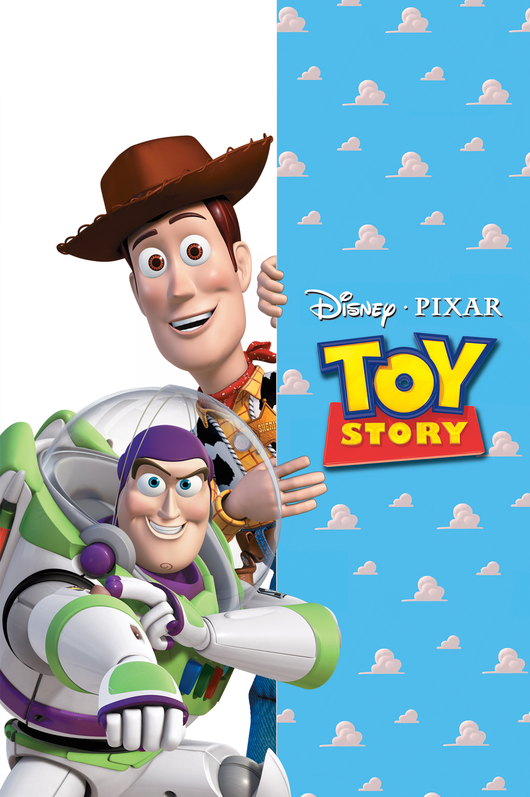
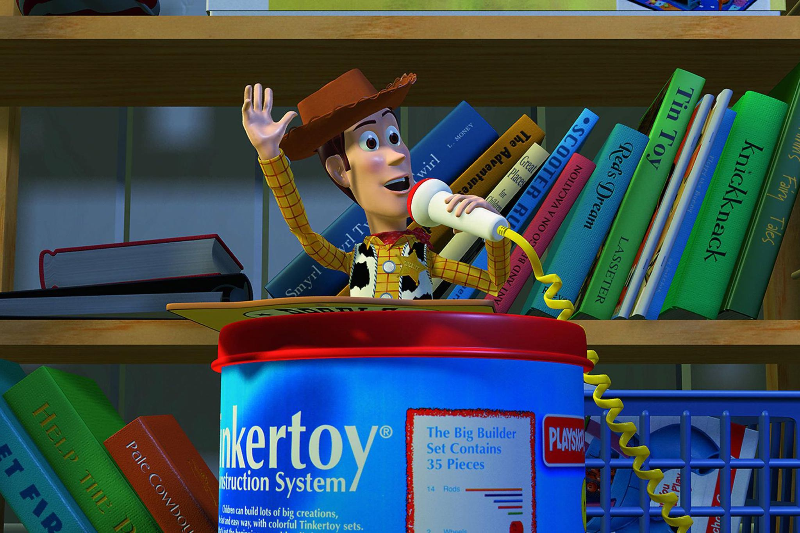
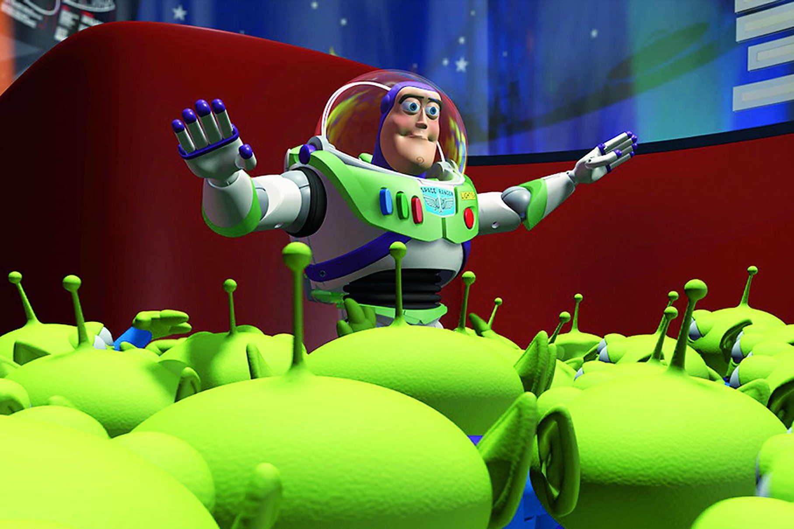

+++
titre = "<em>Toy Story</em>, John Lasseter"
title = "Toy Story, John Lasseter"
url = "/toy-story-pixar"
date = "2014-10-05T18:00:46"
Lastmod = "2014-10-05T18:18:09"
cover = "toy-story-pixar.jpg"
categorie = [ "À voir" ]
tag = [ "Animation", "Comédie", "Enfance", "Famille", "Jeu" ]
createur = [ "John Lasseter", "Pixar" ]
annee = [ "1996" ]
weight = 1996
saga = [ "Toy Story" ]
pays = [ "États-Unis" ]

+++

Quand <em>Toy Story</em> sort sur les salles de cinéma du monde entier, au milieu des années 1990, personne n&rsquo;avait vu un tel film. Près de soixante ans après <a href="http://voiretmanger.fr/blanche-neige-sept-nains-hand/" title="Blanche-Neige et les sept nains, David Hand"><em>Blanche-Neige et les sept nains</em></a>, ce long-métrage révolutionnait à nouveau l&rsquo;animation : après les dessins à la main, c&rsquo;est l&rsquo;ordinateur qui a généré une histoire. Quasiment vingt ans après, on a oublié à quel point c&rsquo;était une nouveauté technique incroyable. Aujourd&rsquo;hui, les dessins animés encore dessinés à la main sont les plus originaux, ce qui se distinguent de la masse face à un nombre incroyable de films animés avec un ordinateur. En 1995, ce n&rsquo;était du jamais vu, ou presque : au début de la décennie Disney avait commencé à utiliser l&rsquo;ordinateur pour certaines de ses productions et Pixar, créé dix ans avant la sortie de <em>Toy Story</em>, avait déjà eu l&rsquo;occasion à plusieurs reprises de démontrer son talent. Ce long-métrage était techniquement bluffant, mais ce n&rsquo;est pas là le plus important : si le travail de John Lasseter reste toujours autant d&rsquo;actualité, ce n&rsquo;est pas pour sa forme, mais pour son fond. Avant d&rsquo;être un long-métrage d&rsquo;animation révolutionnaire, <em>Toy Story</em> est un film passionnant, extrêmement bien écrit et réalisé. Un classique, à voir et à revoir !

Les studios Pixar ont été contraints de tout inventer, ou presque, pour proposer un petit peu plus d&rsquo;une heure d&rsquo;images de synthèse. Il a fallu créer des logiciels qui n&rsquo;existaient pas, imaginer des solutions techniques impensables pour l&rsquo;époque et faire tourner des centaines d&rsquo;énormes ordinateurs pendant des dizaines de milliers d&rsquo;heures. Les images les plus complexes ont nécessité jusqu&rsquo;à 24 heures de temps de traitement et quand on sait qu&rsquo;il a fallu générer plus de 100 000 images pour tout le film, on a une assez bonne idée du temps nécessaire pour créer l&rsquo;ensemble. Tout ceci est passionnant sur le plan technique, surtout quand si l&rsquo;on juge <em>Toy Story</em> avec nos yeux habitués aux films d&rsquo;animation numériques modernes, mais ce n&rsquo;est pas là l&rsquo;essentiel. Heureusement d&rsquo;ailleurs, car si John Lasseter s&rsquo;était contenté de signer une simple démonstration technique, on n&rsquo;en parlerait sans doute plus autant aujourd&rsquo;hui. S&rsquo;il n&rsquo;y avait que la performance dans ce long-métrage, on pourrait juger qu&rsquo;elle n&rsquo;a pas beaucoup d&rsquo;intérêt par rapport à ce que l&rsquo;on sait faire aujourd&rsquo;hui. Certains éléments sont en effet extrêmement bien réalisés et certains personnages, comme le dinosaure par exemple, n&rsquo;ont pas changé dans toute la <a href="http://voiretmanger.fr/saga/toy-story/">saga <em>Toy Story</em></a>. D&rsquo;autres en revanche sont moins réussis : les personnages humains et le chien sont tous visiblement dépassés techniquement à l&rsquo;aune des critères actuels, et même les décors sont encore simplistes et carrés, tandis que l&rsquo;on note des erreurs de jeunesse, à l&rsquo;image des parquets beaucoup trop brillants. En presque vingt ans, les progrès techniques ont été immenses et les ordinateurs actuels sont infiniment plus puissants que ceux qu&rsquo;ils avaient à l&rsquo;époque. Ils sont non seulement plus rapides, mais ils permettent aussi de générer des images beaucoup plus détaillées et beaucoup plus fluides. Pour autant, <em>Toy Story</em> ne mérite-t-il que d&rsquo;être considéré pour son apport technologique ? Non, mille fois non. Toute cette débauche de nouveautés n&rsquo;a aucun sens en soi, mais elle sert une cause bien plus importante : raconter une histoire.

En manque de moyens, Pixar qui appartenait alors à Steve Jobs a été obligée de signer un accord avec Disney. Au début des années 1990, le géant de l&rsquo;animation connait son heure de gloire, avec quelques-uns de ses plus grands succès, de <a href="http://voiretmanger.fr/petite-sirene-clements-musker/" title="La Petite Sirène, Ron Clements et John Musker"><em>La Petite Sirène</em></a> à <a href="http://voiretmanger.fr/aladdin-musker-clements/" title="Aladdin, John Musker et Ron Clements"><em>Aladdin</em></a>, en passant par <a href="http://voiretmanger.fr/roi-lion-allers-minkoff/" title="Le Roi Lion, Roger Allers et Rob Minkoff"><em>Le Roi Lion</em></a> qui sort un an avant <em>Toy Story</em>. Le studio commence à expérimenter avec les ordinateurs, mais Pixar a une nette longueur d&rsquo;avance dans ce domaine et les deux entreprises signent un accord gagnant/gagnant. Disney finance le premier long-métrage du studio et deux autres, en échange de quoi l&rsquo;entreprise obtient une partie du savoir-faire technique de Pixar. Est-ce que <em>Toy Story</em> aurait atteint un tel niveau sans cet accord ? Difficile de le savoir, mais il y a quelque chose de frappant à (re)découvrir ce premier long-métrage : d&rsquo;emblée, le studio d&rsquo;animation par ordinateur prouve qu&rsquo;il peut signer de grandes histoires, et en plus des histoires très originales. Jugez plutôt : les personnages mis en scène par John Lasseter ne sont pas des humains, et ce ne sont pas non plus des animaux. Ce film est construit entièrement sur la base d&rsquo;objets en théorie inanimés, mais que l&rsquo;on finit par croire vivants. Plus fou encore, le pari de <em>Toy Story</em> est de transmettre une émotion en passant par ces objets produits à la chaine dans une usine en Asie. Une émotion, et une personnalité : on doit s&rsquo;attacher à ces morceaux de plastique comme s&rsquo;il s&rsquo;agissait d&rsquo;êtres vivants. C&rsquo;est une idée un peu folle, mais c&rsquo;est précisément ce qui a fait le succès du studio par la suite : pour prendre le cas le plus extrême, <a href="http://voiretmanger.fr/cars-lasseter/" title="Cars, John Lasseter"><em>Cars</em></a> n&rsquo;est constitué que de voitures, et pourtant on ne voit que des êtres vivants.

John Lasseter et toutes les équipes de Pixar avaient bien compris que leur technique ne servirait à rien sans une histoire et celle de <em>Toy Story</em> est excellente. On a d&rsquo;abord la surprise de découvrir un univers où les jouets, quand ils ne sont pas utilisés par les humains, vivent leur vie de façon autonome. Dès qu&rsquo;ils sont seuls dans la chambre d&rsquo;Andy, tous les jouets du garçon s&rsquo;animent et se déplacent, discutent entre eux, bref mènent une vie (presque) comme vous et moi. La première scène permet de comprendre cette singularité : dans un premier temps, les jouets bougent, parce qu&rsquo;Andy les déplace dans l&rsquo;histoire qu&rsquo;il imagine. Quand le garçon s&rsquo;en va, chaque jouet devient vivant et bouge encore, mais cette fois par sa propre volonté. La première fois que l&rsquo;on voit le long-métrage, l&rsquo;effet de surprise est indéniable et le scénario est déjà très malin. Évitant de tout expliciter, il préfère au contraire montrer et faire confiance à l&rsquo;intelligence des spectateurs. Pari gagné : même les enfants comprennent très bien <em>Toy Story</em> et le film évite ainsi la lourdeur qu&rsquo;ont trop de films « pour enfants ». Il n&rsquo;y en a d&rsquo;ailleurs pas du tout que pour les plus jeunes : John Lasseter multiplie les références à la fois vers Disney (on voit Mickey à un moment, on entend la musique du <em>Roi Lion</em> à un autre) et vers d&rsquo;autres œuvres plus adultes. <em>Star Trek</em> et <em>Star Wars</em>, mais aussi des films d&rsquo;horreur : les scénaristes n&rsquo;ont pas peur d&rsquo;effrayer les plus jeunes, et c&rsquo;est tant mieux. Ajoutons que l&rsquo;enjeu principal de ce premier volet — l&rsquo;arrivée d&rsquo;un nouveau jouet qui déclasse le favori d&rsquo;Andy — n&rsquo;a rien d&rsquo;un thème infantilisant. Au contraire, avec ce jouet qui n&rsquo;a pas conscience de son statut et qui se pense vraiment comme Buzz, ranger intergalactique, on a un sujet de fond assez profond sur l&rsquo;identité. <em>Toy Story</em> ne montre peut-être que des jouets, mais cela ne l&rsquo;empêche pas d&rsquo;avoir des arguments matures. En cela, il touche en plus une forme d&rsquo;universel qui justifie sa durée de vie exceptionnel.

<em>Toy Story</em> n&rsquo;est pas seulement une première sur le plan technique, et l&rsquo;animation informatisée est peut-être même le moins important. Dès ce premier film, Pixar met en avant autre chose : sa capacité à raconter des histoires extraordinaires. Certes, John Lasseter ne fait pas appel à des dessins sur un papier pour réaliser son film, mais qu&rsquo;importe : ce qui compte, c&rsquo;est que <em>Toy Story</em> raconte une grande histoire, et c&rsquo;est bien le cas. Le film a plutôt bien vieilli dans l&rsquo;ensemble, même si on fait mieux aujourd&rsquo;hui naturellement, mais on oublie totalement toutes ces questions techniques quand on le regarde. On se passionne pour ces jouets et on finit par les considérer comme des personnes. C&rsquo;est d&rsquo;abord ça, la grande réussite de ce premier film d&rsquo;animation numérique.

<h3>Vous voulez <a href="http://voiretmanger.fr/soutien/">m&rsquo;aider</a> ?</h3>
<ul>
<li><a href="http://www.amazon.fr/gp/product/B0032CJ3NS/ref=as_li_ss_tl?ie=UTF8&amp;tag=leblogdenic07-21&amp;linkCode=as2&amp;camp=1642&amp;creative=19458&amp;creativeASIN=B0032CJ3NS">Acheter le film en Blu-ray</a> / <a href="http://www.amazon.fr/gp/product/B0040X3SGG/ref=as_li_ss_tl?ie=UTF8&amp;tag=leblogdenic07-21&amp;linkCode=as2&amp;camp=1642&amp;creative=19458&amp;creativeASIN=B0040X3SGG">acheter la trilogie en Blu-ray</a> sur Amazon</li>
<li><a href="http://www.amazon.fr/gp/product/B0032CJ3ME/ref=as_li_ss_tl?ie=UTF8&amp;tag=leblogdenic07-21&amp;linkCode=as2&amp;camp=1642&amp;creative=19458&amp;creativeASIN=B0032CJ3ME">Acheter le film en DVD</a> / <a href="http://www.amazon.fr/gp/product/B0040X3SFW/ref=as_li_ss_tl?ie=UTF8&amp;tag=leblogdenic07-21&amp;linkCode=as2&amp;camp=1642&amp;creative=19458&amp;creativeASIN=B0040X3SFW">acheter la trilogie en DVD</a> sur Amazon</li>
<li><a href="https://itunes.apple.com/fr/movie/toy-story/id378346225">Acheter ou louer le film sur l&rsquo;iTunes Store</a></li>
</ul>

