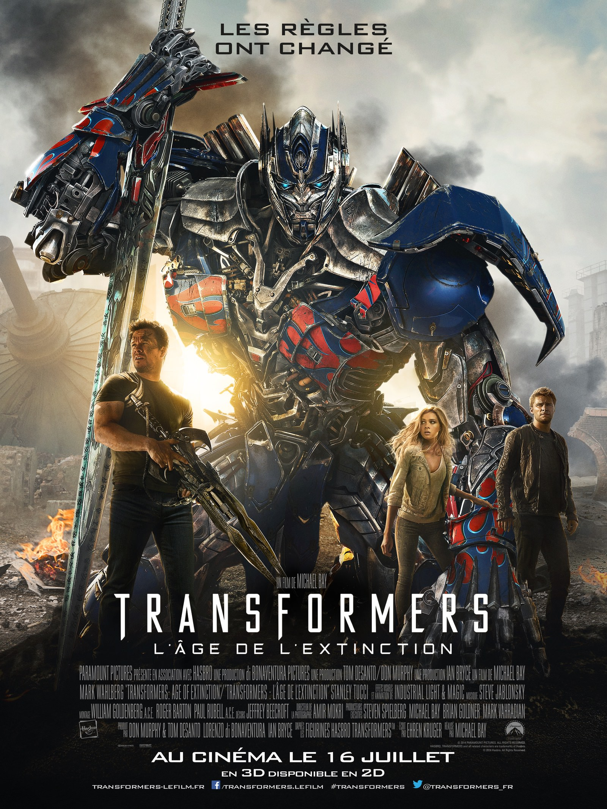

+++
titre = "<em>Transformers : L&rsquo;Âge de l&rsquo;extinction</em>, Michael Bay"
title = "Transformers : L'Âge de l'extinction, Michael Bay"
url = "/transformers-age-extinction-bay"
date = "2015-01-09T21:17:17"
Lastmod = "2015-01-09T21:26:38"
cover = "transformers-4-michael-bay.jpg"
categorie = [ "À voir" ]
tag = [ "Action", "Blockbuster", "Famille", "Guerre", "Robot", "Science-Fiction", "Vite oublié" ]
createur = [ "Michael Bay" ]
acteur = [ "Jack Reynor", "Kelsey Grammer", "Mark Wahlberg", "Nicola Peltz", "Stanley Tucci" ]
annee = [ "2014" ]
weight = 2014
saga = [ "Transformers" ]
pays = [ "États-Unis" ]
original = "Transformers: Age Of Extinction"

+++

Cette fois, c&rsquo;est sûr, <a href="http://voiretmanger.fr/saga/transformers/"><em>Transformers</em> est une saga</a> et Michael Bay n&rsquo;a pas dit son dernier mot, puisque deux suites sont d&rsquo;ores et déjà prévues. Depuis le premier film qui mettait des images sur cette idée de robots qui peuvent se transformer en voitures, l&rsquo;univers a bien évolué, mais ce nouvel opus entend à nouveau tout bouleverser. Fini le temps des robots-superhéros alliés des États-Unis, désormais ils sont rejetés par le gouvernement et ils doivent se protéger sous peine d&rsquo;être traqués sans relâche. À l&rsquo;image des adaptations de superhéros, Michael Bay joue ainsi la carte de l&rsquo;exclusion, mais dans les faits, cela ne change pas grand-chose. <em>Transformers : L&rsquo;Âge de l&rsquo;extinction</em> est aussi stupide que ses prédécesseurs, mais il est surtout long, beaucoup trop long. Résultat, on s&rsquo;ennuie ferme devant ce spectacle déjà tellement vu qu&rsquo;il n&rsquo;impressionne même plus.

« <em>Les règles ont changé</em> » : cette mention en grosses lettres sur l&rsquo;affiche du film laisse attendre des changements dans la saga et de fait, <em>Transformers : L&rsquo;Âge de l&rsquo;extinction</em> renouvelle complètement le casting. À part deux ou trois robots que l&rsquo;on avait déjà vu auparavant, les personnages ont changé sans que l&rsquo;on ne sache très bien pourquoi. Exit Sam, le héros des trois premiers volets, place à Cade, père de famille qui a du mal à joindre les deux bouts avec sa petite affaire liée aux robots, mais pas les Autobots, ceux qui ne rapportent rien. C&rsquo;est bien, sauf que Michael Bay n&rsquo;a pas pris la peine de trouver une excuse pour ce changement qui semble n&rsquo;avoir été choisi par les scénaristes que pour le plaisir de changer. Mark Wahlberg est plus âgé que Shia LeBeouf, mais c&rsquo;est à peu près tout : il découvre un Autobot et devient leur ami et allié, et on retrouve ainsi le scénario habituel. Puisqu&rsquo;il fallait une bombe (sexuelle), on lui a donné une fille qui est censée avoir 17 ans, mais qui en fait au moins 20<a href="#fn-12804-1" rel="footnote">1</a>. Nicole Peltz a aussi peu d&rsquo;intérêt que celles qui l&rsquo;ont précédé, mais il faut dire que son rôle se résume à mettre en avant ses arguments physiques. Elle permet quand même à <em>Transformers : L&rsquo;Âge de l&rsquo;extinction</em> de tirer sur la corde de la famille avec une « polémique » quand son père, persuadé qu&rsquo;elle est sage comme une image, découvre qu&rsquo;il a un copain (Jack Reynor, qui n&rsquo;est là que pour officier en tant que beau gosse de service, avec succès d&rsquo;ailleurs). À côté de cette famille parfaitement américaine qui court régulièrement au ralenti et avec le drapeau qui flotte pas loin, il y a naturellement les robots qui s&rsquo;affrontent, comme toujours. Mais attention, cette fois, les règles ont changé ! Ainsi, les gentils Autobots<a href="#fn-12804-2" rel="footnote">2</a> sont considérés comme des méchants par la CIA, mais la CIA a en fait signé un pacte avec des méchants robots envoyés par les créateurs des Transformers pour les ramener à eux. Et pour pimenter encore les choses, Michael Bay ajoute les « Dinobots », des robots qui ont la forme de dinosaures et qui sont plus puissants que les autres (imaginez donc, ils crachent du feu !). Ce cocktail explosif est l&rsquo;occasion de quelques séquences impressionnantes, même si on a l&rsquo;habitude maintenant chez le cinéaste. Mieux vaut toutefois qu&rsquo;il filme les explosions, car toutes les scènes censées susciter l&rsquo;émotion sont totalement ratées. Et on n&rsquo;évoquera pas les plans façon <a href="https://fr.wikipedia.org/wiki/Imagerie_à_grande_gamme_dynamique">HDR</a> avec de l&rsquo;herbe vert pomme qui émaillent le film, on deviendrait vulgaire.

Quand le film se termine enfin, le spectateur se sent surtout soulagé. Soulagé d&rsquo;en avoir fini avec cette œuvre interminable qui devient insupportable à s&rsquo;étirer ainsi dans le temps : <em>Transformers : L&rsquo;Âge de l&rsquo;extinction</em> dure 2h45 et c&rsquo;est probablement une heure de trop. C&rsquo;est dommage, car on peut très bien accepter la stupidité du projet — après tout, il s&rsquo;agit de robots qui se transforment en voiture, ou l&rsquo;inverse — et apprécier un blockbuster décérébré, mais fun. Mais quand on s&rsquo;ennuie ferme comme c&rsquo;est le cas ici, le plaisir disparaît vite et il ne reste plus qu&rsquo;un spectacle explosif déjà vu mille fois et à l&rsquo;idéologie douteuse. <em>Transformers : L&rsquo;Âge de l&rsquo;extinction</em> promettait de nouvelles règles, mais on aurait préféré l&rsquo;extinction de la saga. Hélas, Michael Bay n&rsquo;a pas dit son dernier mot avec ces robots…

<h3>Vous voulez <a href="http://voiretmanger.fr/soutien/">m&rsquo;aider</a> ?</h3>
<ul>
<li><a href="http://www.amazon.fr/gp/product/B00LTMVZ6G/ref=as_li_ss_tl?ie=UTF8&amp;tag=leblogdenic07-21&amp;linkCode=as2&amp;camp=1642&amp;creative=19458&amp;creativeASIN=B00LTMVZ6G">Acheter le film en Blu-ray sur Amazon</a></li>
<li><a href="http://www.amazon.fr/gp/product/B00LTMVY6W/ref=as_li_ss_tl?ie=UTF8&amp;tag=leblogdenic07-21&amp;linkCode=as2&amp;camp=1642&amp;creative=19458&amp;creativeASIN=B00LTMVY6W">Acheter le film en DVD sur Amazon</a></li>
<li><a href="https://itunes.apple.com/fr/movie/transformers-lage-lextinction/id889044299">Acheter ou louer le film sur l&rsquo;iTunes Store</a></li>
</ul>

<ol>
<li id="fn-12804-1">
Franchement, qui pourrait croire que <a href="http://voiretmanger.fr/wp-content/2015/01/transformers-age-extinction-nicola-peltz.jpg">cette fille</a> a 17 ans ? Notez au passage le drapeau américain, quasiment de tous les plans…&#160;<a href="#fnref-12804-1" rev="footnote">&#8617;</a>
</li>
<li id="fn-12804-2">
Qui n&rsquo;ont jamais été aussi humains que dans ce film. Après le sang dans le <a href="http://voiretmanger.fr/transformers-3-face-cachee-lune-bay/">troisième volet</a>, ils toussent et il y en a désormais des gros, des asiatiques, des… On se demande bien pourquoi on s&rsquo;embête encore avec ces robots qui n&rsquo;ont jamais été aussi humains, au fond…&#160;<a href="#fnref-12804-2" rev="footnote">&#8617;</a>
</li>
</ol>

