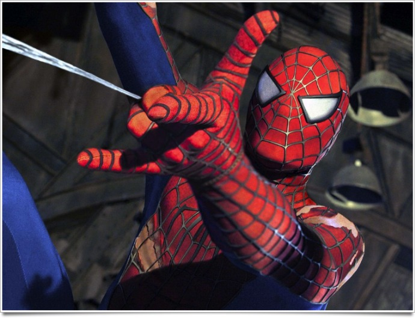
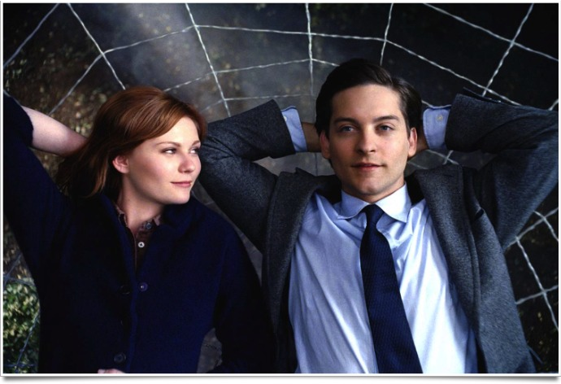
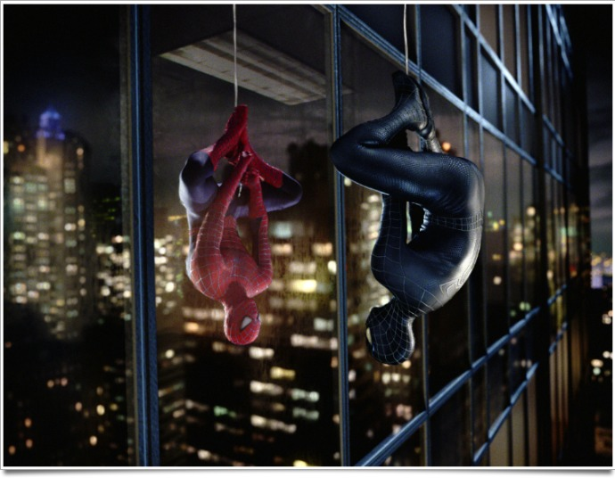

+++
titre = "La trilogie <em>Spider-Man</em>, Sam Raimi"
title = "La trilogie Spider-Man, Sam Raimi"
url = "/trilogie-spider-man-raimi"
date = "2012-01-15T16:38:38"
Lastmod = "2015-06-10T14:13:43"
cover = "spider-man-sam-raimi.jpg"
categorie = [ "À voir" ]
tag = [ "Action", "Amour", "Blockbuster", "Comics", "Superhéros" ]
createur = [ "Sam Raimi" ]
acteur = [ "James Franco", "Kirsten Dunst", "Tobey Maguire" ]
annee = [ "2002" ]
weight = 2002
pays = [ "États-Unis" ]

+++

Spider-Man est sans aucun doute l&rsquo;un des superhéros les plus populaires au cinéma. Avant la sortie cet été de <a href="http://voiretmanger.fr/2012/07/04/amazing-spider-man-webb/" title="The Amazing Spider-Man, Marc Webb"><em>The Amazing Spider-Man</em></a> qui sera un reboot de la série avec une nouvelle tête derrière le masque (Andrew Garfield), Sam Raimi a réalisé trois films de 2002 à 2007, composant ainsi une trilogie. De la naissance du superhéros dans <em>Spider-Man 1</em> à la confrontation de son double maléfique dans <em>Spider-Man 3</em>, cette trilogie a toujours placé les problèmes du superhéros et du au cœur des intrigues. Une bonne idée qui a influencé la manière de filmer les superhéros par la suite et la trilogie reste aujourd&rsquo;hui encore une valeur sûre…

Dans la grande famille des superhéros, Spider-Man se place du côté de ceux qui sont à l&rsquo;origine de leurs super-pouvoirs. Contrairement à Batman ou Iron Man par exemple, l&rsquo;homme araignée ne construit pas ses armes grâce à un financement illimité, mais il peut grimper sur n&rsquo;importe quel immeuble et sauter de gratte-ciel en gratte-ciel sans peine avec ses projections de toile d&rsquo;araignée. Dans la plupart des cas, le superhéros nait d&rsquo;une expérience scientifique qui ne se déroule pas comme prévu. Ici, c&rsquo;est une araignée mutante qui mord le héros et contribue à la transformer. De manière assez originale, ce sont ses ennemis qui dérivent tous d&rsquo;expériences scientifiques ratées : le Bouffon vert de <em>Spider-Man 1</em>, tout comme le Docteur Octopus de <em>Spider-Man 2</em> ou encore l&rsquo;Homme-Sable de <em>Spider-Man 3</em> sont tous nés d&rsquo;expériences scientifiques. Dans cette conception assez originale, le dernier film se distingue toutefois : le Nouveau Bouffon se crée lui-même de manière parfaitement maîtrisée, tandis que Venom provient d&rsquo;une matière extraterrestre. Reste cette originalité de la saga où les ennemis ne sont pas des ennemis venus d&rsquo;ailleurs, mais simplement des hommes qui se sont trouvés au mauvais endroit et au mauvais moment, ou qui n&rsquo;ont pas su maîtriser leur expérience.

Comme tout bon superhéros qui se respecte, Spider-Man utilise ses pouvoirs pour améliorer la société et en l&rsquo;occurrence faire respecter l&rsquo;ordre et la loi à New York. La morsure de l&rsquo;araignée ne lui donne pas mécaniquement cette envie. Au départ, le jeune homme gringalet apprécie surtout sa nouvelle musculature puissante et sa vision retrouvée. Par la suite, il découvre ses pouvoirs : la peau qui se colle à n&rsquo;importe quelle surface et surtout le fil qu&rsquo;il peut créer avec ses mains. <em>Spider-Man 1</em> est l&rsquo;occasion de découvrir ses talents : on le voit sauter d&rsquo;immeuble en immeuble et aller toujours plus loin au fur et à mesure qu&rsquo;il prend confiance en lui. Il fallait un évènement tragique pour le conduire à aider la police new-yorkaise toutefois : la mort, devant ses yeux, de son oncle qui l&rsquo;a adopté depuis des années est le déclencheur. Cette mort mêlée de culpabilité le conduit à attaquer tous les malfrats ou à aider la population de différentes manières, que ce soit dans un incendie ou pour contrer une grue devenue folle dans une impressionnante scène de <em>Spider-Man 3</em>.

Spider-Man aide ses concitoyens et doit faire face à de terribles ennemis dans chaque film, mais il doit aussi et surtout faire face à ses doutes et ses problèmes personnels. Tous les superhéros doutent à un moment ou à un autre, mais rarement les doutes du personnage ont constitué à ce point une part importante. La trilogie <em>Spider-Man</em> de Sam Raimi tourne constamment autour des problèmes de Peter Parker : problèmes sociaux d&rsquo;abord, financiers aussi, mais surtout amoureux. Peter aime une fille, mais elle ne s&rsquo;intéresse pas à lui dans un premier temps et quand c&rsquo;est finalement le cas, c&rsquo;est lui qui refuse de s&rsquo;engager pour la protéger. Spider-Man est le superhéros du doute. Quand il n&rsquo;est que Peter Parker, il n&rsquo;est sûr de rien et s&rsquo;avère maladroit et incapable de mener une vie sociale normale. Quand il est Spider-Man, la moindre critique le ronge et il a besoin de l&rsquo;acclamation de la foule pour se sentir bien. Dans ce contexte, on attendait beaucoup de <em>Spider-Man 3</em> qui promettait un combat contre son double sombre (ci-dessous). Las, Sam Raimi en fait trop, beaucoup trop dans ce dernier film en intégrant pas moins de trois méchants qui diluent le scénario et affaiblissent finalement le film.

La trilogie <em>Spider-Man</em> ne restera sans doute pas gravée dans l&rsquo;histoire du cinéma comme des films révolutionnaires, mais Sam Raimi compose une série extrêmement efficace. L&rsquo;action est toujours au rendez-vous avec quelques scènes d&rsquo;anthologie très réussies ici ou là. La naissance de l&rsquo;Homme-Sable dans <em>Spider-Man 3</em> reste vraiment dans les mémoires, tandis que les premiers sauts du personnage dans <em>Spider-Man 1</em> sont assez impressionnants même s&rsquo;il faut reconnaître que ceux de <em>The Amazing Spider-Man</em> entrevus dans la <a href="http://www.youtube.com/watch?v=njCs0skAVyo&amp;feature=fvst">bande-annonce</a> le sont encore plus. Un des arguments de la trilogie est sans conteste son humour discret, mais toujours présent. Il atteint son paroxysme avec le personnage du rédacteur en chef du <em>Daily Bugle</em> interprété à merveille par le délicieux J.K. Simmons. Tobbey Magguire dans le rôle-titre s&rsquo;en sort bien en étudiant intello à lunettes puis superhéros en proie aux doutes et les deux seconds rôles principaux, Mary Jane (Kirsten Dunst) et Harry (James Franco) sont également à la hauteur. On n&rsquo;atteint jamais des sommets avec la trilogie concoctée par Sam Raimi, mais son efficacité est constante. La trilogie doit également beaucoup à la musique originale composée par un Danny Elfman en pleine forme, du moins sur les deux premiers films.

Le reboot de la licence cet été est assez surprenant. La trilogie <em>Spider-Man</em> n&rsquo;a pas à rougir dans le paysage des adaptations de blockbusters. Certes, après un très bon <em>Spider-Man 1</em>, la série s&rsquo;affaiblit peu à peu, mais même <em>Spider-Man 3</em> reste tout à fait efficace et convaincant pour un blockbuster adapté d&rsquo;un comics. Marc Webb fera-t-il mieux que Sam Raimi ? En attendant la réponse cet été, on peut revoir sans risque les <em>Spider-Man</em> existants, ils fournissent un divertissement de qualité.

<h3>Vous voulez m&rsquo;aider ?</h3>
<ul>
<li><a href="http://www.amazon.fr/gp/product/B000VI04X4/ref=as_li_ss_tl?ie=UTF8&#038;tag=leblogdenic07-21&#038;linkCode=as2&#038;camp=1642&#038;creative=19458&#038;creativeASIN=B000VI04X4">Acheter le coffret de trois films en Blu-Ray sur Amazon</a></li>
<li><a href="http://www.amazon.fr/gp/product/B002KMW7W0/ref=as_li_ss_tl?ie=UTF8&#038;tag=leblogdenic07-21&#038;linkCode=as2&#038;camp=1642&#038;creative=19458&#038;creativeASIN=B002KMW7W0">Acheter le coffret de trois films en DVD sur Amazon</a></li>
<li><a href="http://ax.search.itunes.apple.com/WebObjects/MZSearch.woa/wa/search?entity=movie&#038;media=all&#038;restrict=true&#038;submit=seeAllLockups&#038;term=spider-man">Acheter ou louer les trois films de la trilogie sur l&rsquo;iTunes Store</a></li>
</ul>

