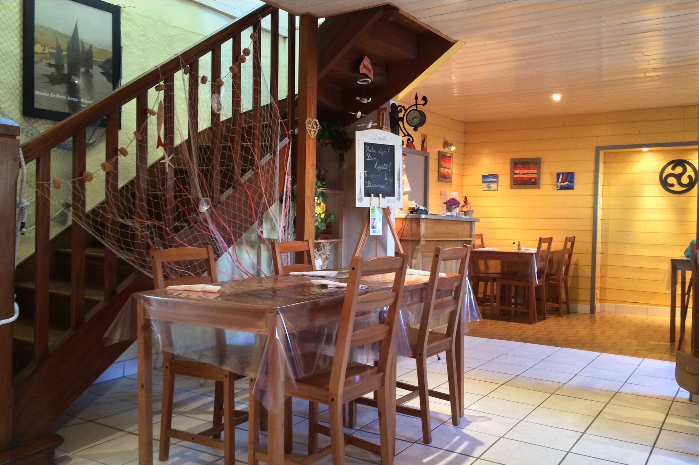
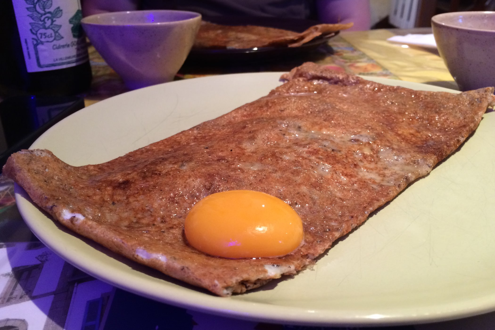
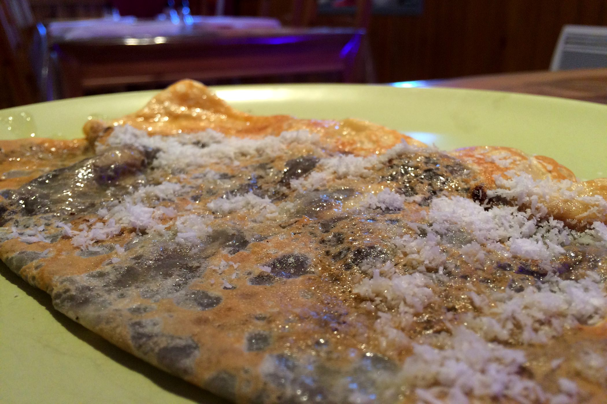

+++
type = "post"
titre = "Le Triskell à Névez"
title = "Le Triskell à Névez"
url = "/triskell-nevez"
date = "2014-07-17T21:47:33"
Lastmod = "2014-07-17T21:54:01"
cover = "nevez-creperie-triskell.jpg"
categorie = [ "À manger" ]
tag = [ "Bretagne", "Crêperie", "Cuisine traditionnelle" ]

+++

Située à la sortie du village de Névez, la crêperie <strong>Le Triskell</strong> masque bien son jeu. Si l’on n’est pas vraiment attentif, on pourrait rater cette toute petite adresse, cachée derrière deux minuscules fenêtres. Autant dire que la devanture n’est pas très accueillante, mais il ne faut pas s’y arrêter. Dans cette région riche en crêperies, mais aussi en pièges à touristes, on mange ici des galettes et crêpes très classiques, mais soignées et à un prix très doux.

À l’intérieur, on ne sent pas vraiment dans un restaurant, plus dans la (grande) salle à manger de la patronne qui officie dans sa cuisine. Dans la petite salle décorée simplement, une vingtaine de personnes peuvent prendre place pour manger. Un cadre un peu rudimentaire, c’est vrai, mais aussi intimiste et agréable. La cuisine est à l’image du reste : non professionnelle, elle semble bien peu adaptée pour servir autant de personnes. Que l’on se rassure, la cadence est assurée par la cuisinière, seule aux fourneaux et qui vient parfois apporter les galettes tout juste cuites. Il faut dire que la crêperie ne nécessite pas beaucoup de préparations de dernière minute, mais <strong>Le Triskell</strong> n’a pas choisi la facilité avec une longue carte. Au programme, tous les produits attendus, de la banale galette à l’indispensable andouille bretonne. Pareil côté desserts, avec du chocolat ou du caramel au beurre salé évidemment, mais aussi plusieurs fruits, des glaces…

Dans ce coin particulièrement touristique du Finistère sud, les prix sont une bonne surprise : on ne dépasse jamais les 6 ou 7 € pour les galettes et crêpes, sauf à avoir la main lourde sur les suppléments. <strong>Le Triskell</strong> n’a pas les ambitions d’une adresse comme l’<a href="/ouzh-taol-rennes/"><strong>Ouzh Taol</strong></a> rennais et la crêperie en a bien conscience. Les assiettes proposées à cette adresse sont très simples, mais elles ont la modestie de ne pas en faire trop. Ainsi, la pâte des galettes est bien cuite, elle est croustillante sur les côtés et moelleuse au cœur grâce à l’utilisation généreuse du beurre à la cuisson. Les garnitures sont bonnes, même si l’ajustement laisse parfois à désirer : la fondue de poireaux par exemple, est un peu nature. On pourrait aussi regretter l’absence totale de produits de la mer — les coquilles Saint-Jacques sont si bonnes en galette —, mais on apprécie en revanche la présentation des œufs miroir, originale et agréable pour répartir le jaune sur toute la surface. Côté desserts, le fait maison pour le chocolat et le caramel au beurre salé est un avantage indéniable. En revanche, on regrette que les fruits proposés soient quasiment tous au sirop : on aurait préféré des recettes plus éphémères, avec des produits frais de saison.

<strong>Le Triskell</strong> ne fait pas d’étincelles, mais ce n’est pas son but. Loin des usines à touristes plus proches de la côte, cette toute petite adresse familiale ressemble à un havre de paix bien agréable. Les galettes et crêpes sont très simples, dans l’ensemble bien faites, et elles ont de toute manière le bon goût d’être bon marché. Si vous voulez une crêperie reposante dans les environs, c’est un bon choix !

