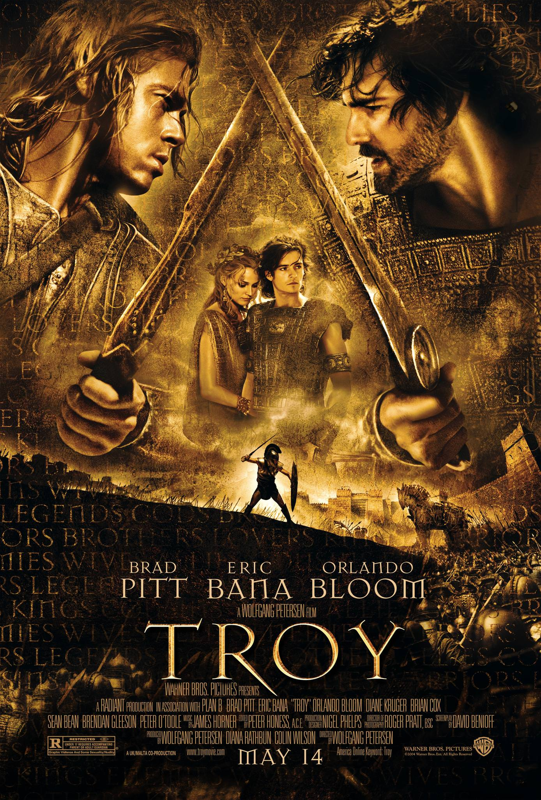
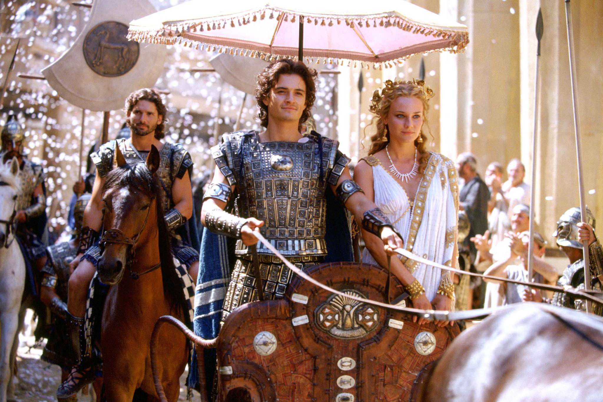
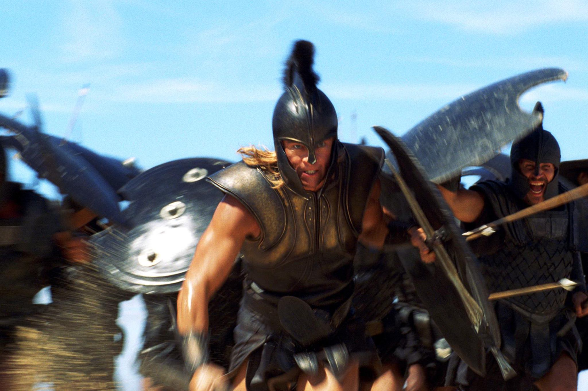

+++
type = "post"
titre = "<em>Troie</em>, Wolfgang Petersen"
title = "Troie, Wolfgang Petersen"
url = "/troie-petersen"
date = "2015-05-04T10:22:36"
Lastmod = "2015-05-03T18:25:23"
cover = "troie-wolfgang-petersen.jpg"
categorie = [ "À voir" ]
tag = [ "Action", "Amour", "Antiquité", "Blockbuster", "Drame", "Épopée", "Famille", "Guerre", "Histoire", "Mort", "Mythe", "Peplum", "Religion" ]
createur = [ "Wolfgang Petersen" ]
acteur = [ "Brad Pitt", "Brian Cox", "Diane Kruger", "Eric Bana", "Orlando Bloom", "Peter O'Toole", "Rose Byrne", "Sean Bean" ]
annee = [ "2004" ]
weight = 2004
pays = [ "États-Unis" ]
original = "Troy"

+++

Peut-on vraiment adapter l&rsquo;œuvre de Homère au cinéma ? Paradoxalement, <em>Troie</em> semble répondre que ce n&rsquo;est pas possible tout en essayant précisément de le faire. Pour adapter la bataille de Troie à un long-métrage déjà long — plus de trois heures dans la version <em>Director&rsquo;s Cut</em> —, Wolfgang Petersen a été obligé de revoir complètement l&rsquo;histoire racontée dans <em>L&rsquo;Iliade</em><a href="#fn-13628-1" rel="footnote">1</a>. D&rsquo;une longue guerre de siège qui a duré plus de dix ans, il ne reste qu&rsquo;une quinzaine de jours d&rsquo;affrontements. Et de la galerie de personnages souvent mythiques entremêlée de divinités, il ne reste que la confrontation de quelques êtres beaucoup plus exceptionnels qu&rsquo;ils ne l&rsquo;étaient à travers les mots de Homère. À l&rsquo;arrivée, <em>Troie</em> est un péplum très classique, porté par quelques scènes épiques vraiment réussies, mais handicapé aussi par son classicisme et sa tendance à en faire régulièrement trop.

La guerre de Troie a commencé autour d&rsquo;une histoire d&rsquo;amour et d&rsquo;une vengeance. Wolfgang Petersen attaque ainsi rapidement avec le cœur du problème : venus à Sparte pour sceller une paix, les deux frères troyens Hector et Pâris repartent avec Hélène, l&rsquo;épouse de Ménélas. Il faut dire que Pâris, le cadet, est tombé follement amoureux de la belle reine et que cet amour est si fort qu&rsquo;il a convaincu le couple de fuir vers Troie. Sans vraiment en avoir tout à fait conscience, le jeune prince déclenche l&rsquo;une des plus grandes guerres de l&rsquo;époque quand Agamemnon, qui contrôle toute la Grèce réunie par sa force dans cette réalité parallèle de l&rsquo;Antiquité, décide d&rsquo;utiliser ce prétexte pour assouvir Troie. Le reste est connu, mais le siège de la ville et la ruse des Grecs pour obtenir finalement la victoire sont offerts en accéléré. Car <em>Troie</em> ne s&rsquo;intéresse finalement pas tant que ça au mythe et lui préfère des histoires et surtout des confrontations personnelles. Hector, le plus valeureux soldat troyen, contre Achille, demi-dieux que rien ne semble arrêter. Pâris contre Ménélas autour de Hélène. Et bien sûr, Agamemnon contre Priam qui résument à eux seuls l&rsquo;affrontement entre Grecs et Troyens. Wolfgang Petersen n&rsquo;est pas avare en grandes scènes de combat, avec des troupes immenses — plusieurs dizaines de milliers d&rsquo;hommes de part et d&rsquo;autres — et du sang qui coule à flot. Mais ce qui le motive vraiment, ce sont les combats singuliers : une bonne partie de <em>Troie</em> ne concerne ainsi qu&rsquo;Achille et ses états d&rsquo;âme, Hector et ses responsabilités contradictoires de père de famille et de prince héritier, que Pâris et son amour destructeur, ou bien encore d&rsquo;Agamemnon et son envie de contrôler l&rsquo;empire le plus immense. Tout le reste passe à la trappe, et il ne s&rsquo;agit pas simplement de coupes franches dans l&rsquo;œuvre de Homère. Pour favoriser ses personnages clés, <em>Troie</em> sacrifie tout le reste. Quitte à donner lieu à des situations étonnantes, où l&rsquo;on ne comprend pas très bien ce qui se passe ; quitte aussi à avoir une galerie de personnages secondaires inexistants. Ulysse ou Énée devraient être au cœur de l&rsquo;intrigue, mais ils sont totalement oubliés : le premier ne sert qu&rsquo;à motiver Achille quand le héros ne veut plus se battre, quant au second, on le découvre par hasard à la toute fin, alors qu&rsquo;il est censé être aux côtés de Priam, pour assurer la défense de la ville.

Wolfgang Petersen ne peut pas éviter quelques incohérences majeures : comment se fait-il que Hector et Achille combattent au pied de l&rsquo;immense muraille de Troie sans que personne n&rsquo;intervienne, ni d&rsquo;un côté, ni de l&rsquo;autre ? La plus grossière concerne le cheval toutefois : les Grecs ne sont là que depuis une dizaine de jours, ils ont l&rsquo;avantage sur les Troyens et pourtant ils fuiraient à cause de la peste, sans que personne ne prenne la peine de vérifier. Pire, les Troyens font entrer le cheval sans même regarder comment il est composé ? <em>Troie</em> justifie cet aveuglement par l&rsquo;importance de la religion et des présages, mais l&rsquo;ensemble paraît un peu trop simple. De manière générale d&rsquo;ailleurs, les grandes batailles sont confuses, on ne comprend jamais pourquoi un camp prend le dessus sur l&rsquo;autre et Wolfgang Petersen donne parfois le sentiment d&rsquo;interrompre la scène faute d&rsquo;idées pour la continuer. Malgré tous ces défauts, il faut aussi reconnaître que le film fonctionne par ses confrontations personnelles. Le combat entre Achille et Hector reste un grand moment de cinéma, avec une chorégraphie parfaite et beaucoup de suspense. Par ailleurs, <em>Troie</em> soigne ses personnages principaux et Achille en particulier, est très convaincant : Brad Pitt offre une prestation d&rsquo;acteur très réussie et on adhère à ce personnage moderne — on pourrait même dire anachronique —, toujours en conflit avec ses propres démons. Il est en permanence à la limite de la dépression, un choix étonnant de la part du scénario qui fonctionne bien. Eric Bana endosse lui aussi un Hector réussi, on n&rsquo;en dira pas autant d&rsquo;Orlando Bloom qui campe un Pâris fade et c&rsquo;est un peu le problème de tous les personnages, qui oscillent entre absence et interprétation outrancière. Agamemnon n&rsquo;était qu&rsquo;un simple dirigeant pour l&rsquo;armée grecque et le non le conquérant imaginé ici, soit ; mais méritait-il l&rsquo;interprétation grossière de Brian Cox, ridicule au possible avec ses nattes ? Diane Kruger donne ses traits à Hélène, mais son personnage se contente de figuration.

<em>Troie</em> est un péplum à l&rsquo;ancienne, spectaculaire par moment, c&rsquo;est vrai, mais sans doute trop classique à beaucoup d&rsquo;autres moments. Dans sa relecture de <em>L&rsquo;Iliade</em>, Wolfgang Petersen excelle quand deux hommes s&rsquo;affrontent et il parvient aussi assez bien à rendre l&rsquo;ampleur des batailles d&rsquo;alors. Par ailleurs, quelques personnages clés — Achille en tête — sont bien dessinés et assez passionnants, même s&rsquo;ils n&rsquo;ont rien à voir avec les versions mythiques telles qu&rsquo;on les connaît, grâce à Homère. Malgré ces bons moments, le bilan reste mitigé pour <em>Troie</em> qui souffre d&rsquo;une vision trop classique du péplum et de personnages trop mal dessinés. Quant à la guerre en elle-même, elle est bien trop simplifiée et caricaturale pour convaincre, et c&rsquo;est bien dommage.

<h3>Vous voulez <a href="/soutien/">m&rsquo;aider</a> ?</h3>
<ul>
<li><a href="http://www.amazon.fr/gp/product/B001927NBC/ref=as_li_ss_tl?ie=UTF8&amp;tag=leblogdenic07-21&amp;linkCode=as2&amp;camp=1642&amp;creative=19458&amp;creativeASIN=B001927NBC">Acheter le film en Blu-ray sur Amazon</a></li>
<li><a href="http://www.amazon.fr/gp/product/B0002V5Z5M/ref=as_li_ss_tl?ie=UTF8&amp;tag=leblogdenic07-21&amp;linkCode=as2&amp;camp=1642&amp;creative=19458&amp;creativeASIN=B0002V5Z5M">Acheter le film en DVD sur Amazon</a></li>
<li><a href="https://itunes.apple.com/fr/movie/troie/id366264347">Acheter ou louer le film sur l&rsquo;iTunes Store</a></li>
</ul>

<ol>
<li id="fn-13628-1">
La fiche Wikipedia contient une <a href="https://fr.wikipedia.org/wiki/Troie_(film)#Diff.C3.A9rences_avec_L.27Iliade">liste assez longue</a> (mais certainement exhaustive) des différences entre <em>Troie</em> et <em>L&rsquo;Iliade</em>.&#160;<a href="#fnref-13628-1" rev="footnote">&#8617;</a>
</li>
</ol>

