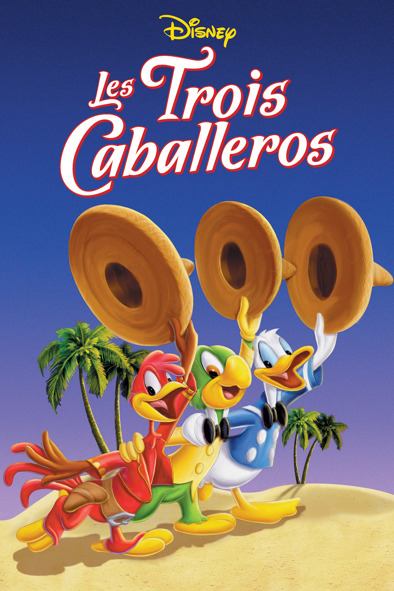
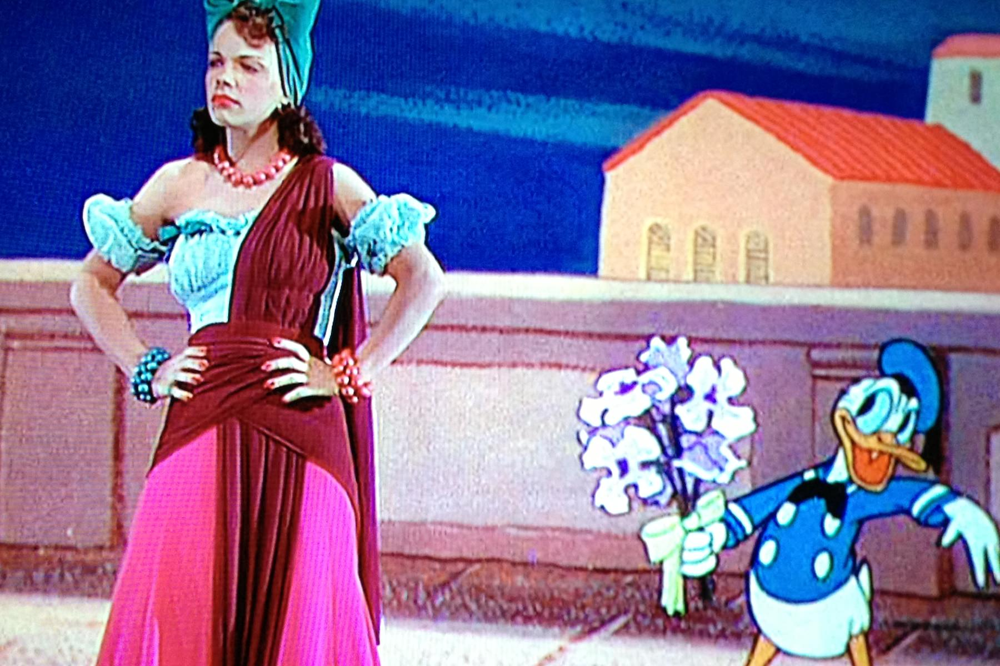

+++
type = "post"
titre = "<em>Les Trois Caballeros</em>, Norman Ferguson"
title = "Les Trois Caballeros, Norman Ferguson"
url = "/trois-caballeros-ferguson"
date = "2014-02-03T11:27:28"
Lastmod = "2014-02-03T15:17:06"
cover = "les-trois-caballeros-ferguson.jpg"
categorie = [ "À voir" ]
tag = [ "Animation", "Animaux", "Caricature", "Humour", "Tourisme" ]
createur = [ "Norman Ferguson", "Walt Disney" ]
annee = [ "1944" ]
weight = 1944
saga = [ "Classiques d'animation Disney" ]
pays = [ "États-Unis" ]
original = "The Three Caballeros"

+++

La Seconde Guerre mondiale bloque toujours le studio Disney qui dépendait à l’époque de l’Europe pour une très grande part de ses revenus. Au début des années 1940, Walt Disney et ses équipes lancent plusieurs projets, mais aucun n’a connu de succès et les studios doivent à tout prix faire rentrer de l’argent. En 1942, Walt Disney se laisse convaincre par le gouvernement américain qui veut l’envoyer en Amérique du Sud pour des raisons politiques. De cet accord naît <a href="/saludos-amigos-ferguson/" title="Saludos Amigos, Norman Ferguson"><em>Saludos Amigos</em></a>, une compilation de courts-métrages inspirés par les pays visités. Un film qui n’a pas rapporté énormément, mais c’était encore le double de ce qu’il avait coûté. Convaincu que la formule est bonne, le patron du studio renouvelle l’expérience deux ans après avec <em>Les Trois Caballeros</em> qui suit exactement la même formule. Menés par Norman Ferguson, les animateurs créent quelques courts-métrages vaguement liés entre eux, toujours en Amérique du Sud. Et encore une fois, le résultat n’est pas très passionnant…

<em>Saludos Amigos</em> prenait comme prétexte la visite des animateurs Disney en Amérique du Sud. Son successeur cherche une idée plus originale et imagine que Donald reçoit un cadeau pour son anniversaire de la part de ses amis, en provenance du continent sud-américain. Parmi les cadeaux, une bobine de film et <em>Les Trois Caballeros</em> lance ainsi son premier court-métrage, l’histoire d’un pingouin du pôle Sud qui n’aime pas le froid et qui se met en tête de partir au nord vers l’Équateur et la chaleur. Une petite histoire toute mignonne, mais aussi très enfantine qui se poursuit avec la découverte de l’Aracuan, un oiseau fictif inventé pour les besoins du film. Dernière séquence dans cette première partie, l’histoire étonnante d’un âne volant racontée par un narrateur qui prend un accent argentin à couper au couteau qui vient un peu gâcher le plaisir. L’heure est à la caricature de manière générale et le film supervisé par Norman Ferguson enfile les clichés, en particulier dans la suite. Donald ouvre son autre cadeau et <em>Les Trois Caballeros</em> fait revenir José Carioca, personnage créé dans le long-métrage précédent et qui fait son grand retour. Il emmène Donald avec lui dans une découverte du Brésil et surtout de ses femmes. Pour un film pour les enfants, les femmes sont étonnamment présentes et non pas, comme c’était toujours le cas jusqu’ici chez Disney, comme des mères, mais comme des êtres désirables. Dans une séquence qui mêle images d’animation et images réelles — une technique d’ailleurs parfaitement maîtrisée, même si à l’origine il ne s’agissait que de réduire les coûts —, Donald tente de séduire une danseuse. Plus loin, alors qu’on ira au Mexique, il sera sous le charme d’une fille du coin. Cette place des femmes a choqué certains contemporains et sans aller jusque-là, on est effectivement surpris par l’importance prise par ce thème dans ce film. Pour le reste, Walt Disney introduit le troisième <em>Caballeros</em> annoncé par le titre avec le personnage de Panchito Pistoles, un coq mexicain qui tire dans tous les sens. Cette fois, l’objectif est de découvrir le Mexique avec toutes ses traditions, de la <em>Piñata</em> aux fêtes typiques. La musique est au cœur de cette séquence qui évoque un peu les expérimentations de <a href="/fantasia-sharpsteen/" title="Fantasia, Ben Sharpsteen"><em>Fantasia</em></a>, mais en plus déjanté et moins abouti.

Difficile de s’enthousiasmer pour ce septième long-métrage qui est plus travaillé que le précédent, mais paradoxalement moins passionnant encore. <em>Les Trois Caballeros</em> reste un formidable terrain de jeu pour les animateurs de chez Disney et ils essaient de nouvelles formes, mais il s’agit de raconter des histoires sans grand intérêt et surtout qui respirent l’objectif de propagande à l’origine du projet. Les caricatures se suivent et on sent la volonté de donner une certaine image de l’Amérique du Sud. Mis à part peut-être pour quelques séquences plus réussies, <em>Les Trois Caballeros</em> n’est pas un classique qui reste dans les mémoires…

<h3>Vous voulez m’aider ?<a href="#footnote_0_11090" id="identifier_0_11090" class="footnote-link footnote-identifier-link" title="&Agrave; propos de la publicit&eacute;&hellip;">1</a></h3>
<ul>
<li><a href="http://www.amazon.fr/gp/product/B0000AXMQF/ref=as_li_ss_tl?ie=UTF8&tag=leblogdenic07-21&linkCode=as2&camp=1642&creative=19458&creativeASIN=B0000AXMQF">Acheter le film en DVD sur Amazon</a></li>
<li><a href="https://itunes.apple.com/fr/movie/les-trois-caballeros/id468015849">Acheter ou louer le film sur l’iTunes Store</a></li>
</ul>

<ol class="footnotes"><li id="footnote_0_11090" class="footnote"><a href="/soutien/">À propos de la publicité…</a> [<a href="#identifier_0_11090" class="footnote-link footnote-back-link">&#8617;</a>]</li></ol>
