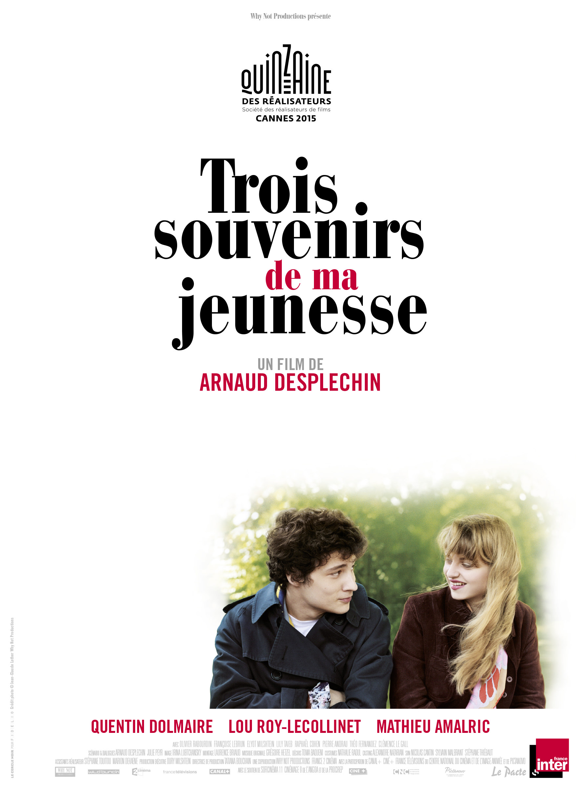
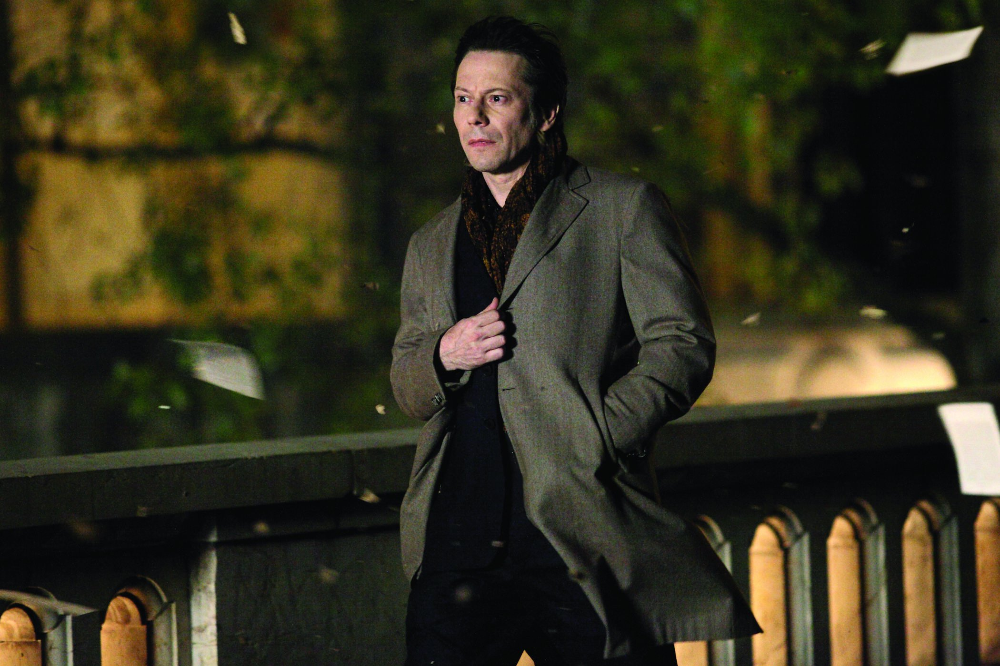
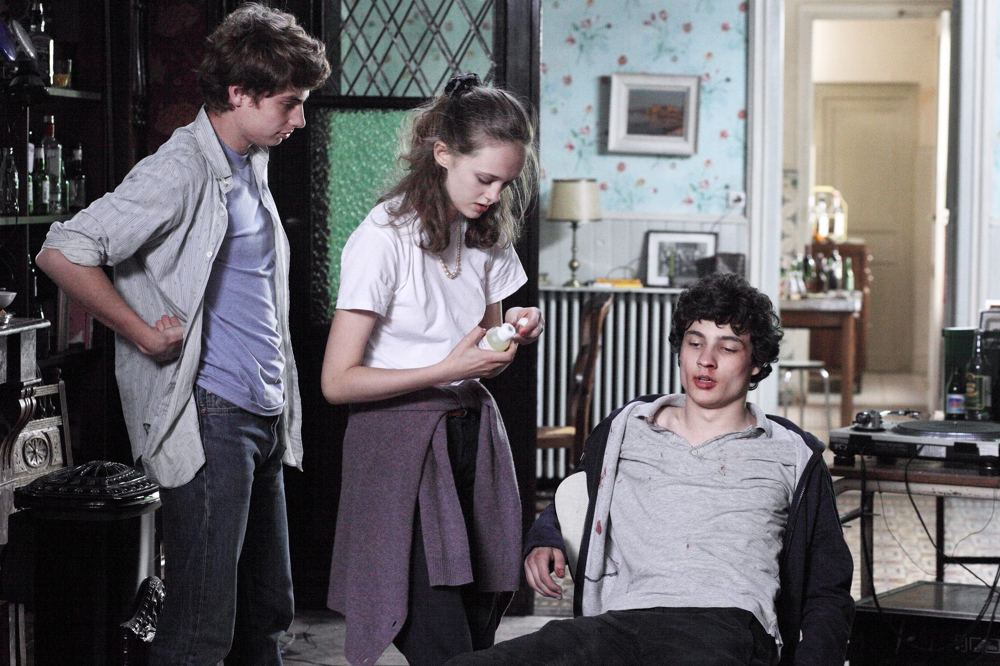

+++
titre = "<em>Trois souvenirs de ma jeunesse</em>, Arnaud Depleschin"
title = "Trois souvenirs de ma jeunesse, Arnaud Depleschin"
url = "/trois-souvenirs-jeunesse-desplechin"
date = "2015-05-25T21:11:32"
Lastmod = "2015-05-25T21:15:31"
cover = "trois-souvenirs-jeunesse-arnaud-desplechin.jpg"
categorie = [ "À voir" ]
tag = [ "Adolescence", "Amour", "Enfance", "Famille", "Mémoire", "Sorties du mois", "Vie" ]
createur = [ "Arnaud Desplechin" ]
acteur = [ "Lou Roy Lecollinet", "Mathieu Amalric", "Quentin Dolmaire" ]
annee = [ "2015" ]
weight = 2015
pays = [ "France" ]

+++

Le titre du dernier long-métrage d&rsquo;Arnaud Desplechin, <em>Trois souvenirs de ma jeunesse</em>, a le mérite de la clarté. Ne s&rsquo;arrêtant pas en si bon chemin, le réalisateur a aussi choisi de structurer son film par une série d&rsquo;intertitres qui découpe très clairement chaque souvenir. On a ainsi trois évocations de la jeunesse de Paul Dédalus, personnage récurrent du cinéaste<a href="#fn-13773-1" rel="footnote">1</a>, mais cette construction interne très ferme n&rsquo;est pas vraiment justifiée par un scénario qui se contente de rester assez flou. Chaque séquence n&rsquo;est, ainsi, pas liée à l&rsquo;autre et alors même que l&rsquo;on avait le sentiment d&rsquo;avoir une œuvre parfaitement cohérente, Arnaud Desplechin nous perd un petit peu en donnant les trois souvenirs sans les justifier. Qu&rsquo;importe, <em>Trois souvenirs de ma jeunesse</em> est un film passionnant, tout en finesse, une réussite.

On découvre tout d&rsquo;abord le Paul du présent. Il prépare ses affaires et s&rsquo;apprête à quitter le Tadjikistan où il a séjourné pendant plusieurs années. Mais cette actualité n&rsquo;est pas le sujet du dernier film d&rsquo;Arnaud Desplechin, constitué presque uniquement de flashbacks. Ce retour vers la France, son pays qu&rsquo;il n&rsquo;a pas vu depuis une dizaine d&rsquo;années, déclenche un souvenir de jeunesse, un retour au cœur de l&rsquo;enfance. Le premier segment de <em>Trois souvenirs de ma jeunesse</em> se déroule ainsi à Roubaix, au début des années 1980. Paul a une dizaine d&rsquo;années et on sent d&rsquo;emblée que ce garçon débrouillard n&rsquo;est pas un enfant comme les autres. La première scène de ce souvenir se déroule dans la maison familiale, le père parti pour ses affaires, les trois enfants qui restent et supportent la folie de la mère. Paul tient un couteau pour protéger son frère et sa sœur et on croit d&rsquo;abord qu&rsquo;ils jouent, mais non : il est bien là, seul, à se défendre contre une femme que l&rsquo;on imagine dangereuse. En un seul plan, Arnaud Desplechin révèle un pan important de son personnage et on ressent très bien, déjà, la solitude de Paul. La suite du segment présente son départ de la cellule familiale, quand il va se réfugier chez une tante des environs. Retour au présent et cette fois, <em>Trois souvenirs de ma jeunesse</em> propose une transition logique : Paul est arrêté à la frontière française, car un autre Paul Dédalus est mort en Australie. Le personnage, incarné dans ce présent par un Mathieu Amalric toujours aussi bon acteur, explique ainsi la raison, qui correspond au deuxième souvenir. Cette fois, on retrouve Paul âgé de seize ans, lors d&rsquo;un voyage scolaire en URSS. Il accompagne en fait un ami juif qui a pour mission de donner argent et papier à des réfugiés locaux qui veulent partir pour Israël. C&rsquo;est à cette occasion que le jeune homme donne son passeport à un autre jeune, qui devient un deuxième Paul Dédalus : le souvenir se termine ainsi assez rapidement.

À ce stade, le spectateur est circonspect : <em>Trois souvenirs de ma jeunesse</em> nous a promis trois parties et les deux premières ont été expédiées très rapidement, trop pour tenir les deux heures annoncées par le long-métrage. De fait, le troisième souvenir est le plus important et c&rsquo;est presque un film à l&rsquo;intérieur du film. C&rsquo;est aussi un souvenir qui n&rsquo;a pas vraiment de raison d&rsquo;être, qui est amené sans justification, alors même que c&rsquo;est le plus important des trois. Il faut accepter cette bizarrerie et se laisser porter, car c&rsquo;est aussi le souvenir qui est le plus intéressant et réussi. On retrouve donc Paul, quelques années après son voyage en URSS. Désormais étudiant sans le sous à Paris, il revient régulièrement à Roubaix voir son frère et sa sœur, mais éviter son père détruit depuis le suicide de sa femme. Arnaud Desplechin présente Paul et ses amis, une bande de jeunes qui aime faire la fête et qui commence à fréquenter pour la première fois des filles. Ce souvenir tout en entier est centré autour d&rsquo;Esther, une fille que Paul rencontre à la sortie du lycée de sa sœur. Commence alors une histoire d&rsquo;amour de dix ans, mais une histoire très compliquée, à cause de la distance et du caractère de l&rsquo;un et de l&rsquo;autre. Dans ce segment, <em>Trois souvenirs de ma jeunesse</em> trouve le ton juste pour présenter des personnages complexes, et surtout Paul, un jeune homme qui a du mal à concrétiser ses sentiments. Il essaie d&rsquo;atteindre une forme de perfection morale, mais son histoire a des allures de drame dès le départ et ce couple semble impossible. Quoi qu&rsquo;il en soit, le réalisateur trouve le ton juste pour évoquer cette histoire touchante, et il pouvait compter sur ses jeunes acteurs. Lou Roy Lecollinet est très bien dans le rôle d&rsquo;Esther, mais on retiendra surtout le nom de Quentin Dolmaire. Ce jeune acteur n&rsquo;avait jamais tourné au cinéma, et pourtant il fait déjà preuve d&rsquo;une grande maturité, avec un jeu naturellement calqué sur celui de Mathieu Amalric. Les deux acteurs ne se ressemblent pas beaucoup physiquement, mais on a l&rsquo;impression de voir le même interprète d&rsquo;un bout à l&rsquo;autre, c&rsquo;est troublant. Il convient aussi de saluer l&rsquo;encore plus jeune Antoine Bui qui incarne le Paul d&rsquo;une dizaine d&rsquo;années et qui, lui aussi, a bien réussi à représenter son personnage.

Comme souvent, <em>Trois souvenirs de ma jeunesse</em> n&rsquo;est pas un film que l&rsquo;on peut classer facilement. Arnaud Desplechin poursuit sa voie à part dans le cinéma, avec un film d&rsquo;auteur fascinant. Ne soyez pas effrayés par le synopsis ou le sujet, le dernier long-métrage du réalisateur est très plaisant à regarder et l&rsquo;histoire d&rsquo;amour entre Paul et Esther est très touchante, et en même temps assez terrible. La vraie réussite, c&rsquo;est sans conteste le personnage de Paul Dédalus, d&rsquo;une complexité folle et parfaitement incarné par Mathieu Amalric, mais aussi par Quentin Dolmaire.

<ol>
<li id="fn-13773-1">
D&rsquo;ailleurs, <em>Trois souvenirs de ma jeunesse</em> est une préquelle à <em>Comment je me suis disputé… (ma vie sexuelle)</em>, deuxième réalisation d&rsquo;Arnaud Desplechin sortie en 1996 où l&rsquo;on retrouvait aussi le personnage de Paul Dédalus.&#160;<a href="#fnref-13773-1" rev="footnote">&#8617;</a>
</li>
</ol>

