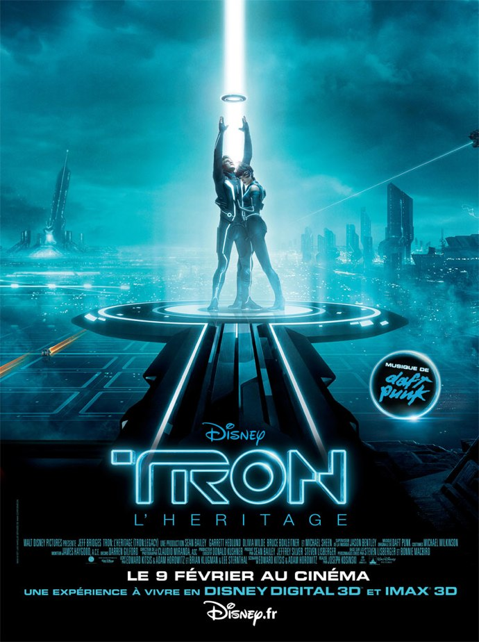
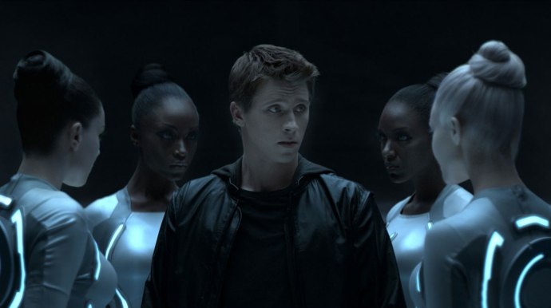
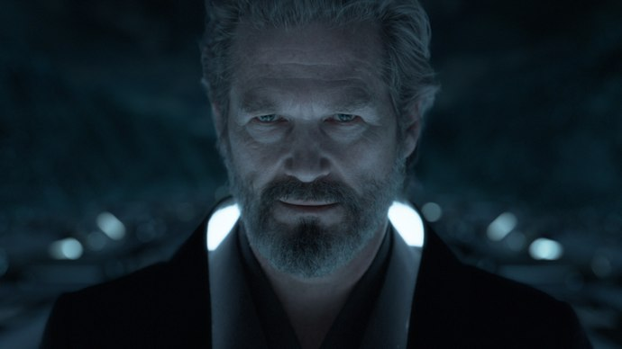

+++
type = "post"
titre = "<em>Tron l&rsquo;héritage</em>, Joseph Kosinski"
title = "Tron l'héritage, Joseph Kosinski"
url = "/tron-heritage-kosinski"
date = "2011-01-29T00:25:54"
Lastmod = "2014-12-08T23:55:03"
cover = "tron-heritage-kosinski.jpg"
categorie = [ "À voir" ]
tag = [ "3D", "Blockbuster", "Famille", "Informatique", "Remake", "Science-Fiction" ]
createur = [ "Joseph Kosinski" ]
acteur = [ "Garrett Hedlund", "Jeff Bridges", "Olivia Wilde" ]
annee = [ "2011" ]
weight = 2011
saga = [ "Tron" ]
pays = [ "États-Unis" ]
original = "Tron Legacy"

+++

Presque 30 ans après <em><a href="http://voiretmanger.fr/2010/12/25/tron-lisberger/">Tron</a></em>, film culte qui n&rsquo;a pas très bien vieilli, les studios Disney décident d&rsquo;exploiter à nouveau cet univers avec <em>Tron l&rsquo;héritage</em>. L&rsquo;affiche, identique à l&rsquo;originale, met d&rsquo;emblée dans l&rsquo;ambiance : le Tron de 2011 sera un <em>Tron</em> remis à l&rsquo;ordre du jour, pas une révolution. Et de fait, Joseph Kosinski reste bien sagement dans les pas de Steven Lisberger et suit consciencieusement le scénario original. <em>Tron l&rsquo;héritage</em> est pourtant loin de n&rsquo;avoir strictement aucun intérêt pour qui a vu <em>Tron</em>. Cette remise au goût du jour offre un film visuellement époustouflant, du grand spectacle comme on a rarement l&rsquo;occasion d&rsquo;en voir. Un film à voir, mais à voir absolument sur grand écran.

Dans l&rsquo;<a href="http://voiretmanger.fr/2010/12/25/tron-lisberger/">épisode précédent</a><a href="#footnote_0_4587" id="identifier_0_4587" class="footnote-link footnote-identifier-link" title="M&ecirc;me si ce n&rsquo;est pas indispensable pour comprendre Tron l&rsquo;h&eacute;ritage, mieux vaut commencer par regarder le Tron de 1982 avant celui de 2011&hellip;">1</a>, Flynn a réussi à récupérer son empire industriel, évinçant Dillinger et le MCP. Ce nouvel épisode commence peu après cette victoire. Flynn a fondé une famille, il a un fils qui le vénère et à qui il promet de l&rsquo;emmener dans la &laquo;&nbsp;Grille&nbsp;&raquo;, l&rsquo;univers virtuel que l&rsquo;on avait découvert précédemment. On pouvait s&rsquo;y attendre, les choses ne se passent pas comme prévu et le père disparaît, laissant son fils seul pendant une vingtaine d&rsquo;années. On retrouve Sam à 27 ans, il a bien grandi et s&rsquo;intéresse mollement à l&rsquo;entreprise de son père, devenue une multinationale, monstre de l&rsquo;informatique moderne. Sam a perdu tout espoir de revoir son père, jusqu&rsquo;au jour où un mystérieux message le guide là où tout a commencé, dans la salle d&rsquo;arcade de son père. Il réussit à découvrir le bureau caché de ce dernier et par une malencontreuse manipulation, Sam atterrit dans la Grille où il est immédiatement fait prisonnier, avant d&rsquo;être conditionné à jouer et balancé dans une arène gigantesque où il devra affronter d&rsquo;autres &laquo;&nbsp;programmes&nbsp;&raquo; au disque. Son parcours le mène ensuite au cœur d&rsquo;une terrible course-poursuite avec les fameuses motos lumineuses, avant de lui faire retrouver son père…

Si vous avez vu le <em>Tron</em> de 1982, le scénario de la version 2011 ne vous sera pas étranger. Et pour cause, <em>Tron l&rsquo;héritage</em> fait preuve d&rsquo;une absence totale d&rsquo;innovation scénaristique et se contente au contraire de reprendre l&rsquo;histoire de son ainé. Les points communs sont frappants, surtout une fois que Sam est entré dans l&rsquo;univers de la Grille. Il connaît le même parcours que son père dans <em>Tron</em> avec l&rsquo;emprisonnement, la découverte des programmes, le combat de disques, la course de moto, la fuite hors de la Grille et enfin la quête du portail. Même toute la partie dans le monde réel, au début, ressemble fort à la partie réelle de l&rsquo;original : certaines séquences, comme l&rsquo;ouverture de la porte blindée ou le conseil d&rsquo;administration, sont des copies parfaites, mais remises au goût du jour. Une fois passé de l&rsquo;autre côté, le film semble emprunter des rails et ne déraille jamais : le film de Joseph Kosinski est à cet égard très convenu, et assez décevant si l&rsquo;on connaît bien l&rsquo;original. Seront bien sûr avantagés tous ceux qui découvriront ainsi l&rsquo;univers de <em>Tron</em>, les autres devront se contenter d&rsquo;une mise à jour. En effet, si <em>Tron l&rsquo;héritage</em> suit de très près l&rsquo;histoire originale, son traitement est celui d&rsquo;un blockbuster de 2011 et il s&rsquo;avère bien différent de celui d&rsquo;un film de 1982. Le rythme a subi une sacrée accélération, les séquences s&rsquo;enchaînent désormais sans interruption, le film ne s&rsquo;appesantit jamais sur des détails… ce qui est plutôt bien vu. En outre, le scénario tient finalement plutôt bien la route et même s&rsquo;il est ultra-classique sur le thème de l&rsquo;uchronie et de l&rsquo;intelligence artificielle qui se retourne contre son créateur, il s&rsquo;avère aussi efficace.

<em>Tron</em> a mal vieilli visuellement, mais ce film reste un document très intéressant sur la perception de l&rsquo;informatique par le grand public au début des années 1980. L&rsquo;informatique personnifiée que Steven Lisberger filmait alors a totalement disparu aujourd&rsquo;hui, époque où l&rsquo;ordinateur a envahi nos vies, jusqu&rsquo;à nos téléphones portables. Il était dès lors intéressant de voir quelle conception de l&rsquo;informatique <em>Tron l&rsquo;héritage</em> allait pouvoir proposer en 2011. Le résultat est… troublant. L&rsquo;informatique a en fait disparu du film, ou presque : il reste bien quelques éléments disparates, quelques liens encore avec la programmation, mais ce qui faisait de <em>Tron</em> un film presque geek n&rsquo;a plus sa place ici. Joseph Kosinski filme des programmes, mais cela n&rsquo;a strictement aucune incidence sur son film, en fait cela n&rsquo;a aucun intérêt. L&rsquo;univers du film est un univers de science-fiction, il aurait pu prendre place n&rsquo;importe où, n&rsquo;importe quand. L&rsquo;informatique est devenue banale et s&rsquo;avère ici transparente, sans intérêt. On peut même dire qu&rsquo;elle est niée par <em>Tron l&rsquo;héritage</em> : alors que Clu est censé être une intelligence artificielle, on le comprend comme un double de Flynn, un clone plus qu&rsquo;un programme constitué de lignes de codes. Ce déni de l&rsquo;informatique est un élément très intéressant : que ce soit Disney qui a estimé que le côté geek n&rsquo;avait pas sa place dans un blockbuster familial, peu importe, le résultat est le même. On notera quand même, dans la partie réelle, une attaque en règle contre une certaine conception de l&rsquo;informatique, fermée et à rentabiliser à tout prix, quitte à proposer une nouvelle version d&rsquo;un système où seul le numéro change. Cette thématique n&rsquo;a aucune incidence sur le reste du film, mais elle est amusante.

Avouons-le, <em>Tron l&rsquo;héritage</em> est d&rsquo;abord et avant tout un spectacle, un très grand spectacle même. La mise à jour de <em>Tron</em> passe bien sûr par une mise à jour visuelle et le contraste entre les deux films est pour le moins saisissant. Là où Steven Lisberger, limité par les techniques de l&rsquo;époque, proposait un film proche du dessin animé à l&rsquo;ancienne, Joseph Kosinski peut se permettre de créer un univers photoréaliste absolument splendide. Un univers très sombre d&rsquo;ailleurs que seules les bandes lumineuses blanches viennent éclairer. Le résultat est bluffant et offre une expérience de cinéma rare, même si comme prévu, la 3D n&rsquo;apporte pas grand-chose, mais elle est utilisée intelligemment, c&rsquo;est-à-dire avec parcimonie. Seule la partie se déroulant dans l&rsquo;univers virtuel de la Grille est en 3D, toutes les parties dans l&rsquo;univers réel sont laissées en 2D. Une bonne idée qui offre au film plus de réalisme (et qui justifie un message inattendu au début du film, indiquant de garder ses lunettes même toutes les scènes ne sont pas en 3D). <em>Tron l&rsquo;héritage</em> est un film à voir absolument sur un grand écran, tant l&rsquo;immersion est impressionnante : on reste émerveillé devant cet univers parfaitement fluide où tout est possible. À cet égard, la course de motos est vraiment LA séquence du film, aussi impressionnante que prévu. <em>Tron l&rsquo;héritage</em> est aussi un film qui s&rsquo;appuie énormément sur sa bande originale. Composée par Daft Punk, on le sait, elle n&rsquo;a pas fait l&rsquo;unanimité à sa sortie, d&rsquo;aucuns la jugeant trop classique, trop proche de Hans Zimmer aussi… Il est vrai que les premiers albums du duo français sont loin, mais on aura rarement entendu une musique de film aussi efficace, et on aura rarement vu de film qui utilise aussi bien cette musique. La bande originale joue presque le rôle d&rsquo;un personnage à elle toute seule, et elle justifie encore le besoin de voir le film en salles.

<em>Tron l&rsquo;héritage</em> ne brille pas par l&rsquo;originalité de son scénario. Néanmoins, cette mise à jour du <em>Tron</em> de 1982 s&rsquo;avère assez époustouflante d&rsquo;efficacité. C&rsquo;est un blockbuster extrêmement bien réalisé, visuellement magnifique, un film qui justifie vraiment une séance de cinéma tant le résultat serait différent sur le petit écran d&rsquo;une télévision. Et tant pis si le scénario est faiblard, tant pis si tout le côté geek informatique des débuts a disparu, la réalisation bluffante donne envie de pardonner ces défauts à Joseph Kosinski. <em>Tron l&rsquo;héritage</em> n&rsquo;est peut-être qu&rsquo;un divertissement, mais c&rsquo;est un excellent divertissement. Ce n&rsquo;est déjà pas si mal…

<h3>Vous voulez m&rsquo;aider ?</h3>
<ul>
<li><a href="http://www.amazon.fr/gp/product/B004S7OUL6/ref=as_li_ss_tl?ie=UTF8&tag=leblogdenic07-21&linkCode=as2&camp=1642&creative=19458&creativeASIN=B004S7OUL6">Acheter le film en Blu-Ray sur Amazon</a></li>
<li><a href="http://www.amazon.fr/gp/product/B004EEO6BM/ref=as_li_ss_tl?ie=UTF8&tag=leblogdenic07-21&linkCode=as2&camp=1642&creative=19458&creativeASIN=B004EEO6BM">Acheter le film en DVD sur Amazon</a></li>
<li><a href="https://itunes.apple.com/fr/movie/tron-lheritage/id421569664">Acheter ou louer le film sur l&rsquo;iTunes Store</a></li>
</ul>

<ol class="footnotes"><li id="footnote_0_4587" class="footnote">Même si ce n&rsquo;est pas indispensable pour comprendre <em>Tron l&rsquo;héritage</em>, mieux vaut commencer par regarder le <em>Tron</em> de 1982 avant celui de 2011… [<a href="#identifier_0_4587" class="footnote-link footnote-back-link">&#8617;</a>]</li></ol>
