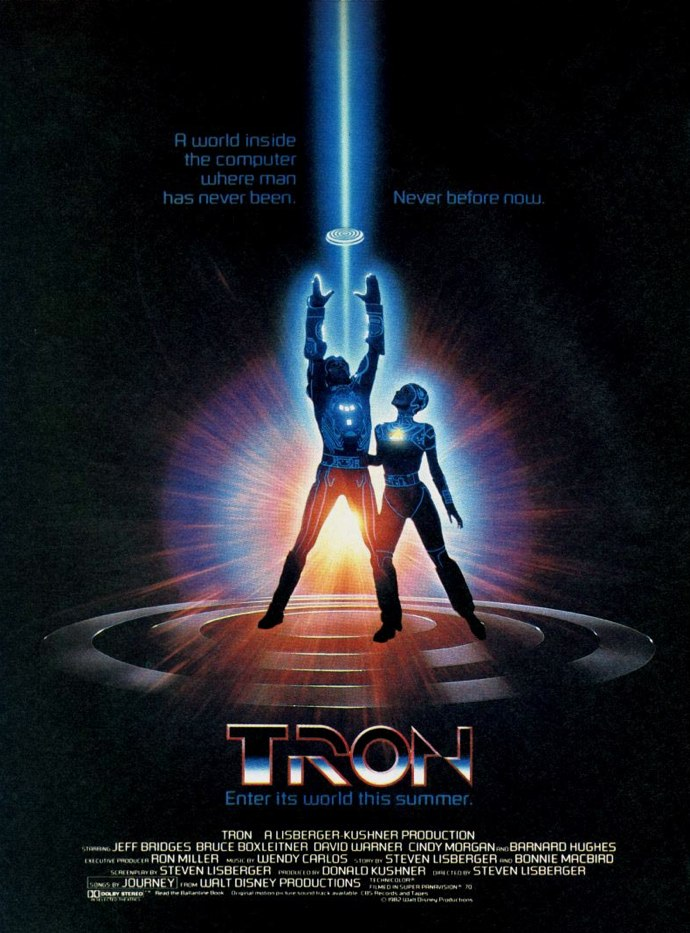
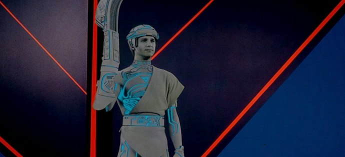

+++
type = "post"
titre = "<em>Tron</em>, Steven Lisberger"
title = "Tron, Steven Lisberger"
url = "/tron-lisberger"
date = "2010-12-25T00:39:19"
Lastmod = "2014-12-08T23:57:58"
cover = "tron-lisberger.jpg"
categorie = [ "À voir" ]
tag = [ "Culte", "Informatique", "Jeu vidéo", "Science-Fiction" ]
createur = [ "Steven Lisberger" ]
acteur = [ "Bruce Boxleitner", "David Warner", "Jeff Bridges" ]
annee = [ "1982" ]
weight = 1982
saga = [ "Tron" ]
pays = [ "États-Unis" ]

+++

Film culte pour tous les fans de science-fiction, <em>Tron</em> révolutionnait aussi le cinéma à sa sortie en 1982 en étant le premier à aller aussi loin dans les effets spéciaux créés par ordinateur. Si quelques films les avaient déjà exploités, notamment la trilogie <em>Star Wars</em>, on n&rsquo;avait encore jamais osé créer entièrement un monde par ordinateur. Un pari effectivement audacieux à une époque où les ordinateurs n&rsquo;avaient même pas la puissance d&rsquo;une calculatrice scientifique bas de gamme aujourd&rsquo;hui. Ces effets ont, bien évidemment, pris un sacré coup de vieux en pas loin de 30 ans, surtout depuis que l&rsquo;on sait ce qui nous attend avec <em><a href="http://www.allocine.fr/film/fichefilm_gen_cfilm=29233.html">Tron l&rsquo;héritage</a></em>, la suite qui sortira en France en février. Il est néanmoins très intéressant de retrouver aux origines et (re)découvrir un film qui, malgré les années, reste une référence en la matière.

Flynn est un programmeur. Il a développé plusieurs jeux vidéos qui connaissent énormément de succès, mais qui lui ont aussi été volés par Dillinger, son ancien employeur qui est devenu depuis un homme riche et puissant à la tête de la plus grosse entreprise de jeux vidéos. Flynn veut récupérer ses droits sur ses jeux et doit pour cela récupérer des documents prouvant sa paternité. Ces documents sont stockés dans l&rsquo;ordinateur de l&rsquo;entreprise en question et Flynn tente, en vain, d&rsquo;infiltrer cet ordinateur avec un programme qu&rsquo;il a conçu, CLU. Mais ce programme est constamment bloqué par le MCP (<em>Master Control Program</em>), une sorte de pare-feu qui est un ancien jeu d&rsquo;échec qui a évolué en programme extrêmement puissant et qui contrôle tout le système. Car, dans <em>Tron</em>, les programmes sont représentés comme des êtres vivants, avec d&rsquo;ailleurs le visage de leur concepteur. L&rsquo;ordinateur prend, quant à lui, la forme d&rsquo;un monde virtuel composé de formes géométriques, un monde dans lequel les programmes évoluent et éventuellement s&rsquo;affrontent. Le MCP veut prendre le contrôle et oublier les humains, leurs créateurs qu&rsquo;ils appellent utilisateurs. MCP a donc pris le pouvoir et détruit systématiquement tous les programmes qui refusent d&rsquo;adhérer à son dogme disant qu&rsquo;il n&rsquo;existe pas d&rsquo;utilisateurs et que ce n&rsquo;est qu&rsquo;une histoire inventée. Ces programmes sont détruits dans des jeux, parmi lesquels la course de <em>Light Cycle</em>, la séquence qui a rendu célèbre le film. Flyyn veut détruire le MCP et alors qu&rsquo;il s&rsquo;apprête à le faire à partir des ordinateurs de l&rsquo;entreprise de Dillinger, le MCP utilise un laser spécial pour le transformer en programme. Flynn est devenu un programme en apparence, mais doté de pouvoirs extraordinaires du fait de son statut d&rsquo;utilisateur et surtout de concepteur originel de l&rsquo;univers dans lequel il évolue. Mais comme on pouvait s&rsquo;en douter, sa quête pour détruire le MCP ne sera pas de tout repos et il aura notamment besoin de Tron, un autre programme qui donne son nom au film et dont l&rsquo;objectif même est de détruire le MCP.

Au cœur des enjeux de <em>Tron</em>, un thème extrêmement classique en science-fiction, sans doute même le thème le plus important avec la vie extra-terrestre : l&rsquo;intelligence artificielle. La fin des années 1970 correspond à l&rsquo;émergence de l&rsquo;informatique grand public. Les ordinateurs commencent doucement à quitter les universités, instituts d&rsquo;États ou grosses entreprises et ils commencent à se démocratiser alors que leur puissance explose. L&rsquo;idée même d&rsquo;une intelligence artificielle se diffuse en parallèle auprès du grand public : même si les ordinateurs sont encore en général assez limités, ils sont par exemple capables de calculer beaucoup plus vite et avec beaucoup moins d&rsquo;erreurs qu&rsquo;un homme. La <a href="http://fr.wikipedia.org/wiki/Loi_de_Moore">loi de Moore</a> énoncée au milieu des années 1960 se concrétise dans le matériel disponible et on imagine alors que bientôt, les ordinateurs seront bien plus puissants que les hommes et prendront le contrôle sur eux. Cette idée est ancienne : <a href="http://fr.wikipedia.org/wiki/Isaac_Asimov">Asimov</a> est sans doute parmi les premiers à l&rsquo;exploiter dans la littérature, tandis que <em><a href="http://fr.wikipedia.org/wiki/2001,_l'Odyssée_de_l'espace">2001, l&rsquo;Odyssée de l&rsquo;espace</a></em> la popularise au cinéma à la fin des années 1960. Ainsi, quand <em>Tron</em> sort au début des années 1980, l&rsquo;idée est loin d&rsquo;être nouvelle, mais c&rsquo;est peut-être le premier film à la rendre accessible au très grand public. Le film de Kubrick, par exemple, est beaucoup plus complexe, à la fois parce qu&rsquo;il était visuellement réaliste, mais aussi parce qu&rsquo;il prenait une voie que l&rsquo;on pourrait qualifier de métaphysique. Rien de cela dans ce film produit par les studios Walt Disney. L&rsquo;univers mis en place par Tron est au contraire très simple, voire simpliste. L&rsquo;idée de personnifier des programmes informatiques, concept qui est aujourd&rsquo;hui encore souvent mal compris et qui devait l&rsquo;être d&rsquo;autant plus en 1982, est une idée de génie pour permettre l&rsquo;identification immédiate des spectateurs. En outre, les enjeux dans <em>Tron</em> sont quand même globalement insignifiants. Rappelons que Flynn lutte pour récupérer des droits sur des jeux qu&rsquo;il a programmés. Le film est ainsi dans l&rsquo;ensemble très accessible, même pour un jeune public.

Malgré tout, et c&rsquo;est ce qui fait l&rsquo;intérêt de <em>Tron</em>, la science-fiction et l&rsquo;informatique ne sont ici qu&rsquo;un prétexte à une histoire extrêmement classique et universelle. C&rsquo;est d&rsquo;abord l&rsquo;histoire d&rsquo;un conflit entre deux hommes, Flynn et Dillinger, d&rsquo;un côté le jeune programmeur ancêtre du geek (le terme n&rsquo;était pas aussi répandu à l&rsquo;époque), de l&rsquo;autre l&rsquo;homme d&rsquo;affaires, avide de pouvoir et d&rsquo;argent et extrêmement ambitieux. L&rsquo;opposition est classique et se retrouve dans de nombreuses œuvres littéraires ou cinématographiques. Mais ce qui est très intéressant dans <em>Tron</em> et apparaît aujourd&rsquo;hui comme une anticipation assez brillante (mais sans doute involontaire), c&rsquo;est que les personnages réels ont tous un double virtuel dans le monde de l&rsquo;ordinateur, à la manière des avatars des mondes virtuels de jeux en ligne tels qu&rsquo;on les connaît bien aujourd&rsquo;hui. Dans <em>Tron</em>, l&rsquo;affrontement entre les deux avatars virtuels a un impact direct sur le monde réel, mais sous une forme finalement minime (un bout de papier). Au-delà de la lutte entre deux hommes, <em>Tron</em> exploite à son compte tout l&rsquo;imaginaire des totalitarismes. Le MCP n&rsquo;est qu&rsquo;une représentation de plus du totalitaire et évoque tantôt le nazisme hitlérien, tantôt le communisme stalinien. À cet égard, le choix d&rsquo;une symbolique de couleurs très simple, le rouge pour les méchants, le bleu pour les gentils, est significatif. On est là dans l&rsquo;opposition manichéenne entre bien et mal, avec une lutte de programmes entre eux pour le choix entre deux univers totalement différents, l&rsquo;un fermé et en opposition aux hommes, l&rsquo;autre ouvert et en dialogue avec les hommes. Si cette vision simpliste de l&rsquo;informatique peut faire sourire, elle ne doit pas occulter le fait qu&rsquo;il s&rsquo;agit là avant tout d&rsquo;une excuse pour des thèmes plus généraux sur l&rsquo;homme. Stanley Kubrick ne faisait pas autre chose avec son film, même si ses choix techniques radicalement différents ont permis au film de vieillir moins vite.

<em>Tron</em> est aussi un film culte par sa réalisation, tout simplement extraordinaire à l&rsquo;époque où il sortait. Jamais jusque-là on n’avait pu voir un univers composé par ordinateur, jamais aussi on n’avait vu de tels effets spéciaux. Le film a demandé le travail de quatre studios américains spécialisés dans les effets spéciaux et a obligé les équipes à inventer directement de nouvelles techniques pour répondre à des problèmes nouveaux. Le projet s&rsquo;est révélé logiquement plus coûteux que prévu et même si le budget de <em>Tron</em> est aujourd&rsquo;hui ridicule avec 17 millions de dollars (à comparer aux 150 millions de <em>Tron l&rsquo;héritage</em>…), c&rsquo;était déjà une belle somme pour l&rsquo;époque, même si les deux épisodes de <em>Star Wars</em> sortis à la même époque ont coûté le double. Le résultat est… étonnant. Visuellement, le film a moins bien vieilli que la prélogie de <em>Star Wars</em> que l&rsquo;on peut considérer de la même époque. La raison est assez simple : George Lucas a fait le choix de caser son univers de science-fiction dans des décors réels. Steven Lisberger était beaucoup plus ambitieux : toutes les scènes tournées dans l&rsquo;ordinateur ont été créées de toutes pièces. Même si les bonnes vieilles techniques ont toujours cours, notamment pour les éclairages (le fond vert magique utilisé aujourd&rsquo;hui dans tous les films à grand spectacle n&rsquo;existait pas encore), une bonne part a été réalisée grâce à l&rsquo;ordinateur. Les techniques restant limitées, cela se voit et les effets sont tout de même un peu kitsch. Mais le plus étonnant est sans doute l&rsquo;esprit dessin qui est omniprésent et qui se comprend sans peine quand on sait que <a href="http://fr.wikipedia.org/wiki/Jean_Giraud">Mœbius</a> a participé à la création graphique de l&rsquo;univers. Le film évoque aussi l&rsquo;univers de certains mangas ou autres films d&rsquo;animation asiatiques. L&rsquo;intégration des personnages, leurs têtes surtout, est assez grossière dans l&rsquo;ensemble, mais offre du coup un effet original qui fait sens si l&rsquo;on considère que l&rsquo;on est dans un univers informatique. Passé le premier choc, on s&rsquo;habitue vite à cet univers particulier, beaucoup plus original que le prochain <em>Tron</em>. Notons que la bande originale est aussi peu moderne et originale que celle composée par les Daft Punk. Un choix surprenant, mais qui est pour le coup plutôt un bon choix par rapport à une musique des années 1980 qui aurait, elle aussi, bien mal vieilli.

Critiquer à la fin 2010 un film de science-fiction sorti en 1982 est un exercice périlleux. Faut-il le juger à l&rsquo;aune de nos critères cinématographiques actuels, auquel cas <em>Tron</em> apparaît un film vieillot et bien peu intéressant, ou fait-il au contraire se replacer dans le contexte original où <em>Tron</em> était au contraire un film moderne et sans doute déjà trop complexe pour un grand public qui l&rsquo;a plutôt boudé (le film n&rsquo;ayant rapporté &laquo;&nbsp;que&nbsp;&raquo; 30 millions) ? (Re)voir aujourd&rsquo;hui <em>Tron</em> est surtout intéressant pour juger de <em>Tron l&rsquo;héritage</em> : à une époque où l&rsquo;informatique est entrée dans les mœurs et où même le plus simple des téléphones est encore beaucoup plus puissant que tout ce que l&rsquo;on pouvait imaginer pour le premier <em>Tron</em>, que reste-t-il à cette franchise ? La question est posée et j&rsquo;ai personnellement hâte de trouver une réponse avec le film de Joseph Kosinski. En attendant, <em>Tron</em> reste un classique de la science-fiction au cinéma et le film se regarde encore sans déplaisir, même s&rsquo;il accuse un peu le poids des années.

<em>Et joyeux Noël à tous !</em>

<h3>Vous voulez m&rsquo;aider ?</h3>
<ul>
<li><a href="http://www.amazon.fr/gp/product/B004EEO6BW/ref=as_li_ss_tl?ie=UTF8&#038;tag=leblogdenic07-21&#038;linkCode=as2&#038;camp=1642&#038;creative=19458&#038;creativeASIN=B004EEO6BW">Acheter le film en Blu-Ray sur Amazon</a></li>
<li><a href="http://www.amazon.fr/gp/product/B0008FDE9G/ref=as_li_ss_tl?ie=UTF8&#038;tag=leblogdenic07-21&#038;linkCode=as2&#038;camp=1642&#038;creative=19458&#038;creativeASIN=B0008FDE9G">Acheter le film en DVD sur Amazon</a></li>
</ul>

