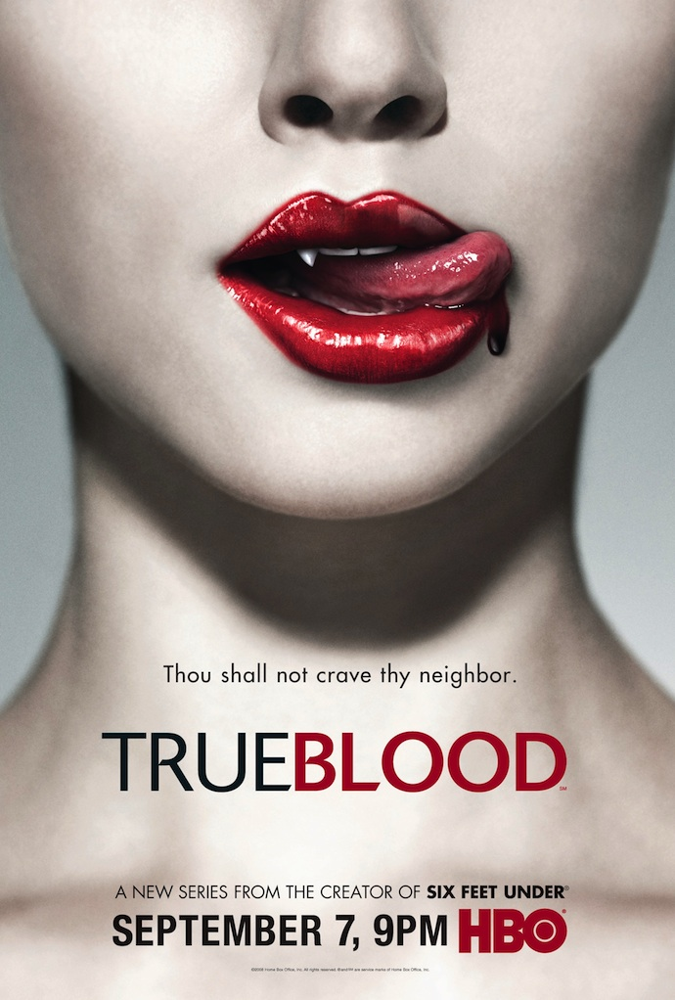
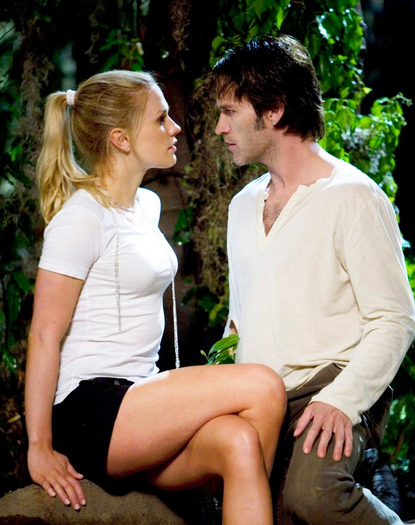
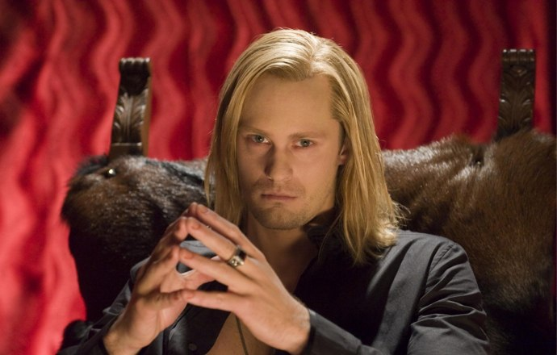
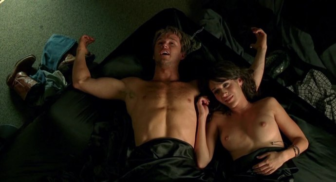

+++
type = "post"
titre = "True Blood saison 1, HBO"
title = "True Blood saison 1, HBO"
url = "/true-blood-saison-1-hbo"
date = "2010-07-04T23:06:26"
Lastmod = "2013-09-08T00:29:21"
cover = "true-blood-hbo.jpg"
categorie = [ "À voir" ]
tag = [ "Amour", "Horreur", "Serial-killer", "Série", "Société", "Vampires" ]
createur = [ "Alan Ball", "HBO" ]
annee = [ "2008" ]
weight = 2008
pays = [ "États-Unis" ]

+++

Alors que la série <em>Twilight</em> s&rsquo;apprête à devenir une trilogie au cinéma, il est important de se souvenir que les vampires n&rsquo;étaient pas, à l&rsquo;origine, un mythe tout mignon, canevas de bluettes dignes des meilleurs tomes de la série Arlequin. Au départ, il s&rsquo;agit plutôt de monstres sanguinaires et effrayants, prêts à tuer impitoyablement le premier humain venu. Mais le vampire est aussi un être affublé d&rsquo;une sexualité légendaire et la morsure a rapidement été identifiée à l&rsquo;acte sexuel, la pénétration étant associée elle aussi au sang. Twilight n&rsquo;a gardé que le folklore et utilise le mythe vampire de manière rétrograde en faisant l&rsquo;apologie d&rsquo;une sexualité limitée au strict nécessaire et donc au mariage.

<em>True Blood</em> est la dernière création du génial Alan Ball, auteur de la meilleure série de tous les temps (<em>Six Feet Under</em> bien sûr). C&rsquo;est aussi une série de la chaîne HBO réputée pour la très grande qualité de ses séries. Après avoir regardé la première saison de <em>True Blood</em>, je peux le dire : enfin des vampires sérieux qui passent leur temps à s&rsquo;envoyer en l&rsquo;air ! À ne pas rater, sauf si la simple vue du sang vous fait défaillir.

<em>True Blood</em> semble avoir comme mot d&rsquo;ordre de pervertir l&rsquo;histoire de <em>Twilight</em>. Les mêmes ingrédients de base sont là : une jeune fille &laquo;&nbsp;différente&nbsp;&raquo; (Sookie) et un beau et ténébreux vampire (Bill), les dangers de la morsure du vampire, l&rsquo;amour fou et impossible, mais si fort qu&rsquo;il renverse tous les obstacles… Les points communs ne manquent pas, d&rsquo;autant que <em>True Blood</em> reprend l&rsquo;idée de <em>Twilight</em> de moderniser les vampires, sans aller aussi loin que ce dernier d&rsquo;ailleurs. Tout le décorum traditionnel est présent : les vampires craignent la lumière du soleil, meurent uniquement quand on leur plante un pieu dans le corps (autrement, ils sont immortels), l&rsquo;argent les brule et ils sont très forts et régénèrent très vite. La série fait sien le mythe et l&rsquo;adapte à sa guise : si les vampires tiennent des bars et réclament des droits civiques, ils restent marqués par de vieux principes, comme une structure hiérarchique très marquée où la possession d&rsquo;un humain empêche les autres vampires de le toucher et où un vampire ne peut entrer dans une maison sans une invitation explicite de son propriétaire. Intelligemment, les concepteurs de la série ont fait de certaines traditions (comme l&rsquo;ail ou l&rsquo;eau bénite) des mythes inventés par les vampires, tandis que d&rsquo;autres (l&rsquo;argent notamment) sont réellement nocifs.

Le premier épisode de la série rappelle vraiment l&rsquo;univers de <em>Twilight</em>, avec la même scène de coup de foudre entre les deux tourtereaux, la même découverte d&rsquo;un monde en partie vampirisé avec les mêmes conflits entre les hommes et les vampires. Même le concept amusant de vampire végétarien imaginé dans <em>Twilight</em> est présent dans <em>True Blood</em> sauf qu&rsquo;au lieu de boire le sang d&rsquo;animaux, les vampires végétariens boivent du sang chimique qui s&rsquo;achète en bouteilles et se boit après quelques secondes au micro-ondes pour atteindre la température du sang humain. Le récit de cette première saison se déroule ensuite autour du couple qui apprend à se découvrir. Pour maintenir le suspense de bout en bout, les scénaristes ont imaginé une histoire plus ou moins policière autour d&rsquo;une série de meurtres, mais elle n&rsquo;apporte pas grand-chose. L&rsquo;essentiel reste le couple amoureux avec également un troisième larron pour former le traditionnel triangle amoureux. S&rsquo;il ne s&rsquo;agit pas exactement d&rsquo;un loup-garou, ce prétendant fou amoureux de Sookie n&rsquo;est pas &laquo;&nbsp;normal&nbsp;&raquo; non plus comme on finit par le découvrir. Je n&rsquo;en dis pas plus, mais <em>Twilight</em> et <em>True Blood</em> ont tellement en commun que l&rsquo;on jurerait qu&rsquo;il s&rsquo;agit du même scénario.

Avec tant de points communs entre les deux, on pouvait s&rsquo;attendre à ce que <em>True Blood</em> ne soit qu&rsquo;une version longue de <em>Twilight</em>. Rien de bien réjouissant donc, quand on a subi les interminables deux premiers films des aventures de Bella et Edward. Sauf que <em>True Blood</em> n&rsquo;a absolument rien à voir, mais alors rien du tout. La différence tient en quatre lettres : sexe, ou encore sang. La jeune fille est certes également innocente dans la série de HBO puisque Sookie est vierge au départ. Mais elle est plus vieille que Bella et cela se sent : on n&rsquo;est plus dans un univers adolescent où les parents doivent être consultés pour pouvoir sortir avec son amoureux, mais on est entre adultes consentants. Cela se voit : le sexe est une thématique centrale de la série, à tel point que la regarder en public est presque gênant… Un sexe sous toutes ses formes, du classique duo hétérosexuel et humain au vampire homosexuel, en passant par toutes les combinaisons et mélanges possibles. Et contrairement à <em>Twilight</em>, les héros n&rsquo;attendent pas la fin de la série ou le mariage pour consommer. Cette présence du sexe qui manque tant aux films de vampires à la mode change la donne. En effet, le sang des vampires a un effet énorme sur les humains, comme du Viagra, mais bien plus puissant. Le &laquo;&nbsp;V&nbsp;&raquo; est alors recherché par bon nombre d&rsquo;humains, tout comme les vampires cherchent le sang humain. La boucle est bouclée et je trouve cette idée vraiment excellente je trouve puisqu&rsquo;elle annule l&rsquo;opposition systématique et lassante entre humains et vampires. Finalement, les deux groupes recherchent la même chose, pouvoir vivre à fond, sans être inquiété par l&rsquo;autre groupe.

<em>True Blood</em> est aussi marquée par une violence sanguinaire. Qui dit vampire dit sang et la série respecte tout à fait ce principe. Le sang est ici partagé en deux grandes catégories : celui des humains et celui des vampires. Les deux sont recherchés par le groupe inverse pour des raisons de survie (même si le sang synthétique change largement la donne) ou par plaisir sexuel, comme on l&rsquo;a déjà évoqué. Le sang coule aussi abondamment, ne serait-ce que parce que cette saison est parcourue d&rsquo;une série de meurtres. Le plus impressionnant reste néanmoins les morts de vampires par plantage de pieu : le corps explose alors et projette des bouts de chair sanguinolente à travers la pièce et ne laisse qu&rsquo;une masse de chairs, de sang et de vêtements. Avis aux amateurs de films d&rsquo;horreur, <em>True Blood</em> offre de belles scènes bien sales et très réussies. Les concepteurs de la série s&rsquo;en sont donné à cœur joie pour faire tripatouiller la chair par ses acteurs. Disons-le, le résultat est très réussi. On voit les bouts dégouliner, c&rsquo;est dégoutant à souhait&#8230; Le sang est également lié à l&rsquo;acte sexuel comme on peut s&rsquo;en douter et les plongées des dents de vampires dans les cous des jeunes filles sont profonds et sanglants. Toutes les femmes de Bon-Temps rêvent, plus ou moins secrètement de se faire mordre par un vampire tant ils sont censés assurer au lit.

Au-delà du sang et du sexe, voire des deux en même temps, <em>True Blood</em> ménage une vraie dimension sociale et politique. La série se déroule dans La Nouvelle-Orléans, lieu qui concentre, au moins symboliquement, tous les maux des États-Unis. Ce choix n&rsquo;est évidemment pas anodin : même si la série n&rsquo;est pas politique, elle fait place à des thématiques sociales par le biais des vampires. Ces derniers sont le symbole de la minorité opprimée et oppressante à la fois. Minorité visible depuis peu, elle cherche à obtenir des droits équivalents aux humains, notamment en ce qui concerne le mariage. Un lobby vampire agit dans ce sens, tandis que divers lobbys le plus souvent religieux s&rsquo;opposent aux vampires en reprenant des arguments habituels sur la dangerosité d&rsquo;êtres diaboliques et en usant jusqu&rsquo;à la corde des thèmes sécuritaires. On ne peut que penser à plusieurs minorités, la plus évidente étant sans doute les homosexuels qui revendiquent tout autant l&rsquo;égalité des droits et l&rsquo;accès au mariage tandis que les groupes religieux condamnent leurs pratiques jugées déviantes. Cette association est d&rsquo;autant plus évidente que le générique montre une pancarte qui indique &laquo;&nbsp;<em>GOD HATES FANGS</em>&nbsp;&raquo; (&laquo;&nbsp;<em>fangs</em>&nbsp;&raquo; étant la canine des vampires et donc par analogie, les vampires) qui évoque immanquablement &laquo;&nbsp;<em>fags</em>&laquo;&nbsp;, terme péjoratif qui désigne les homosexuels (équivalent de notre &laquo;&nbsp;pédé&nbsp;&raquo;). On comprend alors pourquoi un des personnages secondaires de la série est un homme ouvertement gay…

Mais au-delà du mouvement gay et lesbien, les vampires symbolisent la différence, l&rsquo;anormalité qui explose au sein d&rsquo;une société normée. Comme on l&rsquo;a dit, l&rsquo;intérêt de <em>True Blood</em> est que les vampires ne sont pas simplement des victimes, mais aussi des bourreaux qui attaquent régulièrement des humains. Le mouvement n&rsquo;est d&rsquo;ailleurs pas homogène, mais il est au contraire divisé en plusieurs mouvements, certains prônant l&rsquo;intégration parmi les humains quand d&rsquo;autres revendiquent au contraire le droit à la différence et veulent vivre librement leur vampirisme en mordant tous les humains croisés. La série gagne ainsi en richesse et en réalisme : les vampires ne sont que des humains qui ont malencontreusement rencontré le chemin d&rsquo;un vampire et se sont transformés à leur tour en vampires. Ils sont donc marqués par les mêmes faiblesses que les humains, les mêmes conflits d&rsquo;intérêts, les mêmes différences entre faibles et puissants… Outre que le spectateur peut aisément s&rsquo;identifier à eux (d&rsquo;autant qu&rsquo;ils sont totalement humains en apparence, nonobstant les canines bien sûr), cette proximité les rend plus proches des hommes, suffisamment en tout cas pour essayer de s&rsquo;intégrer. Et, logiquement, réclamer des droits. Suffisamment proche aussi pour inquiéter les mâles qui domine depuis toujours la société et qui ne voient pas d&rsquo;un très bon œil l&rsquo;arrivée d&rsquo;êtres au moins aussi intelligents qu&rsquo;eux et beaucoup plus fort. Fondamentalement, ils se sentent en concurrence avec les vampires et c&rsquo;est bien ça, le problème numéro un vis-à-vis des vampires.

Comme dans toutes les séries de la chaîne HBO, les sujets ne sont que des prétextes pour parler de sujets plus généraux. Quand <em>Six Feet Under</em> évoquait la famille, <em><a href="http://voiretmanger.fr/2010/05/10/deadwood-hbo/">Deadwood</a></em> la constitution d&rsquo;une société moderne, <em>True Blood</em> évoquerait plutôt la démocratie américaine dans sa diversité, source de richesse et en même temps de tension. Le cloisonnement sociologique qui marque la société américaine se retrouve dans cette petite ville rurale perdue dans l&rsquo;immensité du territoire. Une société fermée qui reste &laquo;&nbsp;entre soi&nbsp;&raquo; depuis la nuit des temps (les vieux évoquent la voix chargée d&rsquo;émotions la guerre d&rsquo;Indépendance), mais qui est aussi marquée par une diversité exacerbée, des vampires aux polymorphes, jusqu&rsquo;à l&rsquo;héroïne différente parce qu&rsquo;elle entend les pensées des gens autour d&rsquo;elle. <em>True Blood</em> cède un peu à la mode des représentants des minorités visibles avec des Noirs et un Hispanique notamment, même si Alan Ball n&rsquo;est pas tombé dans le piège en nuançant ces genres. Une autre thématique essentielle est la présence de la religion et le retour des intégrismes. Un aspect très présent dans la série, quoique le plus souvent en arrière-plan, par les informations télévisées. Une secte anti-vampires fait néanmoins son entrée au cours de la saison et on comprend sans peine qu&rsquo;elle prendra du pouvoir dans la suite de la série. On ne peut qu&rsquo;y voir un parallèle avec le pouvoir grandissant des sectes diverses et variées qui sévissent aux États-Unis.

Nous voilà rendus bien loin de la bluette entre l&rsquo;adolescence et un vampire. Mais <em>True Blood</em> n&rsquo;oublie pas le premier degré au profit de lectures politiques ou sociologiques et propose une histoire pleine de rebondissements, où la recherche de l&rsquo;assassin est un sujet central et où l&rsquo;on découvre une galerie de personnages secondaires réjouissants. Cette première saison ne donne sans doute pas le maximum du matériau de <em>True Blood</em>, mais offre une belle introduction à un univers original, à la fois proche et différent du nôtre. J&rsquo;ai entendu dire que la série prenait son envol au cours de la seconde saison et je veux bien le croire, la chaîne ayant l&rsquo;habitude de proposer des séries en ascension sur le plan qualitatif. Il ne me reste plus qu&rsquo;à suivre les prochaines aventures de Sookie et Bill pour le savoir !

<object width="690" height="413" classid="clsid:d27cdb6e-ae6d-11cf-96b8-444553540000" codebase="http://download.macromedia.com/pub/shockwave/cabs/flash/swflash.cab#version=6,0,40,0"><param name="allowFullScreen" value="true" /><param name="allowscriptaccess" value="always" /><param name="src" value="http://www.youtube.com/v/Wet5OM7RR8Q&amp;hl=fr_FR&amp;fs=1?rel=0&amp;hd=1" /><param name="allowfullscreen" value="true" /><embed width="690" height="413" type="application/x-shockwave-flash" src="http://www.youtube.com/v/Wet5OM7RR8Q&amp;hl=fr_FR&amp;fs=1?rel=0&amp;hd=1" allowFullScreen="true" allowscriptaccess="always" allowfullscreen="true" /></object>

Je m&rsquo;en voudrais de parler de <em>True Blood</em> sans évoquer le générique. Comme dans toutes ses séries, HBO a mis le paquet en proposant, comme toujours, un assemblage d&rsquo;images qui résument l&rsquo;esprit de la série sur une musique qui constitue à elle seule une raison supplémentaire en faveur de la série. Le résultat est réjouissant et on regrette d&rsquo;autant plus que la saison ne dure que le temps de 12 épisodes tant on pourrait regarder ce court générique encore et encore. Pour le plaisir, je vous le propose en version complète. Regardez bien, on retrouve tout, le sang, le sexe, les Églises, la haine de l&rsquo;autre, mais aussi le bayou de La Nouvelle-Orléans qui compose une partie des paysages du film. Ce petit assemblage est vraiment un bijou et même s&rsquo;ils se ressemblent tous dans l&rsquo;esprit chez HBO, c&rsquo;est toujours un plaisir de les retrouver dans leurs séries, comme une signature et un gage de qualité.

Sans atteindre le niveau de <em>Six Feet Under</em> (mais est-ce seulement possible ?), cette première saison offre un avant-goût prometteur de cet univers sanguinolent. J&rsquo;attends beaucoup des saisons suivantes, mais jusque-là je fais totalement confiance à HBO et Alan Ball… beaucoup plus qu&rsquo;à <em>Twilight 3</em> en tout cas !

<h3>Vous voulez m&rsquo;aider ?<a href="#footnote_0_3587" id="identifier_0_3587" class="footnote-link footnote-identifier-link" title="&Agrave; propos de la publicit&eacute;&hellip;">1</a></h3>
<ul>
<li><a href="http://www.amazon.fr/gp/product/B003EURAOC/ref=as_li_ss_tl?ie=UTF8&#038;tag=leblogdenic07-21&#038;linkCode=as2&#038;camp=1642&#038;creative=19458&#038;creativeASIN=B003EURAOC">Acheter la saison en Blu-Ray sur Amazon</a></li>
<li><a href="http://www.amazon.fr/gp/product/B002NRBY1M/ref=as_li_ss_tl?ie=UTF8&#038;tag=leblogdenic07-21&#038;linkCode=as2&#038;camp=1642&#038;creative=19458&#038;creativeASIN=B002NRBY1M">Acheter la saison en DVD sur Amazon</a></li>
<li><a href="http://itunes.apple.com/fr/tv-season/true-blood-saison-1-vost/id361390588">Acheter la saison sur l&rsquo;iTunes Store</a></li>
</ul>

<ol class="footnotes"><li id="footnote_0_3587" class="footnote"><a href="http://voiretmanger.fr/soutien/">À propos de la publicité…</a> [<a href="#identifier_0_3587" class="footnote-link footnote-back-link">&#8617;</a>]</li></ol>
