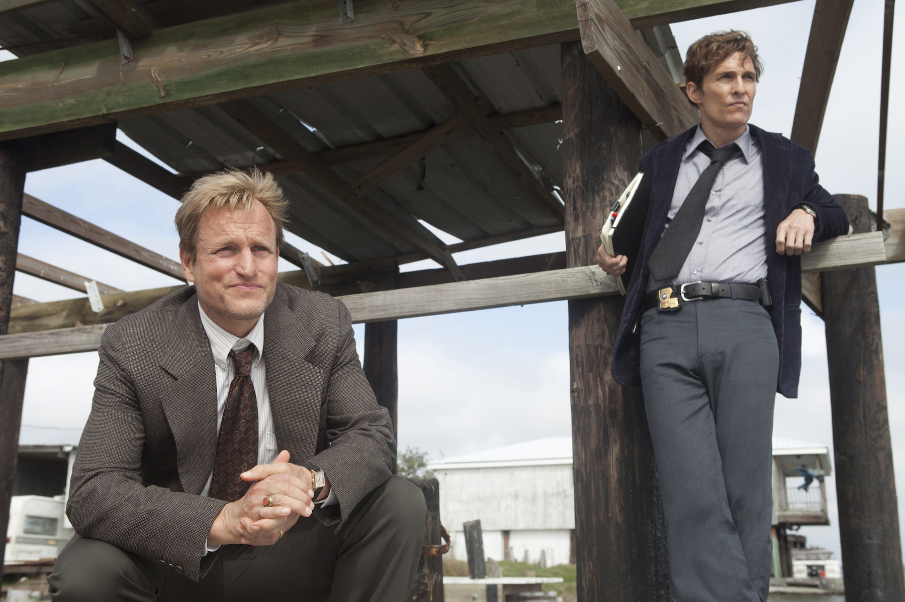
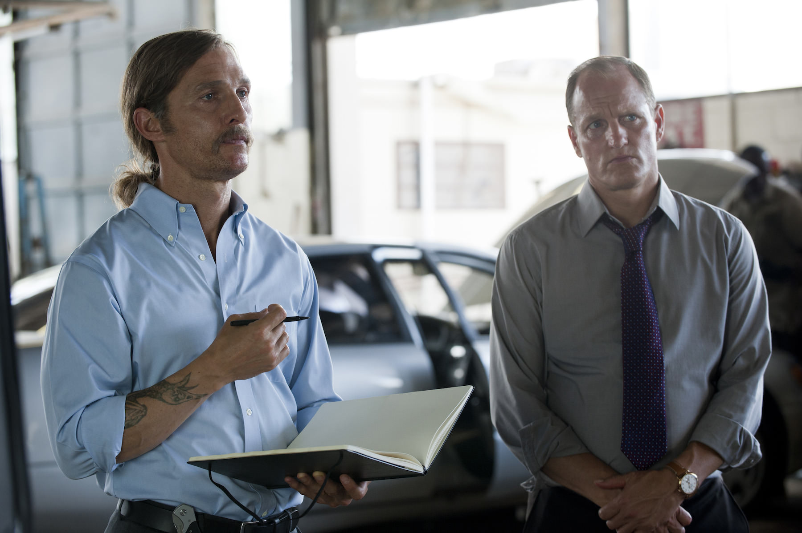
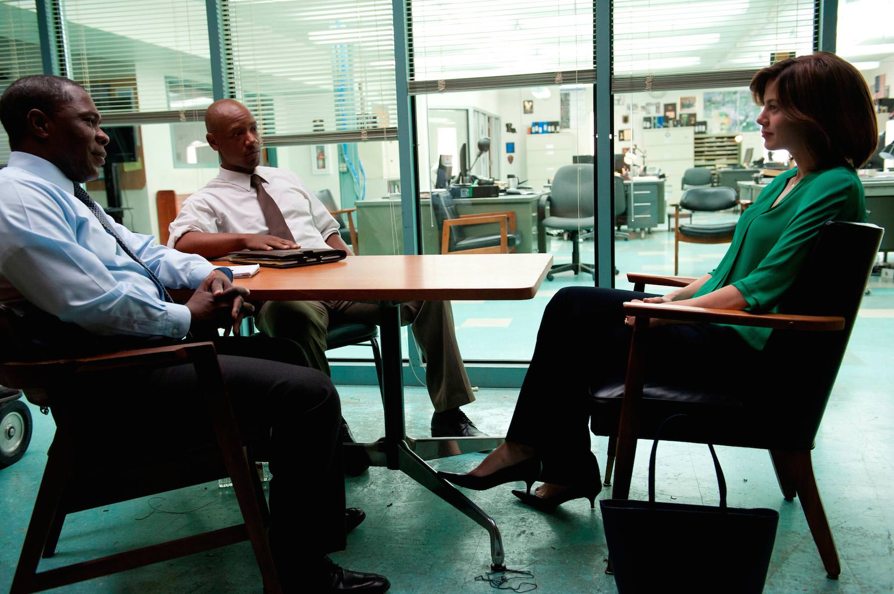

+++
titre = "<em>True Detective</em>, Nic Pizzolatto (HBO)"
title = "True Detective, Nic Pizzolatto (HBO)"
url = "/true-detective-pizzolatto-hbo"
date = "2014-03-29T10:49:01"
Lastmod = "2014-08-27T22:56:13"
cover = "true-detective-pizzolatto-harrelson-mcconaughey.jpg"
categorie = [ "À voir" ]
tag = [ "Drame", "Mort", "Police", "Religion", "Serial-killer", "Série", "Thriller" ]
createur = [ "HBO", "Nic Pizzolatto" ]
acteur = [ "Matthew McConaughey", "Michael Potts", "Michelle Monaghan", "Tory Kittles", "Woody Harrelson" ]
annee = [ "2014" ]
weight = 2014
pays = [ "États-Unis" ]

+++

Plus qu’une série, <em>True Detective</em> s’est rapidement imposée comme un phénomène. Sur le papier, cette série policière située en Louisiane dans les années 1990 n’a rien de bien nouveau, mais Nic Pizzolatto a su aller bien au-delà de la production habituelle du genre. Avec un duo de détectives atypiques, avec une histoire qui sait rester longtemps mystérieuse et surtout avec une mise en scène qui fait la part belle à l’ambiance, les huit épisodes de la première saison ont suffi à instituer quasiment une légende. Entièrement réalisée par Cary Fukunaga, la série fait preuve d’une cohérence interne exceptionnelle, à tel point que l’on a plus le sentiment de voir un long-métrage de huit heures, un sentiment renforcé par les moyens mis en œuvre. HBO opte pour un format différent, mais ne remet pas en cause ses exigences de production et le résultat est indéniablement à la hauteur des attentes. <em>True Detective</em> est une série à ne rater sous aucun prétexte, même si vous n’aimez pas tellement les séries policières en général.

Dès les premières minutes du premier épisode, <em>True Detective</em> impose son rythme et un ton à part. Plutôt que de simplement raconter une enquête policière, et même si c’est le principal élément dans la saison, le scénario imagine une double temporalité. L’action principale se déroule au milieu des années 1990, mais le présent de la série est contemporain : Rust Cohle et Martin Hart, deux détectives de la police de Louisiane, ont enquêté en 1995 sur une série de meurtres dans l’État. En 2012, un nouveau meurtre très similaire à ceux sur lesquels ils avaient enquêté les convoque au commissariat. Ils ne sont pas suspectés, mais les policiers qui leur ont succédé aimeraient en savoir plus sur cette enquête qui avait fait beaucoup de bruit, quinze ans auparavant. C’est ainsi que Nic Pizzolatto raconte l’enquête originale, par une série de flashbacks racontés par chaque détective, l’un après l’autre. Cette idée n’a rien du caprice du scénariste qui ne veut pas faire comme tout le monde, elle permet d’emblée de montrer l’évolution des personnages. Quand l’enquête commence, les deux détectives viennent juste d’être associés en partenaires et l’enquête débute alors qu’ils apprennent à se connaître. Le duo de <em>True Detective</em> est atypique, dans le sens où Rust et Martin n’ont rien, mais absolument rien en commun. Le premier est un célibataire endurci, un asocial aux idées très tranchées, notamment sur la religion, quand le second est un père de famille tout à fait banal. Les relations entre les deux sont assez électriques, mais Rust est un excellent détective et c’est lui qui permet à l’enquête d’avancer quasiment à chaque fois. Martin voit l’opportunité pour sa carrière et il s’accommode tant bien que mal de ce partenaire qui ne lui plait pas vraiment. En 2012, on sent très vite que de l’eau a coulé sous le pont et que les deux anciens partenaires ne s’entendent plus du tout comme avant. La bonne idée de Nic Pizzolatto est de garder au maximum les informations sur ce qui s’est réellement passé. On comprend dès le départ qu’ils ne s’entendent plus, on ne comprendra que tardivement pourquoi.

Même si <em>True Detective</em> est une série policière, l’enquête à proprement parler n’est pas le plus important. De fait, c’est peut-être même l’élément le plus faible de cette série : on nous vend dans un premier temps un meurtre très mystérieux, l’enquête nous emmène ensuite sur des pistes énormes qui impliqueraient les dirigeants locaux, mais la résolution — que l’on se gardera bien de dévoiler — est assez décevante en comparaison. Quand cette première saison se termine, on peut se demander « tout ça pour ça ? », mais ce n’est pas vraiment un problème. Au-delà de la résolution de l’intrigue, qui est sans conteste importante malgré tout, on apprécie d’abord la série pour l’ambiance de la Louisiane et pour ses deux personnages principaux. Les amateurs de série policière seront peut-être un peu déçus, mais <em>True Detective</em> cherche à renouveler le genre et Nic Pizzolatto apporte incontestablement une âme supplémentaire, une profondeur scénaristique que l’on n’avait pas l’habitude de voir dans les autres productions du genre. On est tellement pris par l’histoire et par l’ambiance poisseuse que c’est sans conteste une réussite sur ce point, une réussite qui est d’abord due aux deux acteurs. Tout à la fois devant les caméras et producteurs, Woody Harrelson et Matthew McConaughey forment un couple de policiers délicieusement différents. Leur duo fonctionne à la merveille, à tel point que la saison et ses huit épisodes terminés, on a le sentiment étrange de l’avoir toujours connu. Chacun est dans un registre bien particulier, mais ils forment une paire vraiment réussie et le succès de <em>True Detective</em> leur doit beaucoup, même s’il convient aussi de saluer la réalisation. Contrairement à la majorité des séries actuelles, tous les épisodes de celle-ci sont réalisés par le même homme : Cary Fukunaga. Même s’il a à son actif deux longs-métrages, il se fera surtout connaître avec ce travail où il a pu profiter des ambiances naturelles de la Louisiane pour créer un mystère que l’on qualifierait de poisseux. C’est comme si le meurtrier n’était pas, au fond, un individu, mais la région tout entière. Un sentiment assez fort, pour une image souvent très belle.

<em>True Detective</em> fonctionne sur le principe de saisons indépendantes, comme <a href="http://voiretmanger.fr/american-horror-story-murphy-falchuck/" title="American Horror Story, Ryan Murphy et Brad Falchuk (FX)"><em>American Horror Story</em></a>. Après cette première saison en Louisiane, la suite est prévue dans un autre contexte et avec d’autres acteurs. On quitte à regret Woody Harrelson et Matthew McConaughey, mais confiants dans l’avenir de la série. Nic Pizzolatto a dépoussiéré la série policière de la meilleure façon et le résultat est excellent, tout simplement. Après ce premier essai réussi, on a hâte de découvrir ce que les scénaristes nous réservent. Et d’ici là, ne ratez pas cette saison de <em>True Detective</em>, c’est une vraie réussite !

<h3>Vous voulez <a href="http://voiretmanger.fr/soutien/">m&rsquo;aider</a> ?</h3>
<ul>
<li><a href="http://www.amazon.fr/gp/product/B00I7VMJCQ/ref=as_li_ss_tl?ie=UTF8&amp;tag=leblogdenic07-21&amp;linkCode=as2&amp;camp=1642&amp;creative=19458&amp;creativeASIN=B00I7VMJCQ">Acheter la série en Blu-ray sur Amazon</a></li>
<li><a href="http://www.amazon.fr/gp/product/B00I7VMIC2/ref=as_li_ss_tl?ie=UTF8&amp;tag=leblogdenic07-21&amp;linkCode=as2&amp;camp=1642&amp;creative=19458&amp;creativeASIN=B00I7VMIC2">Acheter la série en DVD sur Amazon</a></li>
</ul>

