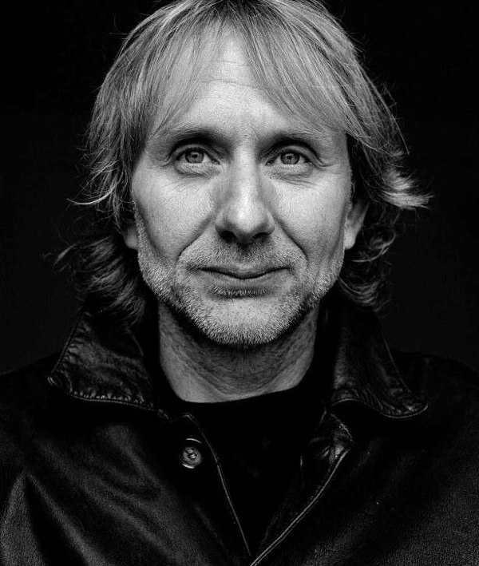
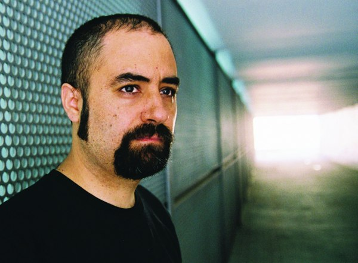
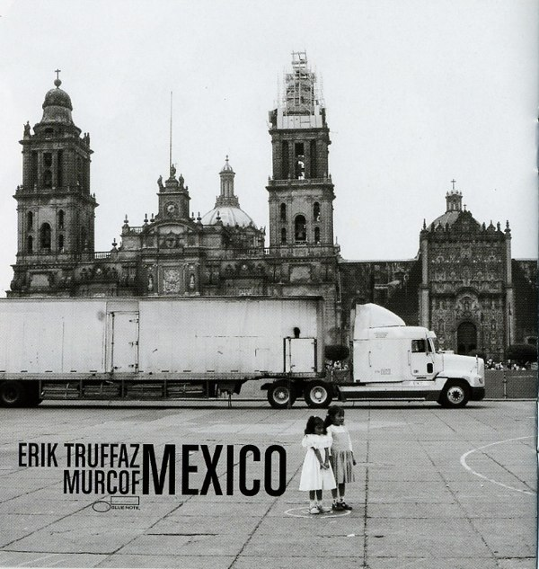
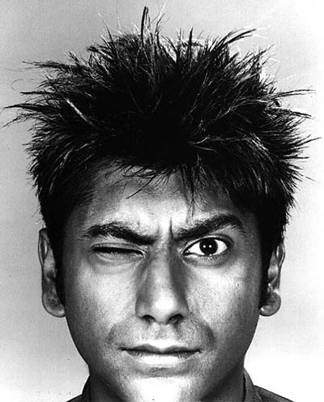

+++
titre = "Truffaz, Murcof et Singh à la Cité de la Musique"
title = "Truffaz, Murcof et Singh à la Cité de la Musique"
url = "/truffaz-murcof-singh-cite-musique"
date = "2009-04-17T00:38:11"
Lastmod = "2010-02-03T11:05:24"
cover = "erik-truffaz.jpg"
categorie = [ "À voir… en live" ]
tag = [ "Cité de la Musique", "Concert", "Électronique", "Jazz" ]
createur = [ "Talvin Singh" ]
annee = [ "2009" ]
weight = 2009
pays = [ "France" ]

+++

Ce soir, ce fut concert à la Cité de la Musique, pour un trio pour le moins étonnant composé de trois musiciens fort différents. Aux côtés du trompettiste de jazz Erik Truffaz se tenaient en effet Murcof, artiste mexicain que Wikipedia classe dans l&rsquo;<a href="http://fr.wikipedia.org/wiki/Electronica">electronica</a> (pourquoi pas ?) et Talvin Singh qui jouait ce soir des <a href="http://fr.wikipedia.org/wiki/Tabla">Tablas</a> (percussions indiennes), mais qui semble être un artiste assez divers, avec également une casquette de DJ. Bref, un trio improbable pour un excellent concert de jazz, s&rsquo;il fallait le classer.

Au premier abord, cette alliance de musiciens venus d&rsquo;horizons divers peut étonner. Elle ne semble pas si atypique quand on connaît un peu Erik Truffaz, un musicien à la carrière pour le moins complexe, commençant avec du jazz assez traditionnel avant de le mêler, au fil des albums, à tous les genres possibles et imaginables, du rock à l&rsquo;électronique en passant par le rap. C&rsquo;est un vrai artiste touche-à-tout, que j&rsquo;avais déjà vu lors de la tournée suivant la sortie de <em>The Walk of The Giant Turtle</em>, soit pendant sa période rock. Le mélange de sonorités jazz et rock, avec une part importante laissée aux guitares, m&rsquo;avait alors semblé très réussi. Depuis, il mélange encore et toujours, compose avec les musiques orientales puis, sur son dernier album, avec Murcof.

J&rsquo;ai découvert Murcof par hasard, d&rsquo;ailleurs je ne sais même plus comment au juste. Quelqu&rsquo;un en avait sans doute parlé quelque part&#8230; Toujours est-il que j&rsquo;ai récupéré son premier album, <em>Martes</em>, et que je suis immédiatement tombé sous le charme de cette musique électronique basée sur l&rsquo;ambiance, une musique électronique, mais qui n&rsquo;était pas prévue pour danser (ce qui était nouveau à mes oreilles), une musique très belle, bref une bonne musique. Quand j&rsquo;ai vu qu&rsquo;il avait collaboré avec Truffaz sur le dernier album de ce dernier, j&rsquo;étais plutôt ravi. Et le résultat est à la hauteur de mes attentes, la trompette de Truffaz s&rsquo;intègre parfaitement aux samples de Murcof, comme si c&rsquo;était naturellement sa place.

Tout ça pour dire que j&rsquo;attendais avec impatience ce concert. Je ne fus pas déçu, même si le démarrage a été un peu lent à mon goût. En fait, le concert a commencé par les trois morceaux qui composent la trilogie Mexico du dernier album de Truffaz. Pour bien connaître ces trois morceaux, ils ont été repris quasiment à la note près par la trompette et le chef d&rsquo;orchestre virtuel mexicain. Talvin Singh apportait de temps en temps une pointe d&rsquo;originalité, mais on est resté très près des albums.

Ça n&rsquo;est pas un défaut en soi bien sûr, cet album étant excellent. Néanmoins, en concert, cela n&rsquo;est pas passé aussi bien que sur l&rsquo;album, et je dois dire que mes paupières se sont un peu alourdies au cours de ces premiers morceaux.

Ce fut, néanmoins, l&rsquo;occasion d&rsquo;observer aussi attentivement que possible (on était assez loin de la scène) le maître de l&rsquo;electronica (puisque c&rsquo;est de cela qu&rsquo;il s&rsquo;agit) s&rsquo;activer derrière son écran et ses diverses machines. Truffaz a glissé au détour d&rsquo;un commentaire qu&rsquo;il gérait trente pistes en simultanée, ce qui me semble tout bonnement impressionnant. Évidemment, tous les samples étaient déjà enregistrés, mais son travail reste essentiel puisqu&rsquo;il peut, via son système informatique, les réorganiser, les faire intervenir ou non. Quand on connaît bien les titres sur album, il est assez fascinant d&rsquo;écouter les différences, parfois subtiles, qu&rsquo;il introduit. Un vrai travail d&rsquo;orfèvre&#8230;

Fort heureusement, le concert a vite changé de direction par la reprise de titres de Murcof en majorité, mais aussi de Truffaz. Ce choix s&rsquo;est révélé heureux puisque nos trois compères ont été comme libérés par ce choix et se sont plus lâchés en improvisations, le nerf de tout concert de jazz. Les dialogues entre chaque &laquo;&nbsp;instrument&nbsp;&raquo; se sont multipliés et le concert a alors gagné en intensité et en intérêt. Manifestement, les musiciens ont pris beaucoup de plaisir à jouer ensemble, et ils n&rsquo;ont pas été radins et l&rsquo;ont partagé avec le public. Talvin Singh est vraiment excellent avec ses Tablas, Truffaz excelle comme d&rsquo;habitude avec sa trompette, et Murcof a proposé une performance sans faille. À certains moments, l&rsquo;union entre les trois était parfaite et c&rsquo;était assez magique.

Pour toutes ces raisons, je maintiens que l&rsquo;on avait affaire, lors de ce concert, à un trio de jazz comme ce genre en connaît tant. Des percussions, une trompette et, en guise de contrebasse, Murcof qui a hérité du rôle traditionnellement dévolu à cet instrument, à savoir composer une trame sonore pour accompagner le trio. En général, c&rsquo;était ainsi Murcof qui plantait le décor, si j&rsquo;ose dire (sa musique est tellement visuelle&#8230;), avant d&rsquo;être rejoint par ses deux compagnons.

Mais comme dans un trio plus classique, chaque élément était essentiel et en enlever un seul aurait conduit à l&rsquo;écroulement de l&rsquo;ensemble. On a eu droit à quelques périodes de solo, mais régnait plutôt ce soir le jeu en commun. Truffaz, modeste comme toujours, s&rsquo;est néanmoins mis en retrait à plusieurs reprises pour laisser jouer les deux autres.

En définitive, ce concert fut clairement un excellent concert, quoiqu&rsquo;un peu court, dommage. Je me demandais ce que Murcof donnerait en live, eh bien c&rsquo;est très bien même si je pense qu&rsquo;il vaut mieux qu&rsquo;il soit accompagné, seul je ne vois pas bien comment cela pourrait fonctionner, d&rsquo;autant que le bonhomme semble peu bavard (c&rsquo;est peu dire). La trompette de Truffaz semble n&rsquo;avoir eu d&rsquo;autres buts dans la vie que d&rsquo;accompagner la musique de Murcof, l&rsquo;alliance est vraiment réussie. Et la participation de Talvin Singh apporte indéniablement quelque chose qui manquerait en son absence&#8230;

Si vous avez l&rsquo;occasion de les voir, n&rsquo;hésitez pas. Nous étions assis juste derrière Christophe, preuve qu&rsquo;il a de bons goûts et que le concert vaut la peine, non ? (oui bon, c&rsquo;est la note people finale&#8230;)

