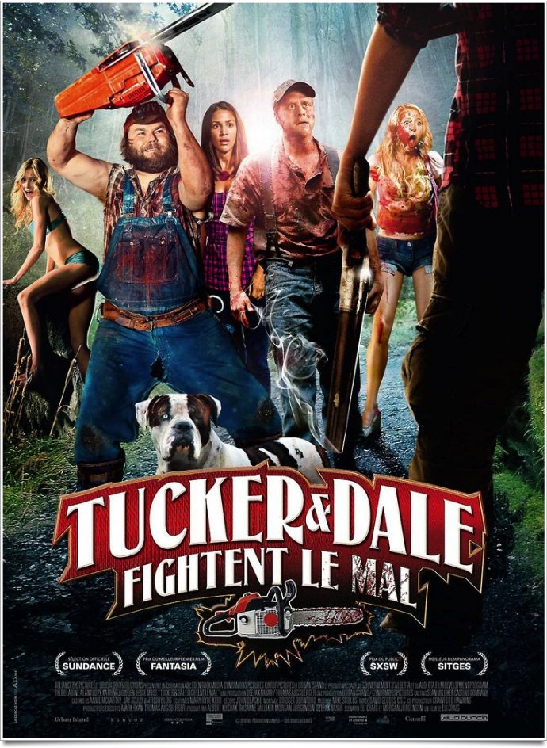
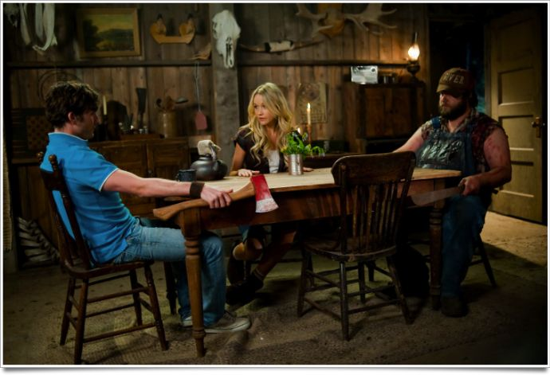

+++
type = "post"
titre = "Tucker &#038; Dale fightent le mal, Eli Craig"
title = "Tucker &#038; Dale fightent le mal, Eli Craig"
url = "/tucker-dale-fightent-mal-craig"
date = "2012-02-04T17:54:55"
Lastmod = "2012-07-04T08:09:17"
cover = "craig-tucker-dale-fightent-mal.jpg"
categorie = [ "À voir" ]
tag = [ "Comédie", "Gore", "Horreur", "Parodie", "Suspense" ]
createur = [ "Eli Craig" ]
acteur = [ "Alan Tudyk", "Tyler Labine" ]
annee = [ "2012" ]
weight = 2012
pays = [ "États-Unis" ]

+++

Les titres sont très importants au cinéma comme ailleurs et celui-ci devrait malheureusement faire fuir quelques spectateurs. <em>Tucker &amp; Dale fightent le mal</em> (<em>Tucker &amp; Dale vs Evil</em> en version originale, c&rsquo;est tout de suite mieux) mérite mieux que son titre particulièrement mauvais pourtant. Le premier film d&rsquo;Eli Craig est en apparence un film d&rsquo;horreur assez classique, mais en apparence seulement. Il s&rsquo;agit finalement d&rsquo;une comédie gore plutôt drôle et réussie, malgré un final en demi-teinte.

Prenez une bande d&rsquo;étudiants venus pour un week-end de camping dans l&rsquo;Amérique la plus profonde. Ils sont jeunes, ils sont forcément beaux avec une poitrine généreuse ou des pecs bien formés selon les cas. Dans la forêt profonde où ils viennent camper vivent également, prenez également deux types nécessairement un peu louches. Ils sont au moins rustres et tranchent avec les jeunes manifestement urbains. Ces derniers se méfient immédiatement des deux hommes quand ils les croisent à une station de service. Par un singulier manque de chance, ils vont camper tout près de la maison de vacances des deux compères. Le massacre va pouvoir commencer…

La bonne idée de <em>Tucker &amp; Dale fightent le mal</em> est de jouer avec les attentes du public. Dès le départ, Tucker et Dale sont identifiés inconsciemment par le spectateur comme de dangereux psychopathes et la première image que le film offre n&rsquo;est guère rassurante. On comprend toutefois très vite qu&rsquo;ils sont inoffensifs : la première rencontre à la station est l&rsquo;occasion d&rsquo;un malentendu puisque Dale veut juste engager la conversation avec une charmante jeune fille, mais ils se donnent des airs de serial-killer. Il est vrai qu&rsquo;y aller avec une faux n&rsquo;était pas la meilleure idée, indéniablement. Le film d&rsquo;Eli Craig repose tout entier sur ce principe bien connu des dramaturges classiques : le quiproquo. Quoi que fassent les deux héros, les étudiants comprendront toujours qu&rsquo;ils sont en danger et répondront en conséquence. <em>Tucker &amp; Dale fightent le mal</em> est un <a href="http://fr.wikipedia.org/wiki/Slasher">slasher</a>, les morts pleuvent, mais ce n&rsquo;est aucunement un film d&rsquo;horreur. Tucker comme Dale ne comprennent pas pourquoi tous ces jeunes cherchent absolument à se suicider et quasiment toutes les morts sont en fait accidentelles. Le spectateur est mis d&rsquo;emblée dans la confidence, on est dans une comédie après tout, mais même s&rsquo;il n&rsquo;y a du coup pas vraiment de suspense, le film reste très efficace. Il est court (moins d&rsquo;1h30) et intense et on y retrouve le plaisir de la saga <em><a href="http://voiretmanger.fr/2011/09/03/destination-finale-5-quale/">Destination Finale</a></em> : de quelle manière stupide vont mourir tous ces personnages ?

<em>Tucker &amp; Dale fightent le mal</em> ne brille pas par la finesse de ses personnages ou de son scénario, ce n&rsquo;est pas son objectif. Eli Craig propose malgré tout un divertissement bien ficelé et efficace : l&rsquo;opposition entre les deux &laquo;&nbsp;bouseux&nbsp;&raquo; un peu bourrus et les jeunes venus de la ville est efficace, même si elle a déjà été vue. Dans le groupe d&rsquo;étudiants, il ne manque pas la blondasse et ses talons aiguilles parfaitement inadaptés à la forêt. Tucker et Dale de leur côté font tout pour avoir l&rsquo;air de psychopathes et la peur des jeunes peut facilement se comprendre. L&rsquo;ensemble est assez drôle et on passe un bon moment. <em>Tucker &amp; Dale fightent le mal</em> surprend malgré tout avec le personnage de Dale, qui est sans aucun doute le personnage le plus travaillé sur le plan psychologique dans le film. Maladif timide, souffrant d&rsquo;un complexe d&rsquo;infériorité écrasant, il a tout du balourd un peu stupide, du garçon de ferme gentil, mais pas bien malin. Il se révèle au cours du film bien plus riche que cela : Dale est en fait beaucoup plus intelligent et capable qu&rsquo;il ne le croit, il a notamment une redoutable mémoire qui lui permet de tout retenir. Surprise, la plus belle fille du groupe sur laquelle il flache d&rsquo;emblée l&rsquo;accepte comme il est et se met même à l&rsquo;apprécier, voire plus si affinité. Cette histoire d&rsquo;amour qui conduit à une fin un brin trop mielleuse pour un film d&rsquo;horreur, fût-il parodique, est toutefois une vraie surprise dans <em>Tucker &amp; Dale fightent le mal</em>.

Eli Craig n&rsquo;est pas encore un cinéaste reconnu, mais son premier long-métrage est plutôt prometteur. <em>Tucker &amp; Dale fightent le mal</em> est un film simple, mais bien filmé avec une ambiance façon films d&rsquo;horreur réussie. On sent que le film n&rsquo;a pas été réalisé avec de gros moyens techniques, mais ce n&rsquo;est jamais gênant et le résultat est très agréable à regarder. Le film peine manifestement à trouver son public — il est terminé depuis 2010 —, mais il mériterait à être plus connu. Espérons que ce succès mitigé ne découragera pas Eli Craig de se remettre derrière la caméra : de la comédie efficace, mais plus fine que cela que l&rsquo;on a l&rsquo;habitude de voir au cinéma américain, on en redemande.

<em>Tucker &amp; Dale fightent le mal</em> est un petit film, certes, mais ce n&rsquo;est en rien une critique. Eli Craig parvient à créer une belle ambiance d&rsquo;horreur tout en proposant une comédie qui parodie les films de genre et qui reprend avec succès la bonne vieille méthode du quiproquo. Un film gore (interdit aux moins de 12 ans à raison) à ne pas rater si vous aimez le genre : il est parfait pour une petite séance sympa !

<h3>Vous voulez m&rsquo;aider ?<a href="#footnote_0_5641" id="identifier_0_5641" class="footnote-link footnote-identifier-link" title="&Agrave; propos de la publicit&eacute;&hellip;">1</a></h3>
<ul>
<li><a href="http://www.amazon.fr/gp/product/B007UPIIQG/ref=as_li_ss_tl?ie=UTF8&#038;tag=leblogdenic07-21&#038;linkCode=as2&#038;camp=1642&#038;creative=19458&#038;creativeASIN=B007UPIIQG">Acheter le film en Blu-Ray sur Amazon</a></li>
<li><a href="http://www.amazon.fr/gp/product/B007UPIJ74/ref=as_li_ss_tl?ie=UTF8&#038;tag=leblogdenic07-21&#038;linkCode=as2&#038;camp=1642&#038;creative=19458&#038;creativeASIN=B007UPIJ74">Acheter le film en DVD sur Amazon</a></li>
<li><a href="http://itunes.apple.com/fr/movie/tucker-dale-fightent-le-mal/id534132680">Acheter ou louer le film sur l&rsquo;iTunes Store</a></li>
</ul>

<ol class="footnotes"><li id="footnote_0_5641" class="footnote"><a href="http://voiretmanger.fr/soutien/">À propos de la publicité…</a> [<a href="#identifier_0_5641" class="footnote-link footnote-back-link">&#8617;</a>]</li></ol>
