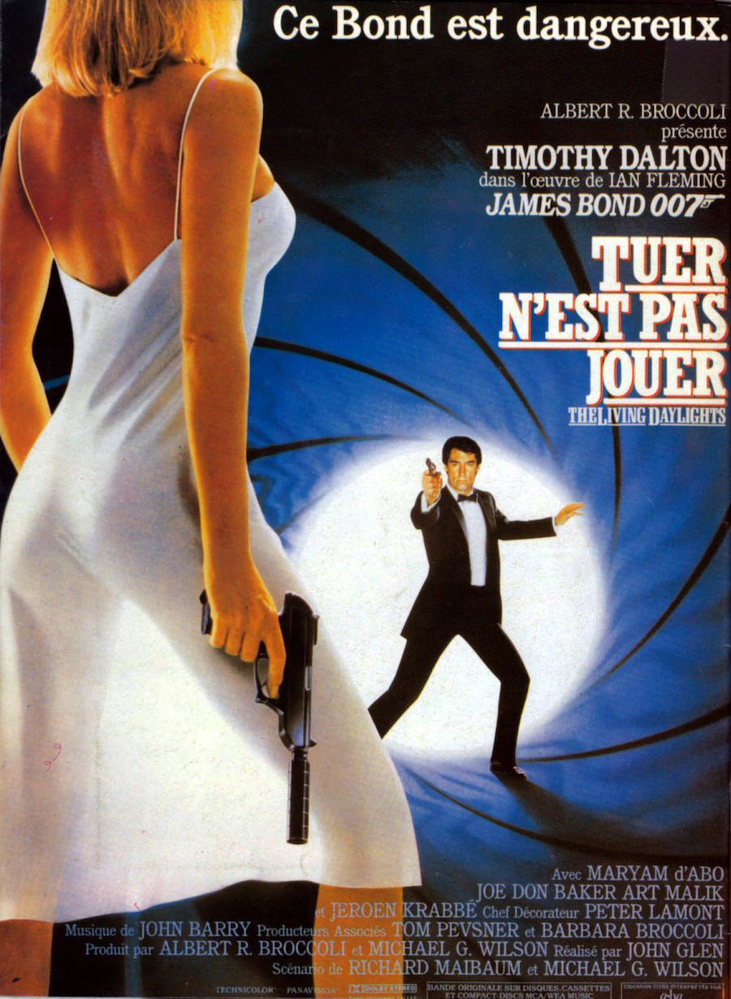
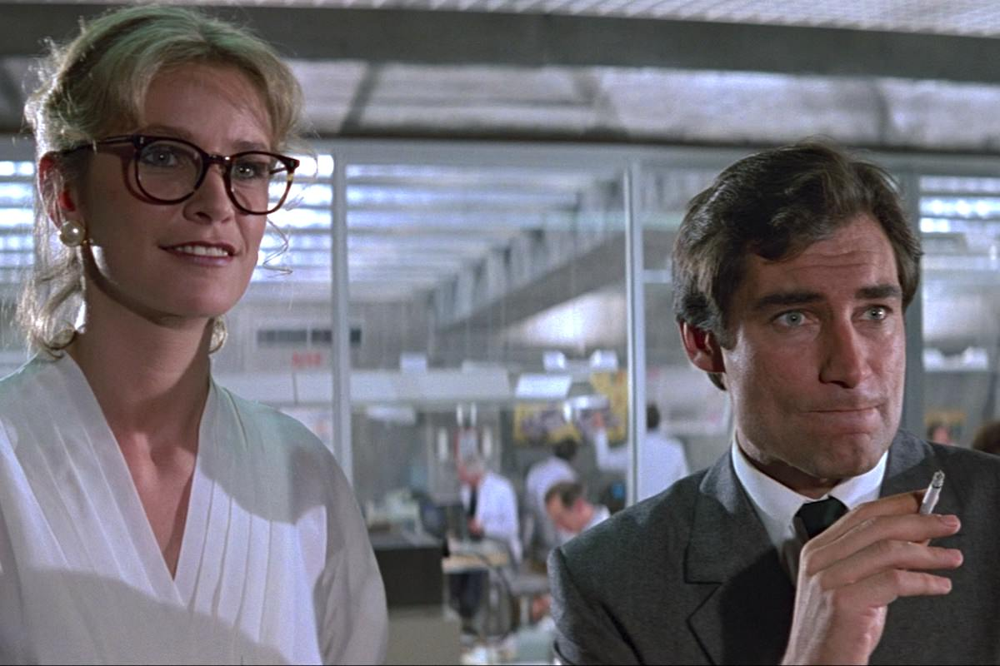
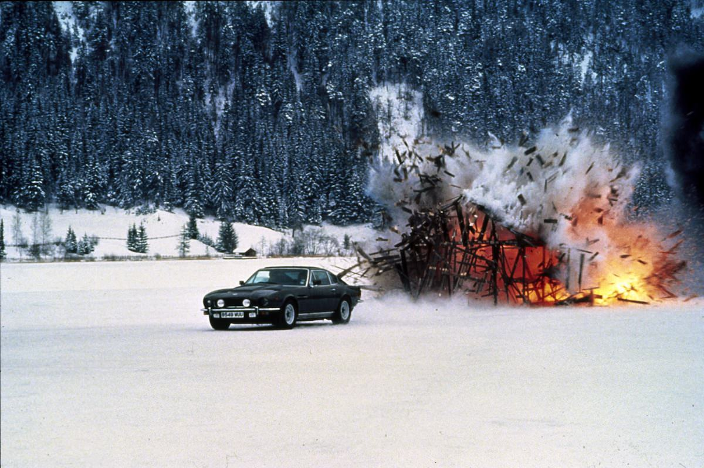

+++
titre = "<em>Tuer n&rsquo;est pas jouer</em>, John Glen"
title = "Tuer n'est pas jouer, John Glen"
url = "/tuer-pas-jouer-glen"
date = "2013-03-31T09:58:25"
Lastmod = "2013-05-11T09:54:40"
cover = "tuer-n-est-pas-jouer-thimoty-dalton-glen.jpg"
categorie = [ "À voir" ]
tag = [ "Action", "Blockbuster", "Espionnage", "James Bond" ]
createur = [ "John Glen" ]
acteur = [ "Desmond Llewelyn", "Jeroen Krabbe", "John Rhys-Davies", "Maryam D'Abo", "Robert Brown", "Timothy Dalton" ]
annee = [ "1987" ]
weight = 1987
saga = [ "James Bond" ]
pays = [ "États-Unis" ]
original = "The Living Daylights"

+++

Sans être un désastre financier, <a href="http://voiretmanger.fr/2013/03/24/dangereusement-votre-glen/" title="Dangereusement vôtre, John Glen - À voir et à manger"><em>Dangereusement vôtre</em></a> signe la nécessaire fin de l’ère Roger Moore pour la saga. Pour la troisième fois de son histoire, il faut un nouveau visage pour James Bond, ce qui est évidemment un risque important pour cette saga, d’autant que Roger Moore a réussi à imposer sa lecture de l’agent secret et le grand public associe désormais l’acteur au personnage. Comment lui donner un successeur capable de le faire oublier ? C’est tout l’enjeu de <em>Tuer n’est pas jouer</em> et le quinzième épisode doit en plus créer une rupture, réinventer le mythe 007 et sortir d’une formule sans doute un peu trop vue. L’équipe technique reste en place et John Glen signe ici son cinquième long-métrage d’affilée, mais le nécessaire renouveau est au rendez-vous. Thimoty Dalton compose un nouveau James Bond jamais vu jusque-là et sa composition moderne et jeune fait mouche : <em>Tuer n’est pas jouer</em> est un excellent épisode, divertissant et prenant. 

« <em>Ce Bond est dangereux</em> » clame l’affiche du film, reconnaissant implicitement que le précédent ne l’était pas. Le message est en tout cas très clair : l’agent 007 cuvée 1987 est différent et il est plus méchant ! John Glen a la lourde tâche d’introduire, encore une fois, un nouveau James Bond et il profite de la séquence avant le générique à cet effet. <em>Tuer n’est pas jouer</em> ouvre dans un avion militaire, avec M qui fait un briefing à une poignée d’hommes en combinaison. On apprend vite que ce sont tous les agents 00 et que le MI6 a été choisi pour un exercice à Gibraltar. Le spectateur se doute d’emblée que l’exercice ne se déroulera pas tout à fait comme prévu et cela ne manque pas : tous les agents secrets se font tuer, à l’exception de l’un d’entre eux qui parvient non seulement à s’échapper, mais en plus à arrêter le meurtrier. Quand la séquence se termine, il atterrit sur un yacht au large de Gibraltar, juste à côté d’une belle femme à qui il dit se nommer « <em>Bond. James Bond.</em> » : voilà pour l’introduction, avec tous les codes de la séduction appelés en renfort pour poser correctement le personnage. 

Timothy Dalton est bien décidé à interpréter à sa manière le plus fameux agent secret et il propose ainsi un rôle beaucoup plus sombre qu’avant. Fini l’agent amusé et souvent amusant de son prédécesseur, place à un James Bond qui évoque plutôt celui de Daniel Craig, quelques années plus tard. Même s’il reste quelques touches de second degré dans <em>Tuer n’est pas jouer</em>, on sent très clairement que la saga passe à autre chose. Dans le même ordre d’idée, le personnage est moins coureur de jupons, puisqu’il ne couche qu’avec deux femmes et respecte pendant la majeure partie du film l’intimité de Kara, la principale James Bond girl de cet épisode. Leur histoire d’amour est d’ailleurs touchante, comme on n’en avait pas vu sans doute depuis <a href="http://voiretmanger.fr/2013/01/27/au-service-secret-de-sa-majeste-hunt/" title="Au service secret de sa Majesté, Peter Hunt - À voir et à manger"><em>Au service secret de sa Majesté</em></a>. Au passage, le James Bond de Timothy Dalton n’est pas si différent de celui de George Lazenby, même si les deux acteurs sont physiquement très différents, mais on retrouve un traitement assez proche, plus réaliste notamment. Le James Bond de <em>Tuer n’est pas jouer</em> est plus débrouillard, il ne dépend souvent que de lui-même, même si les gadgets font leur grand retour. L’agent doit toutefois réagir rapidement et prendre ses propres décisions, tandis que ses hésitations par rapport à ses ordres sont également assez modernes. 

Avec <em>Tuer n’est pas jouer</em>, la rupture n’a pas lieu qu’avec le personnage principal de la saga, elle est aussi scénaristique. Les producteurs mettent un terme, au moins temporairement, aux méchants aux ambitions planétaires souvent assez peu crédibles, au profit d’un méchant pour le moins surprenant dans <em>James Bond</em>. Brad Whitaker est un vendeur d’armes un peu louche, mais il est surtout américain : pour la première fois dans toute la saga, un Américain est un méchant. Au-delà de cette originalité, il faut noter les efforts des scénaristes pour complexifier l’intrigue du long-métrage. Comme James Bond, le spectateur est un peu perdu au départ et si on sent bien que la mission est trop simple pour ne pas cacher quelque chose, on n’a aucun moyen de savoir ce qu’il en retourne exactement. John Glen a réussi par la suite à dérouler un scénario beaucoup plus complexe qu’il n’y paraissait au premier abord sans jamais nous perdre et même avec une simplicité apparente très réussie. Les motifs des ennemis sont beaucoup plus simples, mais aussi plus réalistes et cette histoire de trafic de drogue fonctionne vraiment bien, d’autant qu’elle se déroule au cœur de l’Afghanistan, une région déjà complexe en ces années de fin de Guerre froide. <em>Tuer n’est pas jouer</em> se joue d’ailleurs astucieusement des attentes du public en inversant en quelque sorte les rôles traditionnels. Ici, l’URSS a le beau rôle et sa participation du côté des méchants n’est pas volontaire. Une bonne idée, surtout qu’en 1987, la situation géopolitique change rapidement. 

<em>Tuer n’est pas jouer</em> revient également à une formule à l’ancienne et le film de John Glen semble chercher du côté de la période Sean Connery. Ce retour est d’abord symbolique : ce sont les gadgets qui reviennent en force et avec eux, la mythique Aston Martin. Délaissée depuis <em>Au Service de sa Majesté</em> au profit d’autres marques, la V8 utilisée dans le film est non seulement magnifique, elle est aussi bardée de technologies mises au point par Q. Le savant un peu fou du Mi6 toujours interprété par un Desmond Llewelyn qui joue de son âge dans une scène a intégré un lance-missiles et un système d’auto-destruction, mais aussi, plus originaux, deux skis sur le côté et même un astucieux laser qui vient découper la voiture d’à côté. Ces gadgets font le retour le temps d’une scène très impressionnante, mais ils sont utilisés avec parcimonie dans <em>Tuer n’est pas jouer</em>, sans doute pour éviter les errements de la saga à la fin des années 1960 et notamment ceux de <a href="http://voiretmanger.fr/2013/02/03/les-diamants-sont-eternels-hamilton/" title="Les diamants sont éternels, Guy Hamilton - À voir et à manger"><em>Les diamants sont éternels</em></a>. John Glen qui en est à son quatrième <em>James Bond</em> n’a plus rien à prouver et il est ici à nouveau extrêmement efficace, avec un blockbuster impressionnant, mais qui a su conserver la marque de la saga. Les effets spéciaux, notamment pyrotechniques, ont fait des progrès et même si les fonds peu réalistes font de la résistance en voiture, l’ensemble a progressé sur le plan qualitatif. Il convient aussi de saluer la <a href="http://www.amazon.fr/gp/product/B000087DT7/ref=as_li_ss_tl?ie=UTF8&#038;tag=leblogdenic07-21&#038;linkCode=as2&#038;camp=1642&#038;creative=19458&#038;creativeASIN=B000087DT7">bande originale</a>, à nouveau composée par John Barry et qui réussit cette fois parfaitement la fusion entre la musique traditionnelle de la saga et celle des années 1980. C’est un peu kitsch comme le veut l’époque, mais c’est aussi ce qui fait son charme…

À défaut d’être le meilleur épisode de la saga, <em>Tuer n’est pas jouer</em> est un très bon épisode, rythmé, musclé et bien mené. John Glen s’en sort très bien d’un scénario plus complexe qu’il en a l’air et on retrouve avec plaisir une certaine ambiance qui avait disparu avec Roger Moore. Ce quinzième épisode relance la saga sur de bonnes bases, mais le public ne suit pas totalement. Timothy Dalton est malgré tout rappelé pour un second épisode deux ans plus tard… <em>James Bond</em> peut repartir !

<strong>James Bond reviendra dans… <em>Permis de tuer</em></strong>

<h3>Vous voulez m’aider ?<a href="#footnote_0_8728" id="identifier_0_8728" class="footnote-link footnote-identifier-link" title="&Agrave; propos de la publicit&eacute;&hellip;">1</a></h3>
<ul>
<li><a href="http://www.amazon.fr/gp/product/B00AOALXTI/ref=as_li_ss_tl?ie=UTF8&#038;tag=leblogdenic07-21&#038;linkCode=as2&#038;camp=1642&#038;creative=19458&#038;creativeASIN=B00AOALXTI">Acheter le film en Blu-Ray sur Amazon</a></li>
<li><a href="http://www.amazon.fr/gp/product/B000NJM5V0/ref=as_li_ss_tl?ie=UTF8&#038;tag=leblogdenic07-21&#038;linkCode=as2&#038;camp=1642&#038;creative=19458&#038;creativeASIN=B000NJM5V0">Acheter le film en DVD sur Amazon</a></li>
<li><a href="https://itunes.apple.com/fr/movie/tuer-nest-pas-jouer-living/id562209400">Acheter ou louer le film sur l’iTunes Store</a></li>
</ul>
<ul>
<li><a href="http://www.amazon.fr/gp/product/B008U6R9B4/ref=as_li_ss_tl?ie=UTF8&amp;tag=leblogdenic07-21&amp;linkCode=as2&amp;camp=1642&amp;creative=19458&amp;creativeASIN=B008U6R9B4">Acheter la trilogie complète en Blu-Ray sur Amazon</a></li>
<li><a href="http://www.amazon.fr/gp/product/B008U6R93C/ref=as_li_ss_tl?ie=UTF8&amp;tag=leblogdenic07-21&amp;linkCode=as2&amp;camp=1642&amp;creative=19458&amp;creativeASIN=B008U6R93C">Acheter la trilogie complète en DVD sur Amazon</a></li>
</ul>

<ol class="footnotes"><li id="footnote_0_8728" class="footnote"><a href="http://voiretmanger.fr/soutien/">À propos de la publicité…</a> [<a href="#identifier_0_8728" class="footnote-link footnote-back-link">&#8617;</a>]</li></ol>
