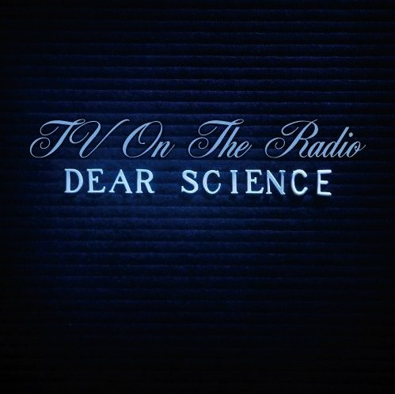

+++
type = "post"
titre = "TV on the Radio &#8211; Dear Science"
title = "TV on the Radio &#8211; Dear Science"
url = "/tv-on-the-radio-dear-science"
date = "2008-10-05T14:45:55"
Lastmod = "2013-01-27T19:58:20"
cover = "tv-on-the-radio1.jpg"
categorie = [ "Musique" ]
tag = [ "Mélange", "Rock" ]
createur = [ "TV on the Radio" ]
annee = [ "2008" ]
weight = 2008
pays = [ "États-Unis" ]

+++

TV On The Radio n&rsquo;est pas un groupe nouveau dans le monde musical, le groupe étant né en 2001. Mais c&rsquo;est un groupe resté globalement inconnu du grand public, même si chaque album a été un succès critique et a obtenu une reconnaissance du milieu, et d&rsquo;abord celle de David Bowie, rien que ça. Ce dernier, à la sortie du premier album, a même déclaré que ses deux groupes préférés étaient TV on the Radio et Arcade Fire. D&rsquo;emblée, on le voit, la barre est placée très haut. Et en effet, on peut se demander pourquoi ce groupe n&rsquo;a jamais connu, à ce jour, de réel succès alors qu&rsquo;un groupe comme Arcade Fire rassemble des foules immenses.

Il est vrai que la musique de ce groupe new-yorkais n&rsquo;est pas d&rsquo;approche aisée. Leurs mots d&rsquo;ordre serait sans doute l&rsquo;innovation et le mélange à outrance, mais aussi la perfection en terme de réalisation. Ainsi, leur musique est plutôt du genre fouillée, et se base sur le mélange de genres très variés tel que le post-punk, le free jazz, la soul ou encore la musique électronique<a href="#footnote_0_770" id="identifier_0_770" class="footnote-link footnote-identifier-link" title="Je me contente de citer Wikipedia, &eacute;tant tr&egrave;s peu &agrave; l&rsquo;aise moi-m&ecirc;me avec les genres&hellip;">1</a>. Leur troisième album, <em>Return to Cookie Mountain</em> présentait tous ces attributs : on passait, d&rsquo;un titre à l&rsquo;autre mais parfois même à l&rsquo;intérieur d&rsquo;un titre, d&rsquo;une ambiance à une autre, parfois deux ambiances très différentes. De ce fait, il est difficile de classer ce groupe sous une étiquette générique. Ce groupe est loin d&rsquo;être un groupe uni par un membre un peu dominant qui donnerait une ligne commune, ou par une ligne commune acceptée par tous les membres. Loin de cela, les cinq artistes derrière ce groupes proviennent d&rsquo;horizon très différents et apportent une vision musicale très différente au groupe. Mais surtout, aucun d&rsquo;eux n&rsquo;a la priorité sur les autres : chaque membre du groupe doit être entièrement satisfait avec une chanson, faute de quoi elle était remisée au placard ou refaite, jusqu&rsquo;à obtenir la satisfaction de tous. Ceci explique à la fois la diversité de chaque album mais aussi un certain perfectionnisme dans une architecture musicale complexe.

Car il faut bien parler d&rsquo;architecture à propos des morceaux de TV on the Radio. Chaque morceau est une pièce d&rsquo;orfèvre réalisée avec soin par l&rsquo;ajout de couches musicales superposées les unes sur les autres, jamais artificiellement cependant mais pour donner quelque chose d&rsquo;assez magique, de &laquo;&nbsp;naturel&nbsp;&raquo; même. Touffus, les disques de TV on the Radio ne se découvrent pas à la première écoute mais progressivement, au fil des écoutes, et paraissent toujours plus évident. Cependant, cette complexité qui peut tendre par moment à l&rsquo;obscurité avait de quoi gêner et on comprend dès lors pourquoi ce groupe est resté globalement anonyme.

Le dernier album du groupe, <em>Dear Science</em>, introduit une rupture nette tout en restant clairement et sans conteste un album de TV on the Radio. Mais le groupe, après le précédent album, a vu deux alternatives : soit continuer dans la voie ouverte par <em>Return to Cookie Mountain</em>, à savoir un son lourd, complexe, marqué notamment par des couches de guitare empilées que l&rsquo;on commençait à reconnaître comme caractéristiques du groupe. Soit changer, évoluer, se renouveler. C&rsquo;est cette deuxième solution que le groupe a choisi, et le renouvellement est passé, dans ce cas, par la légèreté. Le groupe lui-même l&rsquo;explique<a href="#footnote_1_770" id="identifier_1_770" class="footnote-link footnote-identifier-link" title="Dans les Inrockuptibles.">2</a> : alors que pour <em>Return to Cookie Mountain</em> ils avaient élaboré des dizaines et des dizaines de versions pour chaque morceau avant de choisir LA version, cette fois ils sont allés beaucoup plus vite, et n&rsquo;ont fait que deux ou trois variations pour chaque morceau.

Le résultat est immédiatement audible : cet album respire comme jamais auparavant, les mélodies se font entendre bien plus clairement qu&rsquo;avant. En bref, cet album a une approche bien plus facile que ses prédécesseurs et, par bien des aspects, il est le plus &laquo;&nbsp;pop&nbsp;&raquo; du groupe. Les guillemets sont indispensables tant cet album cherche à tout prix à éviter la pop ronflante que l&rsquo;on entend un peu partout : la musique de TV on the Radio reste indomptable et cherche à tout moment à s&rsquo;échapper d&rsquo;un enclos générique pour aller voir ailleurs. Comme toujours, on passe d&rsquo;un genre, d&rsquo;une ambiance à un autre, souvent sans même s&rsquo;en apercevoir tant ces maîtres du studio sont capables de brouiller les pistes. Une écoute attentive des morceaux dévoile bien souvent de grandes difficultés pour déterminer quels instruments sont convoqués à un moment précis. Apparemment, le groupe aime brouiller ainsi les pistes<a href="#footnote_2_770" id="identifier_2_770" class="footnote-link footnote-identifier-link" title="Tir&eacute; de la critique des Inrocks : &laquo;&nbsp;Cr&eacute;er ce genre d&rsquo;ambigu&iuml;t&eacute;s, c&rsquo;est vraiment ce que je pr&eacute;f&egrave;re, confie Sitek, des &eacute;tincelles dans les yeux. Je ne nous consid&egrave;re pas comme des musiciens d&rsquo;avant-garde : nous utilisons des instruments on ne peut plus traditionnels. Mais rien ne nous amuse plus que d&rsquo;essayer de les faire sonner autrement, en les d&eacute;saccordant, en les pla&ccedil;ant bizarrement dans le mix, en les transformant &agrave; travers une p&eacute;dale. Les ressources harmoniques et sonores d&rsquo;une simple guitare sont immenses : je suis &eacute;tonn&eacute; qu&rsquo;elles ne soient pas davantage exploit&eacute;es. Le monde musical est incroyablement conservateur, en particulier dans le rock, o&ugrave; plein de groupes s&rsquo;&eacute;chinent &agrave; reproduire le rock anglo-saxon des ann&eacute;es 70 ou 80. A quoi bon, puisque tout &ccedil;a a d&eacute;j&agrave; &eacute;t&eacute; fait, et en bien mieux ?&nbsp;&raquo;">3</a>. Leur virtuosité en matière de production donne à l&rsquo;album son unité et permet d&rsquo;éviter le terrible sentiment du collage artificiel.

Ainsi, cet album marque une nouvelle étape dans l&rsquo;histoire du groupe. Aussi complexe et passionnant que ses prédécesseurs, <em>Dear Science</em> gagne en transparence, une certaine simplicité d&rsquo;approche qui ne met que mieux en valeur cette passionnante complexité. Le groupe a su se renouveler sans se perdre en offrant un album qui, peut-être, leur permettra de gagner un peu d&rsquo;estime du public. TV on the Radio cite souvent parmi ses sources Radiohead, leur premier album auto-produit étant d&rsquo;ailleurs un hommage à peine voilé au groupe anglais (il s&rsquo;appelait <em>OK Calculator</em>) : on peut difficilement leur souhaiter mieux quede suivre les pas de cet immense groupe&#8230;

<h3>Vous voulez m&rsquo;aider ?<a href="#footnote_3_770" id="identifier_3_770" class="footnote-link footnote-identifier-link" title="&Agrave; propos de la publicit&eacute;&hellip;">4</a></h3>
<ul>
<li><a href="http://www.amazon.fr/gp/product/B001EOQTSI/ref=as_li_ss_tl?ie=UTF8&tag=leblogdenic07-21&linkCode=as2&camp=1642&creative=19458&creativeASIN=B001EOQTSI">Acheter l&rsquo;album en CD sur Amazon</a></li>
<li><a href="https://itunes.apple.com/fr/album/dear-science-bonus-track-version/id289963250">Acheter l&rsquo;album sur l&rsquo;iTunes Store</a></li>
</ul>

<ol class="footnotes"><li id="footnote_0_770" class="footnote">Je me contente de citer <a href="http://en.wikipedia.org/wiki/TV_on_the_Radio">Wikipedia</a>, étant très peu à l&rsquo;aise moi-même avec les genres&#8230; [<a href="#identifier_0_770" class="footnote-link footnote-back-link">&#8617;</a>]</li><li id="footnote_1_770" class="footnote">Dans les <a href="http://www.lesinrocks.com/musique/musique-article/dear-science-tv-on-the-radio/?cHash=dafa442146">Inrockuptibles</a>. [<a href="#identifier_1_770" class="footnote-link footnote-back-link">&#8617;</a>]</li><li id="footnote_2_770" class="footnote">Tiré de la critique des <em>Inrocks</em> : &laquo;&nbsp;Créer ce genre d’ambiguïtés, c’est vraiment ce que je préfère, confie Sitek, des étincelles dans les yeux. Je ne nous considère pas comme des musiciens d’avant-garde : nous utilisons des instruments on ne peut plus traditionnels. Mais rien ne nous amuse plus que d’essayer de les faire sonner autrement, en les désaccordant, en les plaçant bizarrement dans le mix, en les transformant à travers une pédale. Les ressources harmoniques et sonores d&rsquo;une simple guitare sont immenses : je suis étonné qu’elles ne soient pas davantage exploitées. Le monde musical est incroyablement conservateur, en particulier dans le rock, où plein de groupes s’échinent à reproduire le rock anglo-saxon des années 70 ou 80. A quoi bon, puisque tout ça a déjà été fait, et en bien mieux ?&nbsp;&raquo; [<a href="#identifier_2_770" class="footnote-link footnote-back-link">&#8617;</a>]</li><li id="footnote_3_770" class="footnote"><a href="http://voiretmanger.fr/soutien/">À propos de la publicité…</a> [<a href="#identifier_3_770" class="footnote-link footnote-back-link">&#8617;</a>]</li></ol>
