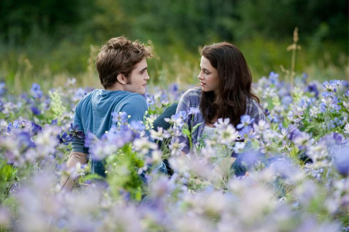
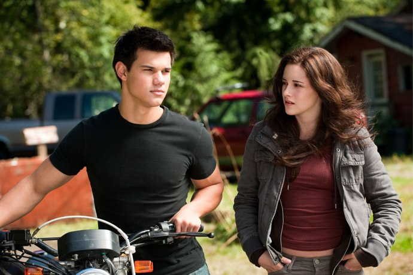

+++
type = "post"
titre = "<em>Twilight chapitre 3 : Hésitation</em>, David Slade"
title = "Twilight chapitre 3 : Hésitation, David Slade"
url = "/twilight-3-hesitation-slade"
date = "2010-07-09T00:21:13"
Lastmod = "2013-12-01T16:33:55"
cover = "twilight-bella-jacob-edward.jpg"
categorie = [ "À voir" ]
tag = [ "Amour", "Blockbuster", "Fantastique", "Mythe", "Twilight", "Vampires", "Vite oublié" ]
createur = [ "David Slade" ]
acteur = [ "Kristen Stewart", "Robert Pattinson", "Taylor Lautner" ]
annee = [ "2010" ]
weight = 2010
saga = [ "Twilight" ]
pays = [ "États-Unis" ]
original = "Eclipse"

+++

Après <a href="http://voiretmanger.fr/2009/01/13/twilight-chapitre-1/">un médiocre premier épisode</a> et <a href="http://voiretmanger.fr/2009/11/27/twilight-chapitre-2-weitz/">un calamiteux second chapitre</a>, je suis retourné en salles ce soir pour voir le troisième chapitre de la série <em>Twilight</em>. Et surprise, le justement sous-titré <em>Hésitation</em> est meilleur que ses deux prédécesseurs. Grâce à quelques bagarres bien senties et une pointe de second degré, David Slade parvient à rehausser légèrement le niveau. Pas de quoi faire un bon film, n&rsquo;exagérons rien quand même, mais enfin, ce <em>Twilight chapitre 3</em> est honorable. Dommage que l&rsquo;on s&rsquo;ennuie quand même fermement dès que l&rsquo;amûr fou entre en jeu…

Quelqu&rsquo;un ignore-t-il encore l&rsquo;histoire de <em>Twilight</em> ? Si vous n&rsquo;avez jamais lu ou vu cette histoire de vampires à l&rsquo;eau de rose, mais que vous envisagez de le faire, arrêtez immédiatement votre lecture. Sinon, vous savez déjà que la belle et mystérieuse Bella a rencontré le très beau et très mystérieux Edward et qu&rsquo;ils sont tombés immédiatement amoureux dans <em>le premier chapitre</em>. On a aussi appris que le bellâtre était un vampire, ce qui posait quelques soucis de chaque côté avec les belles-familles. Le <a href="http://voiretmanger.fr/2009/11/27/twilight-chapitre-2-weitz/">second chapitre</a> n&rsquo;a pas servi à grand-chose, si ce n&rsquo;est à détailler les difficultés que rencontre un couple mixte (vampire/humain) et faire entrer Jacob dans la partie, l&rsquo;ami d&rsquo;enfance de Bella qui se trouve être un loup-garou, accessoirement. Évidemment, loups-garous et vampires sont ennemis depuis toujours et ce beau gosse très musclé veut conquérir la belle, comme il se doit. À la fin du second chapitre, on apprenait avec stupeur et effroi que Edward ne voulait pas toucher la belle au-delà du présentable en public avant de se marier, ce qui n&rsquo;arrivera pas avant la fin des études des deux tourtereaux.

<em>Hésitation</em> est donc, comme son nom l&rsquo;indique, l&rsquo;époque des choix. En fait, le choix est encore le même que dans le deux, à savoir que Bella doit choisir entre deux bellâtres, celui très rapide, fort et avec la peau qui brille au soleil, ou celui qui montre ses muscles saillants et use de son sourire Colgate©™ ravageur en toute occasion. Le choix est difficile parce que Bella aime les deux, et qu&rsquo;un trio n&rsquo;est pas envisageable pour la cible du film. Il faut donc choisir et la belle a besoin de deux heures pour cela. Fort heureusement, il se passe vaguement quelque chose en tâche de fond, sinon le scénario du <em>Chapitre 2</em> allait immanquablement se répéter. Ce qui se passe n&rsquo;a qu&rsquo;un intérêt limité, on comprend vaguement qu&rsquo;une rousse déjà croisée dans les chapitres précédents veut se venger d&rsquo;Edward et pour ça s&rsquo;en prend à Bella et que les Volturi (les chefs des vampires, italiens évidemment) laissent faire parce qu&rsquo;ils aiment pas tellement ces vampires végétariens de Seattle. Du coup, une armée de &laquo;&nbsp;Nouveaux-Nés&nbsp;&raquo; (des vampires fraichement créés) vient les attaquer et ça se termine comme prévu en baston générale où même les loups-garous viennent aider les vampires pour sauver la belle Bella. Qui, de son côté, prend son temps, hésite, aime surtout Edward, mais n&rsquo;est pas insensible aux charmes corporels de Jacob. Le choix est d&rsquo;autant plus difficile que son vampire est <em>old-school</em> et refuse de passer à l&rsquo;acte avant le mariage, alors que Jacob ne se ferait pas vraiment prier, de son côté. Mais ce que l&rsquo;on savait depuis la dixième minute du premier chapitre (l&rsquo;auteur bâille) se réalise et la belle choisit Edward. Nous voilà fixés, le sexe sera pour plus tard, peut-être.

La pudibonderie est une caractéristique commune à tous les épisodes de la série <em>Twilight</em> jusqu&rsquo;à ce dernier <em>Chapitre 3</em>. Alors que ça ne parle que d&rsquo;amours entre adolescents, il ne se passe strictement rien entre les personnages. Tout au plus voit-on dans ce film quelques poils du torse d&rsquo;Edward, avant que l&rsquo;action s&rsquo;interrompe brusquement. <em>Twilight</em> est clairement une histoire à l&rsquo;eau de rose, très <em>old-school</em> elle aussi et je suis prêt à parier que le quatrième et ultime chapitre ne sera pas plus dévergondé. La série n&rsquo;était pas censée offrir un film porno, certes, mais on est ici dans la valorisation d&rsquo;une position plus que rétrograde où le sexe se limite à la procréation dans le cadre du mariage et ne se conçoit pas pour le plaisir. C&rsquo;est gênant, mais ça l&rsquo;est encore plus quand on regarde <em>Hésitation</em>. Le film tout entier est plein de désirs charnels : derrière le message pudibond, la série est en fait totalement hypocrite en essayant de caser le plus possible de références plus ou moins implicites. Il faudra que l&rsquo;on m&rsquo;explique pourquoi les loups-garous devraient être en permanence torse nu et montrer leurs abdos bodybuildés, même quand il neige et qu&rsquo;il fait manifestement -40° ? On en arrive à des scènes cocasses où soi-disant Jacob passe la nuit avec Bella dans ses bras, sous une tente alors que lui est encore une fois torse nu, mais sans jamais la toucher… On a le sentiment que le scénario des films a été écrit par le catéchisme pour enseigner les vertus du mariage, mais que le film a été réalisé par une industrie qui considère qu&rsquo;un blockbuster sans sexe est un blockbuster inachevé. Le mélange est vraiment troublant et je trouve ce <em>Chapitre 3</em> malhonnête.

<em>Chapitre 3 Hésitation</em> a fait un bond qualitatif sur le plan de la réalisation, indéniablement. La scène d&rsquo;ouverture est prenante et vraiment bien fichue, les scènes de combat sont plutôt pas mal dans le genre ça bouge tout le temps. Le film conserve aussi plusieurs défauts inhérents à la série, comme un rythme globalement très lent où les héros passent leur temps à hésiter et à répéter inlassablement les mêmes choses. L&rsquo;histoire n&rsquo;avance pas, on sent beaucoup de remplissages, bref on s&rsquo;ennuie. Heureusement, ce chapitre fait preuve de maturité en incluant de temps en temps un peu de second degré bienvenu, notamment lorsque des scènes censées être romantiques (avec violons et tout) sont brutalement interrompues par une remarque ridicule, ou quand le père de Bella essaie de parler contraception avec sa fille. <em>Twilight</em> n&rsquo;est pas une comédie, mais la série gagnerait effectivement à se prendre moins au sérieux. Autre nouveauté, la prise en compte du passé forcément long pour des vampires immortels. Dommage cela dit que ce passé ne prenne la forme que de flashbacks poussifs et se limitent en gros à la guerre d&rsquo;Indépendance américaine. Finalement, cet aspect sert bien peu. Les acteurs n&rsquo;ont pas changé dans ce dernier épisode, et c&rsquo;est bien dommage. C&rsquo;est flagrant avec Bella, qui n&rsquo;a en tout et pour tout qu&rsquo;une seule expression de la fille &laquo;&nbsp;pas normale&nbsp;&raquo; (sic) et mélancolique. Je ne sais pas comment l&rsquo;actrice gérera l&rsquo;après <em>Twilight</em>, mais ce n&rsquo;est pas gagné…

<em>Twilight Chapitre 3: Hésitation</em> est indéniablement la suite des deux précédents. On retrouve le triangle amoureux digne de <em>Roméo et Juliette</em>, la même pudibonderie affichée avec une héroïne qui hésite sans cesse entre deux bellâtres. Cet épisode sort un peu du lot par le second degré et une réalisation correcte, mais cela n&rsquo;en fait pas une réussite pour autant. On regarde poliment l&rsquo;épisode avancer, les demoiselles fort nombreuses dans la salle devaient sans aucun doute trouver du plaisir à regarder le ténébreux Edward ou les muscles de Jacob, mais ça ne va pas plus loin… Il reste encore un chapitre pour changer la donne, mais je suis sceptique. Je compte plutôt sur <em><a href="http://voiretmanger.fr/2010/07/04/true-blood-saison-1-hbo/">True Blood</a></em> pour voir des vampires dignes de ce nom. Il est frappant de constater qu&rsquo;un vampire meurt très différemment : dans la série de HBO, il explose en gerbes de chairs et de sangs ; dans <em>Twilight</em>, il se casse gentiment comme une statue, sans verser la moindre goutte de sang.

Les avis ne sont pas plus positifs sur ce <em>Twilight 3</em>. <a href="http://www.plan-c.fr/article-critique-twilight-hesitation-de-david-slade-52838684.html">Alexandre</a> a ainsi écrit exactement la même chose que moi, <a href="http://www.filmosphere.com/2010/06/critique-twilight-chapitre-3-hesitation-the-twilight-saga-eclipse-2010/">Nicolas</a> y voit aussi &laquo;&nbsp;le moins pire des trois&nbsp;&raquo; pour un bilan négatif. <em><a href="http://www.critikat.com/Twilight-chapitre-3-Hesitation.html">Critikat</a></em> revient longuement sur les enjeux liés à la sexualité et au mariage, rappelant les dangers de cette vision rétrograde. Quant aux <em><a>Inrockuptibles</a></em>, fans inconditionnels jusqu&rsquo;à l&rsquo;absurde de <em>Twilight</em>, ils justifient cette fois la pudibonderie et expliquent : &laquo;&nbsp;<em>ne pas consommer la chair ne permet pas tant de rester pur que de repousser cet instant où l’amour devient périssable</em>.&nbsp;&raquo; Soit.

En attendant la suite des aventures de Bella et des bellâtres, un film parodique devrait sortir cet été, au moins aux États-Unis. Nommé <em>Vampire Suck</em>, il reprend manifestement le chapitre 2, copiant certaines scènes à l&rsquo;identique. À première vue, cela semble très drôle. Pas de date de sortie prévue pour la France à ma connaissance.

<object id="VINRmQNRFRBwSR" classid="clsid:d27cdb6e-ae6d-11cf-96b8-444553540000" width="690" height="390" codebase="http://download.macromedia.com/pub/shockwave/cabs/flash/swflash.cab#version=6,0,40,0"><param name="allowFullScreen" value="true" /><param name="allowscriptaccess" value="always" /><param name="src" value="http://www.movieweb.com/v/VINRmQNRFRBwSR" /><param name="allowfullscreen" value="true" /><embed id="VINRmQNRFRBwSR" type="application/x-shockwave-flash" width="690" height="390" src="http://www.movieweb.com/v/VINRmQNRFRBwSR" allowscriptaccess="always" allowfullscreen="true"></embed></object>

<h3>Vous voulez m&rsquo;aider ?<a href="#footnote_0_3622" id="identifier_0_3622" class="footnote-link footnote-identifier-link" title="&Agrave; propos de la publicit&eacute;&hellip;">1</a></h3>
<ul>
<li><a href="http://www.amazon.fr/gp/product/B003VIWN08/ref=as_li_ss_tl?ie=UTF8&#038;tag=leblogdenic07-21&#038;linkCode=as2&#038;camp=1642&#038;creative=19458&#038;creativeASIN=B003VIWN08">Acheter le film en Blu-Ray sur Amazon</a></li>
<li><a href="http://www.amazon.fr/gp/product/B003V89VK8/ref=as_li_ss_tl?ie=UTF8&#038;tag=leblogdenic07-21&#038;linkCode=as2&#038;camp=1642&#038;creative=19458&#038;creativeASIN=B003V89VK8">Acheter le film en DVD sur Amazon</a></li>
<li><a href="http://itunes.apple.com/fr/movie/twilight-3-hesitation/id392677122">Acheter ou louer le film sur l&rsquo;iTunes Store</a></li>
</ul>
<ul>
<li><a href="http://www.amazon.fr/gp/product/B00AJO6CE0/ref=as_li_ss_tl?ie=UTF8&#038;tag=leblogdenic07-21&#038;linkCode=as2&#038;camp=1642&#038;creative=19458&#038;creativeASIN=B00AJO6CE0">Acheter la saga en Blu-Ray sur Amazon</a></li>
<li><a href="http://www.amazon.fr/gp/product/B00AJO6CCC/ref=as_li_ss_tl?ie=UTF8&#038;tag=leblogdenic07-21&#038;linkCode=as2&#038;camp=1642&#038;creative=19458&#038;creativeASIN=B00AJO6CCC">Acheter la saga en DVD sur Amazon</a></li>
</ul>

<ol class="footnotes"><li id="footnote_0_3622" class="footnote"><a href="http://voiretmanger.fr/soutien/">À propos de la publicité…</a> [<a href="#identifier_0_3622" class="footnote-link footnote-back-link">&#8617;</a>]</li></ol>
