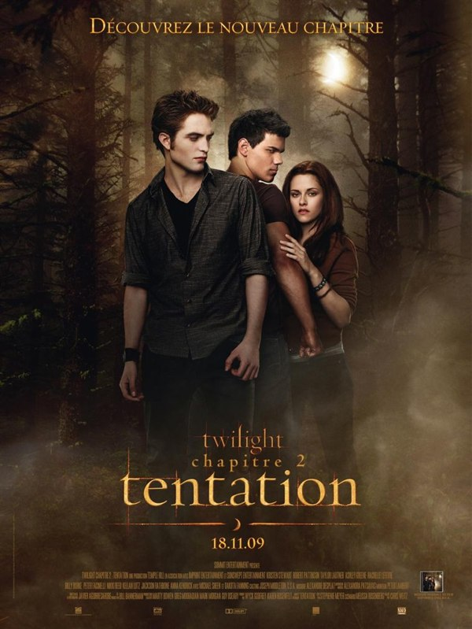
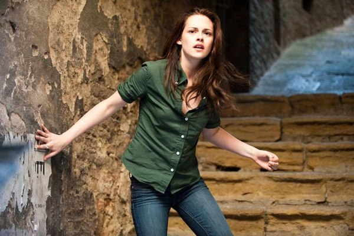
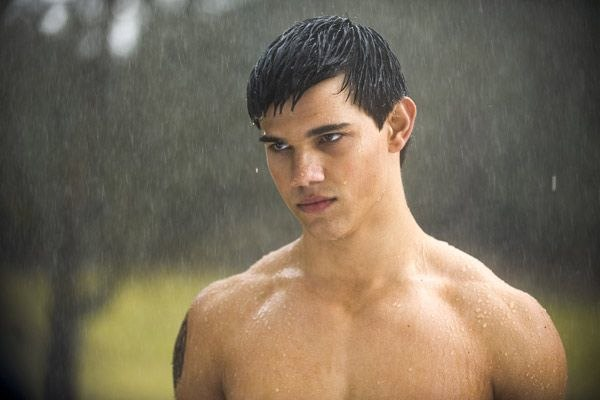

+++
type = "post"
titre = "<em>Twilight – Chapitre 2 : Tentation</em>,  Chris Weitz"
title = "Twilight – Chapitre 2 : Tentation,  Chris Weitz"
url = "/twilight-chapitre-2-weitz"
date = "2009-11-27T21:44:09"
Lastmod = "2013-12-01T16:36:27"
cover = "twilight-new-moon.jpg"
categorie = [ "À voir" ]
tag = [ "Blockbuster", "Romance", "Twilight", "Vampires", "Vite oublié" ]
createur = [ "Chris Weitz" ]
acteur = [ "Kristen Stewart", "Robert Pattinson", "Taylor Lautner" ]
annee = [ "2009" ]
weight = 2009
saga = [ "Twilight" ]
pays = [ "États-Unis" ]
original = "New Moon"

+++

Je suis allé voir <em>Twilight – Chapitre 2 : Tentation</em>, j&rsquo;ai osé, après avoir très moyennement apprécié <a href="http://voiretmanger.fr/2009/01/13/twilight-chapitre-1/">le premier opus</a>, et après avoir été <a href="http://www.toujoursraison.com/2009/11/twilight-chapitre-2-tentation.html">prévenu</a> <a href="http://www.surlarouteducinema.com/archive/2009/11/20/twilight-chapitre-2-tentation-de-chris-weitz.html">à de</a> <a href="http://www.telerama.fr/cinema/films/twilight-chapitre-2-tentation,391335,critique.php">nombreuses</a> <a href="http://cinema-ici-ailleurs.over-blog.com/article-twilight-chapitre-2-tentation-the-twilight-saga-new-moon-2009-40104210.html">reprises</a>&#8230; L&rsquo;idée étant bien sûr de se détendre avec un bon vieux blockbuster des familles, mais le souci étant que, comme dans le premier, il ne se passe rien de rien. Et finalement, le cinéma Arlequin en mode Roméo et Juliette <em>cheap</em>, ça ne fonctionne pas (ou alors faut aimer les romans à l&rsquo;eau de rose)

Petit rappel pour ceux qui viendraient d&rsquo;une autre planète et n&rsquo;auraient jamais entendu parler du phénomène <em>Twilight</em>. Soit une jeune ado qui débarque chez son père, dans un trou paumé des États-Unis et qui rencontre l&rsquo;être sublime, que dis-je, parfait. Oui, mais voilà, ce bellâtre est aussi un vampire qui n&rsquo;a qu&rsquo;une envie au fond, croquer la belle, la vampirisant pour jamais. Le premier film se terminait alors que le &laquo;&nbsp;couple&nbsp;&raquo; était vaguement ensemble, c&rsquo;est-à-dire que lui acceptait de lui toucher le bras, mais pas plus.

On attendait de la deuxième partie un peu d&rsquo;action amoureuse, si j&rsquo;ose dire. Le sous-titre français, &laquo;&nbsp;Tentation&nbsp;&raquo; se révèle finalement un contre-sens total : si tentation il y a, elle n&rsquo;est surtout pas visible, ou alors tout sauf charnelle. Je suppose que les traducteurs ont trouvé le sous-titre original (&laquo;&nbsp;New Moon&nbsp;&raquo;) peu vendeur et ont voulu attirer des Français connus pour leur sexualité débordante par ce qu&rsquo;il faut bien qualifier de publicité mensongère. Bref, vous l&rsquo;aurez compris, il ne se passera rien pendant les 2h30 du film, un bref baiser excepté.

C&rsquo;est même le pire qui arrive au début, quand le bellâtre, sous prétexte que son frère a failli bouffer la belle lorsqu&rsquo;elle se coupe en ouvrant son cadeau d&rsquo;anniversaire (quelle cruche aussi), annonce qu&rsquo;il la quitte &laquo;&nbsp;pour toujours&nbsp;&raquo; et &laquo;&nbsp;pour son bien&nbsp;&raquo;, évidemment. Comme il ne fait pas les choses à moitié, il l&rsquo;amène au milieu de la forêt pour l&rsquo;abandonner là&#8230; oui, on peut être bellâtre et n&rsquo;avoir jamais entendu parler de galanterie. Donc le bellâtre se casse, et un bellâtre 2 (on les nommera bellâtre 1 et bellâtre 2 pour les besoins de l&rsquo;argumentation) débarque pour la consoler. Ça n&rsquo;est rien de moins que Jacob, son ami d&rsquo;enfance, qui est passé en deux mois des tablettes de chocolat de rêve, et tous les accessoires qui vont avec. Évidemment, la belle est impressionnée et bien tentée par ce nouveau bellâtre. Et hop, le sempiternel triangle amoureux se met en place.

Quand on sent qu&rsquo;ils vont (enfin, après moult péripéties à base de réparations de moto) conclure, on apprend que bellâtre deux est en fait un loup-garou. Et évidemment, on s&rsquo;en doute bien, dans <em>Twilight</em> aussi les vampires et les loups-garous s&rsquo;affrontent depuis des millénaires pour protéger on ne sait plus trop quoi ou qui, m&rsquo;enfin franchement on s&rsquo;en fout. L&rsquo;essentiel est que la belle va devoir choisir entre bellâtre 1 et bellâtre 2 et bien sûr, le choix est cornélien, au moins. Bon, je casse immédiatement le suspense, elle choisit bellâtre 1, en se faisant promettre qu&rsquo;il la mordra. Donc apparemment, l&rsquo;action est repoussée pour le troisième épisode, sauf si finalement ce sera dans le quatrième, ou alors pas du tout&#8230;

On l&rsquo;aura compris, <em>Twilight 2</em> rejoue le classique Roméo et Juliette. D&rsquo;ailleurs, si vous ne l&rsquo;avez pas compris, le film ne manque pas de le rappeler avec la finesse du pachyderme en rut. Ainsi, on voit que la belle lit la pièce de Shakespeare au début, avant d&rsquo;en voir l&rsquo;adaptation cinématographique. Évidemment, bellâtre 1 connaît la pièce par cœur, comme il se doit. Dès fois que le message ne soit pas passé, le film fait un passage rapide en Italie, où les Volturi dirigent l&rsquo;impitoyable conseil des vampires (avec une étonnante copie de Jean Sarkozy). Et pour bien enfoncer le clou, bellâtre 1 croit la belle morte et veut se suicider (certes, les rôles sont inversés, mais quand même).

Mais si Roméo et Juliette est une référence constante du film, ça n&rsquo;est pas la pièce de Shakespeare qui est reprise. Non, ça, c&rsquo;est juste pour faire bien sur le lit de la belle. La vraie source d&rsquo;inspiration, ce serait plutôt la comédie musicale : on a gardé les clichés, mais enlevé toute finesse à l&rsquo;histoire (à l&rsquo;image du &laquo;&nbsp;Virgin&nbsp;&raquo; sur l&rsquo;avion qui les emmène en Italie). Il ne faudrait quand même pas que la cible du film ne comprenne pas quelque chose&#8230;

Bon, je crois que je ne vais pas m&rsquo;étendre plus longtemps sur ce film. Il ne s&rsquo;y passe pas grand-chose, l&rsquo;histoire n&rsquo;avance jamais, on connaît déjà la fin, et le tout est en plus filmé avec autant de finesse que le scénario (apparemment le réalisateur ne connaît qu&rsquo;un seul effet, le ralenti&#8230;. mais quelqu&rsquo;un devrait lui expliquer que ça sert surtout à ridiculiser des scènes qui se débrouillaient déjà très bien dans le domaine du ridicule). Sans oublier des acteurs inexistants (la belle fait la gueule<a href="#footnote_0_2119" id="identifier_0_2119" class="footnote-link footnote-identifier-link" title="&Agrave; propos, j&rsquo;aime beaucoup l&rsquo;analyse de Pascale : &laquo;&nbsp;la Bella/Kristen, que dalle&hellip; la premi&egrave;re chose qu&rsquo;on lui a dit c&rsquo;est &laquo;&nbsp;c&rsquo;est un film o&ugrave; tu fais la gueule&nbsp;&raquo; et l&agrave; elle a ferm&eacute; les &eacute;coutilles, elle a rien capt&eacute; &agrave; la suite&nbsp;&raquo;. C&rsquo;est exactement &ccedil;a&hellip;">1</a>, bellâtre 1 est livide, bellâtre 2 montre ses muscles&#8230;) et une morale rétrograde, comme l&rsquo;a bien souligné <a href="http://cinema-ici-ailleurs.over-blog.com/article-twilight-chapitre-2-tentation-the-twilight-saga-new-moon-2009-40104210.html">Nicolas</a> (on ne consomme qu&rsquo;après le mariage, faut pas déconner non plus).

Le tout ne nécessite pas du tout d&rsquo;être vu sur grand écran. Un conseil, à la télé (ou avant sur votre ordinateur, vous vous débrouillez avec la loi&#8230;) ça ira très bien. Enfin ça c&rsquo;est si vous tenez vraiment à le voir hein&#8230;. On peut aussi très bien s&rsquo;en passer.

À noter quand même, une critique très argumentée comme à leur habitude chez <a href="http://www.critikat.com/Twilight-chapitre-2-Tentation.html">Critikat</a>. Critique d&rsquo;ailleurs fort intéressante : on sent qu&rsquo;ils n&rsquo;ont vraiment pas aimé le film, mais qu&rsquo;ils essaient de ne pas le détruire gratuitement. Exercice beaucoup moins fun, mais aussi beaucoup plus difficile&#8230;

<h3>Vous voulez m&rsquo;aider ?<a href="#footnote_1_2119" id="identifier_1_2119" class="footnote-link footnote-identifier-link" title="&Agrave; propos de la publicit&eacute;&hellip;">2</a></h3>
<ul>
<li><a href="http://www.amazon.fr/gp/product/B002XDQGVY/ref=as_li_ss_tl?ie=UTF8&tag=leblogdenic07-21&linkCode=as2&camp=1642&creative=19458&creativeASIN=B002XDQGVY">Acheter le film en Blu-Ray sur Amazon</a></li>
<li><a href="http://www.amazon.fr/gp/product/B002XDQGVE/ref=as_li_ss_tl?ie=UTF8&tag=leblogdenic07-21&linkCode=as2&camp=1642&creative=19458&creativeASIN=B002XDQGVE">Acheter le film en DVD sur Amazon</a></li>
<li><a href="http://itunes.apple.com/fr/movie/twilight-2-chapitre-2-tentation/id368415239">Acheter ou louer le film sur l&rsquo;iTunes Store</a></li>
</ul>
<ul>
<li><a href="http://www.amazon.fr/gp/product/B00AJO6CE0/ref=as_li_ss_tl?ie=UTF8&tag=leblogdenic07-21&linkCode=as2&camp=1642&creative=19458&creativeASIN=B00AJO6CE0">Acheter la saga en Blu-Ray sur Amazon</a></li>
<li><a href="http://www.amazon.fr/gp/product/B00AJO6CCC/ref=as_li_ss_tl?ie=UTF8&tag=leblogdenic07-21&linkCode=as2&camp=1642&creative=19458&creativeASIN=B00AJO6CCC">Acheter la saga en DVD sur Amazon</a></li>
</ul>

<ol class="footnotes"><li id="footnote_0_2119" class="footnote">À propos, j&rsquo;aime beaucoup l&rsquo;analyse de <a href="http://www.surlarouteducinema.com/archive/2009/11/20/twilight-chapitre-2-tentation-de-chris-weitz.html">Pascale</a> : &laquo;&nbsp;la Bella/Kristen, que dalle&#8230; la première chose qu&rsquo;on lui a dit c&rsquo;est &laquo;&nbsp;c&rsquo;est un film où tu fais la gueule&nbsp;&raquo; et là elle a fermé les écoutilles, elle a rien capté à la suite&nbsp;&raquo;. C&rsquo;est exactement ça&#8230; [<a href="#identifier_0_2119" class="footnote-link footnote-back-link">&#8617;</a>]</li><li id="footnote_1_2119" class="footnote"><a href="http://voiretmanger.fr/soutien/">À propos de la publicité…</a> [<a href="#identifier_1_2119" class="footnote-link footnote-back-link">&#8617;</a>]</li></ol>
