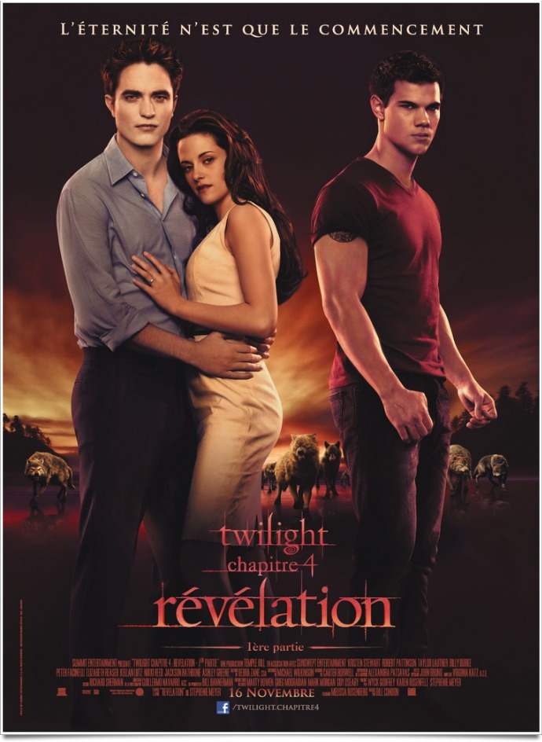
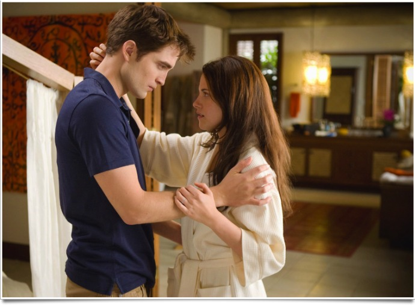
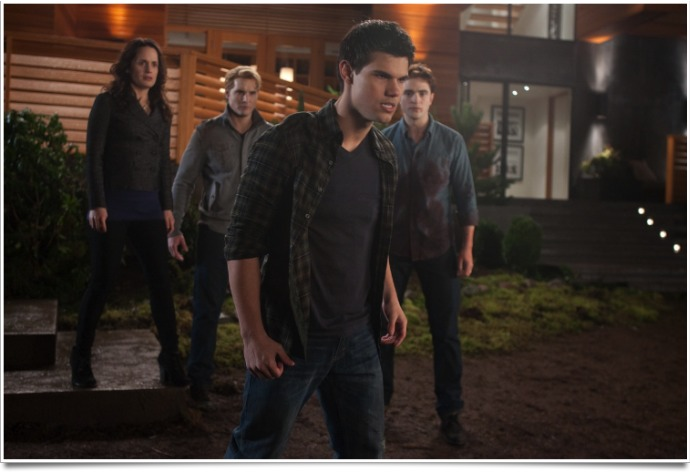

+++
type = "post"
titre = "<em>Twilight &#8211; Chapitre 4 : Révélation 1ère partie</em>, Bill Condon"
title = "Twilight &#8211; Chapitre 4 : Révélation 1ère partie, Bill Condon"
url = "/twilight-chapitre-4-revelation-1ere-partie-condon"
date = "2011-11-20T01:45:47"
Lastmod = "2013-12-01T16:27:09"
cover = "twilight-revelation-partie-1.jpg"
categorie = [ "À voir" ]
tag = [ "Amour", "Blockbuster", "Famille", "Twilight", "Vampires", "Vite oublié" ]
createur = [ "Bill Condon" ]
acteur = [ "Kristen Stewart", "Robert Pattinson", "Taylor Lautner" ]
annee = [ "2011" ]
weight = 2011
saga = [ "Twilight" ]
pays = [ "États-Unis" ]
original = "The Twilight Saga: Breaking Dawn - Part 1"

+++

Après trois films marqués par une pudibonderie tenace, place au sexe ! Dans <em>Twilight – Chapitre 4 : Révélation 1ère partie</em>, Bella a choisi son bellâtre et elle épouse le vampire, au grand dam du loup-garou. Dans ce dernier opus séparé comme il se doit en deux parties, le ton est devenu soudainement beaucoup plus mature et même si le film reste pudibond sur le plan sexuel, cet avant-dernier morceau dans la saga <em>Twilight</em> s&rsquo;avère parfois assez gore. Si Bill Condon ne parvient pas à proposer un film très intéressant sur le plan cinématographique, <em>Twilight – Chapitre 4 : Révélation 1ère partie</em> se regarde sans réel déplaisir, mais sans réel intérêt pour autant.

Résumé rapide des épisodes précédents. L&rsquo;histoire de Bella et Edward commence par de la <em><a href="http://voiretmanger.fr/2009/01/13/twilight-chapitre-1/">Fascination</a></em>. La première rencontre entre les deux fut instantanément l&rsquo;occasion d&rsquo;un coup de foudre à l&rsquo;ancienne, avec cristallisation et tout le décorum. Vint ensuite l&rsquo;époque de la <em><a href="http://voiretmanger.fr/2009/11/27/twilight-chapitre-2-weitz/">Tentation</a></em> : loin d&rsquo;être sexuelle, elle renforce toutefois l&rsquo;amour des deux tourtereaux, même si l&rsquo;ami d&rsquo;enfance de Bella, un beau mec bien musclé qui s&rsquo;avère aussi être loup-garou, constitue un parti tout aussi tentant. Dans le troisième chapitre justement, il a fallu faire un choix : <em><a href="http://voiretmanger.fr/2010/07/09/twilight-3-hesitation-slade/">Hesitation</a></em> vit Bella tendre d&rsquo;un côté ou de l&rsquo;autre avant, enfin, de se décider en faveur du vampire. Quand <em>Twilight – Chapitre 4 : Révélation 1ère partie</em> ouvre, le mariage de Bella et d&rsquo;Edward est officiellement annoncé et les derniers préparatifs vont bon train. Après une longue période de stress partagée par les parents, Bella devient enfin madame Cullen et elle part en voyage de noces aux bras de son cher et tendre. Rappelons que le mariage était la condition <em>sine qua non</em> pour qu&rsquo;Edward puisse aimer Bella et il a promis à sa nouvelle épouse de la vampiriser en contrepartie. Au cours du voyage, la belle tombe enceinte, ce qui n&rsquo;était pas censé être possible. Commence alors une véritable course contre la montre pour sauver la mère et l&rsquo;enfant…

Avec le mariage de Bella, la saga peut enfin avancer un peu. Les trois films précédents tournaient un peu en rond autour du choix de la jeune adolescente. <em>Twilight – Chapitre 4 : Révélation 1ère partie</em> est l&rsquo;occasion d&rsquo;un passage à la vie adulte, passage symbolisé sans surprise par le mariage : Bella quitte le cocon familial pour un nouveau foyer. Autre passage évidemment, celui de la première fois : Bella et Edward n&rsquo;avaient jamais échangé plus qu&rsquo;un baiser jusque-là, ils peuvent enfin s&rsquo;en donner à cœur joie. Inutile d&rsquo;attendre de Bill Condon de torrides scènes de sexe toutefois : comme les trois films qui le précèdent, <em>Twilight – Chapitre 4 : Révélation 1ère partie</em> reste très pudibond et ne montre que des épaules ou éventuellement un torse masculin. Les scènes de sexe sont rapidement évacuées et les cadrages veillent toujours à ne pas montrer le début d&rsquo;un centimètre de sein pour Bella. Cette union relance aussi le conflit entre vampires et loups-garous qui va <em>crescendo</em> dans cette première partie et qui devrait certainement encore s&rsquo;affirmer dans la seconde. Bill Condon n&rsquo;est pas le plus à l&rsquo;aise avec ces scènes de combat qui ne sont pas particulièrement spectaculaires. Elles permettent en tout cas de conserver le rôle de Jacob au centre du film : même si Bella n&rsquo;a plus à choisir, le trio amoureux continue de fonctionner.

<em>Twilight – Chapitre 4 : Révélation 1ère partie</em> pourrait donner le sentiment d&rsquo;être un film d&rsquo;action bourré de rebondissements, mais il n&rsquo;en est rien. Le film dure deux heures, mais il ne se passe finalement pas grand-chose dans ces deux heures. Le récit élude totalement certains enjeux centraux, notamment autour de la grossesse et le film de Bill Condon paraît finalement assez vide. <em>Twilight – Chapitre 4 : Révélation 1ère partie</em> bénéficie d&rsquo;un rythme très lent qui est certainement un choix assumé : à cet égard, ce nouveau film est totalement dans la continuité de la saga. Ses premières minutes sont aussi dans le même ton mélancolique qui prévaut dans <em>Twilight</em>, à tel point que l&rsquo;on a parfois le sentiment un peu pénible de revoir un des trois films précédents. Bill Condon prend son temps, certes, mais on sent aussi que le scénario de son film s&rsquo;étale volontairement en longueur pour tenir deux heures avec seulement la moitié du roman original. Le découpage en deux parties semble ici beaucoup plus un argument marketing et il n&rsquo;est pas vraiment justifié par le récit proprement dit. Un film beaucoup plus dense aurait sans doute suffi à traiter le quatrième et dernier roman de la saga, mais l&rsquo;appât du gain aura été trop fort. Dommage, <em>Twilight – Chapitre 4 : Révélation 1ère partie</em> en pâtit clairement. Reste à voir ce que pourra offrir la deuxième partie qui n&rsquo;est pas attendue avant novembre 2012.

Disons-le d&rsquo;emblée, <em>Twilight – Chapitre 4 : Révélation 1ère partie</em> n&rsquo;a pas tellement d&rsquo;intérêt sur le plan du cinéma. Bill Condon ne fait pas des étincelles derrière sa caméra et le film est vraiment très classique. On note quand même la même photographie peu contrastée qui offre au film une ambiance mélancolique, fil rouge de toute la saga incontestablement. Si vous avez vu les trois précédents, vous ne serez pas dépaysés avec ce nouveau <em>Twilight</em> et ce ne sont pas les performances des acteurs principaux qui vont changer quelque chose à ce sujet. Kristen Stewart a toujours ses trois moues différentes qu&rsquo;elle alterne pendant tout le film, même si elle esquisse aussi pour la première fois un sourire ou deux. Robert Pattison reste dans son rôle de bellâtre pale-parce-que-différent tandis que Taylor Lautner met toujours sa musculature et sa gueule de beau gosse en avant. Les admiratrices (ou admirateurs) apprécieront, les autres trouveront peut-être que l&rsquo;on tourne un peu en rond. Le bon goût musical de la saga a également été maintenu, un bon point tout de même.

<em>Twilight – Chapitre 4 : Révélation 1ère partie</em> ne constitue pas une surprise, c&rsquo;est le moins que l&rsquo;on puisse dire. Le film de Bill Condon est dans la droite continuité des trois épisodes précédents et il reste, inébranlable, sur ses rails. Si vous appréciez <em>Twilight</em>, vous n&rsquo;avez aucune raison de ne pas moins apprécier ce film. Pour tous les autres, on est encore loin d&rsquo;avoir un film intéressant et mémorable, mais le côté plus adulte de <em>Twilight – Chapitre 4 : Révélation 1ère partie</em> n&rsquo;est pas déplaisant. Dommage que le film soit aussi lent et paraisse aussi vide…

<h3>Vous voulez m&rsquo;aider ?<a href="#footnote_0_5328" id="identifier_0_5328" class="footnote-link footnote-identifier-link" title="&Agrave; propos de la publicit&eacute;&hellip;">1</a></h3>
<ul>
<li><a href="http://www.amazon.fr/gp/product/B006H397F8/ref=as_li_ss_tl?ie=UTF8&#038;tag=leblogdenic07-21&#038;linkCode=as2&#038;camp=1642&#038;creative=19458&#038;creativeASIN=B006H397F8">Acheter le film en Blu-Ray sur Amazon</a></li>
<li><a href="http://www.amazon.fr/gp/product/B006H396X6/ref=as_li_ss_tl?ie=UTF8&#038;tag=leblogdenic07-21&#038;linkCode=as2&#038;camp=1642&#038;creative=19458&#038;creativeASIN=B006H396X6">Acheter le film en DVD sur Amazon</a></li>
<li><a href="">Acheter ou louer le film sur l&rsquo;iTunes Store</a></li>
</ul>
<ul>
<li><a href="http://www.amazon.fr/gp/product/B00AJO6CE0/ref=as_li_ss_tl?ie=UTF8&#038;tag=leblogdenic07-21&#038;linkCode=as2&#038;camp=1642&#038;creative=19458&#038;creativeASIN=B00AJO6CE0">Acheter la saga en Blu-Ray sur Amazon</a></li>
<li><a href="http://www.amazon.fr/gp/product/B00AJO6CCC/ref=as_li_ss_tl?ie=UTF8&#038;tag=leblogdenic07-21&#038;linkCode=as2&#038;camp=1642&#038;creative=19458&#038;creativeASIN=B00AJO6CCC">Acheter la saga en DVD sur Amazon</a></li>
</ul>

<ol class="footnotes"><li id="footnote_0_5328" class="footnote"><a href="http://voiretmanger.fr/a-propos/publicite/">À propos de la publicité…</a> [<a href="#identifier_0_5328" class="footnote-link footnote-back-link">&#8617;</a>]</li></ol>
