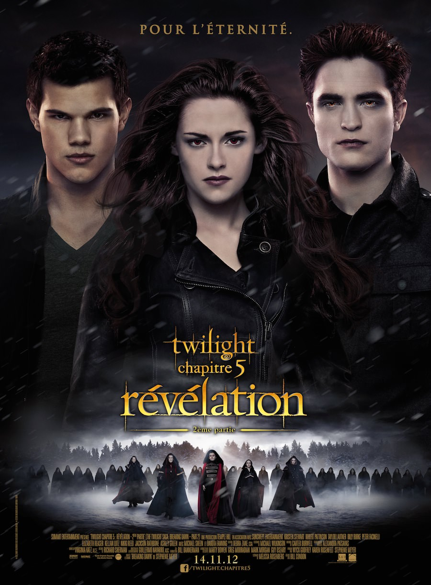
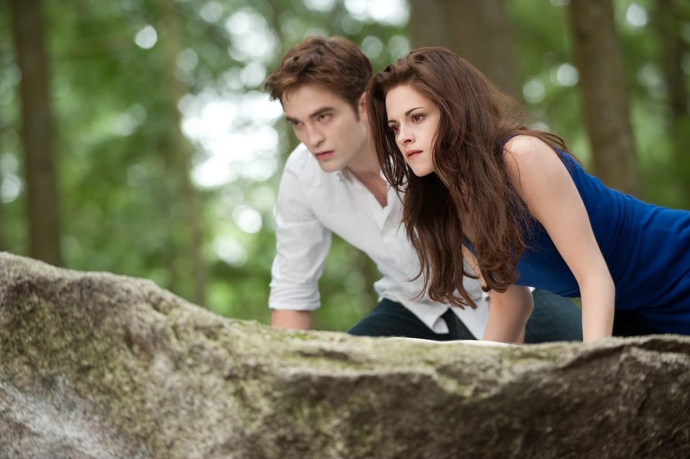
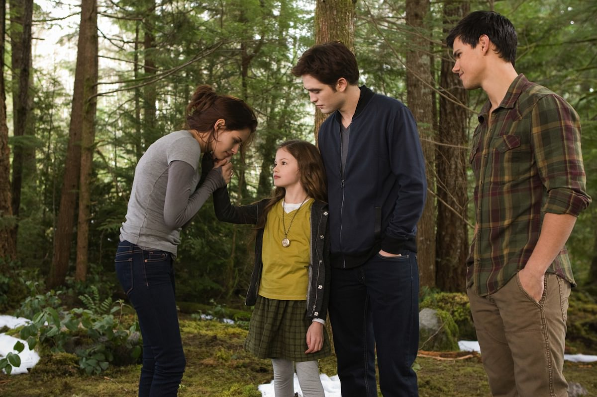

+++
titre = "<em>Twilight – Chapitre 5 : Révélation 2e partie</em>, Bill Condon"
title = "Twilight – Chapitre 5 : Révélation 2e partie, Bill Condon"
url = "/twilight-chapitre-5-revelation-2e-partie-condon"
date = "2012-11-15T23:32:44"
Lastmod = "2014-02-22T20:58:50"
cover = "twilight-5-2-kristen-stewart-robert-pattinson.jpg"
categorie = [ "À voir" ]
tag = [ "Amour", "Blockbuster", "Famille", "Twilight", "Vampires", "Vite oublié" ]
createur = [ "Bill Condon" ]
acteur = [ "Kristen Stewart", "Robert Pattinson", "Taylor Lautner" ]
annee = [ "2012" ]
weight = 2012
saga = [ "Twilight" ]
pays = [ "États-Unis" ]
original = "The Twilight Saga: Breaking Dawn - Part 2"

+++

Et de cinq ! La célèbre saga <em>Twilight</em> se termine cette année au cinéma, après quatre films qui ont rassemblé des millions de fans. Sur le papier, Stephenie Meyer s’était contenté de quatre tomes, mais le succès aidant, les producteurs ont réussi à en tirer deux films. <em>Twilight &#8211; Chapitre 5 : Révélation 2e partie</em> constitue ainsi la deuxième partie du chapitre 4, comme son titre ne l’indique pas, et il suit directement <a href="http://voiretmanger.fr/2011/11/20/twilight-chapitre-4-revelation-1ere-partie-condon/" title="Twilight - Chapitre 4 : Révélation 1ère partie, Bill Condon - À voir et à manger"><em>Twilight &#8211; Chapitre 4 : Révélation 1ère partie</em></a> sorti l’an dernier. Le matériau original était déjà maigre et Bill Condon n’a pas eu l’opportunité de l’enrichir : la saga se termine ainsi sur un film aussi vide que les quatre précédents, même si l’heure est à l’affrontement final. Un blockbuster lent et vide qui n’intéressera que les plus grand(e)s fans…

Petit rappel des épisodes précédents : la saga raconte l’histoire d’amour entre Bella, une jeune ado tout à fait normal et donc dépressive, et Edward, un jeune homme pas normal puisqu’il est un vampire. Dans <a href="http://voiretmanger.fr/2009/01/13/twilight-chapitre-1/" title="Twilight — Chapitre 1 : Fascination - À voir et à manger"><em>Twilight — Chapitre 1 : Fascination</em></a>, l’heure est à la découverte : après une première rencontre qui scelle le coup de foudre, les deux tourtereaux se découvrent. Dans <a href="http://voiretmanger.fr/2009/11/27/twilight-chapitre-2-weitz/" title="Twilight – Chapitre 2 : Tentation, Chris Weitz - À voir et à manger"><em>Twilight – Chapitre 2 : Tentation</em></a>, Edward essaie d’éloigner Bella pour sa propre sécurité et c’est Jacob, l’ami d’enfance qui est aussi loup-garou, qui prend le relai pour séduire la belle. <a href="http://voiretmanger.fr/2010/07/09/twilight-3-hesitation-slade/" title="Twilight chapitre 3 : Hésitation, David Slade - À voir et à manger"><em>Twilight chapitre 3 : Hésitation</em></a> est justement le temps des choix pour Bella qui penche d’un côté et de l’autre, jusqu’à choisir Edward qu’elle épousait dans le film précédent. Le mariage étant prononcé, le sexe pouvait suivre et à la fin du chapitre 4, Bella accouche d’une jeune fille tout en étant transformée en vampire par son bel et tendre. Quand <em>Twilight &#8211; Chapitre 5 : Révélation 2e partie</em> commence, l’héroïne de la saga est donc enfin transformée en vampire, ce qui est son souhait le plus cher depuis qu’elle sait qu’Edward en est un. Sa nouvelle vie d’immortelle peut commencer, mais elle est troublée d’emblée par les Volturi. Ce clan de vampires italiens old-school n’apprécie pas trop la naissance issue de ce couple et il décide de les attaquer pour les exterminer jusqu’au dernier. Pour éviter de trop raccourcir l’immortalité qui attend les deux tourtereaux, le clan Cullen s’organise et prépare sa défense…

Sur le papier, <em>Twilight &#8211; Chapitre 5 : Révélation 2e partie</em> introduit enfin un peu d’action dans cette saga par ailleurs assez calme. L’affrontement des Volturi et des Cullen était la promesse d’un peu de spectacle, d’autant que les loups-garous se rangent du côté des Cullen et de Bella. Ce nouveau chapitre commence pourtant comme les précédents, avec pas grand-chose. Bill Condon reprend précisément là où il s’était arrêté précédemment et on découvre une Bella mère, mais surtout vampire. Pendant une bonne demi-heure, le temps est à l’apprentissage de sa nouvelle condition et tout se déroule sans accroc : la jeune femme apprend à maîtriser sa soif de sang humain, mais aussi sa force surhumaine. Elle apprend aussi, et c’est une vraie nouveauté dans la saga <em>Twilight</em>, le sexe, le vrai. Le film ne masque pas tout pudiquement cette fois et même s’il ne faut s’attendre à un porno, on voit le couple faire l’amour sans équivoque. Nonobstant cette libération bienvenue — elle était vraiment pesante dans le chapitre 4 —, on est en terrain connu dans ce <em>Twilight &#8211; Chapitre 5 : Révélation 2e partie</em>. L’intrigue tient en fait sur deux lignes et on sent bien qu’il fallait sortir quatre heures du dernier tome de Stephenie Meyer alors que deux auraient largement suffi. 

Le scénario mis en image par Bill Condon est une nouvelle fois frustrant. <em>Twilight &#8211; Chapitre 5 : Révélation 2e partie</em> passe des dizaines et des dizaines de minutes à filmer le couple et la drôle de famille composée avec leur fille et un Jacob beaucoup plus sage, qui ne montre plus ses ados saillants qu’une seule fois et qui a totalement abandonné l’idée de conquérir Bella. À côté de ces longues scènes qui ne font pas avancer le récit, le film s’offre des ellipses gigantesques et élude toutes les questions qui pourraient être intéressantes. Bella est devenue une vampire, tout de même : ce qui devrait être le clou du spectacle dans cette saga centrée sur ce personnage n’est ici qu’un épiphénomène, un fait qui passe comme si de rien n’était. La jeune femme maîtrise tout de suite ses nouvelles capacités et il semble qu’elle a toujours été vampire au bout de 10 minutes de film. C’est un peu décevant, mais <em>Twilight &#8211; Chapitre 5 : Révélation 2e partie</em> aurait été peut-être pire autrement, cela dit. La mythologie des vampires devient chez Bill Condon une variante des superhéros : pour le grand combat final, les Cullen font appel à leurs amis dans le monde entier et une dizaine de vampires viennent les rejoindre. Chacun à son pouvoir précis, un pouvoir qui, bien sûr, servira à un moment crucial du combat. L’ensemble est beaucoup trop artificiel pour convaincre, tandis que les Volturi sont d’un kitsch si ridicule, qu’il est difficilement excusable, même s’il est volontaire. Au total, on peine à croire à cette conclusion qui se veut épique, mais qui pourrait être comique si <em>Twilight &#8211; Chapitre 5 : Révélation 2e partie</em> ne se prenait pas tant au sérieux. 

Pendant près de deux heures, Bill Condon parvient à filmer un récit qui tient sur une ligne et demie, ce qui relève d’une certaine performance. <em>Twilight &#8211; Chapitre 5 : Révélation 2e partie</em> n’est pas très intéressant sur le plan cinématographique, mais cela n’a jamais été le point fort de la saga. On note quand même un surprenant générique, très graphique et assez réussi. Pour le reste, le cinéaste a opté pour la simplicité, ce qui était sans doute la meilleure chose à faire. Le long-métrage manque bien évidemment de rythme et le scénario cousu de fils blancs grossiers n’aide vraiment pas, avec une béquille monstrueuse à la fin. <em>Twilight &#8211; Chapitre 5 : Révélation 2e partie</em> est toutefois l’occasion d’une découverte tout à fait surprenante : Kristen Stewart sait faire plus que la moue. Alors que la jeune actrice avait conservé sa même mine triste pendant les trois premiers films, avant de tendre au film d’horreur dans le quatrième, elle est ici presque rayonnante et quasiment heureuse et c’est sans doute sa meilleure prestation à ce jour. À ses côtés, Robert Pattinson et Taylor Lautner font le job ; on n’en dira pas autant de quelques personnages secondaires aussi inutiles qu’insignifiants…

La fin de la saga est à l’image de ce qui précède : c’est lent et globalement vide. <em>Twilight &#8211; Chapitre 5 : Révélation 2e partie</em> n’est pas le pire de la série, peut-être même l’un des meilleurs, mais ce n’est pas terrible malgré tout. Bill Condon fait ce qu’il peut, mais le scénario de base reste toujours aussi vide et un peu vain. On passe à côté des enjeux intéressants et même la bataille finale qui promettait beaucoup s’avère assez décevante. Les fans apprécieront sans aucun doute, les autres feront aussi bien de passer à côté…

<h3>Vous voulez m&rsquo;aider ?<a href="#footnote_0_7751" id="identifier_0_7751" class="footnote-link footnote-identifier-link" title="&Agrave; propos de la publicit&eacute;&hellip;">1</a></h3>
<ul>
<li><a href="http://www.amazon.fr/gp/product/B00AJO6CIG/ref=as_li_ss_tl?ie=UTF8&#038;tag=leblogdenic07-21&#038;linkCode=as2&#038;camp=1642&#038;creative=19458&#038;creativeASIN=B00AJO6CIG">Acheter le film en Blu-Ray sur Amazon</a></li>
<li><a href="http://www.amazon.fr/gp/product/B00AJO6CEU/ref=as_li_ss_tl?ie=UTF8&#038;tag=leblogdenic07-21&#038;linkCode=as2&#038;camp=1642&#038;creative=19458&#038;creativeASIN=B00AJO6CEU">Acheter le film en DVD sur Amazon</a></li>
<li><a href="https://itunes.apple.com/fr/movie/twilight-chapitre-5-revelation/id604113103">Acheter ou louer le film sur l&rsquo;iTunes Store</a></li>
</ul>
<ul>
<li><a href="http://www.amazon.fr/gp/product/B00AJO6CE0/ref=as_li_ss_tl?ie=UTF8&#038;tag=leblogdenic07-21&#038;linkCode=as2&#038;camp=1642&#038;creative=19458&#038;creativeASIN=B00AJO6CE0">Acheter la saga en Blu-Ray sur Amazon</a></li>
<li><a href="http://www.amazon.fr/gp/product/B00AJO6CCC/ref=as_li_ss_tl?ie=UTF8&#038;tag=leblogdenic07-21&#038;linkCode=as2&#038;camp=1642&#038;creative=19458&#038;creativeASIN=B00AJO6CCC">Acheter la saga en DVD sur Amazon</a></li>
</ul>

<ol class="footnotes"><li id="footnote_0_7751" class="footnote"><a href="http://voiretmanger.fr/soutien/">À propos de la publicité…</a> [<a href="#identifier_0_7751" class="footnote-link footnote-back-link">&#8617;</a>]</li></ol>
