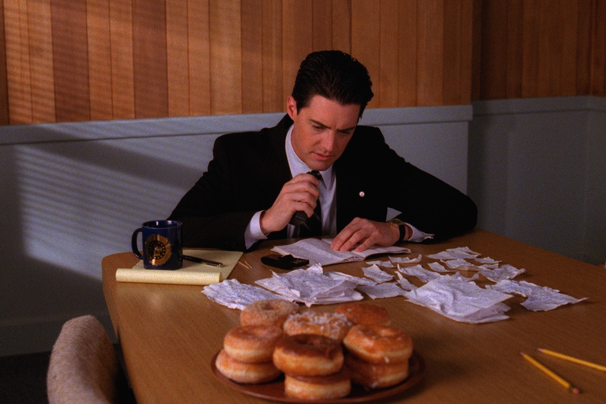

+++
type = "post"
titre = "<em>Twin Peaks</em>, Mark Frost et David Lynch (ABC)"
title = "Twin Peaks, Mark Frost et David Lynch (ABC)"
url = "/twin-peaks-frost-lynch-abc"
date = "2014-09-28T13:44:59"
Lastmod = "2014-09-28T19:15:56"
cover = "twin-peaks-lynch-frost.jpg"
categorie = [ "À voir" ]
tag = [ "Amour", "Enquête", "Famille", "Fantastique", "Horreur", "Humour", "Mort", "Police", "Série", "Société" ]
createur = [ "David Lynch", "Mark Frost" ]
acteur = [ "Kyle MacLachlan", "Lara Flynn Boyle", "Michael Ontkean", "Ray Wise", "Richard Beymer", "Sherilyn Fenn", "Sheryl Lee" ]
annee = [ "1990" ]
weight = 1990
pays = [ "États-Unis" ]

+++

Rares sont les séries qui ont eu un impact aussi fort qu&rsquo;a pu en avoir <em>Twin Peaks</em>. Quand son pilote a été diffusé pour la première fois sur les télévisions en 1990, on n&rsquo;avait jamais vu ça. Il faut dire que cet épisode d&rsquo;une heure trente tient beaucoup plus du long-métrage de cinéma que d&rsquo;une série, du moins d&rsquo;une série comme on les connaissait à cette époque. Réalisation soignée et surtout une intrigue qui se met en place doucement : Mark Frost et David Lynch impose dès ce premier pilote leur marque de fabrique en privilégiant systématiquement l&rsquo;ambiance à l&rsquo;intrigue policière. Le reste de la série est à cette image : certes, il y a un crime à résoudre, mais c&rsquo;est un objectif presque secondaire par rapport à la découverte de la petite ville et de ses habitants, et surtout par rapport à cette ambiance si particulière. <em>Twin Peaks</em> est une série très courte, avec deux saisons et seulement trente épisodes, mais elle a durablement marqué les esprits. Il y a eu un avant et un après et il suffit de regarder n&rsquo;importe quelle série ambitieuse sortie après celle-ci pour comprendre son importance. Près d&rsquo;un quart de siècle après, la série de Mark Frost et David Lynch est ancrée dans les années 1990, mais elle n&rsquo;a pas pris une ride pour son ambiance et ses personnages. Un classique !

<em>Twin Peaks</em> commence avec la découverte d&rsquo;un corps, celui de Laura Palmer, retrouvée morte sur le bord de la rivière, dans la petite ville de Twin Peaks. Une ville sans histoire, et d&rsquo;ailleurs ce meurtre est le seul incident depuis plusieurs années. La ville est tellement habituée à une vie tranquille que son shérif ne sait pas trop quoi faire et il appelle ainsi le FBI à l&rsquo;aide. De ce fait, le personnage principal n&rsquo;est pas tant Harry S. Truman, le shérif, mais plutôt Dale Cooper, l&rsquo;agent spécial envoyé par le FBI. Et dès les premières minutes, Mark Frost et David Lynch campent un personnage haut en couleur : l&rsquo;agent passe sa journée avec un dictaphone, à raconter en détail ses actions à une certaine Diane, probablement son assistante, mais on n&rsquo;en saura jamais plus. C&rsquo;est bien la force de cette série, sensible dès le pilote : <em>Twin Peaks</em> n&rsquo;en dévoile jamais trop et préfère entretenir le mystère en ajoutant, à chaque épisode, un peu plus de complexité à l&rsquo;intrigue. L&rsquo;histoire est pourtant simple au départ : on a un meurtre et une tentative de meurtre après séquestration et violences sexuelles et la piste semble rapidement se dessiner en faveur d&rsquo;un serial-killer de passage à Twin Peaks. Mais cette piste est vite déjouée par la réalité si complexe du coin : au fil des épisodes, les deux créateurs de la série ajoutent des éléments, avec une forêt supposée hantée, une base militaire qui travaille sur des sujets secrets, mais <em>a priori</em> tous extraordinaires. Et bien sûr, les épisodes se concentrent aussi sur la vingtaine de personnages récurrents, qui ont tous leur part d&rsquo;ombre et qui sont tous, à un moment ou à un autre, suspects à des degrés divers. Ainsi, Mark Frost et David Lynch partent d&rsquo;une intrigue relativement simple, pour finir avec une série extrêmement complexe, voire un peu folle. Mieux vaut regarder <em>Twin Peaks</em> sans lire quoi que ce soit à son sujet, mais en sachant que tout peut arriver, même les choses les plus folles. Certains rebondissements paraissent vraiment fous, mais c&rsquo;est aussi l&rsquo;esprit de cette série qui ose tout, quitte à en faire parfois un peu trop. C&rsquo;est aussi la forte de cette série qui essaie tout, et qui a marqué durablement les esprits par quelques scènes ou idées. On n&rsquo;entre pas dans la culture populaire sans raison et <em>Twin Peaks</em> n&rsquo;y a pas volé sa place.

<iframe class="aligncenter" src="//www.youtube.com/embed/i7d0Lm_31BE" frameborder="0" allowfullscreen></iframe>

L&rsquo;intrigue policière importe si peu qu&rsquo;elle ne conclut pas la série, même si la résolution au milieu de la saison 2 était une erreur d&rsquo;après ses concepteurs. Il faut bien reconnaître que <em>Twin Peaks</em> perd un peu en force par la suite, mais c&rsquo;est aussi le signe qu&rsquo;il ne s&rsquo;agit pas vraiment d&rsquo;une série policière. Mark Frost et David Lynch créent beaucoup plus en effet, un phénomène de société qui a marqué les années 1990 et qui continue d&rsquo;être essentiel aujourd&rsquo;hui, même si on ne le sait pas forcément. Cette série atypique, où les personnages sont plus importants que les intrigues, a ouvert la voie à toutes les séries modernes telles qu&rsquo;on les connaît aujourd&rsquo;hui encore. Tous les acteurs rassemblés ici, à commencer par Kyle MacLachlan, sont vraiment excellents et ils contribuent au succès de l&rsquo;ensemble, par leurs agissements inquiétants ou drôles. On pourrait critiquer des intrigues secondaires amoureuses un peu niaises, on pourrait regretter la lenteur de certains épisodes, mais les petites faiblesses de <em>Twin Peaks</em> n&rsquo;enlèvent rien à la réussite du projet. Si vous aimez les séries, ne ratez pas celle qui a modifié en profondeur le genre…

<h3>Vous voulez <a href="http://voiretmanger.fr/soutien/">m&rsquo;aider</a> ?</h3>
<ul>
<li><a href="http://www.amazon.fr/gp/product/B00H1YZIPA/ref=as_li_ss_tl?ie=UTF8&amp;tag=leblogdenic07-21&amp;linkCode=as2&amp;camp=1642&amp;creative=19458&amp;creativeASIN=B00H1YZIPA">Acheter la série en Blu-ray sur Amazon</a></li>
<li><a href="http://www.amazon.fr/gp/product/B00LXM30RO/ref=as_li_ss_tl?ie=UTF8&amp;tag=leblogdenic07-21&amp;linkCode=as2&amp;camp=1642&amp;creative=19458&amp;creativeASIN=B00LXM30RO">Acheter la série en DVD sur Amazon</a></li>
</ul>

