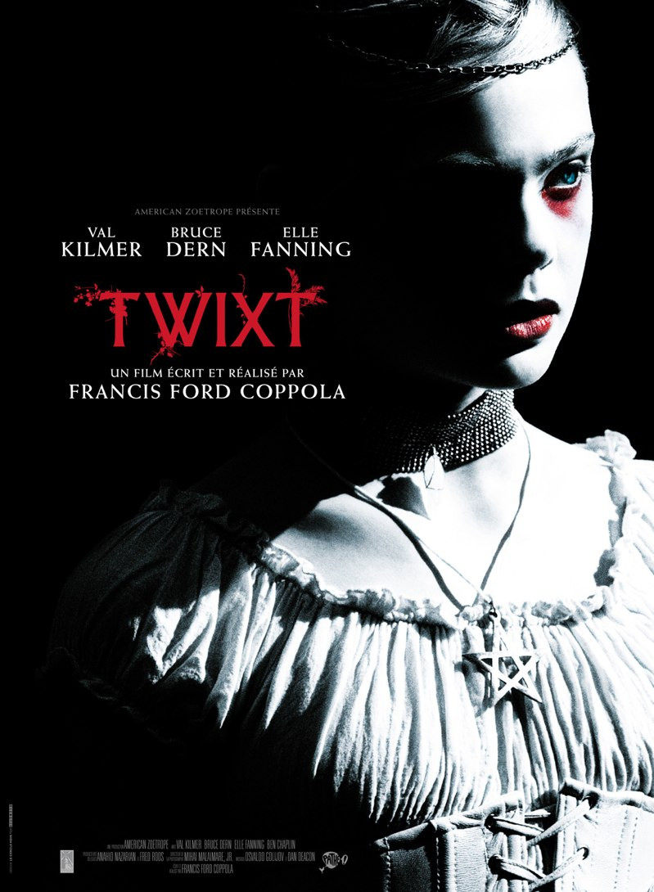
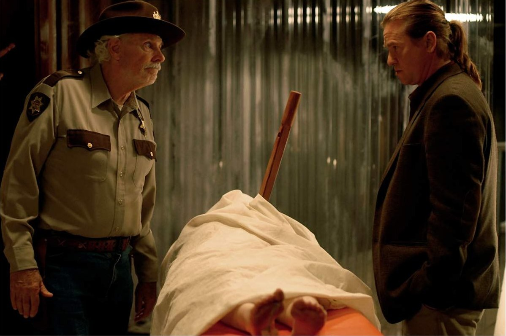

+++
titre = "<em>Twixt</em>, Francis Ford Coppola"
title = "Twixt, Francis Ford Coppola"
url = "/twixt-coppola"
date = "2012-04-17T23:34:22"
Lastmod = "2014-06-01T15:55:15"
cover = "twixt-val-kilmer-elle-fanning.jpg"
categorie = [ "À voir" ]
tag = [ "Écrivain", "Expérience", "Fantastique", "Gore", "Horreur", "Thriller" ]
createur = [ "Francis Ford Coppola" ]
acteur = [ "Ben Chaplin", "Bruce Dern", "Elle Fanning", "Val Kilmer" ]
annee = [ "2012" ]
weight = 2012
pays = [ "États-Unis" ]

+++

Avec <em>Twixt</em>, Francis Ford Coppola continue son exploration du cinéma indépendant et ainsi libre. Après <em>L&rsquo;Homme sans âge</em> puis <em><a href="http://voiretmanger.fr/2009/12/28/tetro-coppola/">Tetro</a></em>, il s&rsquo;engage sur un terrain étonnant pour ce troisième film : l&rsquo;horreur. En apparence au moins, <em>Twixt</em> est un film d&rsquo;horreur, mais les apparences sont trompeuses dans ce film surprenant et inconfortable. Pas un coup de cœur, mais un film vraiment intéressant…

Hall Baltimore est un &laquo;&nbsp;Stephen King au rabais&nbsp;&raquo;, comme n&rsquo;hésite pas à le qualifier le shérif du bled paumé au fin fond de l&rsquo;Amérique où il se rend pour faire la promotion de son dernier roman. Cet écrivain a connu un certain succès, mais il est aujourd&rsquo;hui sur le déclin, voire carrément hors-jeu. Les dettes s&rsquo;accumulent et sa femme menace de vendre ses biens s&rsquo;il n&rsquo;écrit pas rapidement une nouvelle histoire de sorcières, sa marque de fabrique. Hall est un homme fatigué qui n&rsquo;a manifestement plus le goût à écrire depuis qu&rsquo;il a perdu sa fille dans un accident de bateau. Seul dans sa voiture avec ses bouquins qu&rsquo;il ne parvient pas à vendre, il va manifestement de bourgade en bourgade, à la recherche de quelques rares fans. Cette fois, alors qu&rsquo;il vend son livre au milieu du quincailler du village, il tombe sur Bobby Lagrange, le shérif. Non seulement il a lu ses livres, mais Bobby a même écrit quelques histoires et il veut en écrire une nouvelle avec Hall. Ce dernier se laisse prendre au jeu et il découvrir une histoire à glacer le sang…

Francis Ford Coppola ne s&rsquo;est pas contenté de réaliser <em>Twixt</em>, il en a écrit le scénario et il avait la ferme intention de mener ses spectateurs en bateau. Le film commence sur un mode parodique : une voix grave et menaçante décrit la bourgade et d&rsquo;emblée l&rsquo;ambiance film d&rsquo;horreur fauché tendance série B prend le dessus. Ce qui semblait être une parodie de films d&rsquo;horreur disparaît vite toutefois et le comique de situation face à cet écrivain raté qui vend des livres au fond de la quincaillerie ouvre une nouvelle piste… bientôt battue en brèche par une nouvelle quand le fantastique commence à faire son apparition. <em>Twixt</em> est ainsi, déstabilisant. Le spectateur ne sait jamais où il va être mené, le film lance des pistes, mais ne les suit jamais jusqu&rsquo;au bout. Il y a bien une esquisse de thriller, mais Francis Ford Coppola lui-même ne semble pas vraiment y croire et l&rsquo;intrigue est vraiment secondaire. Quand on commence à comprendre l&rsquo;histoire du meurtre, le film brouille une nouvelle fois les pistes en télescopant les époques elles histoires jusqu&rsquo;à n&rsquo;y plus rien comprendre.

<em>Twixt</em> a ainsi un côté brouillon et il donne l&rsquo;impression d&rsquo;avoir été totalement improvisé par un Francis Ford Coppola sous l&rsquo;emprise d&rsquo;une substance quelconque. Le cinéaste habitué aux grandes machines hollywoodiennes profite ici de sa liberté et cela se voit, à tel point que son dernier film a même parfois un côté je-m&rsquo;en-foutiste assez surprenant. Pourtant, <em>Twixt</em> n&rsquo;est improvisé qu&rsquo;en apparence, il est en fait très travaillé et son chaos apparent est en fait construit par le scénario. Derrière les pistes lancées tour à tour, une thématique se démarque pendant tout le film : le travail de l&rsquo;écrivain. <em>Twixt</em> est d&rsquo;abord un film sur un récit en train de se construire et par une mise en abîme assez classique, le récit qui se construit est évidemment le film que l&rsquo;on voit. Dès lors, l&rsquo;écrivain raté est un double du cinéaste et <em>Twixt</em> s&rsquo;apparente à une métaphore de la construction d&rsquo;un film. La séquence la plus intéressante du film est peut-être ce dialogue imaginaire entre Hall et Edgar Allan Poe sur la construction d&rsquo;un récit. L&rsquo;écrivain cherche une &laquo;&nbsp;fin en béton&nbsp;&raquo; pour son éditeur et il fait appel à son modèle absolu ; Poe donne alors quelques clés pour comprendre la construction de son fameux poème &laquo;&nbsp;Le Corbeau&nbsp;&raquo;. Cette question de l&rsquo;écriture est passionnante, mais elle n&rsquo;est pas très développée finalement par Francis Ford Coppola. On voit bien une séance d&rsquo;écriture, rapidement interrompue par l&rsquo;alcool, mais c&rsquo;est assez léger. <em>Twixt</em> aurait peut-être gagné à se concentrer plus sur cet aspect, mais le film assume son côté un peu bordélique.

Pour ce film comme pour les deux précédents, Francis Ford Coppola a choisi de s&rsquo;autofinancer et <em>Twixt</em> est un film fauché, du moins selon les standards du cinéaste. Avec son budget de sept millions de dollars, on est loin de la trentaine de millions de dollars de <em><a href="http://voiretmanger.fr/2012/01/22/apocalypse-now-redux-coppola/">Apocalypse Now</a></em> et cela se voit. La mise en scène est très simple, les effets sont bien visibles et souvent assez kitsch, certainement volontairement d&rsquo;ailleurs. Peu importe, tout cela contribue à l&rsquo;atmosphère mystérieuse qui règne dans <em>Twixt</em> et qui contribue au malaise du spectateur. Le montage multiplie les ruptures, la nuit est plus proche du noir et blanc rehaussé de quelques couleurs et Francis Ford Coppola se permet tout dans ce film qu&rsquo;il a lui-même payé. À la fin, une séquence de mise à mort tend vers un univers visuel plutôt inattendu puisqu&rsquo;il évoque <em>Sin City</em>. La photographie du film est ainsi très travaillée et le résultat est plutôt réussi. <em>Twixt</em> n&rsquo;est pas un film plaisant et s&rsquo;il suscite un intérêt indéniable, il n&rsquo;est guère dans l&rsquo;émotion. En témoignent des acteurs assez peu inspirés à l&rsquo;image de Val Kilmer dans ce rôle d&rsquo;écrivain assez apathique.

<em>Twixt</em> partage la critique et les spectateurs, et pour cause : le dernier film de Francis Ford Coppola est assez inconfortable. Brouillant constamment les pistes, hésitant entre plusieurs genres et ambiances, ce film imprévisible est fascinant et intéressant, mais il ne suscite pas vraiment de passion. <em>Twixt</em> mérite d&rsquo;être vu pour son côté presque expérimental, mais soyez prévenus : vous ne verrez en aucun cas un film d&rsquo;horreur traditionnel.

<h3>Vous voulez m&rsquo;aider ?<a href="#footnote_0_6247" id="identifier_0_6247" class="footnote-link footnote-identifier-link" title="&Agrave; propos de la publicit&eacute;&hellip;">1</a></h3>
<ul>
<li><a href="http://www.amazon.fr/gp/product/B009OEV5DO/ref=as_li_ss_tl?ie=UTF8&#038;tag=leblogdenic07-21&#038;linkCode=as2&#038;camp=1642&#038;creative=19458&#038;creativeASIN=B009OEV5DO">Acheter le film en Blu-Ray sur Amazon</a></li>
<li><a href="http://www.amazon.fr/gp/product/B009OEV5B6/ref=as_li_ss_tl?ie=UTF8&#038;tag=leblogdenic07-21&#038;linkCode=as2&#038;camp=1642&#038;creative=19458&#038;creativeASIN=B009OEV5B6">Acheter le film en DVD sur Amazon</a></li>
</ul>

<ol class="footnotes"><li id="footnote_0_6247" class="footnote"><a href="http://voiretmanger.fr/soutien/">À propos de la publicité…</a> [<a href="#identifier_0_6247" class="footnote-link footnote-back-link">&#8617;</a>]</li></ol>
