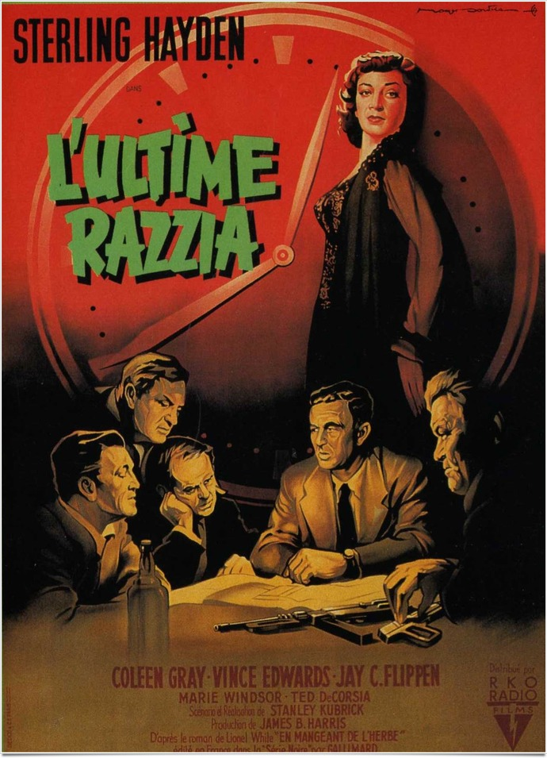
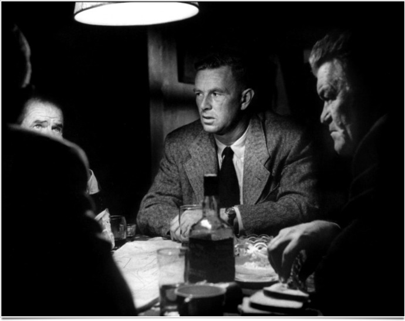
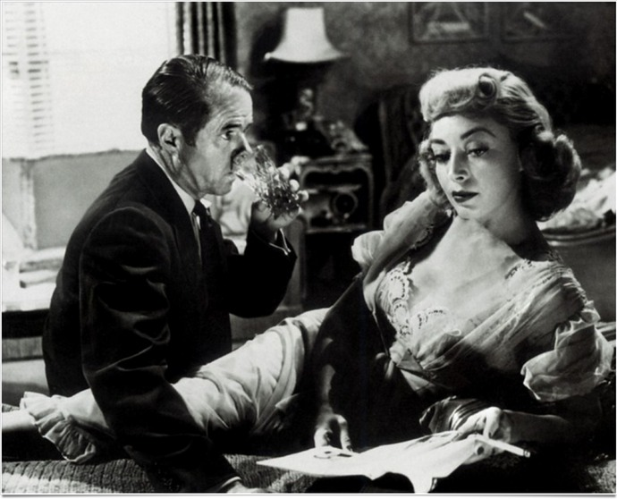

+++
type = "post"
titre = "L&rsquo;Ultime Razzia, Stanley Kubrick"
title = "L'Ultime Razzia, Stanley Kubrick"
url = "/ultime-razzia-kubrick"
date = "2011-05-15T07:56:57"
Lastmod = "2012-11-29T09:07:33"
cover = "killing-kubrick.jpg"
categorie = [ "À voir" ]
tag = [ "Cinéma classique", "Film noir", "Suspense" ]
createur = [ "Stanley Kubrick" ]
annee = [ "1956" ]
weight = 1956
pays = [ "États-Unis" ]

+++

Stanley Kubrick n&rsquo;avait que 26 ans quand il a réalisé son troisième film, le deuxième seulement si l&rsquo;on oublie le mal-aimé <em>Fear and Desire</em>. <em>L&rsquo;Ultime Razzia</em> est un film de genre avec ses codes et ses règles qui contraignent le jeune cinéaste plus que pour ses futurs films. Si ce film n&rsquo;est pas aussi abouti que ceux qui suivront, il n&rsquo;en reste pas moins intéressant, et pas seulement pour assister à la formation d&rsquo;un cinéaste hors pair.

L&rsquo;histoire de <em>L&rsquo;Ultime Razzia</em> n&rsquo;est pas des plus originales. Un coup : le vol d&rsquo;un hippodrome pendant une course, à la clé plusieurs millions de dollars. Un plan : détourner l&rsquo;attention en tuant le cheval en tête de la course pour voler l&rsquo;argent sans se faire repérer. Un groupe : cinq complices, agissants à différents niveaux du coup. Dans ce genre de films, deux fins possibles : soit le coup réussi, soit il échoue. Il ne fait guère de doute que l&rsquo;on se situe ici dans la deuxième hypothèse, comme l&rsquo;indique sans doute mieux le titre original (<em>The Killing</em>). Tout l&rsquo;enjeu est dès lors de savoir comment il va échouer : ce sont des petits grains de sable dissimulés ici où là, que l&rsquo;on ne peut comprendre d&rsquo;emblée, qui viendront enrayer la mécanique bien trop huilée pour ne pas être suspecte.

<em>L&rsquo;Ultime Razzia</em> appartient très clairement au genre du film noir. En apparence, Stanley Kubrick semble s&rsquo;y conformer précisément, mais il faut peu de temps pour comprendre que ce n&rsquo;est qu&rsquo;une apparence trompeuse. D&rsquo;abord parce que la chronologie du récit est bouleversée par le cinéaste. L&rsquo;effet est aujourd&rsquo;hui plus courant, popularisé par des cinéastes comme Quentin Tarantino, mais à l&rsquo;époque, il était beaucoup plus surprenant. La chronologie n&rsquo;est pas complètement retournée, puisque le film suit dans l&rsquo;ensemble la préparation, puis la réalisation du coup, jusqu&rsquo;à son échec final. Néanmoins, le film maltraite la chronologie de manière plus fine : une même période de temps sera vue par plusieurs personnages successivement, suivant à chaque fois leur point de vue. Le jour J, on va voir tous les éléments du groupe mis en place pour l&rsquo;occasion arriver sur les lieux du crime et ainsi remonter plus ou moins longtemps en arrière dans la journée. À chaque fois, un narrateur omniscient nous décrit ce qui se passe, nous donne les horaires et fait même des commentaires sur la bonne marche du plan, comme si nous étions dans un documentaire. Effet étonnant, qui casse un peu l&rsquo;effet de surprise : Stanley Kubrick filme son récit comme s&rsquo;il s&rsquo;agissait d&rsquo;une reconstitution par la police…

Cet effet surprenant n&rsquo;enlève néanmoins rien à l&rsquo;ambiance du film : <em>L&rsquo;Ultime Razzia</em> s&rsquo;avère en effet un film très prenant, avec un suspense tenu d&rsquo;un bout à l&rsquo;autre, malgré la fin prévisible. Tourné avec un budget très serré, surtout comparé aux standards actuels, le film a été tourné aussi très rapidement et il dégage une tension et un sentiment d&rsquo;urgence permanent. Les nombreux retours en arrière dans la chronologie, loin de lasser les spectateurs, sont encore plus prenants. Certains plans sont répétés un grand nombre de fois, comme celui où l&rsquo;on voit la barrière du départ se mettre en place sur la piste ; cette répétition est responsable en grande partie de la tension. Plus le moment du vol approche, plus on sait que la catastrophe est proche et plus on tremble avec les personnages. <em>L&rsquo;Ultime Razzia</em> ne dure que 80 minutes, c&rsquo;est très peu pour un film de Stanley Kubrick, mais il est extrêmement riche et efficace. Le cinéaste n&rsquo;a pas l&rsquo;occasion de s&rsquo;exprimer aussi librement ici qu&rsquo;il le fera par la suite, c&rsquo;est un fait indéniable. Les studios lui ont imposé plusieurs éléments, et notamment le narrateur, mais le réalisateur a su imposer sa patte. Sa maîtrise implacable de la narration et de la caméra sont les manifestations les plus évidentes de cette patte Kubrick. À titre d&rsquo;exemple, on évoquera la scène finale, de toute beauté (on n&rsquo;en dira pas plus) : la conclusion du film est la conséquence d&rsquo;un grand nombre d&rsquo;éléments qui, combinés, conduisent à la catastrophe. Discrètement, Kubrick place des indices dans les dernières minutes de son film : la valise de mauvaise qualité qui ferme mal, la femme bavarde et son chien, des employés zélés… Comme un puzzle en formation, on comprend peu à peu ce qui va arriver, mais le film ne nous laisse pas de temps pour comprendre, la fin nous tombe dessus, comme un couperet. On en ressort un peu lessivé∞

Ce film des débuts a permis à Stanley Kubrick de se faire connaître dans le milieu. C&rsquo;est <em>L&rsquo;Ultime Razzia</em> qui lui vaut se faire remarquer par Kirk Douglas, l&rsquo;acteur l&rsquo;accompagnant ensuite sur deux projets majeurs, des <em>Sentiers de la gloire</em> à <em>Spartacus</em>. Sur le plan technique, le noir et blanc de ce film extrêmement contrasté rappelle qu&rsquo;avant d&rsquo;être réalisateur, Stanley Kubrick était photographe. Sans être aussi impressionnant que certains films qui viendront par la suite, <em>L&rsquo;Ultime Razzia</em> fait preuve d&rsquo;une maîtrise technique déjà bien affirmée, maîtrise qui est aussi celle du jeu d&rsquo;acteurs. Les personnages et leurs acteurs sont pour beaucoup dans l&rsquo;intérêt du film : Kubrick fait ici preuve d&rsquo;une attention particulière et rare pour tous ses personnages, même ceux qui ne sont que secondaires à l&rsquo;action. Quelques images, quelques mots suffisent à les caractériser, à leur donner vie. Il est frappant que tous les membres du groupe soient plus des losers plutôt médiocres qui semblent tous participer pour de mauvaises raisons, ce que montre très bien, et avec une économie de moyens, le film.

Avec une carrière du niveau de celle de Kubrick, les chefs-d&rsquo;œuvre ont un peu tendance à effacer les débuts plus hésitants. Pourtant, le réalisateur américain n&rsquo;a pas mis beaucoup de temps avant d&rsquo;atteindre de très hauts niveaux. <em>L&rsquo;Ultime Razzia</em> n&rsquo;est pas le plus impressionnant ou novateur  dans la filmographie de Stanley Kubrick, mais il n&rsquo;en reste pas moins une relecture passionnante du genre du film noir. Sa chronologie déconstruite, son suspense haletant malgré un scénario à peu près connu à l&rsquo;avance, sa galerie de personnages passionnants en font un film à (re)découvrir…

<h3>Vous voulez m&rsquo;aider ?<a href="#footnote_0_4806" id="identifier_0_4806" class="footnote-link footnote-identifier-link" title="&Agrave; propos de la publicit&eacute;&hellip;">1</a></h3>
<ul>
<li><a href="http://www.amazon.fr/gp/product/B000066EC2/ref=as_li_ss_tl?ie=UTF8&#038;tag=leblogdenic07-21&#038;linkCode=as2&#038;camp=1642&#038;creative=19458&#038;creativeASIN=B000066EC2">Acheter le film en DVD sur Amazon</a></li>
</ul>

<ol class="footnotes"><li id="footnote_0_4806" class="footnote"><a href="http://voiretmanger.fr/soutien/">À propos de la publicité…</a> [<a href="#identifier_0_4806" class="footnote-link footnote-back-link">&#8617;</a>]</li></ol>
