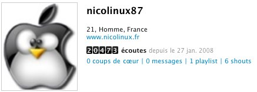
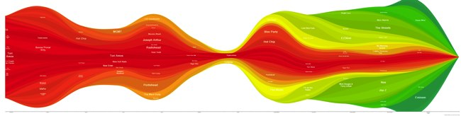
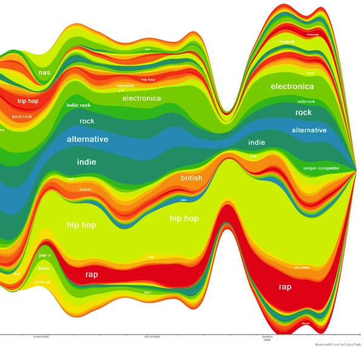
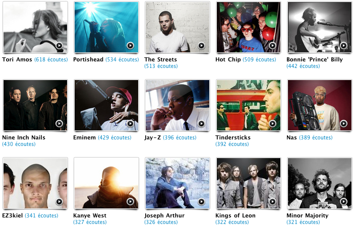
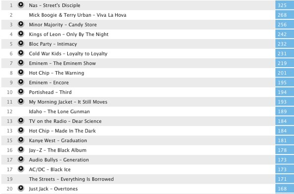
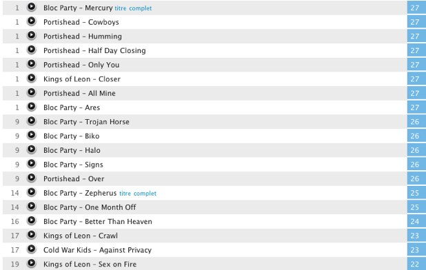

+++
type = "post"
titre = "Un an en musique"
title = "Un an en musique"
url = "/un-an-en-musique"
date = "2009-01-28T01:02:38"
Lastmod = "2013-09-08T00:05:56"
cover = "last-fm.jpg"
categorie = [ "En bref" ]
tag = [ "Chiffres", "Musique" ]

+++

Il y a tout juste un an, j&rsquo;ouvris un compte sur <a href="http://www.lastfm.fr/home">Last.fm</a>, un système au concept original et intéressant : les utilisateurs envoient au site tous les morceaux de musique qu&rsquo;ils écoutent.  Pour en faire quoi, me direz-vous ? Eh bien tout un tas de choses : découvrir de nouvelles musiques, trouver des gens aux goûts musicaux proches (des &laquo;&nbsp;voisins&nbsp;&raquo;) ou se faire des amis<a href="#footnote_0_1162" id="identifier_0_1162" class="footnote-link footnote-identifier-link" title="Eh oui, la sempiternelle liste d&rsquo;amis est bien l&agrave;, &laquo;&nbsp;&agrave; la Facebook&nbsp;&raquo;&hellip;">1</a>, mais aussi, bêtement, enregistrer ce qu&rsquo;ils écoutent et établir des statistiques. Certes, cela ne sert à rien. Mais enfin, il y en a qui aiment les statistiques et qui aiment découvrir ce qu&rsquo;ils sont vraiment, sans peut-être en avoir conscience. Il se trouve que j&rsquo;en suis.

Pour votre plus grand bonheur (ou pas), j&rsquo;ai décidé de décortiquer <a href="http://www.lastfm.fr/user/nicolinux87/charts">mes statistiques</a> après un an d&rsquo;écoute. Mais avant de commencer, signalons que ces statistiques ne concernent que la musique que j&rsquo;ai écoutée sur mon ordinateur quand j&rsquo;avais une connexion Internet. Ceci explique, notamment, les &laquo;&nbsp;trous&nbsp;&raquo; vacanciers, ou bien l&rsquo;absence de certains artistes, plutôt écoutés sur mon iPod, au casque. Par ailleurs, étant donné que cela ne fait qu&rsquo;un an que j&rsquo;utilise le système, certains phénomènes sont surreprésentés et doivent être relativisés en raison de leur courte durée.

Commençons par le plus évident, le nombre de titres lus en un an. Plus de 20 000, 20 473 très exactement au moment où la capture d&rsquo;écran a été prise, mais iTunes tournant toujours, le chiffre continue d&rsquo;augmenter. C&rsquo;est à la fois beaucoup, et assez peu. En moyenne, j&rsquo;ai écouté 56 titres par jour ou 1706 par mois. En général, une journée de travail chez moi équivaut à une grosse centaine de titres. Ayant passé de nombreuses journées sans rien écouter (en tout cas rien avec iTunes et une connexion Internet), cette moyenne ne veut plus dire grand-chose, comme toutes moyennes en fait.

L&rsquo;application <a href="http://www.lastfm.fr/user/C26000/journal/2006/07/30/383m_last.fm_extra_stats">Last.Fm Extra Stats</a> permet de faire de magnifiques, et assez impressionnants graphiques d&rsquo;écoute. Voici le mien : je vous encourage à cliquer pour obtenir quelque chose de lisible. Même en petite taille, ces graphiques sont admirables pour observer une année d&rsquo;écoute en un clin d&rsquo;œil. Ainsi, la rupture estivale, au milieu, est particulièrement visible. Elle sépare également, de manière remarquable, la prépa (avant) et l&rsquo;université (après)&#8230; Dans le détail, on voit le travail qui augmente en prépa, tandis qu&rsquo;à la fac, les mois de décembre et janvier sont marqués par une inflation très importante. À croire ces graphiques, je ne suis jamais autant resté chez moi (quand je suis chez moi, j&rsquo;écoute forcément de la musique, et j&rsquo;ai une connexion Internet) ces deux derniers mois que sur les 10 précédents.

Autre élément qui saute aux yeux, l&rsquo;arrivée massive de la couleur verte depuis le mois d&rsquo;octobre. Les couleurs sont attribuées par ordre d&rsquo;arrivée des artistes : en rouge sont les artistes que j&rsquo;écoutais au début, puis en allant vers le vert, tous les artistes nouveaux. Le rouge foncé désigne les vieux de la vieille si j&rsquo;ose dire (Tori Amos, Tindersticks, Radiohead&#8230;) tandis que le vert foncé signale les derniers arrivés (Eminem en particulier). Cette entrée massive du vert symbolise très bien ma découverte du rap, déjà <a href="/tag/rap/">évoquée à plusieurs reprises</a> ici. La majeure partie des artistes en vert sont, en effet, des artistes liés au rap ou hip-hop (ou approchant), à quelques exceptions près (Minor Majority notamment, que <a href="/2008/11/23/minor-majority-pop-legere-agreable/">je signalais</a> comme coup de cœur fin novembre).

Ces graphiques peuvent également être faits sur les genres et non plus les artistes, mais j&rsquo;ai trouvé que c&rsquo;était moins parlant de reprendre les codes couleurs précédents (en fonction de la date d&rsquo;arrivée). J&rsquo;ai choisi, pour que ça ait un sens, de prendre des couleurs aléatoires. La version complète est toujours disponible en cliquant sur l&rsquo;extrait ci-dessous qui ne présente que la période récente et montre, à nouveau, cette arrivée massive du hip-hop et du rap (couleurs verdâtre et rouge) dans mes écoutes.

C&rsquo;est ça qui m&rsquo;intéresse dans Last.fm : je ne me suis pas dit un jour tiens, Nicolas, si tu écoutais du rap aujourd&rsquo;hui. Tout s&rsquo;est fait inconsciemment, <a href="/2008/11/14/viva-la-hova-le-dialogue-des-musiques/">j&rsquo;ai découvert un album </a>mêlant Coldplay et Jay-Z, et partant j&rsquo;ai &laquo;&nbsp;découvert&nbsp;&raquo; le rap. Après cela, les découvertes d&rsquo;artistes se sont enchaînées, et de fil en aiguille, j&rsquo;en suis venu, aujourd&rsquo;hui, à écouter beaucoup de rap et dérivés. Last.fm a nettement enregistré cette &laquo;&nbsp;découverte&nbsp;&raquo; tout en me permettant d&rsquo;en prendre clairement conscience.

Revenons aux artistes : Last.fm propose des listes des artistes/albums/morceaux les plus écoutés. Ci-dessous, les quinze artistes que j&rsquo;ai le plus écoutés pendant ces derniers mois. Quand je vois ça, j&rsquo;ai du mal à croire que c&rsquo;est ma liste et non celle d&rsquo;un autre. Déjà, il n&rsquo;y a qu&rsquo;un artiste que je placerai spontanément dans la liste de mes artistes préférés, si vous me la demandiez, à savoir Portishead. Les autres, comme Radiohead, Peter Gabriel ou encore Noir Désir sont non seulement absents de ce top 15, mais aussi relégués dans les profondeurs du classement. Radiohead est ainsi au 41e rang, tandis que Peter Gabriel atteint péniblement le 66e rang, et que Noir Désir est même au&#8230; 119e rang, soit, en gros, aussi bien que&#8230; Cocoon, groupe que je n&rsquo;apprécie pas particulièrement.

Cela montre, à mon avis, deux choses : d&rsquo;une part, les artistes que l&rsquo;on dit préférer ne sont pas forcément ceux que l&rsquo;on écoute le plus. Soit parce que leur œuvre musicale n&rsquo;a plus aucun secret pour nous (c&rsquo;est un peu mon cas), soit aussi parce que l&rsquo;on place dans les meilleurs artistes ceux qui, pense-t-on, méritent d&rsquo;y être, un mérite basé en grande partie sur la réputation ou légitimité desdits artistes. Cet aspect joue aussi dans mon cas.

En effet, dans ce top 15, je compte pas moins de 5 rappeurs — soit un tiers de la liste — et pas n&rsquo;importe quels rappeurs ! Si Kanye West peut faire l&rsquo;objet d&rsquo;un malentendu, tant son dernier album n&rsquo;est pas du rap, les autres n&rsquo;ont aucune excuse. D&rsquo;autant qu&rsquo;ils sont souvent typiques de ce que je détestais dans le rap, comme en témoignent les photos. Regardez NaS et son look tellement rappeur américain (casquette à l&rsquo;envers, on devine l&rsquo;ample baggy, et bien sûr l&rsquo;énorme ghetto blaster&#8230;) ; ou bien Eminem et sa main qui témoigne du geste par excellence du rappeur ; ou encore Jay-Z, dans le genre rappeur pété de tunes, le gros cigare à la bouche. The Streets passerait largement incognito dans tout cela, de même que Kanye West : c&rsquo;est étonnant de voir que ces deux artistes sont à l&rsquo;origine d&rsquo;un rap très différent des trois autres, comme si, malgré tout, l&rsquo;habit faisait le moine.

Voir Emimen si haut placé me fait l&rsquo;effet d&rsquo;un choc, car il fut vraiment l&rsquo;Antéchrist absolu en matière de rap, celui que je ne pouvais pas voir, pas même en photo ou en film (je n&rsquo;ai jamais vu <em>8 Miles</em> par exemple). C&rsquo;est d&rsquo;autant plus étonnant que je n&rsquo;ai de lui que deux albums (un troisième a été récupéré aujourd&rsquo;hui, mais ça ne compte qu&rsquo;à la marge). C&rsquo;est d&rsquo;ailleurs le problème principal du système de Last.fm : si un artiste ne fait que des titres courts, mais nombreux, il sera surreprésenté par rapport à un autre qui ne fera que des titres longs, mais peu nombreux. Typiquement, quelqu&rsquo;un comme Mike Oldfield et ses albums à deux, voire un, morceaux peinera à monter dans un classement. Inversement, dans mon cas, la position de Tori Amos doit être relativisée par le fait qu&rsquo;elle fasse des albums longs (plus d&rsquo;une heure), pleins de morceaux (souvent plus de 20). Ayant tous ses albums, je ne les ai jamais écoutés plus de 10 fois, mais cela a suffi à propulser l&rsquo;artiste en tête. Portishead, au contraire, est ici à cause d&rsquo;une écoute très intensive depuis ma découverte du groupe, en juin dernier approximativement.

La liste des albums les plus écoutés (ci-dessus) est révélatrice de cette différence entre albums à morceaux longs, et albums à morceaux courts. Ainsi, le premier album de la liste est un double (25 titres), le second contient aussi 20 titres, le troisième est également un double (27 titres). D&rsquo;autres albums, comme celui de Kings of Leon, Bloc Party, Portishead ou ceux de Hot Chip ont été, au contraire, énormément écoutés et ça n&rsquo;est pas un hasard, du coup, si les titres les plus écoutés (ci-dessous) appartiennent à ces albums.

Pour finir, un point qui m&rsquo;inquiète régulièrement, je dois bien l&rsquo;avouer : suis-je suffisamment ouvert à la diversité musicale ? Il m&rsquo;a toujours semblé important d&rsquo;écouter de tout, et je suis incapable d&rsquo;écouter la même chose très longtemps. Je fonctionne par cycle : un album/artiste pendant un certain temps, puis un nouvel artiste/album. Ce mode d&rsquo;écoute m&rsquo;oblige à la découverte, mais celle-ci peut se faire uniquement dans un même genre, ce qui serait une diversité au rabais de mon point de vue. C&rsquo;est pourquoi si je dis que cette entrée massive du rap m&rsquo;effraie un peu, ça n&rsquo;est pas totalement faux, mais pas totalement vrai non plus. En même temps, elle me réjouit, car j&rsquo;ai, enfin, réussi à passer outre ce blocage qui tenait — sur rien ! — depuis le collège.

Les statistiques de cette année montrent que j&rsquo;écoute un nombre assez important d&rsquo;artistes différents (478 au compteur en ce moment), mais c&rsquo;est beaucoup moins que d&rsquo;autres participants. Je ne sais trop qu&rsquo;en penser, à dire vrai. Peu importe sans doute, tant que ce chiffre augmente, signe de découvertes nouvelles (car il y a toujours autant à découvrir en musique). Il existe aussi des tas de calculateurs d&rsquo;ouverture musicale, censés, par des calculs aussi abscons que peuvent l&rsquo;être, parfois, les statistiques, déterminer si vous êtes ouverts ou pas.  J&rsquo;en ai fait un (ci-dessous) et obtenu 128 ce qui veut dire&#8230; ben je ne sais pas bien au juste. Le très moche graphique est censé résumer tout cela par les tags, mais je trouve que c&rsquo;est idiot comme principe, étant donné que j&rsquo;ai quasiment 40 % avec le tag &laquo;&nbsp;autres&nbsp;&raquo;. Je suis bien avancé avec ça du coup&#8230;

Étant donnée l&rsquo;heure, le fait que je doive justifier ma carte d&rsquo;étudiant demain (et faire mentir ce que je disais plus haut&#8230;) et cette note finale négative, je crois qu&rsquo;il est temps que j&rsquo;arrête ici. D&rsquo;autant que je ne suis pas sûr du tout que cette petite analyse ait un intérêt quelconque, nonobstant, bien sûr, mon intérêt personnel pour la chose. À tout le moins, les graphiques étaient jolis, trouvé-je, et valaient la peine d&rsquo;être diffusés.

Fallait-il en faire une si longue tartine cependant ? Telle est, en effet, la question&#8230; 😉 Merci à tous ceux qui sont arrivés jusqu&rsquo;ici !

<ol class="footnotes"><li id="footnote_0_1162" class="footnote">Eh oui, la sempiternelle liste d’amis est bien là, &laquo;&nbsp;à la Facebook&nbsp;&raquo;&#8230; [<a href="#identifier_0_1162" class="footnote-link footnote-back-link">&#8617;</a>]</li></ol>
