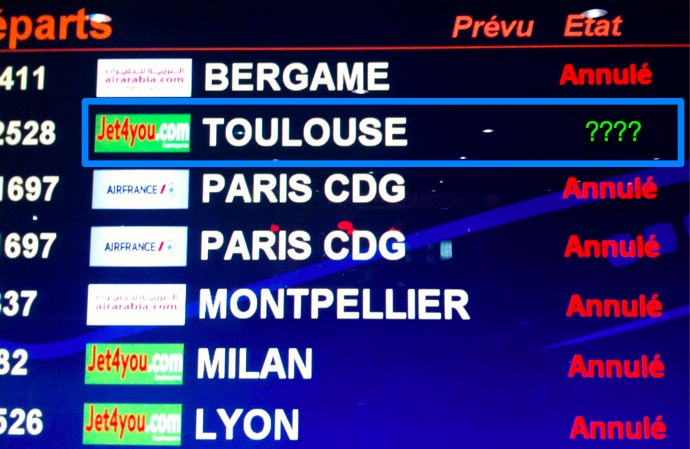
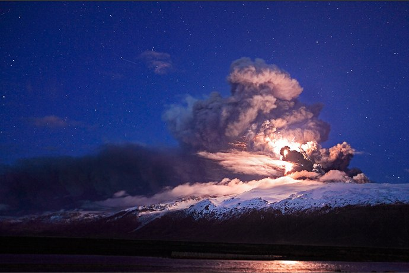
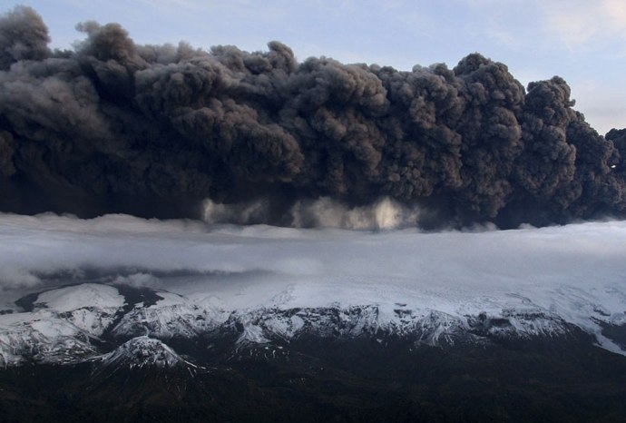
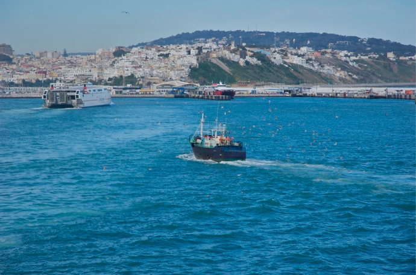
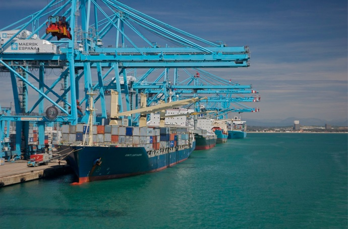

+++
type = "post"
titre = "Un monde sans ciel"
title = "Un monde sans ciel"
url = "/un-monde-sans-ciel"
date = "2010-04-19T14:35:38"
Lastmod = "2012-12-29T09:58:35"
cover = "jet4you.jpg"
tag = [ "Avion", "Bateau", "Société" ]

+++

On y croyait pourtant. Blagnac, dernier aéroport français encore épargné par ce fichu nuage islandais. Un Casablanca-Blagnac avec encore quelques places à bord. On nous fait monter. On décolle, on se voyait déjà toucher le sol toulousain. Et puis après une heure de vol, alors que l&rsquo;avion survolait déjà l&rsquo;Espagne, la voix du commandant annonce que l&rsquo;espace aérien français vient de fermer intégralement et qu&rsquo;il faut faire demi-tour vers le Maroc. Cruelle décision à un moment où tout semblait finalement fonctionner, où la chance semblait avoir tourné avec l&rsquo;annulation de notre vol vers Paris, la veille.

Il faudra donc rentrer en train, en bus, en bateau. Cela prendra du temps, beaucoup de temps, mais au moins on ne sera plus soumis aux aléas volcaniques.

Un petit volcan sur une ile au beau milieu de l&rsquo;océan Atlantique bien connue pour ses eaux chaudes et ses groupes de musique. Une éruption, un nuage de cendres apparemment anodin, invisible du sol. Et c&rsquo;est tout le système aérien européen et par conséquence mondial qui déraille. Un incident totalement imprévu et imprévisible, incontrôlable et impitoyable. Des centaines de milliers de voyageurs bloqués en Europe et à l&rsquo;étranger, des avions cloués au sol, des millions perdus chaque jour pour toutes les compagnies. Brusquement, en quelques jours, c&rsquo;est toute l&rsquo;aviation moderne qui a subitement cessé de fonctionner sur l&rsquo;Europe.

C&rsquo;est évidemment un rappel de la toute-puissance de la nature et de la faiblesse de l&rsquo;homme. L&rsquo;éruption en cause est limitée, on reste loin des plus grosses éruptions connues. Et cette petite éruption a d&rsquo;ores et déjà provoqué le plus gros dérèglement généralisé dans la courte histoire de l&rsquo;aviation civile. Qu&rsquo;est ce que cela aurait été si l&rsquo;explosion avait été beaucoup plus forte ? Pour l&rsquo;heure, seul l&rsquo;espace aérien européen est touché, les autres continents sont encore libres. Imaginons un seul instant que tout un hémisphère soit concerné, c&rsquo;est toute notre économie qui serait remise en cause. D&rsquo;autant que l&rsquo;on ne peut strictement rien faire contre ce genre d&rsquo;incidents. Le 11 septembre avait provoqué la fermeture complète de l&rsquo;espace aérien américain, certes, mais c&rsquo;était une fermeture raisonnée et limitée dans le temps. On avait aussi une solution pour combler la faille : depuis les contrôles se sont renforcés considérablement et il n&rsquo;y a plus eu un seul détournement d&rsquo;avion. Quand il s&rsquo;agit d&rsquo;un nuage d&rsquo;origine volcanique, que peut-on faire ? Inventer des ventilateurs géants pour déplacer le nuage ? Mettre des filtres sur les volcans ? Au mieux pourrait-on envisager d&rsquo;adapter les avions pour les rendre compatibles, mais le coût de la transformation sera-t-il rentable face à un risque après tout minime ? La seule chose que l&rsquo;on puisse vraiment faire est de prévenir les éruptions, et de préparer les fermetures des espaces aériens de manière plus rapide, en détournant automatiquement les avions vers les aéroports encore accessibles.

<a href="http://www.flickr.com/photos/orvaratli/4528090113/">© orvaratli @ Flickr</a>

Cet incident, le plus important depuis le 11 septembre selon ce que l&rsquo;on peut lire partout, révèle surtout avec brio la dépendance des sociétés modernes vis a vis du transport aérien. Peut-on sérieusement considérer un monde sans avion ? Ça n&rsquo;est pas tant que les autres modes de transport manquent, mais ils sont insuffisants on a surtout perdu l&rsquo;habitude de ne pas avoir tout, tout de suite. Avec Internet, on dispose de toutes les informations instantanément sur tous les coins de la planète. Le ciel permet de relier ces mêmes coins de la planète en moins d&rsquo;une journée. Et toutes nos sociétés reposent désormais sur ces deux principes d&rsquo;instantanéité ou au moins de rapidité. Pour faire un Maroc-France sans avion, il faut compter 36 heures en bus, alors que ce sont deux pays finalement très proches. Ceux qui sont actuellement coincés en Amérique, en Asie ou pire, en Australie sont par contre bel et bien coincés, à moins d&rsquo;envisager de longues et couteuses traversées océaniques. L&rsquo;avion apparaît en effet comme une solution relativement peu onéreuse, sans doute parce que plus courte. Pourtant, avec l&rsquo;augmentation du prix des hydrocarbures, sans compter sur les changements climatiques, il faudra peut-être s&rsquo;habituer à vivre sans avion. Sauf que la crise économique promet de reprendre de plus belle après le passage du nuage qui finira bien par passer.

En attendant, on peut ici remercier la compagnie marocaine <a href="http://www.jet4you.com/static/fr-FR/index.html">Jet4You</a> qui, sous prétexte de la fermeture de l&rsquo;espace aérien d&rsquo;une partie de l&rsquo;Espagne et de l&rsquo;aéroport toulousain (ce qui était faux au moment où on devait se poser, au passage), nous a fait un Casablanca-Casablanca via l&rsquo;Espagne pour la modique somme de 140 €. Faire demi-tour parce que contourner une zone et risquer de bloquer son avion au sol pour une durée indéterminée est certes logique dans une vision capitaliste et court-termiste, mais c&rsquo;est vraiment lamentable et donne pour le moins une piètre image de la compagnie. Surtout quand on est incapable de proposer un quelconque suivi derrière, se contentant de proposer un papier avec un numéro a l&rsquo;arrivée. Quand, en plus, le numéro ne répond pas et le site est vide, cela commence à faire beaucoup. Pour la petite histoire, un Marrakech-Toulouse de Royal Air Maroc a atterri gentiment quelques minutes après l&rsquo;heure prévue pour notre vol, et le même vol le lendemain a bien atterri à Blagnac. Jet4You, j&rsquo;ai donné, je ne suis pas prêt de retenter. À bon entendeur…

<a href="http://www.lepoint.fr/actualites/2010-04-16/islande-les-images-spectaculaires-de-l-eruption-volcanique/914/2/1550/0/#newdiapo">© HO / X80001</a>

Étant en plein dans l&rsquo;action (je prends un bus Casa-Paris ce soir, arrivée prévue mercredi matin, <em>inch Allah</em> comme on dit ici), il m&rsquo;est difficile de penser à un quelconque bilan. Néanmoins, je rejoins l&rsquo;<a href="http://davidabiker.fr/wordpress/quand-le-ciel-bas-et-lourd-pese-comme-un-couvercle/">avis de David Abiker</a>, cette immobilisation de l&rsquo;Europe pour une catastrophe naturelle a un côté sympathique. Certes, c&rsquo;est au moins agaçant, mais finalement c&rsquo;est un peu un voyage dans le temps à moindres frais. Car n&rsquo;oublions quand même pas la bonne nouvelle, il n&rsquo;y a toujours pas de morts (© FD)…

<strong>Mise à jour après l&rsquo;arrivée à bon port</strong> (21/04/10, 14h30) : le voyage en car s&rsquo;est bien déroulé. Ce fut long, comme prévu, même si j&rsquo;ai écourté mon voyage en m&rsquo;arrêtant à Bordeaux. Mon retour a nécessité en gros 30 heures, donc 2h30 en bateau pour traverser entre Tanger et Algésiras et 2 heures de train entre Bordeaux et Toulouse. Bilan, si vous devez aller au Maroc sans avion, la <a href="http://www.ctm.ma/" target="_blank">CTM</a> est une bonne compagnie dans l&rsquo;ensemble. Les bus sont modernes et aussi confortables qu&rsquo;un bus peut l&rsquo;être : climatisation, sièges (un peu) inclinables… mais pas de toilettes à bord ni, étrangement, de lumière. De toute façon, cela importait peu vu notre état de fatigue. Et passer autant d&rsquo;heures dans aussi peu d&rsquo;espace (à côté, même un avion paraît spacieux) n&rsquo;est guère agréable.

Disons que l&rsquo;on est content de quitter le véhicule dès que c&rsquo;est possible de le faire, c&rsquo;est-à-dire à toutes les pauses manifestement identiques pour chaque voyage sur ce trajet. On nous lâche ainsi dans de classiques stations services, surtout en Espagne et en France, mais aussi, plus originalement, dans un camping qui appartenait certainement au cousin du chauffeur. Ambiance surréaliste à cause de la fatigue, avec improvisation de chants autour du voyage et apprentissage de l&rsquo;art du Rubik&rsquo;s Cube au programme (si si). Le slogan de la CTM promet de réduire les distances et de rapprocher les hommes, et si la première partie est discutable, la seconde en revanche l&rsquo;est beaucoup moins. Pas de doutes, après 30 heures dans un bus, on est proche des autres. Ceux qui aiment les rencontres apprécieront ce mode de transport, même si en l&rsquo;occurrence, tout le monde était pour le moins tendu.

<a href="http://www.flickr.com/photos/nicolinux/4541111076/in/set-72157623779270533/" target="_blank"><em>Départ de Tanger – FlickR</em></a>

Sinon, la traversée de la Méditerranée ou de l&rsquo;Atlantique selon le point de vue est très sympathique. Un peu longue dans notre cas, avec un navire qui, disons, ne sentait pas le neuf mais plutôt le gasoil ou les toilettes selon que l&rsquo;on se plaçait à l&rsquo;intérieur ou à l&rsquo;extérieur. Par beau temps et quand la mer est d&rsquo;huile, c&rsquo;est vraiment agréable, on peut voir en détail le rocher de Gibraltar. Le départ et l&rsquo;arrivée dévoilent aussi quelques aspects intéressants sur les deux pays, d&rsquo;un côté la médina traditionnelle à flanc de colline, de l&rsquo;autre une urbanisation débridée si typique de nombreuses villes espagnoles. Le port de Tanger ferait presque penser à un petit port villageois à côté de celui d&rsquo;Algésiras avec ses grues dédiées aux portes-conteneurs.

<a href="http://www.flickr.com/photos/nicolinux/4540480691/in/set-72157623779270533/" target="_blank"><em>Le port d&rsquo;Algésiras – FlickR</em></a>

Bon, j&rsquo;arrête avec ce retour perturbé, j&rsquo;ai une montagne de mails en retard à traiter, sans compter plusieurs articles pour le blog dans les tuyaux&#8230; 😉

