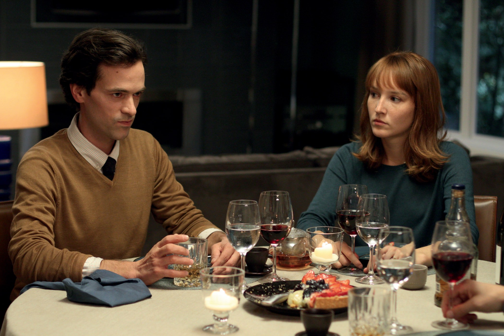

+++
titre = "<em>Une nouvelle amie</em>, François Ozon"
title = "Une nouvelle amie, François Ozon"
url = "/une-nouvelle-amie-ozon"
date = "2014-11-09T15:58:11"
Lastmod = "2014-11-09T16:01:34"
cover = "une-nouvelle-amie-romain-duris-anais-demoustier.jpg"
categorie = [ "À voir" ]
tag = [ "Adaptation littéraire", "Amitié", "Amour", "Famille", "Homosexualité", "Mort", "Sexe", "Sorties du mois", "Transsexualité" ]
createur = [ "François Ozon" ]
acteur = [ "Anaïs Demoustier", "Raphaël Personnaz", "Romain Duris" ]
annee = [ "2014" ]
weight = 2014
pays = [ "France" ]

+++

<em>Une nouvelle amie</em> commence avec un maquillage. Du rouge sur les lèvres, du mascaras sur les lèvres, du fard sur les joues… et en fond, une musique qui évoque un mariage. Le spectateur est nécessairement conduit à penser que cette jeune femme va se marier, d&rsquo;autant que l&rsquo;on voit ensuite une couronne de fleur sur sa tête… mais le charme est rompu dans la seconde qui suit quand une main vient se poser sur ses yeux pour les fermer. On ne vient pas d&rsquo;assister à un maquillage de mariage, mais à celui d&rsquo;un enterrement : à l&rsquo;image de cette première scène, le dernier film de François Ozon est trompeur. On s&rsquo;attendrait à une histoire de couples qui se trompent et se déchirent après un déchirent, mais s&rsquo;il y a bien un peu de cela, le vrai sujet est ailleurs. On peut d&rsquo;ailleurs féliciter les producteurs qui ont réussi à masquer ce véritable sujet à la fois du synopsis et de la <a href="https://www.youtube.com/watch?v=lxNUmOe-dhY">bande-annonce</a>, même s&rsquo;il est sous-entendu à chaque fois, si bien qu&rsquo;il vaut mieux vaut avoir vu <em>Une nouvelle amie</em> avant de lire la suite.

François Ozon ouvre <em>Une nouvelle amie</em> par un enterrement et donc par un vide. Laura est morte pour une raison inexpliquée, mais elle laisse derrière elle un mari, une fille de quelques mois et sa meilleure amie, Claire. Laura et Claire ne se quittaient plus depuis leur première rencontre, quand elles avaient sept ans, elles étaient inséparables et plus proches que deux sœurs. Cette disparition prématurée plonge Claire dans une dépression assez grave et le film ne commence en fait vraiment qu&rsquo;au moment où, poussée par son mari qui veut l&rsquo;aider à oublier son amie, elle va voir David, l&rsquo;ancien mari de Laura. On s&rsquo;attend alors à ce que les deux se rapprochent progressivement et entament une relation, mais le scénario adapté par François Ozon est plus complexe que cela. Quand Claire va le voir, elle surprend le mari de son ancienne amie travesti en femme et elle découvre alors qu&rsquo;il a toujours eu cette envie de s&rsquo;habiller en femme pour plaire aux hommes. <em>Une nouvelle amie</em> prend alors une autre dimension et pose quelques questions autour de la transsexualité : comment David peut-il éduquer sa fille de six mois s&rsquo;il se met à s&rsquo;habiller en femme, en plus s&rsquo;il utilise pour cela les habits de la mère que sa fille a perdu ? Peut-il faire son deuil en revendiquant son changement de sexe ? Et est-il gay pour autant ? Est-ce que cela veut dire qu&rsquo;il n&rsquo;a pas vraiment aimé Laura ? Les questions fusent et François Ozon y répond méthodiquement, mais là encore, le film est trompeur, il est déjà ailleurs. C&rsquo;est qu&rsquo;<em>Une nouvelle amie</em> montre aussi que Claire ne reste pas insensible face à David transformé en femme. Cette personne qu&rsquo;elle renomme Virginia la sort de sa torpeur et de sa dépression et elles finissent par se faire des sorties « entre filles » : shopping, cinéma… et bientôt des week-end entiers. Peu à peu, on retrouve l&rsquo;amitié d&rsquo;autrefois entre Claire et Laura, voire un petit peu plus. C&rsquo;est là toute l&rsquo;intelligence de François Ozon : et si, au fond, Claire n&rsquo;avait pas toujours éprouvé un petit peu plus que de l&rsquo;amitié pour son amie d&rsquo;enfance ? On n&rsquo;en dira pas plus — la fin aurait peut-être gagné elle aussi à en dire un peu moins, d&rsquo;ailleurs —, mais <em>Une nouvelle amie</em> reste ainsi trompeur jusqu&rsquo;au bout.

Sans prétendre au titre de film de l&rsquo;année, <em>Une nouvelle amie</em> parvient à surprendre à plusieurs reprises et à cet égard, François Ozon réussit son coup. Il faut dire aussi qu&rsquo;il a choisi d&rsquo;excellents acteurs. Anaïs Demoustier est très bien pour interpréter Claire, mais c&rsquo;est surtout Romain Duris qui est incroyable à l&rsquo;écran. L&rsquo;acteur n&rsquo;a plus à prouver son talent, mais cela faisait longtemps qu&rsquo;on ne l&rsquo;avait pas vu aussi bon qu&rsquo;ici, quand il passe avec une aisance troublante de David à Virginia. Il a beau avoir des traits assez marqués, son personnage de femme est tout à fait crédible et c&rsquo;est sans aucun doute la plus belle réussite d&rsquo;<em>Une nouvelle amie</em>.

