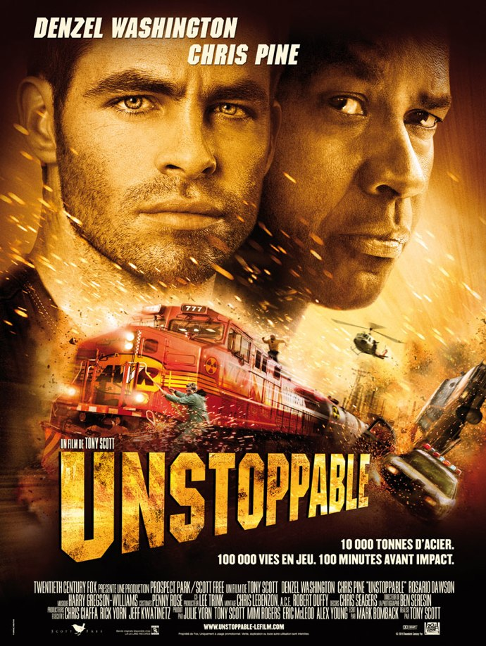
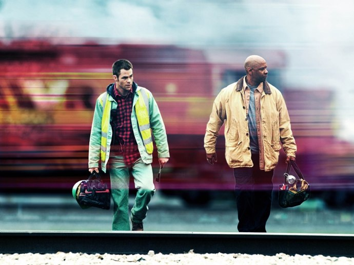
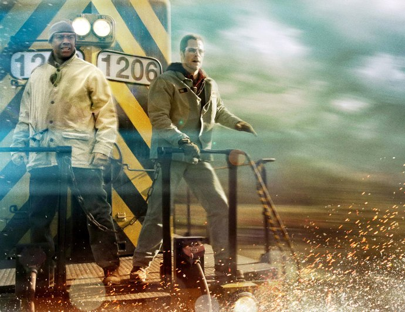

+++
type = "post"
titre = "<em>Unstoppable</em>, Tony Scott"
title = "Unstoppable, Tony Scott"
url = "/unstoppable-scott"
date = "2010-11-20T23:54:25"
Lastmod = "2013-11-17T16:21:33"
cover = "scott-unstoppable.jpg"
categorie = [ "À voir" ]
tag = [ "Action", "Blockbuster", "Famille", "Société", "Thriller", "Train", "Vite oublié" ]
createur = [ "Tony Scott" ]
acteur = [ "Chris Pine", "Denzel Washington", "Ethan Suplee", "Rosario Dawson" ]
annee = [ "2010" ]
weight = 2010
pays = [ "États-Unis" ]

+++

Dans la famille Scott, Tony n&rsquo;est sans doute pas le plus célèbre, un peu dans l&rsquo;ombre de <a href="http://voiretmanger.fr/createur/ridley-scott/">Ridley</a>, son grand frère. Alors que ce dernier s&rsquo;est lancé dans la <a href="http://voiretmanger.fr/2010/05/14/robin-des-bois-scott/">fresque historique</a> aussi épique que banale, Tony Scott a décidé de faire un film beaucoup plus modeste. <em>Unstoppable</em>, c&rsquo;est un film d&rsquo;action à l&rsquo;ancienne, un blockbuster pop-corn vite oublié, mais aussi un grand spectacle prenant et plaisant. À son niveau, c&rsquo;est une réussite.

<strong>Si vous ne voulez pas apprendre qu&rsquo;à la fin du film, le train et Denzel Washington se marièrent et eurent beaucoup d&rsquo;enfants, allez voir le film avant de continuer votre lecture…</strong>

<em>Unstoppable</em> constitue, mine de rien, une belle performance. Celle de faire un thriller à grand spectacle avec en tout et pour tout… un train vide. Enfin, vide de passagers parce que ce train contient sinon plusieurs wagons pleins d&rsquo;une substance très dangereuse. Rien d&rsquo;anormal, certes, sauf que ce train-là est lancé à toute allure dans les plaines américaines, sans conducteur dans la locomotive et sans moyen de l&rsquo;arrêter à distance. Le film ouvre dans l&rsquo;esprit de la série des <em>Destination Finale</em> : alors que l&rsquo;on suit dans leurs quotidiens quelques personnages, la caméra pose son œil sur des défauts, des problèmes, des oublis qui s&rsquo;enchaînent pour conduire à la catastrophe. Dans le cas de ce train, ce sont deux techniciens chargés de déplacer la rame qui, par fainéantise et inadvertance, lancent la locomotive à fond les manettes. Les trains américains sont connus pour être très longs et celui-ci ne fait pas exception à la règle : 800 mètres de long, 10 000 tonnes, ce train est lancé à plus de 120 km par heures, ce qui le rend &laquo;&nbsp;<em>unstoppable</em>&nbsp;&raquo; (impossible à arrêter). Les tentatives se font de plus en massives, avec plusieurs hélicoptères et des armées de policiers, au fur et à mesure que le convoi approche Stanton, ville de 100 000 habitants que ce train pourrait raser s&rsquo;il s&rsquo;écrase en ville. Comme le dit un personnage à un moment, ce n&rsquo;est plus un train, c&rsquo;est véritable missile.

La prouesse est là. Tony Scott parvient à faire haleter ses spectateurs pendant au moins une bonne heure, avec simplement un train et deux techniciens pas très fins. Tout ceci est somme toute banal, mais le réalisateur réussit très bien à instaurer un niveau de stress très élevé, du niveau des meilleurs blockbusters habituels, mais sans passer par une opposition gentils/méchants ou par des combats. Pour arriver à ce résultat, <em>Unstoppable</em> utilise à bon escient plusieurs effets classiques du cinéma hollywoodien. D&rsquo;abord des enjeux extraordinaires, bien résumés par l&rsquo;affiche : soit le train est freiné à temps, soit c&rsquo;est le plus gros accident ferroviaire de tous les temps, rien de moins. Comme dans tout bon blockbuster qui se respecte, cette catastrophe à l&rsquo;échelle du pays se retrouve dans des catastrophes personnelles : les deux héros du film ont ainsi des êtres chers qui, face à la catastrophe et l&rsquo;imminence de la mort, retrouvent leur amour plein et entier. Mais l&rsquo;ampleur de la catastrophe ne fait pas tout : un bon film catastrophe a aussi besoin de durée, et la réussite d&rsquo;<em>Unstoppable</em> provient justement de son presque temps réel. À quelques détails près en effet, Tony Scott maintient en permanence la tension grâce à l&rsquo;utilisation du temps réel qui permet aux spectateurs de s&rsquo;identifier pleinement aux évènements. Entre l&rsquo;ouverture du film (départ du train) et la fin du film (arrêt du train), il se passe peut-être deux heures, à peine plus que la durée réelle du film et ce choix est vraiment bienvenu, surtout à la fin, quand chaque minute compte. On sue à grosses gouttes comme les personnages quand l&rsquo;aiguille du compteur ne baisse pas, on craint en même temps que les téléspectateurs du film pour la vie des deux héros quand ils font des acrobaties sur le train… L&rsquo;effet est classique, bien connu depuis <em>24 heures chrono</em>, mais s&rsquo;avère ici très efficace, d&rsquo;autant qu&rsquo;il est inattendu. Encore une fois, il ne s&rsquo;agit que d&rsquo;un train incontrôlable à cause d&rsquo;une erreur humaine, même pas à cause d&rsquo;un plan machiavélique comme dans <em>Speed</em>. Avec un train seulement, Tony Scott fait un thriller haletant ; cette performance mérite d&rsquo;être saluée.

Indéniablement, Tony Scott aime les trains et il entend bien le montrer dans son dernier film. Dès le générique d&rsquo;ouverture, il filme sous tous les angles ces monstres d&rsquo;acier que sont les trains américains, aussi démesurés que l&rsquo;est ce pays-continent. <em>Unstoppable</em> est un film de trains et de cheminots ; avis aux amateurs, on saura tout sur le fonctionnement du rail aux États-Unis et notamment sur ses dysfonctionnements. Anciens cheminots souvent syndiqués et mis à la porte par des compagnies privées pour qui seule la rentabilité compte (quitte à sauver le train plutôt que le cheminot), matériel vieillissant surtout au niveau des infrastructures (une seule voie non électrifiée… on comprend sans peine que le rail n&rsquo;est plus depuis longtemps une priorité pour le pays) : les amateurs auront de quoi découvrir et si Tony Scott n&rsquo;est pas Ken Loach, cet aspect politique n&rsquo;est pas inintéressant et montre que la situation est souvent la même partout. Les trains sont l&rsquo;occasion de plans variés, tantôt à l&rsquo;intérieur de la cabine, tantôt devant le train, parfois en dessous, souvent aussi au-dessus, à vue d&rsquo;hélicoptère. <em>Unstoppable</em> ressemble souvent à une ode aux trains dotés d&rsquo;une beauté effrayante et peu maîtrisable. Car les trains sont personnifiés par le réalisateur, ils semblent dotés d&rsquo;une volonté propre sur laquelle les hommes n&rsquo;ont qu&rsquo;un pouvoir limité. C&rsquo;est particulièrement vrai pour le train 777, celui que personne ne peut arrêter, qui devient vraiment l&rsquo;incarnation du monstre des films catastrophes à l&rsquo;ancienne. On le surnomme &laquo;&nbsp;triple 7&Prime; et avec sa couleur rouge, on pourrait presque penser à une incarnation du diable en personne. Ce train va en tout cas mobiliser toutes les forces de l&rsquo;ordre et il faudra toute la force de nos deux héros pour parvenir à l&rsquo;arrêter. <em>Unstoppable</em> reste ici sur un terrain connu, à tel point que l&rsquo;on peut se demander si Tony Scott n&rsquo;a pas voulu rendre hommage aux films d&rsquo;action à l&rsquo;ancienne. L&rsquo;affiche est troublante à cet égard, le choix des couleurs, le rendu proche du dessin, le titre en 3D, les voitures de police qui volent et le duo d&rsquo;acteurs… l&rsquo;ensemble à un aspect un peu vieillot qui n&rsquo;est pas sans rappeler certains blockbusters de la fin du XXe siècle. Cet hommage, si c&rsquo;en est un, est plaisant, bien réalisé et prenant, même si on se serait bien passé du happy-end dégoulinant.

<em>Unstoppable</em> met en scène un train qui roule à toute allure sans contrôle et à son image, le film de Tony Scott dépote. Le réalisateur a judicieusement choisi de ne pas s&rsquo;attarder sur les détails : l&rsquo;arrière-plan des deux héros est ainsi évacué en quelques images au début du film, qui commence vraiment avec les trains. Fort heureusement, on n&rsquo;a pas droit aux flashbacks, juste quelques évocations dans la cabine de conduite du train et on note que le réalisateur se débrouille plutôt bien pour camper des personnages sans mots, avec seulement une image ou deux. L&rsquo;efficacité est le maître mot du film et l&rsquo;on ne s&rsquo;en plaindra pas, après tout on est dans la salle pour avoir du grand spectacle. Et on est servi d&rsquo;ailleurs par la caméra virevoltante de Scott. On l&rsquo;a dit, il aime les trains et les filme sous tous les angles : la caméra tourne ainsi autour de l&rsquo;acier, en longs travellings ou parfois (un peu trop à notre goût) version caméra sur l&rsquo;épaule. Tony Scott n&rsquo;est pas un plasticien, mais cela n&rsquo;est pas grave : il filme avec efficacité, privilégiant toujours les détails importants pour faire avancer l&rsquo;action. Il utilise aussi beaucoup l&rsquo;artifice des médias, présents en masse pour couvrir cet événement &laquo;&nbsp;en live&nbsp;&raquo; : ils sont si présents qu&rsquo;ils apportent les informations les plus fraiches et permettent même de suivre l&rsquo;action en direct. Accessoirement, c&rsquo;est aussi un bon moyen d&rsquo;évoquer cette société de médias où la télévision met en œuvre des moyens colossaux pour montrer ce qui se passe et où les citoyens préfèrent se mettre en danger pour ne rien rater et filmer la scène. Même si c&rsquo;est le train 777 le vrai héros d&rsquo;<em>Unstoppable</em>, le duo d&rsquo;acteurs qui incarne les héros officiels est plutôt efficace, avec un Denzel Washington égal à lui-même et un Chris Pine (déjà aperçu dans <em><a href="http://voiretmanger.fr/2009/05/08/star-trek-abrams/">Star Trek</a></em>) un peu écrasé par son aîné.

Il faut parfois peu de choses pour faire un bon film d&rsquo;action. Tony Scott a bien compris la leçon et propose un thriller haletant avec en tout et pour tout… un train sans conducteur. Un pari osé, presque un exercice de style d&rsquo;ailleurs, mais à l&rsquo;écran la réussite est indéniable. Dans le genre, on a pas fait aussi bien depuis longtemps : <em>Unstoppable</em> a l&rsquo;intelligence de rester très modeste, de ne pas chercher à complexifier inutilement une histoire extrêmement simple, mais va au contraire droit au but, à toute allure. Le film est loin d&rsquo;être un chef-d&rsquo;œuvre, mais il n&rsquo;en a pas le début de la prétention. Si le traitement sentimental est un peu trop forcé, comme dans tous les blockbusters, on passe un bon moment avec ce train furieux et c&rsquo;est bien l&rsquo;essentiel.

<a href="http://www.filmosphere.com/2010/11/critique-unstoppable-2010/">Nicolas</a> a aussi beaucoup apprécié ce qu&rsquo;il qualifie, à raison je pense, de film de monstres où la traditionnelle bête poilue ou à écailles a été remplacée par le train. <a href="http://fenetressurcour.blogspot.com/2010/11/back-to-xxth-century-unstoppable-de.html">Thimothée</a> en livre une analyse intéressante, faisant remonter les références au cinéma classique de Raoul Walsh plutôt qu&rsquo;au cinéma des années 1990. <a href="http://www.critikat.com/Unstoppable.html">Critikat</a> a reconnu le &laquo;&nbsp;plaisir coupable&nbsp;&raquo; qu&rsquo;on pouvait éprouver devant ce &laquo;&nbsp;pop-corn movie&nbsp;&raquo;, mais a refusé d&rsquo;y céder, évoquant même un film « infiniment vain et superficiel ». Dans un tout autre genre, ne ratez pas la longue et poilante &laquo;&nbsp;critique&nbsp;&raquo; de l&rsquo;<a href="http://odieuxconnard.wordpress.com/2010/11/13/un-train-peut-en-cacher-unstoppable/">odieux connard</a> de service, qui a notamment le mérite de faire rire en relevant les (fort nombreuses) incohérences du film.

<h3>Vous voulez m&rsquo;aider ?<a href="#footnote_0_4244" id="identifier_0_4244" class="footnote-link footnote-identifier-link" title="&Agrave; propos de la publicit&eacute;&hellip;">1</a></h3>
<ul>
<li><a href="http://www.amazon.fr/gp/product/B004FK2NB0/ref=as_li_ss_tl?ie=UTF8&tag=leblogdenic07-21&linkCode=as2&camp=1642&creative=19458&creativeASIN=B004FK2NB0">Acheter le film en Blu-Ray sur Amazon</a></li>
<li><a href="http://www.amazon.fr/gp/product/B004FK2MWA/ref=as_li_ss_tl?ie=UTF8&tag=leblogdenic07-21&linkCode=as2&camp=1642&creative=19458&creativeASIN=B004FK2MWA">Acheter le film en DVD sur Amazon</a></li>
<li><a href="http://itunes.apple.com/fr/movie/unstoppable/id407448911">Acheter le film sur l&rsquo;iTunes Store</a></li>
</ul>

<ol class="footnotes"><li id="footnote_0_4244" class="footnote"><a href="http://voiretmanger.fr/soutien/">À propos de la publicité…</a> [<a href="#identifier_0_4244" class="footnote-link footnote-back-link">&#8617;</a>]</li></ol>
