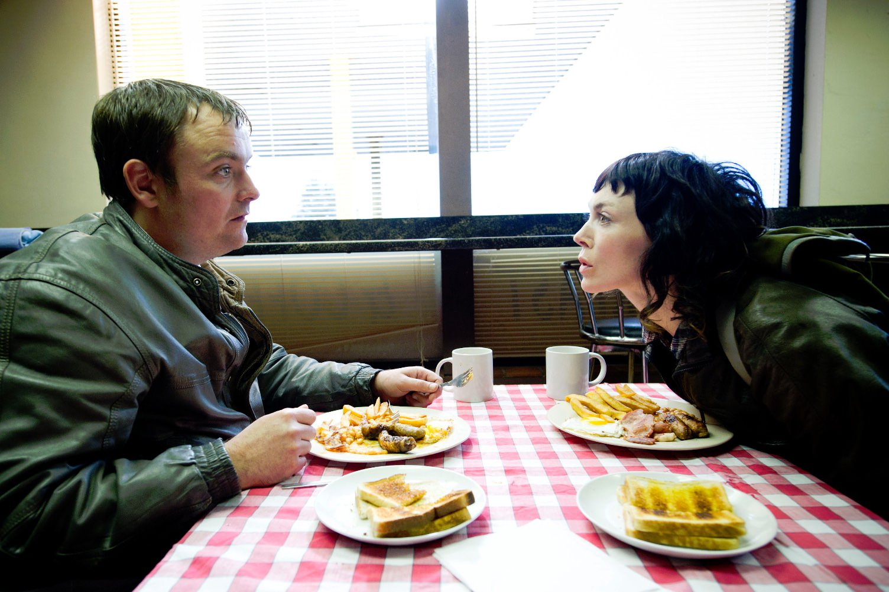
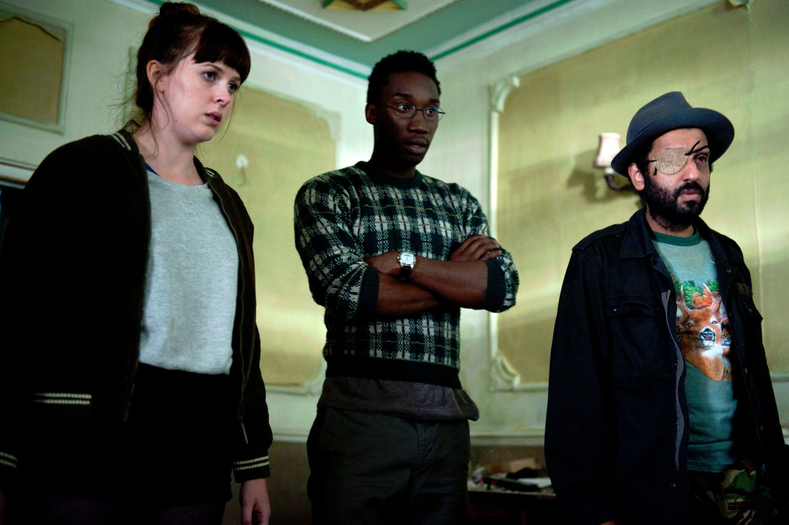
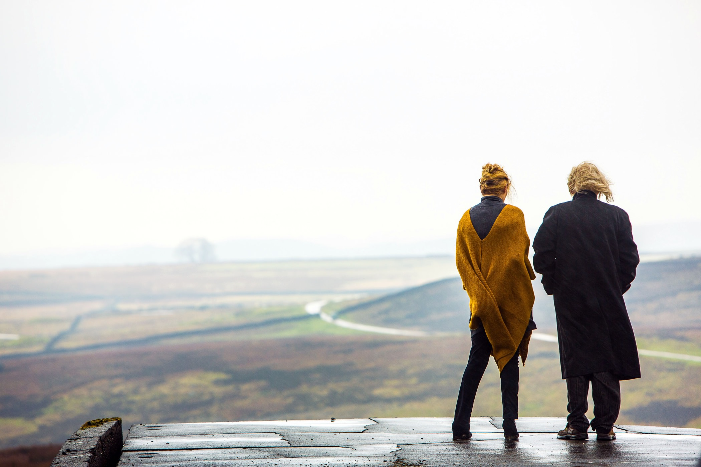

+++
type = "post"
titre = "<em>Utopia</em>, Dennis Kelly (Channel 4)"
title = "Utopia, Dennis Kelly (Channel 4)"
url = "/utopia-kelly-channel-4"
date = "2015-03-05T19:17:38"
Lastmod = "2015-03-05T21:02:17"
cover = "utopia-dennis-kelly-fiona-o-shaughnessy.jpg"
categorie = [ "À voir" ]
tag = [ "Dystopie", "Écologie", "Mort", "Nature", "Science", "Série", "Thriller", "Violence" ]
createur = [ "Channel 4", "Dennis Kelly" ]
acteur = [ "Adeel Akhtar", "Alexandra Roach", "Fiona O'Shaughnessy", "Geraldine James", "Nathan Stewart-Jarrett", "Neil Maskell", "Oliver Woollford", "Paul Higgins" ]
annee = [ "2013" ]
weight = 2013
pays = [ "Grande-Bretagne" ]

+++

Interrompue prématurément faute d&rsquo;audience, <em>Utopia</em> ne compte que douze épisodes, et pourtant c&rsquo;est sans conteste l&rsquo;une des séries les plus fortes de ces dernières années. Créée par Dennis Kelly pour la chaîne britannique Channel 4, elle aura une seconde chance avec un remake américain porté par HBO. En attendant, ses deux brèves saisons sont passionnantes et méritent largement d&rsquo;être vues. Même si la série baisse dans sa deuxième partie, son scénario digne des pires thrillers dystopiques parvient à convaincre, malgré ses incohérences. Et puis <em>Utopia</em> rattrape largement ses défauts par un univers époustouflant : très violente par moments, la série est aussi magnifique avec ses images hyper saturées et ses couleurs vives<a href="#fn-13251-1" rel="footnote">1</a>. S&rsquo;il ne fallait qu&rsquo;une raison de regarder la série de Dennis Kelly, ce serait sa forme, mais l&rsquo;histoire est aussi très divertissante.

<em>Utopia</em> marque d&rsquo;entrée les esprits avec une première scène… de massacre. Deux hommes entrent dans une boutique de bande-dessinée où ils cherchent un exemplaire apparemment précieux et très vite, ils tuent tout le monde à l&rsquo;aide d&rsquo;une bonbonne de gaz. En une scène, Dennis Kelly pose les bases de son scénario avec un mystère — que contient cette fameuse BD qui justifie de tuer autant d&rsquo;innocents ? — tout en imposant une violence frontale qui est la marque de fabrique de la série. Ce n&rsquo;est en effet que la première d&rsquo;une longue série de scènes de violence, avec quelques moments vraiment troublants ; en particulier une scène de massacre, à nouveau, mais cette fois dans une école primaire, a failli couper encore plus prématurément la diffusion du programme outre-Manche. Pour autant, ce n&rsquo;est pas une violence gratuite et ce n&rsquo;est rien en comparaison de l&rsquo;idée générale d&rsquo;<em>Utopia</em>. Le fil rouge pousse la thèse écologiste de la surpopulation au maximum et aboutit sur une conclusion d&rsquo;une logique effrayante : pour sauver la planète, il faut réduire drastiquement sa population. Peu à peu, la première saison dévoile une intrigue autour d&rsquo;un groupe de scientifiques qui mettent au point un programme chargé de stériliser 90 % de la population mondiale. Au fond, cette série choque moins sur le plan visuel que sur cette idée, d&rsquo;une violence rare. D&rsquo;autant plus qu&rsquo;elle est maintenue tout au long des deux saisons : on ressort de la douzaine d&rsquo;épisodes un peu sonné par sa brutalité.

Comme toutes les séries, <em>Utopia</em> met en place une galerie de personnages plus ou moins importants. Au cœur des enjeux, le duo qui prépare le complot dans le plus grand secret depuis trente ans, Mr. Rabbit et Philip Carvel qui est le scientifique qui a trouvé la formule pour stériliser presque toute la population. Pendant toute la première saison et une large partie de la seconde, ces deux personnages restent des mystères, on ne sait pas qui ils sont. À leur trousse, il y a Jessica Hyde, qui donne à la série sa réplique la plus centrale<a href="#fn-13251-2" rel="footnote">2</a>, mais aussi une bande de geeks qui s&rsquo;intéressent à la bande-dessinée et qui se trouvent emportés, bien malgré eux, dans ce complot mondial. S&rsquo;ils sont complexes et intéressants dans un premier temps, <em>Utopia</em> échoue en partie à maintenir leur intérêt tout au long de la série, et la majeure partie des personnages est décevante dans la deuxième saison. Il y a encore quelques rôles forts, mais on se désintéresse de ceux qui devraient être les plus importants à nos yeux, la faute non pas forcément aux acteurs, mais plutôt au scénario. Car si Dennis Kelly a une grande idée d&rsquo;ensemble, il multiplie les incohérences au point où l&rsquo;on perd un petit peu trop en crédibilité. Il y a ces personnages qui ressuscitent un peu trop facilement, quand ça arrange le récit. Et puis ces autres personnages qui n&rsquo;ont jamais tiré de leur vie et placent brutalement trois balles en pleine tête. Ou bien encore ce plan énorme, conçu depuis des années, qui menace de s&rsquo;écrouler pour un rien. <em>Utopia</em> déçoit ainsi en partie, même si encore une fois, le récit d&rsquo;ensemble est suffisamment prenant pour que l&rsquo;on ait envie de tout voir d&rsquo;une traite, sans jamais s&rsquo;arrêter.

Même si ses incohérences l&rsquo;empêche d&rsquo;accéder au statut de grande série, <em>Utopia</em> reste suffisamment passionnante pour être conseillée les yeux fermés. À condition d&rsquo;accepter sa violence, cette série signée Dennis Kelly est une réussite dans l&rsquo;ensemble, ne serait-ce que pour sa proposition formelle radicale et… belle, tout simplement. Les couleurs de la campagne anglaise n&rsquo;ont jamais été aussi vives, ce qui donne à l&rsquo;ensemble un côté surréaliste très bien pensé. Et puis même si la deuxième saison d&rsquo;<em>Utopia</em> n&rsquo;est pas à la hauteur de la première, l&rsquo;ultime épisode est parfaitement réussi et ne donne qu&rsquo;une envie : poursuivre l&rsquo;expérience. Malheureusement, les mauvais scores avaient déjà fait leurs œuvres et la série ne connaîtra jamais de suite. Qu&rsquo;importe, ces douze épisodes valent le détour.

<h3>Vous voulez <a href="http://voiretmanger.fr/soutien/">m&rsquo;aider</a> ?</h3>
<ul>
<li><a href="http://www.amazon.fr/gp/product/B00B2OI0FU/ref=as_li_ss_tl?ie=UTF8&amp;tag=leblogdenic07-21&amp;linkCode=as2&amp;camp=1642&amp;creative=19458&amp;creativeASIN=B00B2OI0FU">Acheter le film en Blu-ray sur Amazon</a></li>
<li><a href="http://www.amazon.fr/gp/product/B00LU4TB2S/ref=as_li_ss_tl?ie=UTF8&amp;tag=leblogdenic07-21&amp;linkCode=as2&amp;camp=1642&amp;creative=19458&amp;creativeASIN=B00LU4TB2S">Acheter le film en DVD sur Amazon</a></li>
<li><a href="https://itunes.apple.com/fr/tv-season/utopia-saison-1-vost/id869248952">Acheter ou louer le film sur l&rsquo;iTunes Store</a></li>
</ul>

<ol>
<li id="fn-13251-1">
Que la sélection de photos pour la presse ne met malheureusement pas en valeur. En la matière, les distributeurs font souvent des choix étranges, pour ne pas dire stupides, et <em>Utopia</em> est un bon exemple…&#160;<a href="#fnref-13251-1" rev="footnote">&#8617;</a>
</li>
<li id="fn-13251-2">
« <em>Where is Jessica Hyde ?</em> », martelé en boucle par les deux tortionnaires dans la première saison. Une phrase qui n&rsquo;a l&rsquo;air de rien, mais qui est vite associée au danger.&#160;<a href="#fnref-13251-2" rev="footnote">&#8617;</a>
</li>
</ol>

