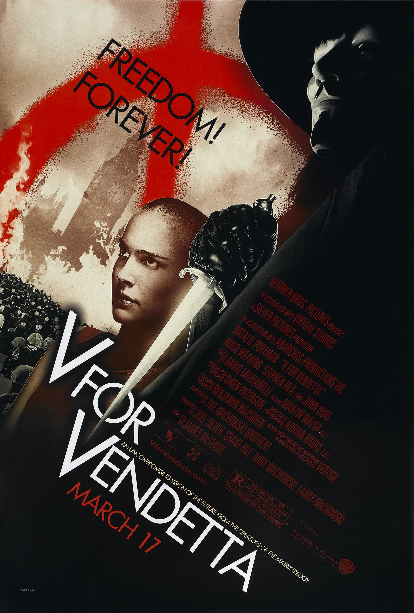
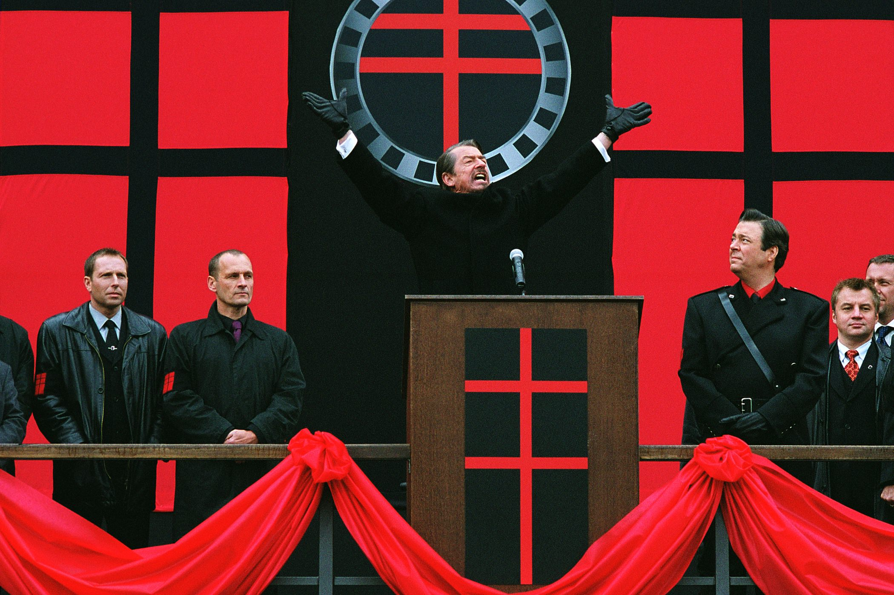
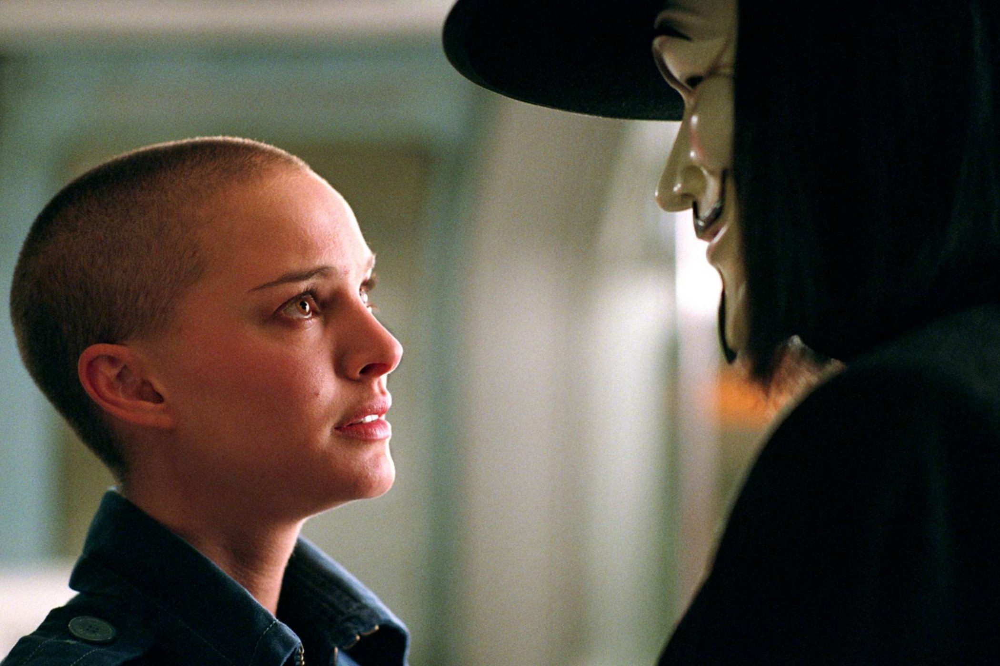

+++
type = "post"
titre = "<em>V pour Vendetta</em>, James McTeigue"
title = "V pour Vendetta, James McTeigue"
url = "/v-pour-vendetta-mcteigue"
date = "2015-05-15T20:37:20"
Lastmod = "2015-05-15T20:43:05"
cover = "v-pour-vendetta.jpg"
categorie = [ "À voir" ]
tag = [ "Adaptation bande-dessinée", "Comics", "Drame", "Dystopie", "Police", "Politique", "Science-Fiction", "Société", "Terrorisme", "Thriller" ]
createur = [ "James McTeigue" ]
acteur = [ "Hugo Weaving", "John Hurt", "Natalie Portman", "Rupert Graves", "Stephen Fry", "Stephen Rea", "Tim Pigott-Smith" ]
annee = [ "2006" ]
weight = 2006
pays = [ "États-Unis" ]
original = "V for Vendetta"

+++

Rares sont films qui ont été non seulement beaucoup cités, mais qui sont devenus un symbole beaucoup plus important. C&rsquo;est sans conteste le cas de <em>V pour Vendetta</em> et du masque de son personnage principal, transformé en symbole pour bon nombre de cases ou de mouvements. Le collectif des Anonymous se présente toujours en public avec ce masque qui aurait été porté à l&rsquo;origine par Guy Fawkes, l&rsquo;un des participants à la <a href="https://fr.wikipedia.org/wiki/Conspiration_des_poudres">Conspiration des Poudres</a> de 1605. Cette tentative d&rsquo;assassinat royal dans l&rsquo;Angleterre du XVIIe siècle sert de point de départ à Alan Moore quand il écrit son comics au milieu des années 1980. <em>V pour Vendetta</em> est alors un pamphlet contre la politique thatchérienne. Une vingtaine d&rsquo;années plus tard, Andy et Lana Wachowsky reprennent ce comics avec l&rsquo;intention de l&rsquo;adapter au cinéma. Ils écrivant un scénario, mais confient à James McTeigue, alors assistant réalisateur sur la saga <em>Matrix</em>, la réalisation. À l&rsquo;arrivée, le long-métrage vise juste et évoque un contexte d&rsquo;horreur qui n&rsquo;est pas si éloigné du nôtre. Une vision qui fait froid dans le dos, ce qui explique probablement son succès.

<em>V pour Vendetta</em> commence par un bref rappel historique sur la Conspiration des Poudres. Même si ce n&rsquo;est pas le sujet du film, cet évènement historique est une base importante pour justifier l&rsquo;essentiel de son intrigue. Celle-ci se met ensuite en place quand un mystérieux homme masqué vient sauver une demoiselle en détresse, en l&rsquo;occurrence Evey Hammond, jeune femme qui travaille à télévision et qui semble n&rsquo;avoir aucune histoire. même si elle détonne dans la dystopie que James McTeigue décrit de façon assez subtile. Plutôt que de commencer son film avec une présentation un petit lourde, le réalisateur introduit l&rsquo;univers par petites touches. On comprend que l&rsquo;action se situe à Londres, dans un futur relativement proche où la guerre a emporté la majorité du monde. On ne sait pas exactement ce qui s&rsquo;est passé, mais on a des indices : les États-Unis sont entrés en guerre, il y a eu d&rsquo;énormes épidémies qui ont décimé des pays entiers et la Grande-Bretagne s&rsquo;est repliée sur elle-même. Le pays s&rsquo;est tourné vers un leader autoritaire et vers un gouvernement totalitaire : un État fasciste s&rsquo;est instauré autour du Haut Chancelier Adam Sutler — incarné par un John Hurt en grande forme — et de son parti, le seul autorisé dans le pays. Au nom de la sécurité, les citoyens n&rsquo;ont plus aucune liberté, des couvre-feux imposent l&rsquo;enfermement chaque nuit… bref, c&rsquo;est une vision qui rappelle fortement des régimes que l&rsquo;Histoire a déjà croisé, mais qui fonctionne toujours aussi bien. <em>V pour Vendetta</em> rapproche constamment son pouvoir de fiction à celui des Nazis en Allemagne, à commencer par le nom de son dirigeant, très proche d&rsquo;Adolf Hitler. Il y a aussi le logo du parti, le choix du rouge et noir et naturellement, la notion de purification ethnique, même si le scénario des Wachowsky a considérablement réduit cet aspect par rapport à la bande-dessinée. On retrouve malgré tout des éléments, comme ces prisons qui ressemblent fort à des camps de concentration.

Mais si la dystopie mise en image par James McTeigue fonctionne si bien, c&rsquo;est surtout parce qu&rsquo;elle s&rsquo;adapte à notre actualité. Comme dans le <em>1984</em> de George Orwell, la dictature s&rsquo;impose d&rsquo;abord par le contrôle permanent des citoyens. Ce célèbre roman est manifestement une référence pour <em>V pour Vendetta</em>, il suffit de voir la salle du gouvernement, avec la tête immense du Haut Chancelier pour s&rsquo;en convaincre. Le film adapte ces idées aux nouvelles technologies, même s&rsquo;il passe totalement à côté d&rsquo;internet — il faut dire qu&rsquo;au début des années 2000, on était encore loin de son omniprésence actuelle. Le gouvernement n&rsquo;arrête pas de faire des écoutes aléatoires en captant les ondes des téléphones portables, avec l&rsquo;objectif très clair de connaître l&rsquo;avis de la population. Comment ne pas penser aux programmes de surveillance de masse, tels qu&rsquo;ils ont été mis en place aux États-Unis et maintenant en France ? On est exactement dans ce sujet-là, tout en ignorant complètement la partie internet, encore une fois. Une dizaine d&rsquo;années après sa sortie, <em>V pour Vendetta</em> n&rsquo;a pas vieilli pourtant et les mensonges assénés tout au long de la journée sur l&rsquo;unique chaîne de télévision autorisée est un autre élément qui nous est familier. C&rsquo;est précisément pour cela que le film nous parle et que la lutte de ce héros masqué, qui n&rsquo;a pas d&rsquo;autre nom que V, raisonne toujours à nos oreilles. Sur ce point, le scénario a vu juste et le long-métrage reste toujours aussi efficace.

Adapté d&rsquo;un comics, <em>V pour Vendetta</em> n&rsquo;est pas pour autant un film de superhéros. Certes, V semble friser avec les super-pouvoirs et il est né d&rsquo;expérimentations scientifiques qui ont mal tourner. Les analogies avec les héros traditionnels du genre s&rsquo;arrêtent là : pour le reste, ses aptitudes au combat à l&rsquo;épée proviennent d&rsquo;un long entraînement et sa capacité à résister aux tirs lui est fournie par une plaque de métal maintenue près de son corps. Il reste très humain, ce qui est paradoxal quand on pense qu&rsquo;on ne voit jamais son visage. Pendant les deux heures que dure le film, on n&rsquo;a que son masque statique et sa voix. On pourrait croire que cela ne suffit pas, que l&rsquo;on ne s&rsquo;identifie jamais à ce personnage, mais James McTeigue prouve le contraire avec un jeu sur la mise en scène qui permet de comprendre les émotions de V. Et puis il faut naturellement saluer le travail de Hugo Weaving qui doit jouer sans le visage et uniquement avec la voix pour traduire sa pensée. L&rsquo;acteur excelle dans ce rôle et le personnage est passionnant, surtout quand il est mis face à quelqu&rsquo;un dont il tombe amoureux. À ses côtés en effet, le personnage d&rsquo;Evey est tout aussi essentiel. Les deux se rencontrent par hasard, ou plutôt par la force du destin, au début de <em>V pour Vendetta</em>. D&rsquo;abord captive, la jeune fille finit par apprécier le révolutionnaire et le sentiment se fait vite réciproque. Cette romance est un ajout des Wachowsky par rapport au travail d&rsquo;Alan Moore, mais elle enrichit le film d&rsquo;une manière intéressante et Natalie Portman est très bien dans son rôle.

On ne devient pas un film culte pour rien. Dans le cas de <em>V pour Vendetta</em>, ce n&rsquo;est sans doute pas la romance des deux personnages principaux qui l&rsquo;explique, mais peut-être plus la dystopie assez classique, mais diablement efficace. La bonne idée de Lana et Andy Wachowsky, c&rsquo;est d&rsquo;avoir mêlé références historiques (Allemagne nazie) et thématiques modernes (surveillance de masse, contrôle par les médias). Bien avant les révélations de Snowden sur la NSA, ce film pointait déjà ce problème, alors même qu&rsquo;il ignore totalement internet. Une bonne intuition, qui explique certainement la longévité de <em>V pour Vendetta</em> dans la culture populaire.

<h3>Vous voulez <a href="/soutien/">m&rsquo;aider</a> ?</h3>
<ul>
<li><a href="http://www.amazon.fr/gp/product/B001927NAS/ref=as_li_ss_tl?ie=UTF8&amp;tag=leblogdenic07-21&amp;linkCode=as2&amp;camp=1642&amp;creative=19458&amp;creativeASIN=B001927NAS">Acheter le film en Blu-ray sur Amazon</a></li>
<li><a href="http://www.amazon.fr/gp/product/B000HWXZS0/ref=as_li_ss_tl?ie=UTF8&amp;tag=leblogdenic07-21&amp;linkCode=as2&amp;camp=1642&amp;creative=19458&amp;creativeASIN=B000HWXZS0">Acheter le film en DVD sur Amazon</a></li>
<li><a href="https://itunes.apple.com/fr/movie/v-pour-vendetta/id520693402">Acheter ou louer le film sur l&rsquo;iTunes Store</a></li>
<li><a href="http://www.netflix.com/WiMovie/70039175?trkid=50263268">Regarder le film sur Netflix</a></li>
</ul>

