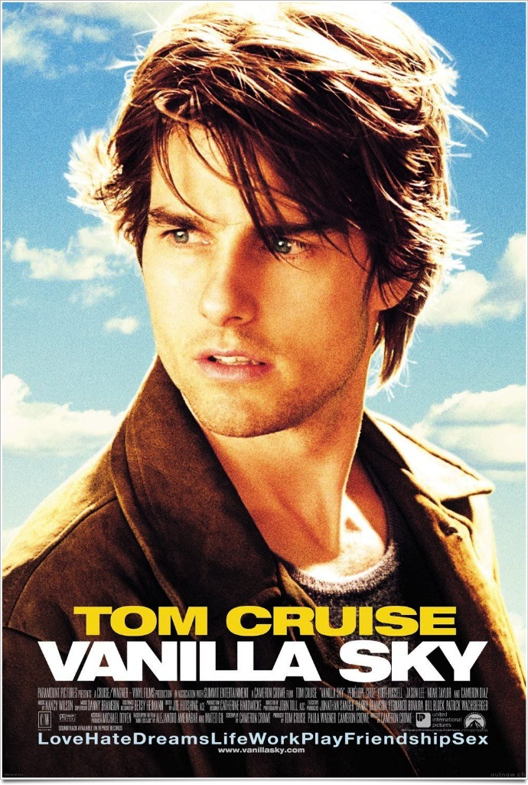
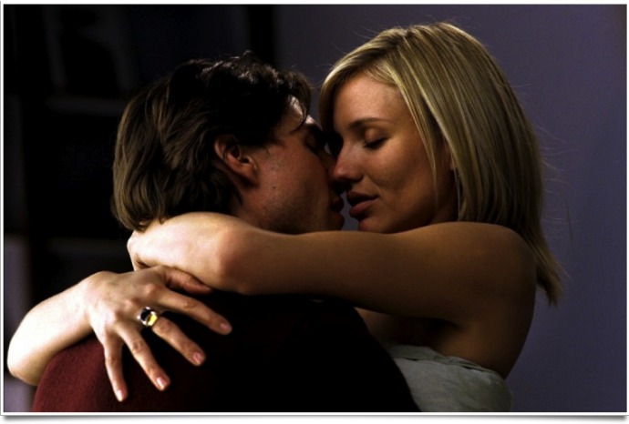
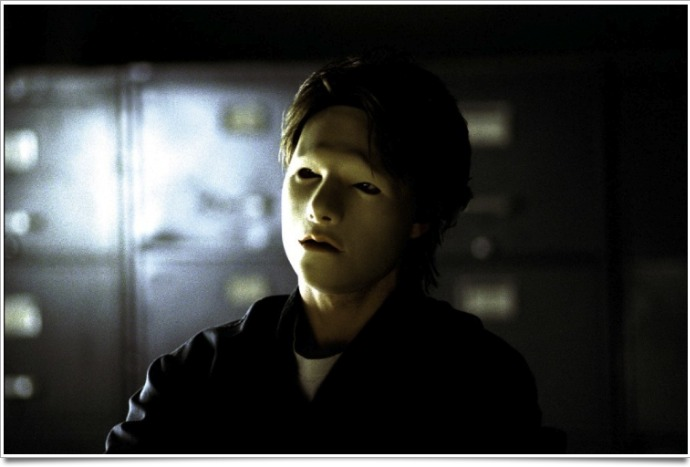

+++
titre = "<em>Vanilla Sky</em>, Cameron Crowe"
title = "Vanilla Sky, Cameron Crowe"
url = "/vanilla-sky-crowe"
date = "2012-01-28T00:29:27"
Lastmod = "2015-02-12T11:10:13"
cover = "vanilla-sky.jpg"
categorie = [ "À voir" ]
tag = [ "Amour", "Drame", "Fantastique", "Folie", "Science-Fiction" ]
createur = [ "Cameron Crowe" ]
acteur = [ "Cameron Diaz", "Penélope Cruz", "Tom Cruise" ]
annee = [ "2001" ]
weight = 2001
pays = [ "États-Unis" ]

+++

Remake d&rsquo;<em>Ouvre les Yeux</em>, un film espagnol réalisé par Alejandro Amenábar, <em>Vanilla Sky</em> est un film à énigme qui a d&rsquo;abord un intérêt par son fameux twist final qui remet en cause ce que l&rsquo;on vient de voir. C&rsquo;est aussi un drame assez touchant, loin de la comédie romantique que l&rsquo;on pourrait attendre en analysant le point de départ et le casting. Cameron Crowe propose un film qui divise, mais qui mérite de toute manière d&rsquo;être vu.

David est le jeune new-yorkais comblé par excellence. Beau et riche, il séduit toutes les femmes et on imagine sans peine ses multiples succès. Un jour, son meilleur ami vient accompagné de Sofia, une Espagnole terriblement séduisante. Entre les deux, c&rsquo;est le coup de foudre et ils passent une première nuit en tout bien tout honneur, mais une première nuit très prometteuse. Cette rencontre rend Julie, celle avec qui il a l&rsquo;habitude de coucher, extrêmement jalouse. Alors qu&rsquo;elle conduit David après la nuit passée avec Sofia, la jeune femme déballe tout, son amour et sa douleur de le voir avec une autre. Le ton monte, la voiture accélère et l&rsquo;inévitable accident se produit. Elle meurt sur le coup, lui s&rsquo;en sort avec un visage totalement défiguré. Sa vie bascule alors et il perd Sofia, désormais effrayée par ce monstrueux visage qui ne peut même plus sourire. Sa vie devient un cauchemar, mais bientôt les médecins lui annoncent avoir découvert une nouvelle méthode qui peut lui rendre son visage…

La force de <em>Vanilla Sky</em> est sa construction. Le scénario est très bien conçu pour troubler le spectateur qui pense comprendre ce qui passe, avant d&rsquo;être rapidement contredit par la suite des évènements. Des pistes sont lancées, mais une information vient ensuite les troubler et alors que l&rsquo;on réfléchit à une autre possibilité, le film de Cameron Crowe vient à nouveau troubler l&rsquo;ensemble. La fin, que nous ne révélerons évidemment pas, vient donner un grand coup de pied dans une histoire qui ressemble alors plus à un fragile château de cartes. <em>Vanilla Sky</em> s&rsquo;inspire vaguement d&rsquo;<em>Ubik</em> de Philip K. Dick, mais il ne s&rsquo;agit pas vraiment d&rsquo;un film de science-fiction. Certaines technologies évoquées relèvent effectivement de la fiction, mais l&rsquo;essentiel du film se déroule à notre époque. Plus que de la science-fiction, il faudrait parler de fantastique. Par certains aspects, <em>Vanilla Sky</em> rappelle les nouvelles fantastiques du XIXe siècle, même si la fin est beaucoup trop rationnelle dans cette optique. Le tout est efficace et on se laisse facilement avoir par le twist final, à condition bien sûr de ne pas le connaître. Sans cela, le plaisir du film est indéniablement plus limité.

Film fantastique, voire de science-fiction, <em>Vanilla Sky</em> est aussi un film sur la folie. Le héros perd la tête après son accident : les dégâts terribles causés par ses blessures et les opérations qui ont suivi l&rsquo;empêchent de penser clairement. David souffre de migraines terribles et il n&rsquo;est plus tout à fait lui-même. Ses proches le lui font bien sentir : son visage fait peur, certes, mais ce n&rsquo;est pas le principal problème. L&rsquo;accident l&rsquo;a changé pour toujours et il est peu à peu rejeté. Son comportement devient violent et David commence à avoir des hallucinations. Alors que Sofia s&rsquo;est remise avec lui, il pense voir Julie à la place de sa fiancée et il frappe alors celle qu&rsquo;il aime pourtant. Ses terribles cauchemars ne sont pas nés avec l&rsquo;accident toutefois : le film de Cameron Crowe commence avec un de ces cauchemars et dans la logique du scénario, l&rsquo;accident n&rsquo;a pas encore eu lieu. La folie est aussi amoureuse dans <em>Vanilla Sky</em> et l&rsquo;amour porté par David à l&rsquo;attention de Sofia est bien rendu et assez touchant.

<em>Vanilla Sky</em> n&rsquo;est pas un film qui se distingue particulièrement sur le plan technique, sauf sur un point. Cameron Crowe est un réalisateur particulièrement intéressé par la musique et il compose pour ce film une bande originale assez impressionnante. On y retrouve une collection de morceaux assez variée, mais toujours de très bon goût : Radiohead, Sigur Ros, R.E.M., Bob Dylan, Peter Gabriel, Jeff Buckley, etc. Le morceau symbolise ici l&rsquo;état d&rsquo;esprit du personnage ou de l&rsquo;action, mais c&rsquo;est toujours assez subtil. Il est rare, en tout cas, d&rsquo;entendre des morceaux non modifiés dans un film en dehors d&rsquo;un générique et <em>Vanilla Sky</em> est irréprochable sur ce point. On n&rsquo;en dira pas autant de Tom Cruise qui reste ici cantonné au jeu un peu simple et bêta qu&rsquo;il a souvent. Penélope Cruz est plus convaincante et c&rsquo;est la deuxième fois qu&rsquo;elle joue ce rôle puisqu&rsquo;elle a aussi participé à <em>Ouvre les yeux</em> tandis que Cameron Diaz offre une très belle partition hystérique.

La première vision de <em>Vanilla Sky</em> est sans aucun doute la plus intéressante. Le spectateur est mené par le scénario qui joue avec ses attentes et ce qu&rsquo;il peut comprendre du film, avant d&rsquo;être contredit plusieurs fois jusqu&rsquo;au final qui change encore tout. La fin est malheureusement un peu trop explicite, mais le plaisir de s&rsquo;être fait manier en bateau est indéniable. Faut-il revoir le film de Cameron Crowe ? La surprise n&rsquo;est plus là, bien sûr, mais le drame ne manque pas d&rsquo;intérêt et l&rsquo;histoire d&rsquo;amour de David et Sofia reste assez touchante.

<h3>Vous voulez <a href="http://voiretmanger.fr/soutien/">m&rsquo;aider</a> ?</h3>
<ul>
<li><a href="http://www.amazon.fr/gp/product/B00005U8P6/ref=as_li_ss_tl?ie=UTF8&amp;tag=leblogdenic07-21&amp;linkCode=as2&amp;camp=1642&amp;creative=19458&amp;creativeASIN=B00005U8P6">Acheter le film en DVD sur Amazon</a></li>
<li><a href="https://itunes.apple.com/fr/movie/vanilla-sky/id419326704">Acheter ou louer le film sur l&rsquo;iTunes Store</a></li>
</ul>

