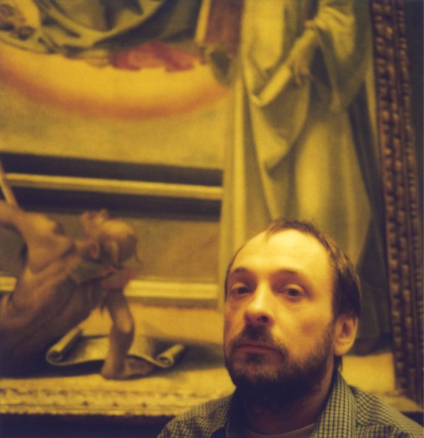
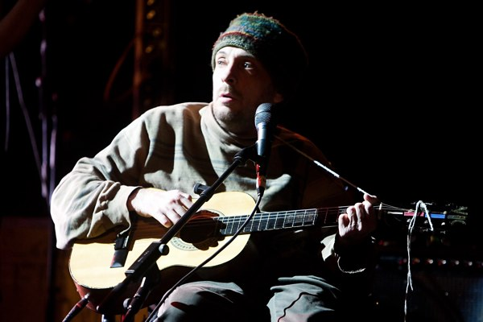

+++
type = "post"
titre = "Vic Chesnutt, la musique à vif"
title = "Vic Chesnutt, la musique à vif"
url = "/vic-chesnutt-la-musique-a-vif"
date = "2009-12-27T20:20:12"
Lastmod = "2012-02-02T23:38:03"
cover = "Vic-Chesnutt.jpg"
categorie = [ "Musique" ]
tag = [ "États-Unis", "Mélancolie", "Rock" ]
createur = [ "Vic Chesnutt" ]
annee = [ "2009" ]
weight = 2009

+++

On l&rsquo;a appris le jour de Noël, Vic Chesnutt est mort des suites d&rsquo;une nouvelle tentative de suicide. Il avait 45 ans et on n’entendra plus jamais sa voix d&rsquo;écorché sur scène. Après <a href="/2009/03/14/alain-bashung-adieu-merci/">Alain Bashung</a>, voilà le second artiste que je voulais absolument voir un jour sur scène, et que je ne verrai jamais. Triste nouvelle&#8230;

Je ne connais pas encore la discographie complète de l&rsquo;artiste, mais seulement les quatre derniers albums. C&rsquo;est peu, mais suffisamment pour ranger Vic Chesnutt directement dans la catégorie des artistes qui comptent. Rarement musique m&rsquo;a emporté à ce point : elle communique de manière quasiment physique un désespoir sans fin et forcément magnifique.

C&rsquo;est un euphémisme de dire que la musique de Vic Chesnutt est marquée par une profonde mélancolie. Elle n&rsquo;est jamais vraiment joyeuse, toujours au contraire triste, sombre, désespérée. Mais pas morne pour autant, elle sait aussi s&rsquo;emporter à coup de guitares parfois saturées, de violons ou de voix. Certains morceaux sont ainsi des montées en puissance constamment répétées, offrant à l&rsquo;auditeur un sentiment permanent d&rsquo;urgence ; &laquo;&nbsp;Debriefing&nbsp;&raquo; sur <em>North Star Deserter</em> en est l&rsquo;exemple parfait. La tristesse est donc toujours combat chez Vic Chesnutt, et un combat que l&rsquo;on sent pressent, comme si seule la musique le maintenait en vie. Le résultat à l&rsquo;oreille est une musique d&rsquo;une intensité rare qui balaie toute résistance au flot d&rsquo;émotion dès les premiers instants.

La voix est au centre de tout, celle de Vic Chesnutt bien sûr, mais aussi celles des membres du Silver Mt. Zion qui l&rsquo;accompagnaient sur les derniers albums. Cette association fait totalement sens et à l&rsquo;oreille, elle devient même évidente et naturelle. Les chœurs du mont Zion s&rsquo;accordent parfaitement avec celle, écorchée et très belle, de Vic Chesnutt, à tel point que l&rsquo;on a vite le sentiment qu&rsquo;elles ne font qu&rsquo;une (c&rsquo;est flagrant sur &laquo;&nbsp;Glossolalia&nbsp;&raquo; par exemple). Le résultat est splendide dans l&rsquo;esprit écorché vif et ambiance glaçante. C&rsquo;est aussi et d&rsquo;abord très beau.

Souvent, l&rsquo;art n&rsquo;atteint son optimum que par le désespoir et en musique au moins, un artiste comme Ian Curtis l&rsquo;a suffisamment démontré. Je crois qu&rsquo;il y a de cela chez cet artiste, le désespoir de la paralysie qui suit son accident à l&rsquo;âge de 18 ans et qui l&rsquo;empêche un temps de jouer de la guitare et définitivement de la trompette. Désespoir aussi de la maladie, du coma qui ponctuent à intervalle régulier <a href="http://vicchesnutt.blogspot.com/2008/01/bio.html">sa douloureuse biographie</a>. On entend que seule la musique l&rsquo;a permis de vivre si longtemps. Et ce suicide ne met que mieux en valeur à quel point la vie ne tenait qu&rsquo;à un fil pour lui. Et pourtant, comme l&rsquo;a rappelé fort à propos<a href="http://branchetonsonotone.com/2009/12/25/vic-chesnutt-un-dernier-pied-de-nez-pour-la-route/"> Branche ton Sonotone</a>, il semblait avoir renoncé à mourir, tout en reconnaissant alors avoir fréquenté la mort en permanence. Mourir le jour de Noël et en partie à cause d&rsquo;énormes dettes médicales<a href="#footnote_0_2282" id="identifier_0_2282" class="footnote-link footnote-identifier-link" title="Elles n&rsquo;ont pas disparu avec la mort du principal int&eacute;ress&eacute;, donc si vous voulez aider la famille, c&rsquo;est possible&hellip; Lisez au moins le joli hommage qui lui est rendu.">1</a> alors que le Congrès venait de voter la réforme d&rsquo;Obama, voilà qui ne manque pas d&rsquo;ironie.

Je ne voulais pas faire un de ces sujets-hommages toujours un peu convenus, mais je vois que c&rsquo;est quand même le cas. Alors, autant le faire court. De toute façon, les mots seront toujours impuissants pour décrire une musique aussi riche, aussi forte et aussi émotionnelle. Mieux vaut donc se contenter de (ré)écouter Vic Chesnutt chanter, et se taire après l&rsquo;avoir remercié.

Merci Vic, et bonne route.

<ol class="footnotes"><li id="footnote_0_2282" class="footnote">Elles n&rsquo;ont pas disparu avec la mort du principal intéressé, donc si vous voulez aider la famille, <a href="http://kristinhersh.cashmusic.org/vic/">c&rsquo;est possible</a>… Lisez au moins le joli hommage qui lui est rendu. [<a href="#identifier_0_2282" class="footnote-link footnote-back-link">&#8617;</a>]</li></ol>
