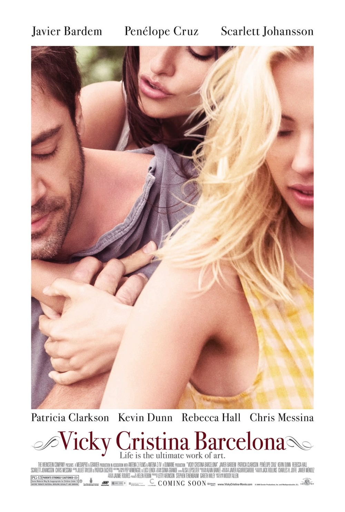

+++
type = "post"
titre = "<em>Vicky Cristina Barcelona</em>, Woody Allen"
title = "Vicky Cristina Barcelona, Woody Allen"
url = "/vicky-cristina-barcelona-woody-allen"
date = "2008-10-11T22:01:33"
Lastmod = "2014-10-28T21:38:40"
cover = "vicky-cristina-barcelona-penelope-cruz.jpg"
categorie = [ "À voir" ]
tag = [ "Amour", "Drame" ]
createur = [ "Woody Allen" ]
acteur = [ "Javier Bardem", "Penélope Cruz", "Rebecca Hall", "Scarlett Johansson" ]
annee = [ "2008" ]
weight = 2008
pays = [ "États-Unis" ]

+++

Cet après-midi, je suis allé comme tous les ans<a href="#footnote_0_798" id="identifier_0_798" class="footnote-link footnote-identifier-link" title="Sauf celui de l&rsquo;an dernier que je n&rsquo;ai, pour une raison qui m&rsquo;&eacute;chappe totalement, toujours pas vu !">1</a>, quasiment religieusement, voir le dernier Woody Allen, <em>Vicky Cristina Barcelona</em>. Du haut de ses 72 ans en effet, le réalisateur américain continue de réaliser des films au rythme effréné d&rsquo;un par an. Et avec Woody Allen, quantité rime exceptionnellement avec qualité : son dernier film est vraiment excellent.

Ce film, c&rsquo;est d&rsquo;abord un casting de folie, et d&nbsp;&raquo;abord un trio d&rsquo;acteurs exceptionnels : Scarlett Johansson qui accompagne le réalisateur depuis <em>Match Point</em>, Penélope Cruz qu&rsquo;on ne présente plus et Javier Bardem, récemment vu dans <a href="http://voiretmanger.fr/no-country-for-old-men-coen/" title="No Country for Old Men, Joel et Ethan Coen"><em>No Country for Old Men</em></a> où il était exceptionnel. Ces deux derniers acteurs sont là parce qu&rsquo;ils l&rsquo;ont demandé au réalisateur qui a ainsi écrit leurs rôles sur mesure, comme il l&rsquo;explique dans <a href="http://www.telerama.fr/cinema/les-jeunes-cineastes-imitent-beaucoup-scorsese-un-peu-kubrick-jamais-moi,34243.php">une récente interview</a>. Mais Woody Allen joue de ces attentes : le film en effet met en scène deux jeunes femmes, l&rsquo;une blonde, c&rsquo;est Scarlett Johansson, et l&rsquo;autre brune mais ça n&rsquo;est pas Penélope Cruz (il s&rsquo;agit d&rsquo;une actrice jusque là inconnue mais très bien, Rebecca Hall). Penélope Cruz n&rsquo;interviendra que plus bien plus tard dans le film, à un moment où le spectateur ne l&rsquo;attendait plus : l&rsquo;effet est réussi !

L&rsquo;histoire de base est assez simple : deux jeunes américaines passent un été à Barcelone pour passer du bon temps et éventuellement trouver l&rsquo;amour pour l&rsquo;une (Cristina), finir sa thèse en attendant son mariage pour l&rsquo;autre (Vicky). Ce scénario est cassé par l&rsquo;arrivée impromptue de Juan Antonio, peintre à la mode qui leur propose de les emmener sur une île pour éventuellement discuter mais surtout coucher. Les deux jeunes femmes sont totalement opposées sur la question de l&rsquo;amour : quand Vicky met en avant un mariage rationnel avec un homme promis à un avenir brillant et riche, Cristina ne sait pas bien ce qu&rsquo;elle cherche, elle sait ce qu&rsquo;elle ne cherche pas, et cela correspond justement à ce type d&rsquo;homme. Autant dire que face à cette proposition, les deux femmes sont partagées mais toutes deux se laisseront séduire.

Je ne veux pas dévoiler l&rsquo;intrigue qui réserve quelques surprises et rebondissements. Où l&rsquo;on découvre que les positions initiales sur l&rsquo;amour sont mises à mal<a href="#footnote_1_798" id="identifier_1_798" class="footnote-link footnote-identifier-link" title="Je n&rsquo;ai pas pu m&rsquo;emp&ecirc;cher d&rsquo;y voir une r&eacute;f&eacute;rence quasiment explicite &agrave; une certaine pi&egrave;ce de Corneille. Mais je crois que c&rsquo;est surtout le signe ds d&eacute;g&acirc;ts occasionn&eacute;s par trois ans de pr&eacute;pa&hellip;">2</a>. Où l&rsquo;on voit aussi que l&rsquo;amour parfait n&rsquo;est pas forcément celui auquel on pourrait d&rsquo;abord penser.

La cuvée Allen 2008 est décidément une très bonne année. Si le réalisateur explique avoir tourné à Barcelone pour bénéficier de tarifs moins élevés, la période européenne de Woody Allen (qui s&rsquo;est achevée puisqu&rsquo;il vient de tourner à nouveau à New-York) est bien plus qu&rsquo;une simple question financière. Depuis <em>Match Point</em>, le réalisateur a atteint un autre niveau. Cela tient notamment à ses acteurs, lui-même s&rsquo;effaçant de ses films (sur les quatre derniers, il n&rsquo;a joué qu&rsquo;une fois) et tout particulièrement à Scarlett Johansson qui, visiblement, a relancé sa carrière cinématographique.

Je vous encourage donc à aller voir ce film, en attendant le prochain que je verrai avec toujours autant de plaisir !

À lire, sur le même registre, les critiques de <a href="http://www.telerama.fr/cinema/films/vicky-cristina-barcelona,353479,critique.php">Télérama</a> et de <a href="http://www.critikat.com/Vicky-Cristina-Barcelona.html">Critikat</a>&#8230;

<h3>Vous voulez m&rsquo;aider ?<a href="#footnote_2_798" id="identifier_2_798" class="footnote-link footnote-identifier-link" title="&Agrave; propos de la publicit&eacute;&hellip;">3</a></h3>
<ul>
<li><a href="http://www.amazon.fr/gp/product/B001HBIPH6/ref=as_li_ss_tl?ie=UTF8&#038;tag=leblogdenic07-21&#038;linkCode=as2&#038;camp=1642&#038;creative=19458&#038;creativeASIN=B001HBIPH6">Acheter le film en Blu-Ray sur Amazon</a></li>
<li><a href="http://www.amazon.fr/gp/product/B001HBIPGW/ref=as_li_ss_tl?ie=UTF8&#038;tag=leblogdenic07-21&#038;linkCode=as2&#038;camp=1642&#038;creative=19458&#038;creativeASIN=B001HBIPGW">Acheter le film en DVD sur Amazon</a></li>
<li><a href="https://itunes.apple.com/fr/movie/vicky-cristina-barcelona-vost/id387347231">Acheter ou louer le film sur l&rsquo;iTunes Store</a></li>
</ul>

<ol class="footnotes"><li id="footnote_0_798" class="footnote">Sauf celui de l&rsquo;an dernier que je n&rsquo;ai, pour une raison qui m&rsquo;échappe totalement, toujours pas vu ! [<a href="#identifier_0_798" class="footnote-link footnote-back-link">&#8617;</a>]</li><li id="footnote_1_798" class="footnote">Je n&rsquo;ai pas pu m&rsquo;empêcher d&rsquo;y voir une référence quasiment explicite à une certaine pièce de Corneille. Mais je crois que c&rsquo;est surtout le signe ds dégâts occasionnés par trois ans de prépa&#8230; [<a href="#identifier_1_798" class="footnote-link footnote-back-link">&#8617;</a>]</li><li id="footnote_2_798" class="footnote"><a href="http://voiretmanger.fr/soutien/">À propos de la publicité…</a> [<a href="#identifier_2_798" class="footnote-link footnote-back-link">&#8617;</a>]</li></ol>
